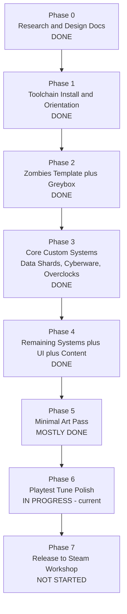

# Roadmap

High-level phase graph for Abandoned Cyber City. Detailed exit criteria live in
[docs/07_milestones.md](docs/07_milestones.md).

**Current reality (2026-07):** the map is fully BUILT and runs end-to-end. First
clean compile + link landed 2026-06-12; ~48 active `_acc_` modules are wired into
`_acc_main.gsc::init()`. Phases 0-4 are complete, Phase 5 is largely done, and the
project sits in **Phase 6 (playtest / tune / polish)** heading toward the first
Workshop release. No public v1.0 tag yet. Nearly everything the original plan
called "planned" is shipped — this doc now records what's DONE vs. what's still
genuinely future.

## Phase Summary

### Phase 0 - Research and Design Docs — DONE
`/docs` is populated and the design direction is locked. REQUIREMENTS.md is the
living spec; the docs and code follow it.

### Phase 1 - Toolchain Install and Orientation — DONE
BO3 Mod Tools are installed on the Windows dev box (setup complete 2026-07-03; see
SETUP_WINDOWS.md). Agents build the map headlessly with `tools/build_map.ps1`
(full cod2map64 + LED + linker pipeline) or `-GscOnly` (linker-only fast path) —
the Launcher GUI is not required. Launch/run runbook: [docs/17_launch_runbook.md](docs/17_launch_runbook.md).

### Phase 2 - Zombies Template plus Greybox — DONE
All 7 zones from [docs/02_layout.md](docs/02_layout.md) are playable, with 13
buyable doors, 6 inline mystery boxes, single-switch power (the custom dual-switch
was stood down 2026-06-19 — `_acc_power` deletes the leftover `acc_power_switch`
triggers and ships one stock wall switch; reconciled to code 2026-07-11), perks,
and Pack-a-Punch.
The map bakes again after the pre-stage3 geometry revert — ~157 light entities +
~15 reflection probes — so the Radiant LED bake is the gate and `-SkipLED` is a
red flag, not the default. Source: `map_source/zm/zm_abandoned_cyber_city.map`.

### Phase 3 - Core Custom Systems — DONE
The map's mechanical identity ships and is live in `_acc_main.gsc::init()`:
- **Data Shards** currency (`_acc_data_shards`) — the trench-economy backbone.
- **Cyberware** tree (`_acc_cyberware`) and **Overclocks** (`_acc_overclocks`).
- **Per-run map randomization** (`_acc_map_randomizer`, read in `pre_init`) and the
  **modifier system** (`_acc_modifiers`).
- Elite class (`_acc_elites`), Apothicon **Fury** trench elite (`_acc_fury`), and
  the **emergency drop** (`_acc_emergency_drop`).

### Phase 4 - Remaining Systems plus UI plus Content — DONE
- **Bosses:** a shared roster (`level.acc_boss_roster_fn`) of Brutus
  (`_acc_boss_brutus`), Glitch (`_acc_boss_glitch`), Phantom (`_acc_boss_phantom`),
  Avogadro, Panzer (mechz), plus the Rogue/Civil Protector as an r20 boss. Cadence:
  a mini-boss debuts first around round 10; full BOSS rounds run every 9 from round
  9 (r9=1, r18=2, r27=3 bosses), with types dealt from a no-duplicate shuffled deck.
  Orchestrated by `_acc_boss` + per-module debt directors. Boss-reward items in
  `_acc_boss_items`.
- **Events:** Hack Terminal (`_acc_events_hack`) is live. The "Vault Overload"
  side event is **RETIRED** (2026-07-07) — `acc_events_overload::init()` is commented
  out in `_acc_main.gsc` and its trigger/point struct were deleted from the `.map`
  (the `#using` is kept only for easy restore).
- **UI / HUD:** the **Aetherium LUI HUD** is the shipped base (since 2026-07-03,
  `_zm_aetherium_hud.gsc/.csc` + `ui/uieditor/menus/hud/*.lua`), with round progress
  as a smooth bar (the radial ring was abandoned). The **gun-badge chip row**
  (`_acc_gun_badges`, PaP / OC / Mule / Turbo / Nuclear) shipped 2026-07-08.
  Health bars (`_acc_health_bars`) and 3-tier Pack-a-Punch (`_acc_pap_levels`) ship.
- **Perks:** 10 perks (Electric Cherry is the real 10th, finished from our side).
  Slot cap `ACC_PERK_SLOT_MAX = 10`; each extra slot costs more than the last
  (`_acc_perks.gsc`: base 4 + step 2 → 4/6/8/10/12/14 shards). The Lab perk-alcove
  rotation is a live **4-of-10** door roll each round (`_acc_perk_doors.gsc`,
  `ACC_PERK_DOORS_OPEN_PER_ROUND = 4`), plus a permanent-unlock path (2 Empty Mega
  Bottles per closed door).
- **Weapons:** box-only acquisition of a large arsenal (Apex ports + Skye BO2/BO3
  ports + HB21 elemental bows), not a fixed shortlist. Starting pistol is the
  Five-Seven (`t6_fiveseven`). Weapon variants / Mega-bottle twins:
  `_acc_weapon_variants`, `_acc_mega_bottles`.

### Phase 5 - Minimal Art Pass — MOSTLY DONE
Stock-asset reskin, lighting, ambient sound — deliberately not a showcase pass.
Atmosphere (cold city-haze fog + night sky + wet-ground re-skin + probes) ships via
`_acc_atmosphere` + Radiant edits ([docs/20_atmosphere_and_materials.md](docs/20_atmosphere_and_materials.md));
perk-machine / PaP power-on glow via `_acc_perk_lights`; underground BOTD zombie
skins via `_acc_trench_skins`. Stations and bosses have been remodeled off the T7
asset dump. Remaining work is legibility/polish, folded into Phase 6.

### Phase 6 - Playtest Tune Polish — IN PROGRESS (current)
Closed-group playtest, balance passes, bug fixes, performance/stability hardening
(the current `fix/coop-crash-hardening` work). Ongoing HP/economy/speed tuning
lives in CHANGELOG.md. **Exit**: testers reach round 30+ with different archetypes,
no game-breaking bugs in a 2-hour session.

### Phase 7 - Release — NOT STARTED
Workshop page, v1.0 tag, post-release plan. Runbook: [docs/34_release_runbook.md](docs/34_release_runbook.md).
Do not publish the Workshop item Public until the IP/credit review in CREDITS.md is
done (external game-rip packs are not redistributable). **Exit**: shipped, installs
cleanly for a non-dev tester from fresh, no emergency hotfix needed in 48 hours.

## Built systems beyond the original plan

These were "planned/future" in earlier drafts and are now shipped, all wired in
`_acc_main.gsc::init()`:
- **Exo Suit station** (`_acc_exo`) — per-player depth-gate that cancels the
  per-layer trench slow.
- **Abyss Descent** (`_acc_abyss_doors` + `_acc_paradise`) — the underground is a
  vertical soul-box descent (5 floors L1-L5 on a 240u pitch, gated by 4 descent
  doors; soul cost scales with live player count — 125/player for the first gate,
  50/player for deeper gates) down to the
  communal Paradise plaza, ending in a timed final-onslaught fight. (The old
  "Black Market" split-room design was never built.)
- **Reactor Surge** climax event (`_acc_reactor`) in the pit.
- **Glitch Altar** Data-Shard gamble (`_acc_glitch_altar`).
- **Jukebox** (`_acc_jukebox`) — random song for 2 Data Shards + 1000 pts; replaced
  the old EE-song teddy bears.
- **The Exchange** transfer vault (`_acc_transfer`) — team point/shard/bottle/item
  transfers, under-Plaza room gated by `enter_exchange`.
- **The Armory** upper room (`_acc_armory`) — shared team weapon rack + Mega-bottle
  exchange.
- **Lockdown** per-round DEFCON room (`_acc_lockdown`) + **Lockdown Challenge** trap
  room (`_acc_lockdown_challenge`).
- Supporting subsystems: `_acc_coop_scaling`, `_acc_zombie_speed`, `_acc_points`,
  `_acc_corpse_cleanup`, `_acc_early_round_pacing`, `_acc_decontamination`,
  `_acc_havoc_charge`, `_acc_bus_trench`.

## Dev/test mode

There is exactly ONE hardcoded `acc_dev` flag, resolved once into `level.acc_dev`
(in `zm_abandoned_cyber_city.gsc::acc_resolve_dev_flags()`); it hardcodes god /
unlimited shards / all perks + slots / open map / power on / test spawns for
testing. It is **not** a runtime console — never "set dvar X to test" (see the
dev-mode section of CLAUDE.md).

## Post-1.0 (tracked, not promised)

- Seeded runs (reproducible map-state from a seed string).
- More modifiers (the `_acc_modifiers` system already ships; this is more entries).
- A second wonder weapon from the unchosen candidates.
- Traps.
- A main Easter Egg — *only* if player feedback demands it.
