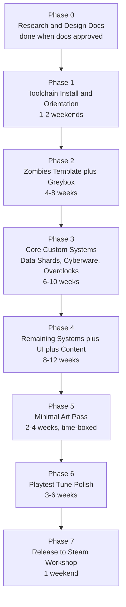

# Roadmap

High-level phase graph for Abandoned Cyber City. Detailed exit criteria live in [docs/08_milestones.md](docs/08_milestones.md).

Total estimate, solo evenings/weekends: **8-14 months to v1.0**. Phases 3 and 4 dominate.

## Phase Summary

### Phase 0 - Research and Design Docs (current)
Populate `/docs`, pitch the project, lock design direction. **Exit**: design is clear enough to build against.

### Phase 1 - Toolchain Install and Orientation
BO3 Mod Tools installed, one-room hello-world map builds and runs. **Exit**: go from Radiant edit to in-game in under 5 minutes from memory.

### Phase 2 - Zombies Template plus Greybox
All 7 zones from [docs/03_layout.md](docs/03_layout.md) playable in a greybox. Doors, perks, PaP, Mystery Box all working with stock values. **Exit**: round 10 reachable, no script errors.

### Phase 3 - Core Custom Systems
The map's mechanical identity: Data Shards, Cyberware, Overclocks, per-run map randomization, first elite class, emergency drop. **Exit**: solo to round 20 with full system engagement, 3 consecutive runs produce different map states.

### Phase 4 - Remaining Systems plus UI plus Content
All elites, mini-boss and boss, Hack Terminal and Vault Overload events, custom perks, wonder weapon, minimum-viable LUI, modifier system. **Exit**: full run to round 30 with 2+ different builds, modifiers work.

### Phase 5 - Minimal Art Pass
Stock-asset reskin, lighting, ambient sound. Explicitly *not* a showcase pass. **Exit**: zones legible, no obvious visual bugs, 60+ FPS on a mid-range GPU.

### Phase 6 - Playtest Tune Polish
Closed-group playtest with experienced players, balance pass, bug fixes, performance pass. **Exit**: 3 testers reach round 30+ with different archetypes, no game-breaking bugs in a 2-hour session.

### Phase 7 - Release
Workshop page, v1.0 tag, post-release plan. **Exit**: shipped, installed by non-dev tester from fresh install, no emergency hotfix needed in 48 hours.

## Post-1.0 (tracked, not promised)

- Seeded runs (reproducible map-state from a seed string).
- More modifiers.
- A second wonder weapon from the unchosen candidates.
- Traps.
- A main Easter Egg - *only* if player feedback demands it.
