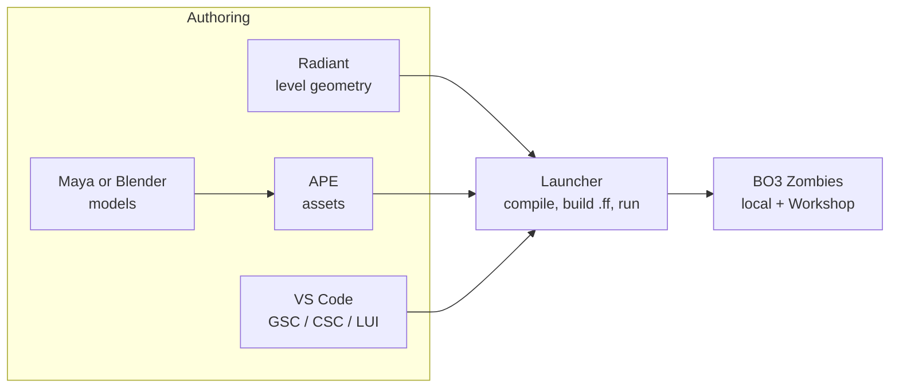
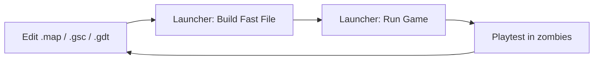

# 01 - Toolchain

This document is the reference for the BO3 custom-map toolchain. It assumes you own Call of Duty: Black Ops III on Steam and have never modded the game before.

## Prerequisites

- Windows 10/11 (the Mod Tools are Windows-only; your dev machine needs to be Windows or a Boot Camp / Parallels / dedicated Windows partition).
- ~100 GB free disk (Mod Tools + raw assets + build artifacts balloon quickly).
- 16 GB RAM minimum, 32 GB recommended (Radiant + APE + the game running simultaneously is heavy).
- A discrete GPU. Integrated will compile but won't let you iterate on lighting.

> Note for you as a Mac user on this repo: the repo itself (design docs, GSC source) can live and be edited on macOS. The actual Radiant/APE/Launcher work must happen on a Windows box. We plan the repo so that the `scripts/` and `ui/` trees can be synced into the Windows Mod Tools install via a symlink or rsync step.

## Install (one-time)

1. **Own BO3 on Steam.**
2. In the Steam library, filter the sidebar to **Tools**. Install **Call of Duty: Black Ops III - Mod Tools**.
3. First launch opens the **Launcher**. Let it perform the initial asset extraction (this can take 30-60 minutes and uses ~60 GB).
4. Install **Maya LT 2017** or the free fallback path (Blender with the Modern Warfare / CoD export plugin) only when you need custom models; for Phase 2 (greybox) you don't need either.
5. Optional but recommended once scripting begins: the community **T7 GSC-tools** / **VSCode GSC extension** for syntax highlighting and the **Wraith Archon** asset viewer.

## The Five Tools



### Radiant

- Brush/patch/prefab-based level editor, direct descendant of the Quake / idTech Radiant line.
- You work in orthographic views + a 3D perspective, carving solid geometry (brushes), placing `script_model` / `script_struct` / `info_player_start` entities, connecting triggers, tagging zones.
- For zombies: **start from the `zm` template** (`File -> New -> Map from template -> zm`). It ships with spawn points, round logic hooks, perk-machine prefabs, Pack-a-Punch prefab, and the Mystery Box stub.

### APE (Asset Property Editor)

- Converts raw assets (materials, models, XAnims, sounds, weapons, FX) into the xasset format the game loads.
- You describe an asset with "GDT" entries (Game Data Table), APE compiles them.
- Weapons, attachments, perks, and Pack-a-Punch variants all live here as weapon GDT entries.

### Launcher

- Central build/run tool.
- Key operations: **Build Fast File** (compiles your map + assets into `zm_abandoned_cyber_city.ff`), **Build Mod**, **Run Game** (launches BO3 into your map).
- Publishes to Steam Workshop via **File -> Publish Mod/Map**.
- Console output here is your primary debugging tool during builds.

### GSC / CSC scripting (text files)

- **GSC** = GameScript, runs server-side. All gameplay logic (rounds, perks, skills, EE, enemies).
- **CSC** = ClientScript, runs client-side. HUD glue, FX, sound triggers that need to be local.
- C-like syntax, event-driven, thread-per-entity model (`self thread my_func();`).
- Stock scripts live in `<mod tools>/share/raw/scripts/zm/...`. Do **not** edit those. Copy the ones you need to override into `usermaps/zm_abandoned_cyber_city/scripts/zm/` and modify there.

### LUI (Lua UI)

- BO3's UI framework: Lua + an HTML-ish layout layer.
- Anything that's a menu, HUD widget, objective banner, or skill-tree screen is LUI.
- Heavier learning curve than GSC. We only touch it in Phase 4+ when we build the Cyberware skill-tree UI and the Data Shard HUD.

## Directory Layout (Windows, inside Mod Tools install)

```
<steamapps>\common\Call of Duty Black Ops III\
  bin\                   # tools binaries (Launcher, Radiant, APE)
  share\raw\             # all stock raw assets (read-only reference)
  usermaps\              # <-- YOUR MAP LIVES HERE
    zm_abandoned_cyber_city\
      maps\zm\           # .map, .gsc, .csc for the map
      scripts\zm\        # map-specific GSC/CSC
      zone_source\       # asset lists that go into the fast file
      sound\             # map-specific sound aliases
      ui\                # map-specific LUI
  zone_out\              # compiled .ff outputs
  mods\                  # standalone mods (not maps)
  players\               # your local config + playtest saves
```

This repo will mirror the authoring-side subset (`maps/`, `scripts/`, `ui/`, `zone_source/`) so it can be version-controlled. A sync step (documented in `08_milestones.md`) copies or symlinks it into `usermaps/zm_abandoned_cyber_city/` on the Windows box.

## Build & Test Loop (what you'll do 100x a day)



- Full rebuild: 5-15 minutes (first time of the day, or after changing many assets).
- Incremental script-only rebuild: 30-90 seconds.
- Radiant geometry change only: 1-3 minutes.

## Version Control Strategy

- **In git**: everything text - `.gsc`, `.csc`, `.lua`, `.gdt` (when stored as plaintext), `.csv` zone files, design docs.
- **In git with LFS (later, when we add them)**: reference images, sound assets we author, small prefab `.map` files.
- **NOT in git**: `.ff` outputs, `zone_out/`, compiled binaries, anything in `share/raw/` (stock game assets), Maya project files (too large and proprietary).
- `.gitignore` will reflect this once we start adding non-markdown content in Phase 2.

## Community References (canonical, stable URLs - verify on your machine)

- **UGX Mods Wiki** - the de-facto BO3 modding wiki. Scripts, GDT references, tutorials.
- **CabConModding** - forum + tutorials, strong on GSC deep-dives.
- **NSZ (NoahJ456's custom zombies community)** + **Tom BMX** tutorials on YouTube - classic multi-part "make your first zombies map" series.
- **MakeCents** YouTube - long-form, up-to-date, covers Radiant, APE, GSC, and LUI.
- **Treyarch's official "Mod Tools Beginner's Guide"** PDF, distributed with the Mod Tools install.

A curated, ordered reading/watching list lives in `02_learning_path.md`.

## Common Pitfalls (known traps, documented up front)

- **Editing stock scripts in `share/raw/`.** Never do this. Always copy to your usermaps scripts tree first.
- **Forgetting to include an asset in your zone_source CSV.** It will be missing at runtime with no clear error. When in doubt, check your map's `zone_source/zm_abandoned_cyber_city.csv`.
- **Radiant CSG issues from non-grid brushes.** Keep brushes grid-aligned; use the `]` and `[` keys to change grid size.
- **PaP / perk prefabs not linking.** The zombies template relies on named script_structs and triggers; renaming prefab internals breaks the script. Don't rename children of stock prefabs.
- **Fast file size limit.** BO3 has a hard cap; bloated texture atlases or redundant weapon variants will push you over it. Audit asset budgets early.
