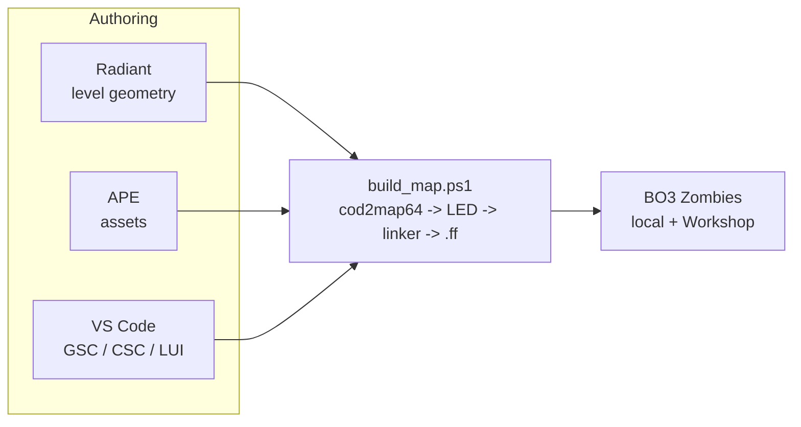
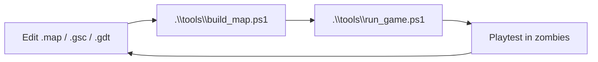

# 01 - Toolchain

This document is the reference for the BO3 custom-map toolchain. It assumes you own Call of Duty: Black Ops III on Steam and have never modded the game before.

## Prerequisites

- Windows 10/11 (the Mod Tools are Windows-only). This repo lives **on** the Windows dev box and the Mod Tools **are installed** (setup completed 2026-07-03 — see `SETUP_WINDOWS.md`).
- ~100 GB free disk (Mod Tools + raw assets + build artifacts balloon quickly).
- 16 GB RAM minimum, 32 GB recommended (Radiant + APE + the game running simultaneously is heavy).
- A discrete GPU. Integrated will compile but won't let you iterate on lighting.

> This repo mirrors only the authoring-side subset of the map (`map_source/`, `scripts/`, `zone_source/`, `sound/`, `zone/`, `ui/`) so it can be version-controlled. `tools\sync_to_modtools.ps1` robocopy-mirrors it into the Mod Tools install before every build (usermap trees into `usermaps\zm_abandoned_cyber_city\`, the `.map` into the root `map_source\zm\`). The linker compiles from the **deployed** copy, not the repo — edit, sync, then build.

## Install (one-time)

1. **Own BO3 on Steam.**
2. In the Steam library, filter the sidebar to **Tools**. Install **Call of Duty: Black Ops III - Mod Tools**.
3. First launch opens the **Launcher**. Let it perform the initial asset extraction (this can take 30-60 minutes and uses ~60 GB).
4. Set the `TA_TOOLS_PATH` / `TA_GAME_PATH` user env vars (the Treyarch tools crash with no message otherwise), and keep **Smart App Control OFF** (SAC blocks `gdtdb.exe`, which stalls every build). Both are covered in `SETUP_WINDOWS.md`.
5. Optional but recommended: the community **VSCode GSC extension** for syntax highlighting and the **Wraith Archon** asset viewer.

## The Tools



### Radiant

- Brush/patch/prefab-based level editor, direct descendant of the Quake / idTech Radiant line.
- You work in orthographic views + a 3D perspective, carving solid geometry (brushes), placing `script_model` / `script_struct` / `info_player_start` entities, connecting triggers, tagging zones.
- Radiant `.map` sources live in `<BO3 root>\map_source\zm\`, **not** under `usermaps\`. Our map started from the stock `zm` template (spawn points, round logic hooks, perk-machine prefabs, PaP prefab, Mystery Box stub) and grew from there.

### APE (Asset Property Editor)

- Converts raw assets (materials, models, XAnims, sounds, weapons, FX) into the xasset format the game loads.
- You describe an asset with "GDT" entries (Game Data Table), APE compiles them. `gdtdb.exe` (in `gdtdb/`, not `bin/`) rebuilds the GDT database after any edit.
- Weapons, attachments, perks, and Pack-a-Punch variants all live here as weapon GDT entries. The large-arsenal ports (Apex, Skye, elemental bows) ship as vendored GDTs; see `docs/21_adding_a_gun_runbook.md`.
- **Model pipeline:** stock BO3 props are carved on demand from the T7 Assets dump via `tools/gen_t7_carve_gdt.js` (authors the GDT from the `.xmodel_bin` files) + `tools/xmodel_bin_inspect.js` (materials + vertex bounds). You rarely author models from scratch in Maya/Blender — see the memory `t7-assets-dump-prop-carving`.

### GSC / CSC scripting (text files)

- **GSC** = GameScript, runs server-side. All gameplay logic (rounds, perks, skills, EE, enemies).
- **CSC** = ClientScript, runs client-side. HUD glue, FX, sound triggers that need to be local. `.csc` cannot call `.gsc` (separate VMs) — custom client HUD is driven off clientfields.
- BO3 GSC ≠ WaW GSC: `function` keyword on every definition, `#namespace` per module, `#using` (not `#include`), `&func` pointers. Full dialect notes in `CLAUDE.md` and `docs/BO3_MAPMAKING_KB.md`.
- Stock scripts live in `<mod tools>/share/raw/scripts/zm/...`. Do **not** edit those. Copy the ones you need to override into the usermap scripts tree and modify there.

### LUI (Lua UI)

- BO3's UI framework: Lua + an HTML-ish layout layer.
- Anything that's a menu, HUD widget, objective banner, or skill-tree screen is LUI.
- We ship a custom LUI HUD: the Aetherium HUD (`scripts/zm/_zm_aetherium_hud.gsc/.csc` + `ui/uieditor/menus/hud/*.lua`) is the base HUD since 2026-07-03, with the gun-badge chip row added 2026-07-08. Custom `.lua` rawfiles require the L3akMod linker patch — the full pipeline (clientfield → clientuimodel bridge, the `UI Error <code>` gotcha) is in `docs/19_lui_pipeline.md`.

## Directory Layout (Windows, inside Mod Tools install)

```
<steamapps>\common\Call of Duty Black Ops III 455130\   # AppID-suffixed root
  bin\                   # tools binaries (Launcher, Radiant, APE, linker, cod2map64)
  gdtdb\                 # gdtdb.exe + the GDT database
  share\raw\             # all stock raw assets (read-only reference)
  map_source\zm\         # Radiant .map sources (yours included - NOT under usermaps)
  usermaps\              # <-- YOUR MAP'S RUNTIME KIT LIVES HERE
    zm_abandoned_cyber_city\
      scripts\zm\        # entry .gsc/.csc + map-specific GSC modules
      zone_source\       # .zone asset manifest that drives the fast file
      sound\             # sound zone config (.szc) + aliases
      zone\              # workshop publish assets (workshop.json, images)
      ui\                # map-specific LUI
  zone_out\              # compiled .ff outputs
  mods\                  # standalone mods (not maps)
  players\               # your local config + playtest saves
```

Scripts detect the tools root via `bin\modlauncher.exe`, never by folder name (the `455130` suffix varies). `tools\sync_to_modtools.ps1` mirrors this repo into place.

## Build & Test Loop (what you'll do 100x a day)

The whole pipeline is headless and CLI-scriptable — **the Launcher GUI is not required, and compiling is not a user action.** Agents build the map themselves.



- **`.\tools\build_map.ps1`** — full geometry build: asset-gate → sync → `cod2map64` (BSP+navmesh, cwd=bin) → Radiant **LED bake** → linker → verify a fresh `.ff` landed. Run this after any brush / entity / material / sky change.
- **`.\tools\build_map.ps1 -GscOnly`** — fast path for GSC/CSC/`.zone`/`.csv`-only changes: sync → linker only (reuses the last BSP+navmesh). Seconds, not minutes.
- **`.\tools\build_map.ps1 -Run`** — build then launch on success. Or launch separately with **`.\tools\run_game.ps1`** / `PLAY_NORMAL.bat` (launches through Steam — `steam://run/311210` — to satisfy BO3's DRM; the Launcher's own "Run" trips the DRM popup on this split install).
- **The LED bake is the gate.** Run the full build **with** the LED bake (no `-SkipLED`) after geometry/material/sky changes — the map bakes again since the pre-stage3 revert (~157 light entities + ~15 reflection probes). `-SkipLED` is a red flag that hides a lightmapper regression; the fast gate is `.\tools\_bake_test.ps1 <map.path>` (prints BAKED / CRASHED).
- **Build success = a FRESH `.ff` was written, not the linker exit code.** The linker prints `ERROR:` for user-waived missing materials yet still packs a valid `.ff`; `build_map.ps1` waives those and fails only if no fresh `.ff` lands.

Timings: full rebuild 5-15 min (first of the day, or many assets changed); `-GscOnly` script rebuild seconds; geometry-only 1-3 min. Full launch/build gotchas: `docs/17_launch_runbook.md`.

## Version Control Strategy

- **In git**: everything text — `.gsc`, `.csc`, `.lua`, `.gdt` (plaintext), `.zone` manifests, `.map` Radiant sources, CSVs, design docs. Line endings are pinned LF by `.gitattributes`.
- **NOT in git**: `.ff` outputs, `zone_out/`, compiled binaries, anything in `share/raw/` (stock game assets).
- **NOT in git — licensed external asset packs** (NSZ Brutus, Skye guns, Charred zombies, Ronan perk-icon shaders, T7 carves): no redistribution licence, so these are gitignored. A fresh clone has only the *references* and the linker fails `no file for filespec` until they're installed — get a teammate's bundle via `tools/unpack_external_assets.ps1` and confirm `tools/check_external_assets.ps1` is all-green before building. Paths live in `tools/external_assets_manifest.ps1`.

## Community References (canonical, stable URLs - verify on your machine)

- **UGX Mods Wiki** - the de-facto BO3 modding wiki. Scripts, GDT references, tutorials.
- **CabConModding** - forum + tutorials, strong on GSC deep-dives.
- **NSZ (NoahJ456's custom zombies community)** + **Tom BMX** tutorials on YouTube - classic multi-part "make your first zombies map" series.
- **MakeCents** YouTube - long-form, up-to-date, covers Radiant, APE, GSC, and LUI.
- **Treyarch's official "Mod Tools Beginner's Guide"** PDF, distributed with the Mod Tools install.

The portable, map-agnostic build/pipeline reference is `docs/BO3_MAPMAKING_KB.md`; verified stock-script ground-truth sources are catalogued in `CLAUDE.md`.

## Common Pitfalls (known traps, documented up front)

- **Editing stock scripts in `share/raw/`.** Never do this. Always copy to your usermaps scripts tree first.
- **Building stale code.** The linker compiles from the deployed usermap copy — always let `build_map.ps1` sync (or run `sync_to_modtools.ps1`) before trusting a build.
- **Forgetting to include an asset in your zone manifest.** It will be missing at runtime with no clear error. When in doubt, check `zone_source/zm_abandoned_cyber_city.zone` (custom scripts use `scriptparsetree`, not `rawfile`; face materials need NO zone line, only non-face assets do — see `docs/20_atmosphere_and_materials.md`).
- **Skipping the LED bake.** `-SkipLED` hides the `brush.cpp:1860` lightmapper regression. Bake after every geometry change.
- **Radiant CSG issues from non-grid brushes.** Keep brushes grid-aligned; use the `]` and `[` keys to change grid size.
- **PaP / perk prefabs not linking.** The zombies template relies on named script_structs and triggers; renaming prefab internals breaks the script. Don't rename children of stock prefabs.
- **Fast file size limit.** BO3 has a hard cap; bloated texture atlases or redundant weapon variants will push you over it. Audit asset budgets early.
