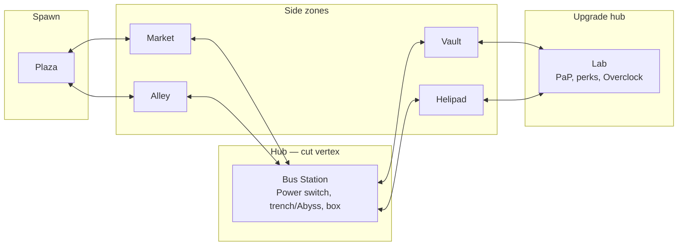
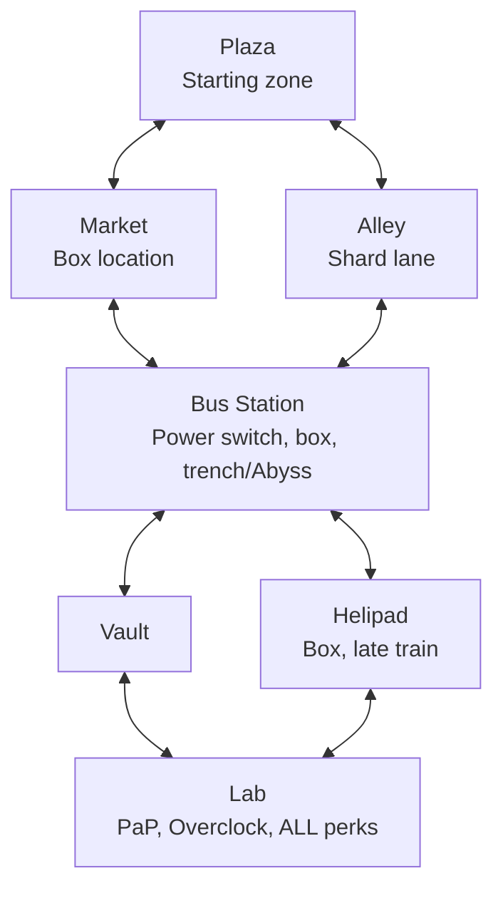

# 02 - Layout

Gameplay-first layout. Theme and art are flavor only; this doc is about **flow, chokepoints, training potential, risk/reward zones, and how randomization slots into geometry**.

> **Visual design**: **[map_design.svg](map_design.svg)** — the as-built map
> rendered from the real `.map` source (rooms, corridors, every perk machine,
> box, door, terminal, power switch, spawn marked + legend). Regenerate
> after map edits: `node tools/gen_map_design.js`.

> **Decontamination was CUT (user 2026-06-22).** An earlier design had a per-round
> "contamination" hazard that sealed a zone each round and killed players caught inside.
> It is no longer in the game — no zone is ever sealed, no EVACUATE warning fires, no
> player is killed. `_acc_decontamination::run_decon_phase` now only re-emits
> `acc_decontamination_complete` once per round as a harmless tick (the module's zone
> helpers stay because `_acc_lockdown`/`_acc_lockdown_challenge` reuse them). All zones
> below are permanent — read them as always-open.

## Design Philosophy

- **Small and dense beats big and empty.** Target total playable footprint comparable to Der Eisendrache, not Tranzit.
- **Every zone must have a reason to visit.** A box location, a Data Shard source, a PaP route node, or a risk/reward event. Zones that are just corridors die.
- **Two distinct training spots per major zone.** A training spot = a loop or chokepoint where a skilled player can herd the horde. Without them, late-game collapses into "camp one corner".
- **Every zone has at least two exits.** No dead-end panic traps unless the panic is a designed risk.
- **Verticality is earned.** Rooftops and the Vault are late-unlock so early rounds stay grounded.
- **Bus Station is a cut vertex** in the zone graph — every path from Plaza to the Lab runs through it.

## Map Diagram (read + build reference)

### ASCII (topology)

Hub-and-spoke with two Lab approaches. `==` / `||` are **doors** (buyable or always open per run).

```
                         +---------------------------+
                         |          Helipad          |
                         |   (sniper, box, train)    |
                         +-------------||------------+
                                       |
         +-----------------------------+----------------------------+
         |                             |                            |
         |                     +-------+--------+                   |
         |                     |    Bus Station    |                 |
         |                     |    (HUB — power,  |                 |
         |                     |     trench, box)  |                 |
         +----------+----------+-------+--------+----------+--------+
         |          |                  |          |          |        |
  +------+---+  +---+------+     +-----+----+ +---+-----+ +--+-------+--+
  |  Plaza   |  |  Market  |     |  Alley  | | Vault   | |   Lab    |
  |          |  |          |     |         | |         | |          |
  | (SPAWN)  |  |          |     |         | |         | |  (PaP)   |
  +------+---+  +----------+     +---------+ +----+----+ +-----+----+
         |            |               |           |           |
         |            +-------+-------+           |           |
         |                    |                   |           |
         +--------------------+                   +-----+-----+
                                                        |
                                              PaP / perks / OC
```

**Legend**

- **SPAWN**: Plaza is the starting zone.
- **HUB**: Bus Station is the cut vertex — required for connectivity between Plaza, the side zones, and both Lab approaches. It holds the map's single power switch and the trench/Abyss descent.
- **PaP**: the Lab holds Pack-a-Punch, the Overclock terminal, and all 10 perks.

### Mermaid (same graph, for slides / wiki)



Key properties:

- Plaza has two exits (Market, Alley), both buyable early so players pick their opener.
- Bus Station is the **hub** — four connections, two training spots, the map's power switch, and the trench/Abyss.
- Lab (PaP + perks) has two approaches (Vault-side or Roof-side). One approach is **randomly blocked per run** (`_acc_map_randomizer::roll_pap_approach` returns `server` or `roof` — the blocked side; see [Randomized Geometry Elements](#randomized-geometry-elements)).
- Total: **7 zones**, all permanent (no zone is ever sealed).

## Zone Graph (compact)



## Weapons are box-only

**There are no wallbuys on this map.** `_acc_map_randomizer::remove_all_wallbuys()`
unregisters every stock wallbuy purchase stub at load, and the world-model spawner
(`spawn_acc_wallbuy_models`) stays defined-but-uncalled. All guns come from the
**Mystery Box** (which moves among seven locations) — a large arsenal (Apex pack + Skye
ports + elemental bows). See [04_weapons.md](04_weapons.md). Any "wallbuy" wording in
older docs is stale; the per-zone notes below list box locations, not wallbuys.

**The box is the AW "3D Printer" (since 2026-07-12)** — PLANET's Exo-Zombies weapon-printer
port replaced the stock Der Riese wooden chest (thematic fit for the cyber city: holographic
weapon preview via a `dr_fx_holo` duplicate-render clientfield, scanner FX, print/malfunction
animations). It is a self-contained parallel driver (`scripts/planet/_aw/_zm_aw_mysterybox.gsc`,
`REGISTER_SYSTEM_EX("aw_mbox")`), NOT a stock `_zm_magicbox` reskin: the stock system idles
harmlessly (zero `treasure_chest_use` structs left in the `.map` — never disable via
`level.enable_magic`, that also kills perks + fire sale). Each of the seven locations is a
baked machine body + animated door rig + `aw_exo_mysterybox_location` struct (plaza tagged
`starting_loc` = deterministic start box) + an `acc_box_clip_<node>` brushmodel reshaped to
the machine's 38x64x120 footprint (same clip names, so the randomizer's solidify/navmesh
threads are untouched). All `_acc` box behaviors were re-homed onto the AW driver's `[acc]`
shims: the `user_grabbed_weapon` notify (variant reconcile / PaP tier reset / tactical
finalizer / badges / usage tracking), firesale $10 + Armory 10%-off via
`acc_box_effective_cost()`, and the per-run weighted draw via `level.CustomRandomWeaponWeights`.
The Paradise Box still wears the classic `p7_zm_der_magic_box` mesh (now packed by an explicit
zone line). Install/credits: `tools/external_assets_manifest.ps1` + CREDITS.md (Planet +
Scobalula + Sledgehammer). **Wonder pulls print GOLD** (2026-07-12): the holo overlay is cyan
for normal guns, gold (`dr_fx_holo_gold`, a cg02-tint clone of the pack material) when the
draw is one of the 5 wonder weapons — the `exo_magicbox_dr_holo` clientfield is 2-bit
(0 off / 1 cyan / 2 gold) and `wonder_cap_key()` is the wonder test. **Display-model fidelity
(2026-07-16):** the Skye CW (`t9_`)/VG (`s4_`) ports' `worldModel` is a bare RECEIVER (mag/
stock/barrel are separate attach parts the engine only composes on an equipped weapon), so the
cycle used to show strip-downs ("RPD tiny", "PPSH/Grav wrong", "Streetsweeper missing parts").
`acc_map_randomizer::box_display_model()` now swaps in the packs' pre-composed `wm_*_full`
meshes (explicit `xmodel,` zone lines + `#precache` — referenced by nothing else) for BOTH the
AW printer and the Paradise Box flicker. Per-gun size lives in `acc_box_display_scale()`
(PPSH 0.85 — the VG mesh is over-scale; XM4 1.1; Apex Alternator/Prowler bumps; the old
RPD/M60 1.25 bumps are retired — the `_full` meshes are true-sized), and low-rigged meshes
(Ballistic Knife, Li'l Arnie — hang below their origin) get an `acc_box_display_zoff()`
shelf lift.

## Per-Zone Gameplay Notes

### Plaza (Spawn Plaza, `start_zone`)
- **Purpose**: first 3-4 rounds. Establish economy.
- **Size (tightened 2026-06-26)**: was a huge near-empty arena; **shrunk ~75%** to a compact space
  (interior **x[-470,213] y[-240,720]** ≈ 683×960) via [tools/gen_plaza_shrink.js](../tools/gen_plaza_shrink.js).
  It ADDS a tighter inner wall ring inside the old footprint and seals the dead space (the stock template arena
  is too irregular to safely value-remap the perimeter — that crashes the LED bake). The squeeze is taken from
  the **east** (spawns + window-barricade + corridor mouths fix the W/S/N sides). The two corner exits (NW→Market,
  NE→Alley) stay connected by connector corridors to the original wall mouths; the buyable doors (further out)
  are untouched. See CHANGELOG 2026-06-26.
- **Implant Lab (side-room)**: the gated room south of the plaza (interior **x[-720,180] y[-540,-240]**,
  widened WEST 2026-06-27 then EAST 2026-07-10) holds the three boss-item **Implant Bench** pads — spread as
  a **staggered arc** across the open EAST half (out of the Exchange staircase's SW corner and clear of every
  wall; relayout 2026-07-10). Entered by a **tight 80u doorway** with a **buyable slide-up door**
  (`enter_implant`, 1500). Also holds the descent to **The Exchange** (below). See [09_boss_items.md](09_boss_items.md).
- **The Exchange (transfer vault, under the Plaza)**: a stairwell carved **down from the Implant Lab floor**
  leads to an enclosed **transfer vault** at **z=-240 directly under the Plaza** (room x[-720,300] y[-448,360]).
  A **SHARED TEAM VAULT** for player-to-player transfers of Points / Data Shards / Mega Bottles / Boss Items —
  deposit/withdraw pads, no targeting. Gated by a **buyable slide-up door** (`enter_exchange`, 1500). Built by
  [tools/gen_plaza_basement.js](../tools/gen_plaza_basement.js) (carves the stock arena-floor slab around the
  stairwell well; LED-bake-gated). A **safe** room (excluded from the trench amping, OOB-vetoed). Full design:
  [37_transfer_vault.md](37_transfer_vault.md).
- **The Armory (upper room)**: an enclosed **mezzanine loft** at **z=288** (room to z=560, footprint
  x[714,1074] y[-200,200], over the EAST dead-space) reached by a **24-tread staircase (12u rise / 20u run, ≈31°) up from the Plaza floor** (into a
  south-wall doorway; zombies path up). Houses a **shared team WEAPON RACK**
  (pooled deposit/withdraw — give guns to teammates) + a **MEGA-BOTTLE EXCHANGE** (1 bottle → random reward).
  It sits inside the tall `start_zone` player_volume (z to 1041), so **no new zone** is needed. Only the
  **door + its buy trigger touch playable floor (x[-470,213])**; the staircase (base x≈234) and loft climb
  EAST into the sealed **east dead-space** (x>213), which is still inside the `start_zone` volume, so it's
  in-zone and zombies path it. (reconciled to code 2026-07-11) Built by [tools/gen_upper_room.js](../tools/gen_upper_room.js)
  (LED-bake-gated → BAKED). Full design: [39_armory.md](39_armory.md).
- **Layout**: open-but-shrunk (an interior maze was tried then removed per user). Difficulty comes from the ~75%
  shrink + **4 scattered cargo-crate caches** (`plaza_cache_1..4`) as low cover, with zombie risers spread across the floor. Players
  spawn in the back band beside the mystery box. No more giant circles.
- **No perks.** Forces movement.

### Market
- **Purpose**: early economy and box location. Mid-risk.
- **Features**: Mystery Box possible spawn. **No perk machines** — all perks live in the Lab per [10_perks.md](10_perks.md).
- **Training**: stall-row loop. Strong early training.

### Alley
- **Purpose**: alternative opener. Faster access to the Bus Station, fewer sightlines.
- **Features**: Data Shard lane (first elite spawn happens here around round 5).
- **Training**: bad. It's a corridor. Don't camp here.

### Bus Station
- **Purpose**: **the hub**. Where a large share of a typical run is spent.
- **Surface dressing (2026-07-16, pilot)**: dressed as an abandoned transit concourse via
  `_acc_surface_deco.gsc` (topside twin of the abyss deco) using the BO2 **TranZit** prop pack
  (`p7_zm_tra_*`) — bench rows + "please wait" sign, a diner/ticket counter cluster, payphone, queue
  stanchions, wall dressing, emissive sconces. **Full TRANSIT-TERMINAL redesign 2026-07-16** (from a 3-concept
  design-panel workflow): a **ticket office** (bank-vault booth + long counter + teller windows), a **departure
  board** of vintage TVs the 3-row bench concourse faces, **boarding queues** down the center aisle to **bus bays**
  on both trench rims (stanchion rails + barriers/cones/quarantine fence — the pit reads as where coaches dock), a
  **baggage-claim** cart spill, a **restroom nook**, a **concession/diner** counter, a **maintenance/debris** corner,
  and an arrivals board. **75 props, 39 models.** The layout is data-driven (`scratch/gen_bus_layout.js` emits the
  GSC spawns AND clips from one table). **Every floor prop is clipped** — 55 shallow worldspawn brushes
  (`add_prop_clips.js` "BUS STATION SURFACE") that cod2map bakes into the navmesh so **zombies route around them**;
  overhead/high props (signs, wall TVs, caged lights, sconces, payphones) carry no floor clip. Center aisles + door
  lanes stay navigable; clears the trench, both door pairs, the power switch, and the corp box. Kill-switch
  `acc_surface_deco`. **All 5 surface zones are now dressed (2026-07-16):** Alley (grimy backstreet — drums/oil
  racks/cages/wrecked bike/quarantine barricades/outhouse), Market (abandoned town market — kitchen-counter stalls
  + gas marquee + shopper mannequins), Vault (server/data vault reusing the already-zoned T7 station tech +
  a bank-vault door), Helipad (rooftop equipment yard — water tower + central tank obstacle + machinery). Market/
  Vault/Helipad were designed by a 3-agent workflow then validated against the ACTUAL room bounds (the zone
  `info_volume` AABBs — `rooms.json` is stale for those three, extended ~180u post-greybox). All via
  `spawn_alley/market/vault/helipad()` + gable-clipped wide props.
- **Power**: a **single stock wall power-switch prefab**, west-wall-mounted in the Bus Station's **north/Lab half**
  with the native flip animation + power-on sound (origin `(-752 2250 1)`, facing east into the room). The trench's
  only north exit is the **east** stair channel, so players climb out on the NE side and must cross the dark Lab half
  to the **far west wall** to flip it — you can't power on the instant you leave the stairs.
  **Design note:** this replaced an earlier custom **dual-switch** (one each side of the trench). Per the user's
  2026-06-19 decision, `_acc_power.gsc` now **stands down** — it keeps the stock `use_elec_switch` prefab (which powers
  the map natively) and only deletes a leftover mid-air `acc_power_switch` trigger. To restore the dual-switch, recover
  the prior `_acc_power.gsc` from git (see its header comment).
  **Wayfinding (2026-07-12, confirmed rendering):** glowing CW dark-aether wall decals ("Images arrow coldwar
  dogcanary" pack, `lit_emissive_scroll_transparent` animated glow; inline worldspawn chalk-recipe meshes, 64×64,
  2u proud; manifest + CREDITS rows added) form a **breadcrumb trail to the power switch**:
  - **South half** (first pass): "POWER" + two west-pointing arrows on the trench south-rim wall face y1703
    (the Olympia-chalk face), guid markers `ACCC0006-8`.
  - **Trench leg** (pass 2, "ACC POWER TRAIL, TRENCH LEG" section, guids `ACCC0009-F`) — fixes the dark-pit
    problem that the E-stair **pit-side flank wall** (x[687,703] y[1805,2173]) hides the only stairs up to the
    power half: pit north wall (y2173) gets "POWER" + a right-arrow pointing **east** at the stairs; the flank
    wall itself (x687 face) gets **"STAIRS"** + an up-right arrow pointing around its south end into the stair
    entry (y≈1805); all pit decals in the z[−204,−140] eye band over the −240 floor.
  - **North half** (surface): "POWER" + right-arrow (= **west**) on the north rim parapet's north face (y2193)
    near the stair exit, + one more west arrow mid-route on the far parapet segment — carrying the trail across
    the dark Lab half to the switch at (−752, 2250).
  Decal-direction rule (documented in the .map section header): normal = u_dir × v_dir (v=+z), u0 = viewer-left —
  so screen-right is +x on −y-normal faces, −x on +y-normal faces, −y on −x-normal faces. Art map: blank=right
  arrow, 4=left, 2=up-right, 1=POWER, 7=STAIRS (full list in the manifest entry).
- **Features**: Mystery Box possible spawn. **No perk machines** — all perks at the Lab.
- **Trench (cross-room)**: a horizontal (E-W) trench is cut **dead-centre**, splitting the room into a south half (the two entrances from Market/Alley, plus the power switch and box) and a north half (the doors to Vault/Helipad). It spans the full room width and is a **deep multi-layer abyss** (first floor −240, then descending on a fixed 240u pitch through layers L2 −480, L3 −720, L4 −960, L5 −1200 — see [30_abyss_descent.md](30_abyss_descent.md)) **with vertical walls** (all four sides sealed, incl. E/W end walls) — you can't step over it or jump the 450u gap across the top, so to cross you go **down and up the far side**. **One thin (96u) staircase per side, hugging the side walls**: a stair against the **west wall** (south lip) and one against the **east wall** (north lip), joined by the open trench floor — cross by going **down one wall and up the other** (diagonal: SW down → across the open pit → NE up). Or **just jump in** (preferred/faster). **Rocket-Shield BRIDGE:** one central deck (`x[-45,83]` = 128u wide, full S→N span) floats **58u above the rim** — reachable ONLY by the Rocket Shield **2× jump**; the express crossing for that item, off the navmesh so zombies can't follow (`tools/add_trench_bridge.js`).
  - **The pit is a deliberate kill-box (user, 2026-06-18):**
    - **No random death** — the trench floor sits below the corp_zone playable-area volume, so stock ZM's out-of-playable-area monitor *was* hard-killing standing players (hp-full, no-damage, ~3s delay). `_acc_bus_trench::init` registers `level.player_out_of_playable_area_monitor_callback` to **veto that kill in the trench only** (rest of map still guarded) → safe at ANY depth. See memory `sunken-floor-oob-kill`.
    - **Move-speed penalty while exposed underground** — a **layered slow gated by your Exo Suit tier**, NOT a flat multiplier. You move normally within the layers your Exo covers; below that you take **−20% at the first uncovered layer** and **−10% per layer deeper** (`acc_exo_slow_first` 0.20 + `acc_exo_slow_step` 0.10 × extra layers, gated by `acc_trench_slow_on`, capped so speed never hits 0; composed in `_acc_utility::recompute_move_speed`). The `player.acc_trench_slow` boolean is kept only for the debug speed-flags readout. See [29_exo_suit_plan.md](29_exo_suit_plan.md).
    - **Spawn surge + raised zombie cap** — entering bursts extra zombies at the corp risers (`spawn_corp_surge`, `acc_trench_surge_count` **5**, `acc_trench_surge_cd_sec` **8** s cooldown) and raises `level.zombie_ai_limit` by `acc_trench_ai_bonus` (**14**) while anyone's in the pit; `_acc_zombie_speed` trench-aggro beelines/sprints them at you. (Both defaults were cut ~25% from 6/18, user 2026-06-18.)
    - **Pulsing full-screen red DANGER warning** (`_acc_bus_trench` `trench_warning_on`, dvar `acc_trench_warn`).
    - **Native engine fall damage is disabled map-wide** (`disable_native_fall_damage`), so the drop never kills; the only fall cost is the scripted, velocity-gated **~35 tax** (`ACC_TRENCH_FALL_DMG` = 35, applied ~0.2s after entry so it lands on impact; PhD-negated — the stair walk is free).
  - **Two trench rooms (user, 2026-06-18):** two greybox rooms open off the pit at the **trench-floor level** — a **Plaza-facing** room behind the south wall (`y=TRENCH_Y1`) and a **Lab-facing** room behind the north wall (`y=TRENCH_Y2`), each ~**512w × 384d × 160h**, carved into the ground slabs (the slab above each stays solid = the walkable floor). Each is gated by a **buyable stock `zombie_door`** (1500 pts, `enter_under_plaza` / `enter_under_lab` → `acc_door_under_plaza` / `acc_door_under_lab`) that slides **sideways** into the wall pocket (so the room height isn't limited by a slide-up). **The whole underground counts as "the trench"** (user 2026-06-18): `player_in_trench` aliases the broad `player_in_underground` footprint, so the slow, spawn surge, AI-cap raise, zombie aggro, and the danger warning all apply down here, not just the open pit (the fall-tax still only fires on a real fall into the pit). NOT a respite. Brushes: `tools/add_trench_rooms.js` (post-processor — reads the **live** slab z, so it tracks the parallel depth retunes; **re-run after any `gen_corp_trench` regen**). Navmesh regenerates through the doorways → zombies follow once a door is bought.
  - **Underground = the Abyss Descent:** the rooms are the entrance to a vertical sub-level — a stacked set of **soul-box layers (L2/L3/L5)** descending to a **Paradise plaza** at the bottom. This supersedes the old "Data Vault gauntlet / Hall A → Hall C" greybox snapshot. The Plaza-facing room holds the shard **Glitch Altar** (`_acc_glitch_altar.gsc`); the layers hold the underground shard economy (caches, Cyberware/Overclock sinks). The deeper you go the harder it gets; each layer is an idempotent module authored by `tools/gen_abyss_layer.js`. The OOB-kill veto covers the whole sub-level (`_acc_bus_trench::player_in_underground`). Full design + per-layer detail: [30_abyss_descent.md](30_abyss_descent.md); trench systems overview: [28_trench_systems_guide.md](28_trench_systems_guide.md).
  - Geometry SoT: `source_data/rooms.json` "trenches".corp; brushes `tools/gen_corp_trench.js`. Navmesh links the stairs so zombies funnel through. **Stairs re-pitched 2026-06-26** (players reported the original 16-tall/16-deep 45° steps glitched the player hull): `tools/regen_trench_stairs.js` rebuilt both stairs at **10-tall / 16-deep (≈32°), 23 steps, 368u long** — same top lip (south W / north E), extended toward the middle (W `y[1723,2091]`, E `y[1805,2173]`; opposite x-walls so no collision), pit-side walls re-sized to match. Lower 10u risers link the navmesh more easily than 16u. Geometry change → full LED bake (passed).
- **Hack terminal**: optional intrusion event (`_acc_events_hack.gsc`; see [05_mechanics.md](05_mechanics.md)). Success completes a multi-stage channel/survive sequence; failure locks the terminal for the run and spawns a **penalty wave** (`spawn_penalty_wave`). The old **+2 Data Shard** reward is now **OFF by default** — the shard economy moved underground (trench-only), so the topside hack grants nothing unless you set `acc_hack_shard_drop 1`. *(An earlier "free Overclock voucher" reward idea was cut 2026-07-12 — never built.)*

### Vault
- **Purpose**: high-risk, high-reward transit zone on one of the two Lab approaches.
- **Features**: **No power here** (the map's single power switch lives in the Bus Station). **No perk machines** — all perks at the Lab.
- **Retired:** the earlier **"Vault Overload"** timed-defense side-event is **removed** (user 2026-07-07). `acc_events_overload::init()` is commented out in `_acc_main.gsc`, and the event's `acc_overload_terminal` trigger + point struct were deleted from the `.map`. Nothing reads `level.acc_overload_state`.

### Helipad
- **Purpose**: late-game training arena. Opens verticality once you've paid for the elevator or taken the service stairs.
- **Features**: Mystery Box possible spawn. **No perk machines** — all perks at the Lab.
- **Training**: the **best late-game training spot in the map**. Large open area with a central obstacle. Elite enemies don't path well here; that's intentional and is compensated by a Helipad-specific modifier (see [06_replayability.md](06_replayability.md)) that forces you to move on timers.

### Lab (Pack-a-Punch + Overclock Terminal + ALL Perks)
- **Purpose**: the map's upgrade + perk hub. Everything that costs progression currency lives here.
- **Features**:
  - **Pack-a-Punch machine** (L1-L5 progression via Points, see [04_weapons.md](04_weapons.md)).
  - **Overclock Terminal** (spend Data Shards to advance weapon tier T1-T5 or re-roll an Overclock).
  - **10 perk alcoves** along the Lab north wall. **A random 4 of the 10 alcove doors open each round** and the rest stay walled off; the 4 re-roll every round (`_acc_perk_doors.gsc`, `ACC_PERK_DOORS_OPEN_PER_ROUND` = 4 of 10 specialties). A player can also **permanently unlock** one currently-closed door for the rest of the game by paying **2 Empty Mega Bottles** (`ACC_PERK_DOOR_UNLOCK_COST`) — that becomes a bonus always-open alcove on top of the 4 rotating ones. Manual override `set acc_perk_doors_all_open 1` forces all open (dev mode runs the real rotation). See [10_perks.md](10_perks.md).
  - **Wonder weapon**: the elemental bows are the map's wonder weapons (box arsenal, see [04_weapons.md](04_weapons.md)). <!-- TODO(acc-verify): the earlier "Signal Staff craft terminal" is not present in code or the weapon CSV; if it is ever built, restore its terminal here. -->
- **Access**: two approaches (from the Vault side or from the Roof side). One is **blocked per run** at random (`roll_pap_approach`) — rerouting punishes players who don't know both paths.
- **Training**: none. It's a transaction zone.
- **Frequency of visit**: high — perk rotation + PaP + Overclock.

## Randomized Geometry Elements

These are features **of the layout** that re-roll per run/round. Full randomization catalog is in [06_replayability.md](06_replayability.md).

- **Power switch**: **not randomized.** There is exactly one switch (the Bus Station wall prefab). The old "A (Corp) or B (Vault)" roll is retired — the Vault switch prefab was deleted from the map, so `roll_power_switch_side()` always returns `corp`.
- **Lab approach blocked**: Vault-side (`server`) or Roof-side (`roof`), rolled once per run by `roll_pap_approach`. Changes your PaP route.
- **Perk rotation (per round)**: a random **4 of the 10** Lab perk alcove doors open each round; no duplicates. Rolled per round in `_acc_perk_doors.gsc` — independent of any round-start tick. See [10_perks.md](10_perks.md).
- **Mystery Box location**: standard BO3-style box move among the **seven** chests (market / corp / roof / plaza / lab / vault + **trench** — the reactor/jukebox under-room at z=-240, added 2026-07-12); the **initial** spawn is deterministic — `roll_mystery_box_initial` always returns `plaza` (the start room), and the stock teddy-bear move rotates among all seven chests thereafter. **Placement convention (2026-07-12)**: every chest except the free-standing plaza one sits flush against a solid room wall — long axis parallel to the wall, origin 20u off the wall face, yaw chosen so the buy trigger (stock unitrigger at `origin + AnglesToRight(angles)*-22.5`) faces the room: west wall→270, east→90, north→180, south→0. Clips re-authored in lockstep by `tools/align_box_clips.js` (reads live struct origins/yaw/z).

## Training Spot Summary

Knowing where you can train is a skill check. Listed best-to-worst for late game:

1. **Helipad** — biggest, cleanest circle.
2. **Bus Station** (south half) — big, safe, central.
3. **Bus Station S-curve** — tighter, higher efficiency, unforgiving.
4. **Market stall row** — early-game only.

## Out-of-Scope for This Doc

- Asset lists, specific prefab choices, exact brush counts.
- Lighting, VFX, soundscape.
- Performance budgets.
