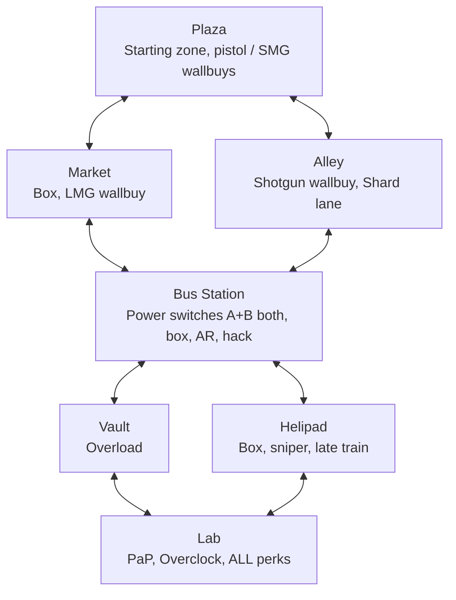

# 03 - Layout

Gameplay-first layout. Theme and art are flavor only; this doc is about **flow, chokepoints, training potential, risk/reward zones, how randomization slots into geometry**, and the **decontamination** round hazard.

> **Visual design**: **[map_design.svg](map_design.svg)** — the as-built map
> rendered from the real `.map` source (rooms, corridors, every perk machine,
> wallbuy, box, door, terminal, power switch, spawn marked + legend). Regenerate
> after map edits: `node tools/gen_map_design.js`.

## Design Philosophy

- **Small and dense beats big and empty.** Target total playable footprint comparable to Der Eisendrache, not Tranzit.
- **Every zone must have a reason to visit.** A wallbuy, a Data Shard source, a PaP route node, or a risk/reward event. Zones that are just corridors die.
- **Two distinct training spots per major zone.** A training spot = a loop or chokepoint where a skilled player can herd the horde. Without them, late-game collapses into "camp one corner".
- **Every zone has at least two exits.** No dead-end panic traps unless the panic is a designed risk (see Vault Overload).
- **Verticality is earned.** Rooftops and the Vault are late-unlock so early rounds stay grounded.
- **Plaza and Lab are never permanently sealed** by decontamination (see below). **Bus Station** is never sealed: it is a **cut vertex** in the zone graph; sealing it would strand players away from the Lab.

## Map Diagram (read + build reference)

### ASCII (topology)

Hub-and-spoke with two Lab approaches. `==` / `||` are **doors** (buyable or always open per run). `xxx` = zone sealed after decontamination (example: Market already locked).

```
                         +---------------------------+
                         |          Helipad          |
                         |   (sniper, box, train)    |
                         +-------------||------------+
                                       |
         +-----------------------------+----------------------------+
         |                             |                            |
         |                     +-------+--------+                   |
         |                     |       Bus Station       |                 |
         |                     |    (HUB — never   |                 |
         |                     |   decontaminated) |                 |
         +----------+----------+-------+--------+----------+--------+
         |          |                  |          |          |        |
  +------+---+  +---+------+     +-----+----+ +---+-----+ +--+-------+--+
  |  Plaza   |  |  Market  |     |  Alley  | | Vault   | |   Lab    |
  |          |  |          |     |         | |         | |          |
  | (SAFE)   |  |xxxxxxxxxx|     |         | |         | | (SAFE)   |
  +------+---+  +----------+     +---------+ +----+----+ +-----+----+
         |            |               |           |           |
         |            +-------+-------+           |           |
         |                    |                   |           |
         +--------------------+                   +-----+-----+
                                                        |
                                              PaP / perks / OC
```

**Legend**

- **SAFE**: Plaza and Lab are **never** chosen as decontamination seals (see [Decontamination zones](#decontamination-zones-round-hazard)).
- **HUB**: Bus Station is **never** sealed — required for connectivity between Plaza, side zones, and both Lab approaches.
- **Eligible seals** (four): Market, Alley, Vault, Helipad. One of these **locks permanently for the run** each round for the first four rounds (order is **run-randomized**).

### Mermaid (same graph, for slides / wiki)


Key properties:

- Plaza has two exits (Market, Alley), both buyable early so players pick their opener.
- Corp is the **hub** — four connections, two training spots, one of two power switches.
- Lab (PaP + perks) has two approaches (Server or Roof). One approach may be **randomly blocked per run** (see Randomization) — independent of decontamination.
- Total: **7 zones**. Eligible for **permanent seal**: **4** (Market, Alley, Vault, Roof). **Never sealed**: Plaza, Corp, Lab.

## Decontamination zones (round hazard)

**Purpose.** Kill the slow-start problem from the other direction: every round begins with **urgency** — you cannot treat the map as fully safe until you have **left the active contamination zone** and the **timer** has resolved. It also **shrinks** the playable space over the first four rounds so routing and training spots change mid-run.

### Rules (v1.0)

| Rule | Detail |
|---|---|
| **What triggers** | At the **start of each round** (after `start_of_round` / `acc_round_start`), one **eligible zone** is declared **contaminated** for that round’s seal event. |
| **Eligible zones** | **Market**, **Alley**, **Vault**, **Helipad** only. **Not** Plaza, **not** Bus Station, **not** Lab. |
| **Order** | A **permutation** of the four zones is rolled **once at map load**. **Round 1** contaminates slot 1, **round 2** slot 2, … **round 4** slot 4. **Round 5+**: **no new permanent zone seal** from this system (map stays at four zones locked). *(Tuning: later rounds could add “soft” re-contamination without new seals — not v1.0.)* |
| **Player warning** | Global HUD + audio: **“DECONTAMINATION — EVACUATE [ZONE NAME]”** at round start. |
| **Escape window** | **20 seconds.** Anyone **inside** the contaminated zone’s volume when the round starts must **leave** that zone’s flagged bounds before the timer hits 0. |
| **Failure** | If still inside when the timer expires: **instant death** (same as being downed with no revive — use stock down/kill path so Quick Revive / co-op rules apply). **Co-op**: each player evaluated independently. |
| **After the timer** | The zone **seals for the rest of the run**: doors close, debris blocks, **kill volume** on re-entry. Zombies may still spawn elsewhere; spawners inside the sealed zone are disabled or redirected in Radiant/script. |
| **Lab perk rotation** | The Lab’s **4-of-9 perk re-roll does not happen at the first frame of the round.** It runs **only after** the decontamination phase completes: **after** the 20s window ends and the zone is sealed (or after round 5+ when there is no new seal — rotation still runs **after** the nominal 0s decontamination tick). See [13_perks.md](13_perks.md#perk-availability-per-round-rotating-lab-machines). |

### Why Corp / Plaza / Lab are excluded

- **Plaza**: must remain a **spawn-safe** floor; sealing it ends the run by definition.
- **Lab**: Pack-a-Punch, Overclocks, **all perks** — sealing it removes progression and contradicts the perk loop.
- **Bus Station**: graph-theoretic **cut vertex**; sealing it disconnects typical paths from Plaza to Lab unless duplicate edges exist (they do not in v1.0).

### Skill expression

- **Round planning**: you end the previous round **positioned** so you are not “caught shopping” in a zone that might seal next.
- **Coordination**: in co-op, one player might bait or train in a zone about to seal while others hold doors — high risk.
- **Perk shopping**: you **cannot** rely on seeing the new perk lineup until **after** decontamination resolves — rushing Lab at round start may trap you if Lab path crosses the contaminated zone (pathing literacy).

### Implementation notes (GSC)

- Emit e.g. `acc_decontamination_start` (round, zone_id) at round start; `acc_decontamination_complete` after 20s + seal logic.
- `_acc_map_randomizer.gsc` should subscribe to **`acc_decontamination_complete`** (or an equivalent **wait 20s** after round start when a seal applies) before **`roll_perk_rotation()`**. Until that module is updated, perk roll timing in code may lead docs — **docs win**.

## Zone Graph (compact)



## Per-Zone Gameplay Notes

### Plaza
- **Purpose**: first 3-4 rounds. Establish economy.
- **Features**: 2x pistol wallbuy, SMG wallbuy, starting pistol upgrade terminal.
- **Training**: one small loop around a central debris pile. Usable through round ~8.
- **No perks.** Forces movement.
- **Decontamination**: **never** the sealed zone.

### Market
- **Purpose**: early economy and box location. Mid-risk.
- **Features**: Mystery Box possible spawn, LMG wallbuy. **No perk machines** — all perks live in the Lab per [13_perks.md](13_perks.md).
- **Training**: stall-row loop. Strong early training; **lost for the run** if this zone is sealed in your game’s decontamination order.
- **Decontamination**: **eligible** — can be permanently sealed.

### Alley
- **Purpose**: alternative opener. Faster access to Corp, fewer sightlines.
- **Features**: shotgun wallbuy, Data Shard first guaranteed drop (first elite spawn happens here around round 5).
- **Training**: bad. It's a corridor. Don't camp here.
- **Decontamination**: **eligible** — can be permanently sealed.

### Bus Station
- **Purpose**: **the hub**. Where a large share of a typical run is spent.
- **Features**: **DUAL power switches (BOTH required)** — Switch A south-east of the trench, Switch B north-west; flipping one alone does nothing, so you must cross the trench to activate both (`_acc_power.gsc`). Mystery Box possible spawn, AR wallbuy. **No perk machines** — all perks at the Lab.
- **Trench (cross-room)**: a horizontal (E-W) trench is cut **dead-centre**, splitting the room into a south half (the two entrances from Market/Alley, plus the power switch and box) and a north half (the doors to Vault/Helipad). It spans the full room width and is **−200u deep with vertical walls** (all four sides sealed, incl. E/W end walls) — you can't step over it or jump the 450u gap across the top, so to cross you go **down and up the far side**. **One thin (96u) staircase per side, hugging the side walls**: a stair against the **west wall** (south lip) and one against the **east wall** (north lip), joined by the open trench floor — cross by going **down one wall and up the other** (diagonal: SW down → across the open pit → NE up). 12 steps to −192 + an 8u drop to the −200 floor; **no guard rails** — a misstep drops you in (intended risk). Or **just jump in** (preferred/faster). **Rocket-Shield BRIDGE:** one central deck (`x[-45,83]`, full S→N span) floats **58u above the rim** — reachable ONLY by the Rocket Shield **2× jump**; the express crossing for that item, off the navmesh so zombies can't follow (`tools/add_trench_bridge.js`).
  - **The pit is a deliberate kill-box (user, 2026-06-18):**
    - **No random death** — the trench floor sits below the corp_zone playable-area volume, so stock ZM's out-of-playable-area monitor *was* hard-killing standing players (hp-full, no-damage, ~3s delay). `_acc_bus_trench::init` registers `level.player_out_of_playable_area_monitor_callback` to **veto that kill in the trench only** (rest of map still guarded) → safe at ANY depth. See memory `sunken-floor-oob-kill`.
    - **−20% move speed** while exposed in the trench/underground (`acc_trench_slow_mult` 0.80, was 0.65 then 0.75; composed via `_acc_utility::recompute_move_speed`).
    - **Spawn surge + raised zombie cap** — entering bursts extra zombies at the corp risers (`acc_trench_surge_count` 4, 12 s cooldown) and raises `level.zombie_ai_limit` by `acc_trench_ai_bonus` (12) while anyone's in the pit; `_acc_zombie_speed` trench-aggro beelines/sprints them at you.
    - **Pulsing full-screen red DANGER warning** (`_acc_bus_trench` `trench_warning_on`, dvar `acc_trench_warn`).
    - **Native engine fall damage is disabled map-wide** (`disable_native_fall_damage`), so the drop never kills; the only fall cost is the scripted, velocity-gated **~25 tax** (`ACC_TRENCH_FALL_DMG`, PhD-negated — the stair walk is free). 
  - **Two trench rooms (user, 2026-06-18):** two greybox rooms open off the pit at the **trench-floor level** — a **Plaza-facing** room behind the south wall (`y=TRENCH_Y1`) and a **Lab-facing** room behind the north wall (`y=TRENCH_Y2`), each ~**512w × 384d × 160h**, carved into the ground slabs (the slab above each stays solid = the walkable floor). Each is gated by a **buyable stock `zombie_door`** (1500 pts, `enter_trench_plaza` / `enter_trench_lab` → `acc_door_trench_plaza` / `acc_door_trench_lab`) that slides **sideways** into the wall pocket (so the room height isn't limited by a slide-up). **The whole underground (rooms + Hall/Chamber floor) counts as "the trench"** (user 2026-06-18): `player_in_trench` aliases the broad `player_in_underground` footprint, so the −25% slow, spawn surge, AI-cap raise, zombie aggro, and the danger warning all apply down here, not just the open pit (the fall-tax still only fires on a real fall into the pit). NOT a respite. Brushes: `tools/add_trench_rooms.js` (post-processor — reads the **live** slab z, so it tracks the parallel depth retunes; **re-run after any `gen_corp_trench` regen**). Navmesh regenerates through the doorways → zombies follow once a door is bought.
  - **Underground floor (in progress, user 2026-06-18):** the rooms are the entrance to a sub-level **gauntlet** (workflow "Data Vault"). **Segment 1 built** — a tight 192u **Hall A** + a wider **Chamber B** extend **south** out of the Plaza-facing room (carved through its back wall), same z-band as the rooms (floor −240, ceiling −80). Built as **enclosed sealed boxes** by `tools/add_trench_floor.js` (post-processor after `add_trench_rooms.js`). **Validated:** the south extension below the corp slab **does not leak** (the map hull seals it) and the LED bake holds, so the floor is built **segment-by-segment, bake-gating each** (`tools/_bake_test.ps1`). **Content wired (2026-06-18):** the shard **Glitch Altar** (kiosk + orb) is in the Plaza-facing room (docs/06); **Data Caches** (cargo crates, grant shards once/round) sit in Hall A + Chamber B = the underground shard **SOURCE**; and **The Foundry** in Chamber B holds the **Cyberware kiosk** (workbench) + **Overclock terminal** (kiosk) — the first reachable Cyberware/Overclock shard sinks. All models are stock `p7_cai_*` props (docs/44), verified-packing. Next: Hall C → a proper Vault, flesh out the Overclock effects. The OOB-kill veto covers the whole sub-level (`_acc_bus_trench::player_in_underground`).
  - Geometry SoT: `source_data/rooms.json` "trenches".corp; brushes `tools/gen_corp_trench.js`. Navmesh links the 16/16 stairs so zombies funnel through.
- **Hack terminal**: optional intrusion event (see `06_mechanics.md`). Success rewards 2 Data Shards + a random Overclock. Failure locks it for the run and spawns a penalty wave.
- **Decontamination**: **never** sealed (connectivity).

### Vault
- **Purpose**: high-risk, high-reward zone.
- **Features**: **Vault Overload event**, EMP Grenade tactical wallbuy. **No perk machines** — all perks at the Lab. (Power is no longer here — both power switches now live in the Bus Station, one each side of the trench.)
- **Vault Overload**: timed event, player commits to defending a point for 90 seconds against a scaled wave. Success = 3 Data Shards + unlocks a permanent map shortcut for this run. Failure = takedown wave spawns that overwhelms if you're not moving.
- **Training**: only one training spot, and it's the point you're defending during Overload — so you can't both farm and run the event.
- **Decontamination**: **eligible** — can be permanently sealed (Overload may become unreachable if sealed before completion — intentional tension; complete Overload before that round or accept loss of event for that run).

### Helipad
- **Purpose**: late-game training arena. Opens verticality once you've paid for the elevator or taken the service stairs.
- **Features**: Mystery Box possible spawn, sniper wallbuy. **No perk machines** — all perks at the Lab.
- **Training**: the **best late-game training spot in the map**. Large open area with a central obstacle. Elite enemies don't path well here; that's intentional and is compensated by a Helipad-specific modifier (see `07_replayability.md`) that forces you to move on timers.
- **Decontamination**: **eligible** — can be permanently sealed.

### Lab (Pack-a-Punch + Overclock Terminal + ALL Perks)
- **Purpose**: the map's upgrade + perk hub. Everything that costs progression currency lives here.
- **Features**:
  - **Pack-a-Punch machine** (L1-L5 progression via Points, see [05_weapons.md](05_weapons.md)).
  - **Overclock Terminal** (spend Data Shards to advance weapon tier T1-T5 or re-roll an Overclock).
  - **Wonder weapon craft terminal** (Signal Staff, see [05_weapons.md](05_weapons.md#signal-staff-ranged-wonder-weapon)).
  - **4 perk machines** (Lab-A, Lab-B, Lab-C, Lab-D). Machines re-assign to a random 4-of-9 perks **after each round’s decontamination phase**. See [13_perks.md](13_perks.md).
- **Access**: two approaches (from Server or from Roof). One may be **blocked per run** at random — rerouting punishes players who don't know both paths.
- **Training**: none. It's a transaction zone.
- **Frequency of visit**: high — perk rotation + PaP + Overclock. **Perk lineup only updates after contamination resolves**, not at round start.
- **Decontamination**: **never** sealed.

## Randomized Geometry Elements

These are features **of the layout** that re-roll per run. Full randomization catalog is in `07_replayability.md`.

- ~~**Power switch active**: A (Corp) or B (Vault).~~ **SUPERSEDED 2026-06-18:** power is now a fixed **dual-switch** in the Bus Station — BOTH switches (one each side of the trench) must be flipped, no per-run randomization. Crossing the trench is the gate.
- **Lab approach blocked**: Server-side or Roof-side. Changes your PaP route.
- **Decontamination order**: which of the four eligible zones seals on rounds **1–4** is a **random permutation** at map load (see [Decontamination zones](#decontamination-zones-round-hazard)).
- **Wallbuy pool per slot**: each wallbuy slot pulls from a weighted pool of 3-5 guns. The slot location is fixed; the gun is not.
- **Perk rotation (per round)**: the 4 perk machines in the Lab re-roll to a random 4-of-9 perks **after** decontamination closes for that round. No duplicates in the rotation. See [13_perks.md](13_perks.md).
- **Mystery Box location weights**: standard BO3-style box move, but the initial spawn weights vary per run.

## Training Spot Summary

Knowing where you can train is a skill check. Listed best-to-worst for late game **after accounting for sealed zones** (your order may remove Market, Alley, Vault, or Roof):

1. **Helipad** — biggest, cleanest circle (unless sealed).
2. **Bus Station fountain** — big, safe, central.
3. **Bus Station S-curve** — tighter, higher efficiency, unforgiving.
4. **Market stall row** — early-game only; **gone** if Market sealed early.
5. **Vault point** — only viable during non-Overload state, and **gone** if Vault sealed.

## Out-of-Scope for This Doc

- Asset lists, specific prefab choices, exact brush counts.
- Lighting, VFX, soundscape.
- Performance budgets (will be added in Phase 5 when we do an art pass, if we do one).
