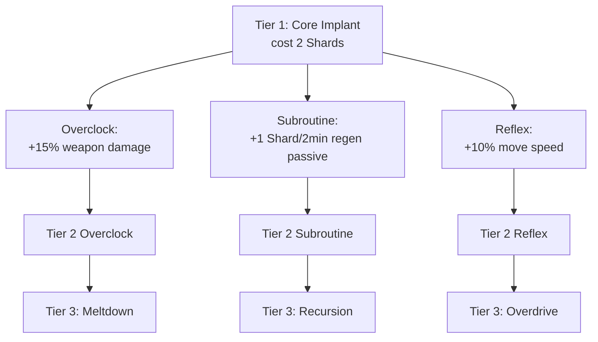

# 03 - Progression and Skills

The core of the map. This is where mechanical depth lives.

## Two Currencies

Runs operate on two parallel economies. Both are spent; neither persists across runs.

| Currency | Source | Sinks |
|---|---|---|
| **Points** (stock BO3) | Damage, kills, revives | Weapons, doors, perks, Pack-a-Punch |
| **Data Shards** (custom) | Underground trench income, Data Caches, Glitch Altar, boss rounds, boss-item duplicates | Perk slots, weapon Overclocks, Exo Suit, emergency drops |

Points are fast and plentiful. Data Shards are **slow and precious**.

> **Trench-only economy (user, 2026-06-19).** Shards are earned almost exclusively **underground**: the
> exposed-pit **Data Caches**, passive **trench income** (deeper layer = faster), the **Glitch Altar**
> jackpot, and boss/boss-item rewards. The old topside sources (elite corpse drops, Hack Terminal) are
> OFF by default (dvar-gated re-enable), and **Vault Overload is fully retired** (no toggle — see below) —
> you raid the trench to earn, and most of the deep sinks live underground too (Neural Expansion Bay, Exo Suit).

## Data Shard Sources (detailed)

All amounts are the shipped defaults (each has a live dvar for tuning).

- **Trench passive income** (`_acc_bus_trench.gsc`): +1 Shard per interval while you stand in a trench layer; deeper layers pay faster. `acc_trench_income_amount` (default 1).
- **Data Caches** (`_acc_data_shards.gsc::spawn_cache_at`, placed by `_acc_glitch_altar` at the pit west/east): a flat count per round, first player to loot it takes it, re-arms each round. Two caches, 3 each by default (`acc_cache_w_count` / `acc_cache_e_count`).
- **Glitch Altar jackpot** (`_acc_glitch_altar.gsc`): a gamble — the `shard_jackpot` outcome pays +4 (`acc_altar_jackpot`).
- **Shielded ("Riot") elite kill** in the trench: flat **3 Shards** to the killer (user 2026-07-13, was 2) (`_acc_elites.gsc::shielded_death_reward`, source `riot_elite`). Reactor/glitch-purge shielded grant nothing (survive-the-gauntlet threat, not a farm).
- **Boss round**: `int( round / 3 )` Shards to **every player independently** (`_acc_boss.gsc:376`, `acc_boss_shards_round_div`) — e.g. 3 at round 9, 6 at round 18, 9 at round 27. Boss rounds land every 9 from round 9; a mini-boss (Brutus) first appears at round 5 (once Bus Station power is on and round >= `acc_warden_first_round`, default 5). Types come from a no-duplicate shuffled roster (see [08_enemies.md](08_enemies.md)).
- **Glitch boss kill**: +1 Shard to the killer (`_acc_boss_glitch.gsc:802`).
- **Boss-item duplicate**: a duplicate boss-item pickup converts to **3 Shards** (`ACC_ITEM_DUPLICATE_SHARD_CONVERT`, `_acc_boss_items.gsc:33`) — a legitimate economy supplement in long co-op runs (see [09_boss_items.md](09_boss_items.md)). Boss-item salvage pays +1.

**Topside sources (OFF by default — dvar-gated re-enable):**

- **Elite corpse drop**: 1 Shard on any elite kill, gated by `acc_elite_shard_drop 1` (default 0; `_acc_elites.gsc`).
- **Hack Terminal** (Bus Station): +2 Shards, gated by `acc_hack_shard_drop 1` (default 0; `_acc_events_hack.gsc:138`).
- **Vault Overload**: **RETIRED** 2026-07-07 — the side event is commented out in `_acc_main.gsc:199`.

**Shard cap.** `ACC_SHARDS_MAX = 500` (`_acc_data_shards.gsc:38`) — finite to block infinite hoarding, but high enough to bank toward the deep multi-tier sinks (Exo Suit + per-gun Overclocks; see [29_exo_suit_plan.md](29_exo_suit_plan.md)). Dev mode (`level.acc_dev`, hardcoded in `acc_resolve_dev_flags()`) starts each player with **1000** and raises the cap to match (`ACC_DEV_SHARDS`, one-time grant in `on_player_connect`, `_acc_data_shards.gsc:39,106`).

## Where Shards Get Spent

Per-run competition for a limited budget.

| Sink | Cost | Module |
|---|---|---|
| **Perk slots** (start at 4, buy up to 10) | 4 / 6 / 8 / 10 / 12 / 14 (54 total for all 6 extra) | `_acc_perks.gsc` — Neural Expansion Bay (underground) |
| Weapon Overclock terminal (the sole weapon-upgrade path) | per-tier, linear +4/tier: 4 / 8 / 12 / 16 / 20 / 24 / 28 / 32 / 36 / 40 Shards (220 to max one gun) | `_acc_overclocks.gsc` — Tier 1–10 terminal (in-game label "CYBERWARE OVERCLOCK") |
| Exo Suit station | deep multi-tier sink | `_acc_exo.gsc` |
| Emergency Drop | 3 Shards (`ACC_EMERGENCY_COST_SHARDS`) | `_acc_emergency_drop.gsc` |
| Jukebox (song swap) | 2 Shards + points | `_acc_jukebox.gsc` |
| The Exchange (team shard transfer) | player-to-player | `_acc_transfer.gsc` |

Perk-slot cost is escalating: `cost = 4 + bonus*2` (`_acc_perks.gsc::perk_slot_cost`, `ACC_PERK_SLOT_BASE=4`, `ACC_PERK_SLOT_MAX=10`, live dvars `acc_perk_slot_*`). Electric Cherry is the real 10th perk (`_acc_perk_electric_cherry`), which is why the cap is 10.

**Design tension.** Shards are the trench payoff, and every deep sink competes for the same slow income — perk slots vs. weapon Overclocks vs. the Exo Suit. You can't max everything in one run, which forces the "what do I pump into" decision that keeps runs distinct.

## The Cyberware Skill Tree — DISABLED

> **Removed from play (user, 2026-06-19).** The three-branch Cyberware skill tree is **not spawned** — the
> kiosk trigger is gated off in `_acc_cyberware.gsc:92-97`, and the weapon **Overclock terminal** is now the
> sole upgrade path. The module still loads (its damage-flag readers are harmless no-ops with no nodes bought).
> **Re-enable with `acc_cyberware_on 1`** — the full node tree below is intact in code, just dormant.

The dormant design, kept for reference and in case it is re-enabled: three branches (Overclock / Subroutine / Reflex), three tiers each, **mutually exclusive within a tier** (pick one of three per tier). A full branch costs 2 + 3 + 5 = **10 Shards**; one tier respec per run for a 3-Shard tax (`ACC_CW_RESPEC_TAX`, `_acc_cyberware.gsc:77`).

- **Overclock** (damage): T1 +15% weapon damage → T2 Overload (+crit) / Fission (free elemental OC slot) → T3 **Meltdown** (kills explode for AoE, no chain).
- **Subroutine** (economy): T1 +1 Shard/2min passive → T2 Parallel Processing / Caching → T3 **Recursion** (every 5th elite kill drops a random pickup). The T1 passive-regen ticker (`subroutine_passive_regen_loop`) still runs but grants nothing while no node is owned.
- **Reflex** (mobility): T1 +10% move speed (only the move-speed half is implemented — `acc_cw_rx1_speed` → ×1.10 in `_acc_utility.gsc::recompute_move_speed`; the "+15% stamina regen" half has no code) → T2 Phase Step (slide-teleport) / Ghost Protocol (stand-still un-target) → T3 **Overdrive** (ramping sprint damage buff).

## Difficulty Curve

Zombie **HP** scales slightly faster than stock; the **speed** curve lives in `_acc_zombie_speed.gsc` (see [05_mechanics.md](05_mechanics.md)).

**Early rounds (1–4) are NEUTRALIZED to base-game counts** (user, 2026-06-24): `ACC_EARLY_SPAWN_MULT = 1.0` and `ACC_EARLY_SPAWN_MULT_R1 = 1.0` (`_acc_early_round_pacing.gsc:34-35` — the old ×1.45/×1.50 spawn-count and the +15% early move scale were removed). Spawn counts follow stock `max_zombie_func`; the early rounds are no longer a custom pressure ramp.

| Round band | Notes |
|---|---|
| 1–3 | Base-game spawn counts and opener pacing. Topside elites hold off. |
| 4+ | Topside Shielded elites begin on shield rounds (every 4 from r4: `round >= 4 && round % 4 == 0`); trench depth-shielded elites can spawn any round underground. The stock-derived speed curve ramps per `_acc_zombie_speed.gsc`. |
| 9, 18, 27, … | **Boss rounds every 9 from round 9** (count scales: 1 at r9, 2 at r18, 3 at r27), types dealt from a no-duplicate shuffled 4-type roster — Phantom, Avogadro, Panzer, Rogue/Civil Protector. (Brutus and Glitch are separate mini-bosses, not part of this roster.) |
| 5 | First **mini-boss** appears (Brutus) — once Bus Station power is on and round >= `acc_warden_first_round` (default 5). |
| Endgame | Scaling chaff + constant elite/special pressure; training becomes essential. |

- Elite spawn rate is floor-based ("guarantee at least N elites per round past round X"), not purely additive.
- Solo vs co-op scaling: regular-zombie HP +20% per extra player (1p 1.0 / 2p 1.2 / 3p 1.4 / 4p 1.6, `ACC_COOP_REGULAR_HP_PER_EXTRA 0.2` — the old +100%/extra was retired as "too tanky"); a custom spawn-count multiplier of +30% per extra player (1p 1.0 / 2p 1.3 / 3p 1.6 / 4p 1.9, `ACC_COOP_SPAWN_PER_EXTRA 0.3` via `level.max_zombie_func` override in `_acc_coop_scaling.gsc`); Data Shard drops go to the killing player; **boss Shards go to every player in full, independently** (not split). So 4-player co-op yields 4× boss Shards but the trench income and caches are still per-player-per-round — solo is intentionally competitive on the slow trench income.

## Design Notes

- **Respec tax** is a "clutch button," not a strategy — the 3-Shard cost means you pay for indecision (moot while the tree is disabled).
- **Tier-3 capstones** were never fully balanced (Meltdown likely strongest, Recursion the most fun) — dormant with the tree.
