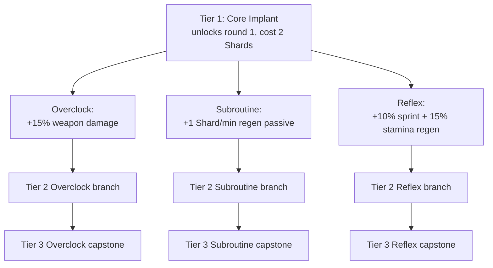

# 04 - Progression and Skills

The core of the map. This is where mechanical depth lives.

## Two Currencies

Runs operate on two parallel economies. Both are spent; neither persists across runs.

| Currency | Source | Sinks |
|---|---|---|
| **Points** (stock BO3) | Damage, kills, revives | Weapons, doors, perks, Pack-a-Punch |
| **Data Shards** (custom) | Elite kills, objective completion, boss rounds | Cyberware skill tree, Overclock re-rolls, emergency supply drops |

Points are fast and plentiful. Data Shards are **slow and precious** - a well-played run yields ~15-25 Shards by round 30; a typical Cyberware build costs 10-14 Shards.

## Data Shard Sources (detailed)

- **Elite kill** (shielded / teleporter / EMP zombie): 1 Shard. Elites start appearing round 5 and scale to ~1 per 8-12 regular zombies.
- **Boss round** (every 10 rounds): 2 Shards on round 10, 3 on round 20, 4 on round 30, capped at 4. Round 10 bosses are mini-bosses; round 30+ bosses are full.
- **Hack Terminal success** (Bus Station): 2 Shards. One per run.
- **Vault Overload success** (Vault): 3 Shards. One per run.
- **Side objectives**: 1-2 Shards each, 3-5 available per run (pool, see `07_replayability.md`).
- **Max Shard drop from a round**: soft-capped so you can't grind low rounds. Exceeding 2 Shards-per-round from elites triggers diminishing returns on that round only.

**Expected Shard budget by round for a clean run (solo):**

- Round 10: ~4 Shards (2 from boss + ~2 from elites)
- Round 20: ~10 Shards
- Round 30: ~18 Shards
- Round 40: ~25 Shards
- Round 50: ~32 Shards (with aggressive side objectives and good elite uptime)

> **Trench-only sources (user, 2026-06-19):** shards are now earned almost exclusively underground — the
> exposed-pit **Data Caches** (re-arm/round, scale with round), the **Trench Warden** kill, and the **Glitch
> Altar** jackpot. The old topside sources (elite drops, Hack, Vault Overload) are OFF by default (dvar-gated).
> All sinks live in the underground "Foundry/Black Market" (docs/45). You raid the trench to earn AND to spend.

**Where Shards get spent (per-run competition for budget):**

| Sink | Cost | When you buy it |
|---|---|---|
| **Perk slots** (start at 4, buy up to 9) | 4/6/8/10/12 (40 total) | The marquee goal — grind toward it all run |
| Cyberware full branch (Tier 1 + Tier 2 + Tier 3) | 10 Shards | Round 15-25 for the payoff |
| Weapon Overclock tiers (T1-T4, one weapon) | 10 Shards (1+2+3+4) | Spread across whole run |
| Weapon Overclock re-roll | 1 Shard each | Opportunistic (inert once a gun owns all 4) |
| Emergency Drop | 3 Shards | Clutch use, 0-2 per run |
| Respec Cyberware tier | 3 Shards | Rare, once per run max |

**Design tension**: at round 30 (18 Shards), you can afford one full Cyberware branch + ~8 Shards of weapon tier upgrades (that's Tier 3 on a primary weapon). You **cannot** do a full Cyberware branch *and* max-tier a weapon until round 40+. **Forces hard decisions about what to pump Shards into.** This is intentional - runs that reach round 40+ are runs that made tight Shard decisions at round 15-30.

Duplicates from boss-drop items convert to 3 Shards each (see [12_boss_items.md](12_boss_items.md)), which is a legitimate Shard-economy supplement in long co-op runs.

## The Cyberware Skill Tree

Three branches. **Within a single tier, branches are mutually exclusive.** You pick one of three at each tier unlock. You can respec one tier per run for a 3-Shard penalty.

Three tiers, three branches, nine total nodes. You end a maxed run with **3 nodes locked in** (one per tier) - so 27 distinct end-of-run build combinations, not counting Overclocks on weapons.

### Branch 1 - Overclock (damage / burst)

- **Tier 1**: +15% weapon damage (all guns).
- **Tier 2 (choose one of two sub-nodes, costs 3 Shards)**:
  - *Overload*: +30% critical hit damage, +50% crit chance on headshots.
  - *Fission*: your PaP weapon gets a free elemental Overclock slot (see `05_weapons.md`).
- **Tier 3 capstone (5 Shards)**: *Meltdown* - kills explode for AoE damage scaling with weapon damage. Does not chain.

### Branch 2 - Subroutine (economy / sustain)

- **Tier 1**: +1 Data Shard per 2 minutes passive (doubles effective Shard yield if you're moving).
- **Tier 2 (choose one of two sub-nodes, costs 3 Shards)**:
  - *Parallel Processing*: Hack Terminals and Vault Overload can be attempted twice per run instead of once.
  - *Caching*: down-but-not-out state lasts 2x longer before bleed-out, and self-revive Shard cost halved.
- **Tier 3 capstone (5 Shards)**: *Recursion* - every 5th elite kill drops a random pickup (max ammo, full armor, insta-kill, double points).

### Branch 3 - Reflex (mobility / evasion)

- **Tier 1**: +10% sprint speed, +15% stamina regen.
- **Tier 2 (choose one of two sub-nodes, costs 3 Shards)**:
  - *Phase Step*: slide becomes a short teleport through zombies (no damage dealt, no collision, 6s cooldown).
  - *Ghost Protocol*: standing still for 2s makes you untargeted by melee zombies (special enemies unaffected) until you move.
- **Tier 3 capstone (5 Shards)**: *Overdrive* - sprint grants a damage buff that ramps with time sprinting (+1% per second, max 30%), resets on taking damage.

### Cost Summary Per Branch

- Full branch (Tier 1 + one Tier 2 + Tier 3): 2 + 3 + 5 = **10 Shards**.
- Unlocking Tier 1 of a second branch for off-branch pickup: 2 Shards.
- **Full maxed build requires 3 Shards in tier 1 of the chosen branch + 3 + 5 = 10 Shards**, leaving you 5-20 Shards in a long run to spend on Overclock re-rolls and emergency services.

### Why Mutually Exclusive?

Because choice = skill. An Ameliorama-style "spend forever, unlock everything" tree is just an XP bar. Forcing mutual exclusivity per tier means:

- Your round-15 decision ("which tier 2 node?") is informed by how the run is going.
- Two players on the same map, same weapons, same round can be playing very different games.
- Build archetypes emerge naturally (see `07_replayability.md`).

### Respec Rules

- One tier respec per run. Costs 3 Shards. Returns the refunded Shards.
- Cannot respec down from Tier 3 (too strong a reset).
- Respec is a "clutch button" not a strategy - the 3-Shard tax means you pay for indecision.

## Difficulty Curve

Stock BO3 has a fairly forgiving ramp. Ours is steeper.

| Round | Zombies per round | Movement speed | Elite spawn rate | Notes |
|---|---|---|---|---|
| 1-4 | Stock `max_zombie_func` × **1.40** (r1) / × **1.35** (r2–4), ceil | **+15%** spawn move scale (r1–4) | 0 | **Setup pressure** — faster chaff + more bodies than stock; routing and economy matter from round 1. |
| 5-9 | 6n + 2 | Jog | 1 per ~10 | First elite (shielded). |
| 10 | Mini-boss round | - | - | Mini-boss replaces zombies. |
| 11-19 | 6n + 4 | Jog / sprint | 2 per ~10 | Second elite type unlocks (teleporter). |
| 20 | Mini-boss round (harder) | - | - | 2 mini-bosses. |
| 21-29 | 6n + 6 | Sprint | 3 per ~10 | Third elite (EMP) unlocks. |
| 30 | Full boss round | - | - | First real boss. Big Shard drop. |
| 31-39 | Custom spawn logic | Sprint | 3 per ~10 + chaff | Spawn logic tightens - fewer "safe" gaps. |
| 40 | Full boss (harder) | - | - | - |
| 41+ | Scaling chaff + constant elite pressure | Sprint | 4+ per ~10 | Endgame. Training becomes essential. |

Details:
- Zombie HP scales slightly faster than stock (start at 150, +100 per round vs stock's +100 starting at 130, equivalent to stock rounds-ahead-by-1).
- Rounds **1–4**: spawn count and per-spawn move speed use the **early round pressure** rules in [`06_mechanics.md`](06_mechanics.md) (not stock "walk-only" openers).
- From round **5**, "Movement speed" ramps per the stock-derived curve (see difficulty table above).
- Elite spawn rate is NOT purely additive - it's floor-based: "guarantee at least N elites per round past round X".

## Solo vs Co-op Scaling

- **HP scales per player** for regular zombies (stock): +100% per extra player.
- **Elites scale flatter**: +50% per extra player (so duos don't blender them).
- **Spawn rate scales**: +30% per extra player (not +100%, to avoid chaos).
- **Data Shard drops in co-op**: drop goes to the killing player. Side objective Shards are shared.
- **Boss Shard drops**: every player gets the full boss Shard amount independently.

This means 4-player co-op yields 4x Shards per boss but only ~2x Shards from elites (because elites are harder but not 4x harder to kill). **Solo is intentionally Shard-richer per elite** to offset the lack of team damage.

## Design Open Questions

- **Is the respec too lenient at 3 Shards?** Might test at 5. Decision: playtest Phase 3.
- **Tier 3 capstones might be unbalanced.** Meltdown is probably strongest; Recursion is the most fun. Decision: playtest Phase 3, rebalance in Phase 6.
- **Should we allow 2 tier-3 capstones in a very long run?** Leaning no (destroys build identity). If yes, cost should be 10+ Shards for the second.
