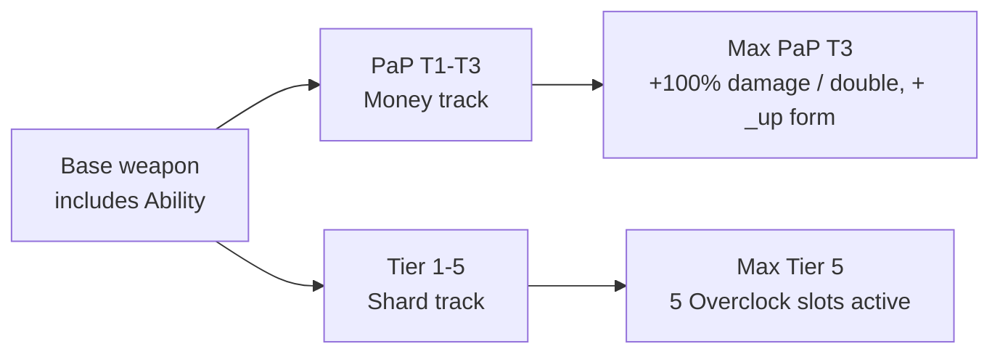

# 04 - Weapons

The arsenal, the Overclock system, custom perks, and the wonder weapon candidates. Most of the within-run replayability weight lives here because Overclocks randomize per run.

> **⚠️ ARSENAL = BOX ONLY (user; box list authoritative in `_acc_map_randomizer::register_mystery_box_pool`).**
> No wall buys except the 5 whitelisted spots below (all others removed at load by `remove_all_wallbuys()`);
> every gun comes from the Mystery Box, which clears `is_in_box` on the whole stock CSV roster and re-enables
> only the chosen set. **Live box (28 draw candidates + 2 fixed-odds tacticals — authoritative roster + all PaP
> stats in [docs/25](25_weapon_stats_table.md) + [docs/33](33_pap_pricing_tiers.md); this list is the exact
> `box_weapons` array):**
> - **Pistols:** Five-Seven `t6_fiveseven` (also the starting pistol), RW1 `s1_rw1` (AW directed-energy).
> - **SMGs:** PPSH-41 `s4_ppsh41_base`, AK-74u `t9_ak74u`, Alternator `apex_alternator` (Apex; trash base / A+ PaP), Prowler `apex_prowler` (Apex burst SMG).
> - **ARs:** AK-47 `t9_ak47`, XM4 `t9_xm4`, AE4 `s1_ae4` (energy), Grav `t9_grav` (CW model + Galil stats), Havoc `apex_beam_rifle` (Apex energy-projectile rifle, classed a special).
> - **Shotguns:** Tac-19 `s1_tac19`, Olympia `t6_olympia`, Streetsweeper `t9_streetsweeper`, CEL-3 `s1_cel3`, Peacekeeper `apex_peacekeeper` (Apex lever, power-first top shotgun).
> - **Marksman / snipers:** MK14 `s1_mk14`, MORS `s1_mors` (charge railgun), G7 Scout `apex_g2a4` (Apex semi marksman).
> - **LMGs:** M60 `t9_m60`, RPD `t9_rpd` (both Cold War).
> - **Explosive specials:** Mahem `s1_mahem` (molten-metal rocket) + War Machine `t6_war_machine` (BO2 6-round drum GL, IMPACT detonation — GDT-native `fuseTime 0`; PaP "Dystopic Demolisher" = 12-rd full-auto drum; ~2000 direct/shot, below the Mahem per-shot — the drum burst is the appeal; Speed-Cola-only fastreload twins).
> - **Wonder weapons** (all claim-capped 1 player/match, `wonder_cap_key()`): Thundergun `thundergun` (wind-blast, `is_limited=1`), Blast-O-Matic `t9_semiauto_cosplay` (CW DOA energy blaster), Fire Bow `elemental_bow_demongate` (HB21 demon-gate), Leviathan Axe `leviathan` (GoW melee).
> - **Tacticals** (fixed pre-roll, `acc_box_tactical_preroll()`): Monkey Bomb `cymbal_monkey` 1% · Li'l Arnie `octobomb` 0.5%.
>
> **REMOVED guns (entries kept inert in code for easy restore — do NOT re-list them as live):** the **Apex
> migration 2026-07-06** replaced four guns — **Chicom CQB `t6_chicom_cqb` → Prowler**, **China Lake
> `t5_china_lake` → Havoc**, **Klauser `s4_klauser` → Alternator**, **Paladin HB50 `t8_paladin_hb50` → G7
> Scout**; **ASM1 `s1_asm1`** was retired 2026-07-03. (Their `acc_weapon_balance_mult` lines survive but are
> unreachable.) Earlier, 2026-06-23, **Ripper, Nail Gun, PDW-57, M1911** were cut for being un-twinnable.
>
> Plus the **Action Figure** `t8_melee_figure` — a fun
> handheld MELEE (BO4 `t8` port by T0nic; swing it like a bat), **box weight S-tier** (user 2026-06-23).
> It's a gitignored rip-port external asset (TEST-ONLY until IP review — CREDITS + `tools/external_assets_manifest.ps1`;
> linker-patched by `tools/fix_actionfigure_port.js`). Class `special` (not Overclock-tiered). **QUIRK:
> it ALWAYS one-knifes a SINGLE regular zombie (every swing, any round); bosses/elites are exempt (normal melee, no
> one-knife). **PaP scales SWING SPEED, not targets (user 2026-06-27):** each PaP tier swaps in a faster "speed twin" —
> **+100% / +200% / +300%** swing rate at tiers 1/2/3 (`fireTime ×0.5 / ×0.33 / ×0.25`). It PaPs IN PLACE (no `_up`
> form, TOP-bucket price 5000/7500/10000). Logic in `_acc_damage` (`is_action_figure_weapon` one-knife gate) +
> `_acc_pap_levels::acc_pap_actionfigure`. *(The old per-tier CLEAVE / multi-hit + `acc_af_cleave_radius` were removed
> 2026-06-27; the speed twins are WIP — the base figure is currently set to the max test speed for feel-testing.)** **Overclock eligibility (user 2026-06-22):
> EVERY gun overclocks — all box guns AND the starting Five-Seven — EXCEPT the Thundergun,
> which keeps its intrinsic wonder-weapon power and is not terminal-tiered. (Classified in
> `_acc_overclocks::weapon_name_to_family`; pistols return the `pistol` family, `thundergun` returns `none`.)**
> **See the [Gun Tier List](#gun-tier-list-design-intent)
> below for each gun's tier, stats, ability, and rationale — that's the canonical roster.** Per-gun
> damage balance lives in `_acc_damage::acc_weapon_balance_mult` (tier-tagged return lines).
> **EVERY conventional box gun is FULLY twinned (benefits from the Mega-perk recoil/reload buffs — the fire-rate "Gun Slinger" twin was REMOVED 2026-07-04, Mega Double Tap is now damage-only);
> the wonder weapons keep their intrinsic power (Blast-O-Matic is the exception — hand-built twins, see
> `_acc_weapon_variants`). REMOVED 2026-06-23 (user "remove any gun that can't be fully twinned"):
> Ripper (convertible altWeapon), Nail Gun (projectile), PDW-57 + M1911 (akimbo PaP) — none could be twinned.**
> **⚠️ The "Roster Structure (v1.0)" / "16-Weapon Roster" / "Per-Weapon Detail" sections far below are the
> ORIGINAL never-built greybox spec (B23R, Haymaker, ICR-1, FAL, Intervention, etc.) — kept only as design
> history. The LIVE arsenal is the box list above; live per-gun stats/tiers are [docs/25](25_weapon_stats_table.md) +
> [docs/33](33_pap_pricing_tiers.md).**
>
> **Global gun buff (user 2026-06-23):** all player damage is lifted by a single across-the-board
> scalar `acc_global_dmg_mult` (default **3.25 = +225%**; user 2026-06-23 bumped 1.20 → 1.32 → 1.50; user 2026-06-24 bumped 1.50 → 2.50; user 2026-06-25 bumped 2.50 → 3.0 → 2.75; user 2026-06-29 → 3.25), applied in `on_ai_damage` OUTSIDE the per-gun
> table — so it buffs every gun *uniformly* and the relative `acc_weapon_balance_mult` tiers above still
> hold. To make guns stronger overall, raise this one dvar rather than re-touching every per-gun line.
>
> **Wall-buys (user 2026-06-23; chalk + placement fixed 2026-06-24; AK-47 added 2026-06-26):** the map is
> box-first but has **5 fixed wall-buys** (whitelisted in `remove_all_wallbuys()`) — **Five-Seven @ Lab** (500),
> **Olympia @ Bus Station** (500), **frag grenade @ Spawn** (100), the **AK-47 @ Abyss Layer 4** (1500, an
> S-tier wall-buy on the "4th floor" trench z=-960 to pull players into the pit), and the **M60 @ Abyss Layer 5**
> ("bottom floor" before Paradise — the second S-tier abyss wall-buy, user 2026-06-27).
> Each is the proven early recipe (commit `0044a16`): an inline worldspawn **chalk outline mesh** on the wall
> face + a `weapon_upgrade` trigger + a model struct, all co-located ON the wall (2u proud) and angled into the
> room. Costs in [zm_levelcommon_weapons.csv](../gamedata/weapons/zm/zm_levelcommon_weapons.csv). The hint text
> and weapon/nade granted come from `zombie_weapon_upgrade` + the CSV (not the chalk), so the chalk shape is
> cosmetic/generic. **Chalk only (user 2026-06-24):** the redundant server-spawned 3D gun/monkey-bomb model
> (`spawn_acc_wallbuy_models()`) is **disabled**, so each spot shows just the chalk outline. Owning the gun
> switches the prompt to **buy ammo** (PaP'd → 4500, else
> ~half cost). Re-enabled past the box-only `remove_all_wallbuys()` by whitelisting those 4 weapon names — see
> [06_replayability.md](06_replayability.md). _(The prior pass wrongly claimed the chalk material "won't
> compile" and used floating 3D models instead — both fixed: the chalk tokens are plain colorMap `material.gdf`
> assets, verified on disk.)_
>
> **Ammo economy (2026-06-16).** Every box gun runs a global **30% ammo cut** baked by
> `tools/reduce_base_ammo.js` (FACTOR 0.70). In the Skye GDTs `maxAmmo`/`startAmmo` are reserve
> **magazine** counts, so **in-game reserve rounds = `maxAmmo × clipSize`**; cutting `clipSize`
> ×0.70 drops both the mag and the reserve by 30% in one edit. Two special cases: **Olympia**
> (double-barrel, `clipSize 2` floor) takes its 30% off `maxAmmo` instead (clip stays 2); the
> **PDW akimbo-PaP** shipped a broken `maxAmmo 920` (Skye data error, clamped to 18 ≈ 306 reserve).
> Approx live reserves — autos ~130-225 base / ~280-420 PaP; shotguns/snipers/pistols ~26-84 (low
> by design). Tune in that one tool; re-run + `gdtdb /update` + linker.
>
> **Mahem launcher (special) is hand-tuned on its own GDT — NOT in `reduce_base_ammo.js`'s list
> (left uncut by design).** Base `s1_mahem`: `clipSize 1`, `maxAmmo/startAmmo 20` → 20 reserve.
> PaP `s1_mahem_up`: `clipSize 10`, `maxAmmo/startAmmo 3` → **30 reserve** (user 2026-06-24, was
> `4` = 40 reserve, "too much"). Edit `skye_s1_mahem.gdt` directly, then `gdtdb /update` + linker.
> Because this GDT is install-side and untouched by either ammo tool, a fresh asset re-install
> reverts it to the Skye default (40) — re-apply this value if you ever reinstall the pack.
>
> **PaP 3-tier (Mahem "only packs twice" — REAL fix, user 2026-06-26):** the Mahem now upgrades through all
> **three** PaP tiers like every other gun. **Root cause** (traced through stock `_zm_pack_a_punch.gsc` +
> `aat_shared.gsc` + `_zm_weapons.gsc`, after several wrong fixes): after the tier-2 transform you hold
> `s1_mahem_up`, and the stock machine's visibility gate `player_use_can_pack_now()` shows the machine only if
> `can_pack_weapon(held) || weapon_supports_aat(held)`. For **any** `_up` gun `can_pack_weapon` is false
> (stock registers only the BASE in `level.zombie_weapons`), so every gun depends on **`weapon_supports_aat(_up)`**
> for the tier-2→3 visibility — and that needs the gun to NOT be AAT-exempt. The Mahem's CSV row sets
> **`AAT_EXEMPT` (col 17) = TRUE** (it's a launcher), so `register_aat_exemption(s1_mahem_up)` runs →
> `weapon_supports_aat` returns false → the machine **hides after pack 2**. (`is_weapon_upgraded(s1_mahem_up)`
> was *always* true via stock `add_zombie_weapon`, so the upgrade-table fixes prior agents tried were no-ops.)
> **Fix:** `_acc_pap_levels::make_mahem_pap_visible_to_tier3()` drops `s1_mahem_up` from
> `level.aat_exemptions`. AAT is globally OFF (`level.aat_in_use=false`), so this grants no alt-ammo — it only
> restores machine visibility so `acc_pap_validate` runs the in-place tier-3 pack. Verify with `+set acc_dev 1`
> → the dev log prints `was_aat_exempt=1 is_weapon_upgraded=1`, and the 3rd pack reaches **tier 3/3**.

Enemies are in a separate doc: [08_enemies.md](08_enemies.md).

## Gun Tier List (multi-factor)

**A gun's tier is COMPUTED from all its stats by the scoring formula below — not from DPS alone.** Each gun
gets a 0–10 **composite score** = the weighted sum of six factor scores; the score maps to an S/A/B/C tier.
To move a gun's tier, change the stat(s) that matter (DPS via `acc_weapon_balance_mult`; clip/reserve/reload via
`tools/reduce_base_ammo.js`; recoil via `apply_recoil_overhaul.js`) and recompute. *(Formula v2 + scores last synced
2026-06-21.)*

### Scoring formula (v2 — "sustain" model)

Composite (0–10) = Σ (factor score × weight). Re-weight here if priorities shift, then recompute the table.

| Factor | Weight | Score scale (→ 1–10) | Notes |
|---|--:|---|---|
| **Effective DPS** | **30%** | per-shot guns judged on horde-kill potential; autos **340 → 1 … 664 → 10** (steeper, so weak-DPS guns can't free-ride on handling) | output — dominant, not everything |
| **Mobility** | **16%** | `moveSpeedScale` 0.80 → 4 … 1.00 → 10 | kiting trains; mainly an LMG penalty (most guns sit at 1.0) |
| **Sustain (uptime)** | **18%** | **effective reload = reloadEmpty ÷ clip**, log-scaled (~0.05 s/round → 10 … ~2.0 → 1) | **THIS is how clip is rewarded** — a big clip means you reload far less often, so it *shrinks* the reload cost. Built-in diminishing returns (doubling clip only halves an already-small per-round cost). Folds the old separate reload + clip factors into one. |
| **Penetration** | **14%** | none 2 · small 4 · medium 7 · large 10 | pierces a zombie *train* |
| **Reserve** | **14%** | **LOG-scaled**: ~26 → 1.5 … ~400 → 10 | rewards an exceptional reserve with diminishing returns |
| **Handling** | **8%** | full-auto / charge 8 · sniper 6 · semi-pistol / single-shotgun 5 | fire-type + range + accuracy |

**Thresholds:** S ≥ 7.7 · A 6.6–7.69 · B 5.6–6.59 · C < 5.6. Sub-tiers (+/−) split each band into thirds.

**Two special rules** layered on top of the score:
- **Snipers are scored on single-target DPS, not chaff** (a one-shot boss-killer's "DPS" is its single-target output). That's why MORS can reach S despite a 1-round charge clip — its single-target power is elite (and why a damage-only buff can't get it there: the clip-1 sustain floor means S also needs the reserve lift). Without single-target scoring, the horde-weighted formula would bury all snipers in B.
- **Pellet shotguns (Tac-19, Olympia) take a separate BOSS-damage cut** (`ACC_SHOTGUN_BOSS_MULT` in `_acc_damage.gsc`, default ×0.25). Their 8 pellets all land on a boss's single hitbox → ~8× stacked damage. This cut only applies *vs bosses/mini-bosses* — it doesn't change their chaff tier (Tac-19 stays the chaff king) but stops the boss-nuke. **This is a damage rule, not a tier-score factor.**

#### Boss-nuke audit (user 2026-06-24 — "one-shot / explosive guns nuking bosses")

The "Thundergun does ~200k to a boss" report is a **systemic** issue: any **multi-hit / explosive** weapon that lands several damage events on a boss's single hitbox stacks into a nuke, amplified by the **×3.25 global player-damage buff** (`ACC_GLOBAL_DMG_MULT`). The only weapons currently protected against this are pellet shotguns (above). Audit of every acquirable damage weapon:

> ⚠ **The `balance mult` column is the 2026-06-24 snapshot.** Several have since been re-tuned to target-damage values — current per-gun mults (verified `_acc_damage.gsc`): **Thundergun 0.45, Mahem 0.1099, Tac-19 0.49929, Olympia 0.41734** (both shotguns took a −20% all-shotgun nerf 2026-07-06); the global player-damage scalar is **3.25** and `ACC_BOSS_HEADSHOT_MULT` is now **0.8** (= 4× boss head; user 2026-07-08, was 0.6). Paladin HB50 was REMOVED in the Apex migration. Live source of truth: `_acc_damage.gsc::acc_weapon_balance_mult()` + the generated [docs/25](25_weapon_stats_table.md).

| Weapon | balance mult | boss-damage cut? | verdict |
|---|---|---|---|
| **Thundergun** (WW) | was **1.0 (UNLISTED!)** → **0.70** (−30%, user 2026-06-24) | **none** | **Root cause.** No balance entry at all → zero cut, while every other gun is cut to 0.10–0.70. Wind-blast cone multi-traces a boss → ~200k. The −30% helps everywhere but it **still nukes** (~140k) — needs a boss cut. |
| **Mahem** (launcher) | **0.29** (0.315 → 0.40 buff → **0.29** −27.5% nerf, user 2026-06-29 vs the 3.25 global) | **none** | Explosive direct + splash both hit one boss hitbox. Ammo-limited so it self-balances somewhat, but no boss cut. |
| **Paladin HB50** (sniper) | 0.3565 | **yes ×0.50** (user 2026-06-24) | One-shot single-target boss-killer; bosses negate the headshot mult (`ACC_BOSS_HEADSHOT_MULT 1.0`) and it's RoF/ammo-limited → not a burst nuke, but reined in vs bosses on user request (`acc_paladin_boss_mult`). |
| Tac-19 / Olympia | 0.49929 / 0.41734 | **yes ×0.25** | Handled (pellet cut). |
| All other guns | 0.10–0.31 | n/a | Single-trace, deeply cut → fine. |
| Frag / Octobomb / Cymbal Monkey | 1.0 (no entry) | none | Explosive, no boss cut — but quantity-limited tacticals, minor. |

**Systemic fix (IMPLEMENTED, user 2026-06-24):** the boss-damage cut is generalized beyond pellet shotguns. `_acc_damage.gsc::boss_nuke_mult()` applies a boss-only REDUCTION (gated on `acc_is_boss`/`acc_is_mini_boss`, stacks on top of `acc_weapon_balance_mult`):
- **Thundergun** ×`acc_thundergun_boss_mult` (default **0.20**) → ~140k (post −30%) drops to **~28k/blast** vs a boss — a strong boss tool, not a one-shot. Chaff power on regular zombies is untouched.
- **Mahem** ×`acc_launcher_boss_mult` (default **0.50**) → ~6,600 direct (0.29 balance × 3.25 global) drops to **~3,300/rocket** + splash; gentler because it's ammo-limited.
- **Paladin HB50** ×`acc_paladin_boss_mult` (default **0.50**, user 2026-06-24) → ~half its per-shot boss damage. It's a single-shot sniper (not a multi-hit nuke), but reined in vs bosses on request. NOTE: the Paladin's design niche IS single-target boss-killing (it's tier-scored on single-target DPS) — a strong boss cut eats into that niche, so dial `acc_paladin_boss_mult` up toward 1.0 if it feels too weak vs bosses.

Both are live dvars — dial the exact boss damage without a rebuild. To protect a future multi-hit special, add its root name to `boss_nuke_mult()`.

#### Deeper audit (2026-06-24, adversarial workflow) — the name-keyed cut is NOT enough; a hard cap is

An adversarial 19-agent audit found the weapon-name boss cuts above are **structurally defeated** in several ways, so they were backstopped with a **final per-hit boss-damage cap** (`ACC_BOSS_PER_HIT_CAP_PCT`, dvar `acc_boss_per_hit_cap_pct`, default **0.10** = a single player hit deals at most 10 % of a boss's maxhealth → ≥10 hits to kill). It clamps `final_damage` **after every multiplier** (global ×2.5 **and** insta-kill ×6), so it survives every bypass below. Applies to the **heavyweight bosses only** (marker-gated on `acc_is_boss`/`acc_is_mini_boss`, so it covers Brutus, The Phantom, and every roster boss) — the Glitch Stalker (`acc_is_glitch_zombie`) is excluded so it still dies fast.

Why the name-keyed cut alone failed (all confirmed in code):
1. **The Thundergun one-shot is a WEAPONLESS DoDamage.** The real ~200k is the stock `thundergun_fling_zombie` → `DoDamage(self.health + 666)` with **no weapon** — so `acc_weapon_balance_mult` (gated on `isdefined(weapon)`) and `boss_nuke_mult` (returns 1.0 for undefined weapon) **never fire**. `int(80666 × 2.5) = ~201,665` = the exact report. The −30% nerf + ×0.20 cut did nothing to it. The hard cap catches it.
2. **Octobomb** (granted by the Li'l Arnie boss item) does `DoDamage(target.health)` (full-HP pull) — same weaponless bypass, one-shots any boss. Capped now.
3. **Insta-Kill ×6** is applied *after* the boss cut + global, re-inflating a cut weapon past the one-shot line during the powerup window. Capped now.
4. **Investment stacking** (PaP T3 + Cyberware Amplifier + Overclock T10) lives in the *bonus_sum* bucket, a different bucket than the cut's *reduction* — so a fully-kitted weapon multiplies right past the cut (~130k/blast even at ×0.20). The advertised "~28k/blast" only held for a zero-investment gun. Capped now.
5. **Ability auto-crit** (Precision Mode +4.0 / Focus Fire / Slug +3.0) adds a flat bonus on bosses that the headshot-negation (`ACC_BOSS_HEADSHOT_MULT 1.0`) does **not** cover — biggest on the uncut snipers **MORS (`s1_mors`)** and **MK14 (`s1_mk14`)**. Capped now.
6. **Melee** (Action Figure, Bowie) has no balance entry and scales with the Exo melee layer (now +30 %/tier to T10) → ~10k/swing maxed; single-target/point-blank, low severity, but also capped now.

The `boss_nuke_mult` cuts (Thundergun/Mahem/Paladin) are **kept** — they shape the baseline feel *below* the cap. The cap only removes the one-shot ceiling-break. `acc_boss_per_hit_cap_pct 0` disables it.

> **Model + curation history (user, 2026-06-21):** the formula is "v2 sustain" — clip is rewarded *through* reload
> (a big clip = you reload rarely), reserve is log-scaled. On top, the user hand-set several sub-tiers and the stats
> were tuned to match: M60 **S** (DPS↓, clip 100/reserve 400), MORS **S** / Paladin **B** (sniper swap 2026-06-24: MORS DPS↑ + reserve 120/180, Paladin DPS↓ 0.70→0.49),
> PPSH **S** (user 2026-06-24 all-around buff: +20% dmg + clip 30/44→40/54), Grav **B+**, Five-Seven **C**, AE4/AK-47 **A**, Olympia **C**. Tac-19 got the boss-damage cut.

### Tier ranking — BASE guns (out of the box, no PaP)

> ⚠️ **PARTIALLY STALE snapshot (2026-06 tuning pass).** The rows for **Nail Gun, Ripper, PDW-57, M1911,
> ASM1, Paladin HB50, Chicom CQB, Wunderwaffe DG-2** are REMOVED guns — ignore them. The live box also adds
> **XM4, Streetsweeper, CEL-3, Peacekeeper, Prowler, Alternator, G7 Scout, Havoc, War Machine, Blast-O-Matic,
> Fire Bow, Leviathan Axe** which are NOT in this table. The canonical, auto-generated per-gun tier/score/PaP
> data is [docs/25](25_weapon_stats_table.md) + [docs/33](33_pap_pricing_tiers.md) — trust those over this table.

How good the gun is *when you roll it* — the box-roll quality.

| Tier | Score | Gun | Class | Eff DPS | Clip | Reserve | Reload | Move | Pen | Key drivers |
|---|--:|---|---|--:|--:|--:|--:|--:|---|---|
| **S** | 7.9 | Nail Gun | AR (proj) | ~589 | 40 | 280 | 2.0s | 1.0 | none | Best sustain in the game (fast reload + 40 clip). |
| **S** | 7.9 | M60 | LMG | ~580 | **100** | **400** | 9.7s | 0.8 | large | DPS traded down for a 100-clip + 400 reserve; the huge mag makes the 9.7s reload trivial. |
| **S** | 7.7 | MORS | Sniper | ~429/shot | 1 | **41** | 1.2s | 1.0 | large | **Moved B → S** (user 2026-06-24): the premier boss-killer. **−35% dmg** (×0.66→0.429) + **reserve −15%** (→41), user 2026-06-27 — **tier/score kept** (damage-only tweak, docs/33 not regenerated). |
| **B** | 6.1 | Paladin HB50 | Sniper | ~357/shot | 8 | 80 | 4.1s | 1.0 | large | **Moved low-S → B** (user 2026-06-24). **−25% dmg** (×0.4753→0.3565) + **reserve −15%** (96→80), user 2026-06-27 — **tier/score kept**. One-shots early, then falls off. |
| **S** | — | Wunderwaffe DG-2 | Wonder | chain lightning | — | recharge | — | — | — | Outside the formula; `is_limited=1`. |
| **A+** | 7.5 | Tac-19 | Shotgun | crowd king | **3** | **27** | **0.47s** | 1.0 | large | **Nerfed** (user 2026-06-21): damage −9% + clip 4→3 + reserve →27 → dropped out of S to A+. Still chaff-strong; **boss damage also cut** (see below). |
| **S** | ~7.9 | PPSH-41 | SMG | ~590 | 40 | 360 | 3.5s | 1.0 | med | All-around buff (user 2026-06-24): +20% dmg + clip 30→40; massive clip + RoF + DPS = back to S. |
| **A** | 7.7 | AK-47 | AR | ~585 | 21 | 168 | 3.25s | 0.95 | med | Strong DPS — +3% spread buff + swapped to TOP/S tier (2026-06-26). |
| **A** | 7.1 | Ripper | SMG⇄AR | ~AK band | 22 | 220 | ~2.5s | 1.0 | med | Convertible flexibility + good reserve. |
| **A-** | 6.8 | AE4 | AR (energy) | ~413 | 25 | 200 | 2.0s | 1.0 | med | Mid DPS, but fast reload + pierce + clip + reserve = A-grade kit. |
| **B** | 6.5 | AK-74u | SMG | ~414 | 20 | 160 | 2.8s | 1.0 | med | Fast, mobile; DPS cut — swapped to MID tier with AK-47 (2026-06-26). |
| **B+** | 6.5 | ASM1 | SMG | ~401 | 22 | 132 | 2.1s | 1.0 | med | Low DPS saved by fast reload + clip + pierce. |
| **B+** | 6.5 | Grav | AR | ~412 | 25 | 225 | 2.9s | 0.95 | med | Galil stats grafted onto the CW Grav model/sfx (2026-07-05). |
| **B** | 5.9 | MK14 | DMR | ~81/shot | 14 | 168 | 2.0s | 0.95 | med | Semi-auto marksman (AW): hard per-shot, ~3× headshot, **curated** single-target DPS. **−10% dmg** (×0.291→0.2619), user 2026-06-27 — tier kept. |
| **C** | 5.5 | RPD | LMG | ~421 | 60 | 240 | 7.5s | 0.8 | large | +25% damage buff (user 2026-06-25, mult 0.10→0.125, ~337→~421); tier/PaP-price/box-odds NOT recomputed. Big clip, slow move. |
| **C** | 5.5 | Five-Seven | Pistol (start) | ~52/shot | 14 | **56** | 1.8s | 1.0 | small | Weak starter; reserve cut to land it at C. |
| **C** | 5.2 | M1911 | Pistol | ~70/shot | 6 | 60 | 1.85s | 1.0 | small | Weak base — its value is the **PaP** (see the PaP list). |
| **C** | 5.2 | PDW-57 | SMG | ~330 | 11 | 132 | 2.1s | 1.0 | small | Hard DPS cut + small clip/pierce. |
| **C** | 4.8 | Olympia | Shotgun | 110×8 | 2 | 26 | 3.9s | 1.0 | small | 2-round clip = worst sustain in the game. Headshot-excluded. |

### Mystery box roll odds — tier-weighted (user 2026-06-22)

The box is **NOT uniform** — the better the tier, the rarer the roll. Per-gun **weights** in
`_acc_map_randomizer::acc_box_weight`, applied via the `treasure_chest_ChooseWeightedRandomWeapon` hook
(`acc_box_only_weapon_keys` does the weighted pick and returns it first; stock takes the first eligible key):

Box weight is driven by the **curated power ranking** (docs/33) — the same ranking that sets PaP cost.
Best packed guns are both the priciest to pack AND the rarest roll. Generated into `acc_box_weight` by
`tools/gen_box_dynamic.js`; **canonical per-gun odds live in [docs/33_pap_pricing_tiers.md](33_pap_pricing_tiers.md).**

Headline odds (user 2026-07-09 retune):

| Group | Per-open % |
|---|--:|
| **Wonder weapons** (Thundergun / Blast-O-Matic / Fire Bow / Leviathan Axe) | **0.30% each** (fixed target) |
| **Action Figure** | **0.81%** (fixed target) |
| **Havoc** | **1.19%** (fixed target, cut from ~2.4%) |
| **Conventional guns** | geometric 11%/step curve: best (XM4) **1.32%** → worst (Five-Seven) **10.62%**. 2026-07-09 rarity SWAPS: XM4↔M60, Peacekeeper↔PPSH, CEL-3↔AK-74u, MK14↔Grav, Olympia↔Five-Seven (pure odds trades; every PaP price unchanged — AK-74u pinned MID) |
| Monkey Bomb / Li'l Arnie | fixed pre-roll 1.0% / 0.5% |

Pool total weight 3886; the worst gun is ~35× more likely than a wonder weapon. The box never repeats a
gun you already own, so live odds re-normalize as you collect. To retune, edit the RANK/curve in
`tools/gen_box_dynamic.js` and re-run (regenerates docs/33 + prints both GSC functions to paste) — do
not hand-edit `acc_box_weight`.

### Tier ranking — FULLY PACK-A-PUNCHED (T3)

> ⚠️ **Same staleness caveat as the base table:** the **Nail Gun / PDW-57 / M1911 / Ripper / ASM1 / Paladin
> HB50** rows are REMOVED guns; the live Apex/CW additions are absent. Canonical packed-tier data =
> [docs/33](33_pap_pricing_tiers.md).

How good the gun is *at its ceiling*, after full PaP — which guns are worth maxing. PaP scales DPS ~×2.0
uniformly at T3 (so the DPS order barely moves); the reshuffle vs base comes from **bigger PaP clips/reserves**
(better sustain) and the **transform guns leaping up** — M1911 → explosive akimbo, PDW / Five-Seven → akimbo.

| Tier | Score | Gun | PaP clip | PaP reserve | What PaP does |
|---|--:|---|--:|--:|---|
| **S** | 8.1 | Tac-19 | **6** | **54** | Chaff ceiling (nerf dropped it S+→S; boss damage still cut). |
| **S** | 8.1 | Nail Gun | 50 | 400 | Bigger nail + huge sustain. |
| **S** | 7.9 | MORS | 1 | **61** | **Moved B → S** (user 2026-06-24): charge railgun one-shot. **Reserve −15%** (→61) + **dmg −35%**, user 2026-06-27 — tier kept. |
| **low S** | 8.0 | M60 | 120 | 480 | 120-clip belt — never stops firing. |
| **low S** | 7.9 | AK-47 | 31 | 279 | Swapped to TOP tier with AK-74u (2026-06-26). |
| **S** | ~8.1 | PPSH-41 | 54 | 486 | All-around buff (user 2026-06-24): +20% dmg + PaP clip 44→54. |
| **low S** | 7.7 | **PDW-57** | 17 | 306 | **→ akimbo + separate higher mult** (user 2026-06-21): base C → **bottom S** packed. |
| **A+** | 7.5 | Ripper | 34 | 340 | Both modes packed. |
| **A** | 7.2 | AE4 | 38 | 304 | — |
| **A** | 7.1 | **M1911** | 8 | 80 | **→ akimbo EXPLOSIVE nuke** (base C → A). The biggest PaP jump. |
| **A** | 7.0 | AK-74u | 40 | 280 | Swapped to MID tier with AK-47 (2026-06-26). |
| **A** | 7.0 | **Five-Seven** | 21 | 462 | **→ akimbo** (base C → A). |
| **A** | 7.0 | ASM1 | 36 | 288 | — |
| **A-** | 6.9 | Grav | 35 | 420 | — |
| **B** | 6.4 | Paladin HB50 | 11 | 110 | **Moved S → B** (user 2026-06-24). **Reserve −15%** (132→110) + **dmg −25%**, user 2026-06-27 — tier kept; 11-round one-shot, mid-tier. |
| **B** | 6.0 | RPD | 100 | 400 | Big belt, but low DPS ceiling. |
| **B** | 6.0 | MK14 | 12 | 240 | Per-shot doubles (79→158 body) + more reserve; stays a precise marksman, not a sprayer. **−10% dmg** user 2026-06-27 — tier kept. |
| **C** | 5.2 | Olympia | 2 | 42 | 2-round clip — PaP can't fix the sustain. |

> **Reading the two lists:** the base list is your *roll quality*; the PaP list is your *investment ceiling*.
> The transform akimbo guns jump hardest when packed — **PDW C → bottom S**, **M1911 C → A** (explosive),
> **Five-Seven C → A** — so they're "bad roll, great if you commit." **Olympia stays C even maxed** (the 2-round
> clip caps it). **Tac-19** was nerfed to **A+ base / S packed**, with its boss damage deliberately cut
> (`ACC_SHOTGUN_BOSS_MULT`, below).

¹ Five-Seven / PDW / M1911 PaP forms are akimbo — PaP reserve shown is the combined `_rdw` form.

**Tier philosophy:** **S** = the roll you celebrate. **A** = strong, very desirable. **B** = reliable mid-tier.
**C** = the "bad roll" / budget fallback. A fully-upgraded C gun can still out-DPS a base A gun — tiers are about
*base feel and roll excitement*, not an absolute power ceiling.

## Design Logic

> **⚠️ HISTORICAL:** the original v1.0 plan was a "3 tiers × 4 categories + utility = 16 weapons" wallbuy-based
> roster (B23R / Haymaker 12 / Brecci / ICR-1 / XR-2 / M14 EBR / G3 / FN FAL / Intervention / Locus / Drakon /
> Bowie / EMP grenade). **None of that shipped** — the map is box-only (see the arsenal list at the top) with
> the live roster in [docs/25](25_weapon_stats_table.md) + [docs/33](33_pap_pricing_tiers.md). The old
> "normal-wallbuy / bad-box / strong-box" three-tier framing and the 16-weapon table have been removed; the
> still-relevant balance/tuning notes below are kept.

### Hip-fire spread by class (skill gate, user 2026-06-29)

Hip-fire accuracy is class-gated so every gun rewards ADS. `tools/scale_hipspread_by_class.js` (the single source of truth) scales the 8 `hipSpread` **pattern** fields (Stand/Ducked/Prone/Slide Min+Max — the cone size only; **ADS is untouched**, and the `*Add` per-shot bloom / `*Decay` recovery are left at stock) across **base + PaP + all 6 twins + the `.acc-orig` recoil baselines**, from a pristine `.acc-hipspread-orig` backup (idempotent; `--revert` resets to vanilla). Per class: **Sniper ×2.5** (MORS, G7 Scout), **Marksman ×1.50** (MK14), **AR ×1.25** (AE4, AK-47, XM4; the CW Grav `t9_grav`'s ×1.25 is **baked into its GDT** by the migration swap, not this tool), **LMG ×1.20** (M60, RPD), **SMG ×1.10** (PPSh-41, AK-74u, Prowler, Alternator). **Pistols + shotguns stay ×1** (`weaponClass` `pistol`/`spread`). Buckets come from the GDT `weaponClass`, with the `"rifle"` class hand-split into AR vs MK14 vs sniper. Re-run it after any `reduce_base_ammo.js` / balance-tool pass (those rewrite from their own `.acc-*-orig` baselines, which don't carry the spread change).

### SMG + LMG coverage (the v1.0 "no SMG / no LMG" plan is superseded)

The original v1.0 spec skipped SMG and LMG; the live box has both. Notes worth keeping:

- **SMG** - live: PPSH-41 `s4_ppsh41_base`, AK-74u `t9_ak74u`, Prowler `apex_prowler`, Alternator `apex_alternator`.
  The **SMG Overclock family is ACTIVE** (`smg_list` in `weapon_name_to_family`).
- **LMG** - **M60 (`t9_m60`) + RPD (`t9_rpd`)** (added 2026-06-19 as Skye BO2 ports; **SWAPPED 2026-06-26 to
  Cold War (BOCW, `t9`) models** — same gun, stats grafted from the BO2 originals via `graft_cw_weapon_stats.js`;
  the `t9` models compile clean). Box-only, fully twinned (their long reloads make the Speed Cola twin valuable).
  Current balance **M60 0.24926 (S) / RPD 0.13213 (C)** in `_acc_damage` (both took a +10% LMG-class buff
  2026-07-09, paired with reserve +1 mag → M60 500/600, RPD 375/625, and the 0.9 LMG move-speed standard; M60
  → S, RPD → C "the bad LMG"). Diverse: M60 heavy/slow (600 RPM), RPD faster (750 RPM). Sounds authored via
  `gen_box_weapon_sounds.js` (Skye ships the wavs, not the aliases). The **LMG Overclock family is ACTIVE**
  (`lmg_list`).
- **WONDER WEAPONS** - see the "Wonder Weapons" section (Thundergun / Blast-O-Matic / Fire Bow / Leviathan
  Axe are the live ones; the Wunderwaffe DG-2 was swapped out for the Thundergun 2026-06-23). Wonder rolls are
  claim-capped and tier-weighted to ~0.29% each (`acc_box_weight`), not uniform.

Impact on Overclock pools: **both the SMG and LMG families are now populated and active** (SMG: PPSH-41,
AK-74u, Prowler, Alternator · LMG: M60, RPD).

## Per-Weapon Detail (live-gun design notes)

> Only weapons with a genuinely load-bearing design rule get a detail block here. For raw per-gun
> stats/tiers/PaP forms use the generated [docs/25](25_weapon_stats_table.md) + [docs/33](33_pap_pricing_tiers.md).
> The old B23R / Haymaker / Brecci / ICR-1 / XR-2 / M14 EBR / G3 / FN FAL / Intervention / Locus / Drakon /
> Bowie / EMP entries described never-built v1.0 guns and have been removed. **Ripper was LIVE but was cut
> 2026-06-23** (convertible altWeapon can't be twinned).

### Tac-19 (AW energy shotgun, `s1_tac19`) — the crowd-control king

Directed-energy blast shotgun; its role is killing many enemies fast, not single-target burst. Current balance
**×0.49929** (`_acc_damage.gsc`, after the 2026-07-06 −20% all-shotgun nerf). Unique rules that define it:

- **No headshot multiplier applies.** Energy blasts dissipate too wide for head-hits to register — damage is flat across hit location (`_acc_damage.gsc::is_applicable_weapon()` / the `b_headshot` exclusion).
  - **Display note (2026-07-06):** the crosshair damage NUMBER still tints teal on a real head
    hit for *every* gun, including the headshot-excluded shotguns (Tac-19 / Olympia /
    Streetsweeper / CEL-3 / Peacekeeper) — the tint means "you hit the head", not "you got the
    crit bonus". The exclusion stays a pure damage rule (`b_headshot`); the tint rides a separate
    `b_head_display` flag in `_acc_damage.gsc` (was the "shotgun headshots are sometimes teal,
    sometimes amber" inconsistency: the Rogue Protector's own feed never applied the exclusion).
- **Always-on crowd-control profile (added 2026-06-14).** The Skye `s1_tac19` is an 8-pellet `weaponClass spread` hitscan shotgun (`shotCount 8`), so its GDT carries a non-perk-gated profile that leans into crowd control: **range buff x1.5** (`maxDamageRange` 550→825, `minDamageRange` 900→1350 base / 1100→1650 `_up`), **FMJ over-penetration** (`penetrateType` none→`large`, pellets pierce a line of zombies), **wider blast "girth"** (hip spread x1.25 — `hipSpreadStandMin` 7→8.75, `hipSpreadMax` 10→12.5; `adsSpread` stays 0 → ADS is still a precise single-target shot), traded against **−15% per-pellet damage** (x0.85, rounded to int — `damage` is an INT-typed GDF field, a decimal value makes the gun do 0 damage in-game). Baked by `tools/apply_recoil_overhaul.js` (`GUNS[tac19].baseline = { range: 1.5, penetrate: "large", damage: 0.85, spread: 1.25 }`) into the base + `_up` + all 6 perk twins; tune every knob in that one config object. Implementation: `_acc_weapon_variants.gsc` + `tools/gen_weapon_variant_gdt.js`.
- **Against bosses it is deliberately cut** (`ACC_SHOTGUN_BOSS_MULT` ×0.25) — its 8 pellets would otherwise stack on a boss's single hitbox into a nuke. Chaff clear is untouched; boss-fight with your secondary.

### AE4 (AW directed-energy AR, `s1_ae4`)

The cyberpunk energy AR — 160 dmg @ 500 RPM but **penetrates** (pierces a zombie train), clip ~25, tight spread.
Balance **×0.341** (`_acc_damage.gsc`). Shares the AR **Focus Fire** ability + AR Overclock pool with the AK-47.
(Energy muzzle-flash VFX waived — references an unbundled IW FX; fires/sounds fine.)

### AK-47 (Skye BO2 → `t9_ak47`, Cold War model)

Full-auto AR, the AR jackpot. Balance **×0.29579** (`_acc_damage.gsc`; raw 200 dmg @ 750 RPM, +15% dmg
2026-07-06, S tier). Ability: **Focus Fire** (next 6 shots auto-crit 4×, 25s cd). Overclock family: **ar**. PaP
placeholder: **"Reznov's Revenge"** (homage to the BO1 easter egg).

### Bowie Knife / Cyber Cleaver

The Bowie melee reskin ("Cyber Cleaver") is Phase-5 art only. Melee damage now scales through the **Exo Suit**
layer, not a wallbuy (the old v1.0 "3000 wallbuy near a perk machine" is gone with the wallbuy roster).

## Weapon Progression (dual-track)

Every weapon in the roster progresses on **two parallel tracks** (money and Shards) plus has an **intrinsic ability** (free):



Both tracks apply independently. A weapon at **PaP T3 + Tier 5** has +100% PaP damage (×2.0, double), the upgraded "_up" form, 5 active Overclocks, and its ability is available from round 1 on cooldown.

### Pack-a-Punch Tiers (money) — 3-tier system (revamp 2026-06-16; per-gun pricing 2026-06-23)

Three tiers — **linear: each pack adds +33.33% of base** (×1.3333 / ×1.66666 / ×1.999999 = +33% / +67% / +100%
over base; T3 MAX = double damage). **The actual
PaP transform (the upgraded "_up" form — explosive, akimbo, etc.) is DEFERRED to tier 2:** tier 1
is a pure **damage** pack that keeps the base gun's appearance/behavior, so the transform is a
deliberate second investment. (Gold PaP camo removed 2026-06-27 — no longer a feature.)

**Cost is PER-GUN by PRICE TIER (user 2026-06-23).** Each gun is ranked by how good it is *at its
fully-packed ceiling* (the docs/04 score computed on its **PaP-form** stats), and the ranking is
split into thirds — **TOP / MID / BOT** — so the better the packed gun, the more it costs to pack.
The price tier per gun, the ranking, and the generator are in **[docs/33_pap_pricing_tiers.md](33_pap_pricing_tiers.md)**
(regenerate with `node tools/compute_gun_tiers.js`; it emits the GSC `pap_price_bucket()` /
`tier_cost()` pasted into `_acc_pap_levels.gsc`). The 10% Armory discount applies to every tier.

| Price tier (rank third) | T1 (+33%) | T2 (+67%, transform) | T3 (+100%, MAX) | Cumulative |
|---|--:|--:|--:|--:|
| **TOP** (Tac-19, M60, MORS, AK-47, PPSH-41, XM4, Peacekeeper, Thundergun…) | 5,000 | 7,500 | 10,000 | **22,500** |
| **MID** (AE4, RW1, AK-74u, Grav, Mahem, Havoc…) | 4,000 | 6,000 | 8,000 | **18,000** |
| **BOT** (Five-Seven, RPD, MK14, Olympia, G7 Scout…) | 3,000 | 4,500 | 6,000 | **13,500** |

> ↑ Bucket membership is illustrative — the **canonical per-gun price tier is generated into
> [docs/33](33_pap_pricing_tiers.md)** (ASM1 / Paladin HB50 / Chicom / China Lake / Klauser are removed guns).

> Action Figure (melee) has no `_up` form but **PaPs IN PLACE** at the TOP-bucket tier price (5000/7500/10000) — each PaP tier scales **SWING SPEED** (+100/200/300%, speed twins WIP), not targets (the old cleave was removed 2026-06-27).

- **"% is the only damage lever":** `acc_weapon_balance_mult` (`_acc_damage.gsc`) normalizes every
  form (base / `_up` / perk-twin) per gun by substring match, so the `_up` form's own higher raw
  damage doesn't double-count — the +33/67/100% ladder (linear, +1/3 base per pack) IS the PaP damage progression. The `_up`
  transform's *functional* identity (explosive splash, akimbo, etc.) still applies on top.
- All tiers applied at the Pack-a-Punch machine in the Lab — one machine, three interactions.
- Buying T2 requires T1, T3 requires T2. A weapon cannot skip tiers.
- **Packing is instant + in-place on every tier** — no gun-into-machine float/animation (user
  2026-06-14). Holding Use packs the held gun right there: T1 just adds damage, T2 swaps to the `_up`
  form, T3 bumps damage. Every tier replays the first-pack in-hand draw. The gun **only ever
  changes when you actually pack** — walking near the machine never swaps it.
- **Perk weapon-variant twins + PaP (twins follow tiers):** if you're holding a perk twin
  (Deadshot recoil, Speed Cola reload — the fire-rate "Gun Slinger" twin was removed 2026-07-04), tier 1 keeps you on the **base-form**
  twin; tier 2 transforms you to the matching **packed `_up` twin** in one step, keeping
  the perk effect. (`_acc_pap_levels::acc_do_first_pack` / `acc_do_transform` +
  `acc_weapon_variants::packed_form`.)
- **Box guns come out stock:** tier 1 is now a base-form gun (no `is_weapon_upgraded` to lean on),
  so a Mystery-Box copy of a gun you previously packed is reset to tier 0 via
  `box_grab_clear_watcher` (on the stock `user_grabbed_weapon` notify) + `prune_lost_tiers`.

### Tiers (Data Shards)

Each tier unlocks **one Overclock slot** that is **permanently applied** (the Overclock is rolled from the weapon's family pool at tier-up, stays for the run).

| Tier | Overclock slots active | Cost (Shards to advance from previous tier) | Cumulative Shards |
|---|---|---|---|
| Base | 0 | - | 0 |
| T1 | 1 | 1 | 1 |
| T2 | 2 | 2 | 3 |
| T3 | 3 | 3 | 6 |
| T4 | 4 | 4 | 10 |
| T5 | 5 | 5 | **15** |

- Advancing a tier **rolls a new Overclock** from the weapon's family pool and adds it to the active set. You cannot have two identical Overclocks active; if the roll duplicates an existing one, re-roll (no Shard penalty).
- Re-rolling an **existing tier's** Overclock costs 1 Shard. Choose tier, choose new roll.
- Tiers applied at the **Overclock Terminal in the Lab** (same location as before; renamed role).

### Weapon Abilities (intrinsic)

Every weapon **category** has one signature ability, hotkey-triggered with cooldown. Free - no buy, no gate. Available from round 1.

**LIVE table (matches `_acc_weapon_abilities.gsc`, user 2026-06-21 — every box gun now mapped):**

| Category | Live guns (`_acc_weapon_abilities.gsc` category lists) | Ability | Cooldown | Effect |
|---|---|---|---|---|
| Pistol | Five-Seven, RW1 | **Precision Mode** | 30s | Next **3** shots auto-crit (4×, ignore hit-loc) |
| SMG | PPSH-41, AK-74u, Prowler, Alternator | **Whirlwind** | 20s | 360° AoE: insta-kill chaff within 96u (elites take 1000 flat; bosses excluded) |
| Shotgun | Tac-19, Olympia, Streetsweeper, CEL-3, Peacekeeper | **Slug Round** | 20s | Next shot **3×** single-target (the 2×-range / tight-cone half is a Phase-4 GDT override) |
| AR | AK-47, AE4, Grav, XM4 | **Focus Fire** | 25s | Next **6** shots auto-crit (4×, ignore hit-loc) |
| Sniper / marksman | MK14, MORS, G7 Scout | **Precision Mode** | 30s | Next **3** shots auto-crit (4×, ignore hit-loc) |
| LMG | M60, RPD | **Focus Fire** | 25s | Next **6** shots auto-crit (4×, ignore hit-loc) |
| Wonder / special | Thundergun, Blast-O-Matic, Fire Bow, Leviathan Axe, Mahem, Havoc, War Machine | *(intrinsic — no ability slot)* | — | Wonder/launcher power is built-in |

> **Stub effects** (defined but NOT wired — no reachable gun / infeasible): Triple Tap (burst-reshape needs a GDT swap), Stabilizer (recoil twins are Deadshot-perk-driven), Thermal Vision (needs LUI/clientfield), Extended Fuse / Overcharge (grenades are never the *current* weapon). The 4 effects above (Precision Mode / Whirlwind / Slug Round / Focus Fire) are the only live ones; sniper reuses Precision Mode and LMG reuses Focus Fire.

Ability activation: **hotkey** (default: hold-then-press on your secondary action button; final bind TBD during Phase 4 LUI / input work).

Cooldowns tick down while the weapon is equipped **and** while holstered (so swapping weapons mid-cooldown doesn't cheese the system).

### Maxed weapon cost

A fully-upgraded weapon costs the gun's **cumulative PaP price** (13,500 / 18,000 / 22,500 Points by BOT/MID/TOP
bucket, before the 10% Armory discount) **+ 15 Data Shards** for the 5 Overclock tiers. That's a huge commitment
- expect one maybe two maxed weapons in a round-40 run, not your whole arsenal. Forces weapon-choice decisions
and rewards sticking with a main weapon.

### Tier vs PaP vs Ability interaction

- **PaP stats multiply into the base damage**, so all Overclocks and abilities benefit from PaP.
- **Overclocks stack with each other** (where they make sense mechanically). Overpressure + Adaptive Aim + Piercing all active = very scary semi-auto headshot rifle.
- **Abilities ignore tier** - a Tier 0 / PaP L0 weapon still has its ability. Useful in emergency.

### A fully upgraded "bad-tier" weapon can still outperform a base "strong"

Example: a PaP T3 + Tier 5 Olympia (C-tier shotgun) vs a base Tac-19 (S-tier shotgun). The maxed Olympia wins on sustained DPS thanks to compounding buffs. This is intentional - investment rewards specialization, the tier system is about **roll excitement**, not an absolute power ranking.

## The Overclock System

Each weapon family has a **pool of 4-6 Overclocks**. Overclocks are unlocked via the **Tier system** above - advancing a weapon's tier from T1 to T5 unlocks 5 total Overclock slots, filled with random draws from that weapon's family pool.

### Pools and Active Weapons

Live family membership is `_acc_overclocks.gsc::weapon_name_to_family()`. **Every box gun (and the start
pistol) Overclocks — only the Action Figure melee returns `"none"`.**

- **AR family** (Burst Coil, Overpressure, Piercing Rounds, Adaptive Aim, Overheat, Subcritical). Active weapons: AK-47, AE4, Grav, XM4.
- **Shotgun family** (Spread Cone, Breach, Concussive, Reflow). Active weapons: Tac-19, Olympia, Streetsweeper, CEL-3, Peacekeeper.
- **Sniper family** (Thermal Lock, Penetration Round, Reactive Powder, Quick Chamber). Active weapons: MK14, MORS, G7 Scout.
- **SMG family** (Swarm, Reflex Fire, Coolant Flow, Shrapnel, Micro-Boost). Active weapons: PPSH-41, AK-74u, Prowler, Alternator.
- **LMG family** (Sustained Fire, Suppression, Reload Drum). Active weapons: M60, RPD.
- **Pistol family**: Five-Seven, RW1 (pistols were made Overclock-able, user 2026-06-22).
- **Special** (`special_list` — overclockable, damage/vs-glitch tiers only): Mahem, Havoc, Thundergun, War Machine.
- **Melee / Grenade** (Action Figure, laststand pistol, knife, frag): `"none"` — no Overclock roll.

### How rolls work

- At each tier-up, the Terminal picks a random Overclock from the weapon's family pool that isn't already active on that weapon.
- If the family pool is exhausted (e.g. shotgun family has 4 Overclocks and you've unlocked T4), further tiers simply don't add new Overclocks - they still cost Shards and unlock the slot, but the slot is empty unless a re-roll elsewhere frees one up.
- Re-rolling a specific tier's Overclock costs **1 Shard**; new roll cannot duplicate an already-active Overclock on the weapon.
- Pools are **NOT re-rolled per run**. All Overclocks in a family pool are draftable each run; the randomization is **per tier-up**, not per run. This reverses my earlier design (previous spec had a random 3-active-per-run per family - that system is replaced by the tier-driven reveal).

### Marksman guns ride the sniper pool

The semi-auto marksman guns (MK14 `s1_mk14`, G7 Scout `apex_g2a4`) classify as `"sniper"` family for Overclock
purposes, alongside the MORS railgun. The sniper Overclock list mixes options that favor a slow bolt-action
(Thermal Lock, Reactive Powder) with ones that favor fast follow-up (Quick Chamber) — the random roll creates
interesting build puzzles regardless of which marksman/sniper you rolled.

### Replayability via Overclock rolls

- A single weapon with 5 Overclock slots drafted from a 6-Overclock pool = 6 distinct "miss" permutations per fully-maxed weapon.
- Across your 2 main weapons, that's 36+ distinct run-end states for just weapon Overclocks, not counting which weapons you pick or which items you equipped.

## Perks

Full perk roster, costs, effects, and stacking rules live in **[10_perks.md](10_perks.md)**. Perks that are especially weapon-relevant:

- **Deadshot** (3,500): +1.3 headshot damage bonus (American Sniper Mega: +1.5) + auto-aim to head on ADS. **Added** (not multiplied) into the crit/headshot bonus pool, which is then scaled by the map headshot temper (`locHead × 0.5` trash / `× 0.8` boss = ×2.5/×4 on a locHead-5.0 gun). Keystone for precision builds (MORS, MK14, G7 Scout).
- **Speed Cola** (3,500): +50% reload, faster perk drinking, faster equipment swap. Best on the long-reload guns (M60, RPD, Tac-19, AK-47).
- **Double Tap 2.0** (2,000): +33% fire rate + 3% damage. Compounds with PaP L5 + Tier 5 on full-auto ARs.
- **Widow's Wine** (4,000): +50% frag damage + radius, +50% EMP stun duration + radius. Grenade-heavy builds.
- **PhD Flopper** (2,500): immunity to fall damage and your own explosive splash; dive-to-prone triggers a nova explosion that clears nearby zombies (jump → land in a slide → blast), and you explode on going down. Clutch on the Abyss Descent falls and in boss add-waves.

Overall: **no perk cap** in this map (slot cap `ACC_PERK_SLOT_MAX` = 10). 10 perks total (the 9-specialty Lab
roster in `get_full_perk_roster()` + Electric Cherry, wired separately); a **live per-round Lab-alcove door
rotation** opens a random subset each round (`_acc_perk_doors.gsc`). See [10_perks.md](10_perks.md) for the
authoritative roster, costs, and rotation.

## Wonder Weapons

> **LIVE wonder weapons (in the box, each claim-capped to 1 player/match by `wonder_cap_key()`, ~0.29% roll
> each):** **Thundergun `thundergun`** (wind-blast knockback, `is_limited=1`; swapped in from the Wunderwaffe
> DG-2, user 2026-06-23), **Blast-O-Matic `t9_semiauto_cosplay`** (CW DOA energy blaster), **Fire Bow
> `elemental_bow_demongate`** (HB21 demon-gate), and the **Leviathan Axe `leviathan`** (GoW melee). The two
> CUSTOM designs below (Signal Staff + Vibro Cleaver) were never built and are **superseded** design history —
> the live wonder-weapon slots are the four box weapons above, not craftables.

### Phase-4 design concept: two boss-counter craftables (NOT built)

Two wonder weapons, each a hard counter to one specific boss. **No counter overlap** - players must pursue both if they want easier boss fights, and missing one means the corresponding boss is noticeably harder.

| Wonder Weapon | Type | Boss Counter | Acquisition Gate |
|---|---|---|---|
| **Signal Staff** | Ranged, AoE data pulses | ~~Subroutine Core (full boss, r30+)~~ — counter target unassigned since that boss was removed 2026-06-22 | Vault Overload completed + 5 Data Shards |
| **Vibro Cleaver** | Wide-arc energy melee | Juggernaut Host (mini-boss, r10/20) | Hack Terminal completed + 5 Data Shards |

### Signal Staff (ranged wonder weapon)

- **Form**: two-handed staff emitting directed signal pulses. Cyber-adjacent fiction: engineered to disrupt the same corporate-AI network that reanimated the city.
- **Primary fire**: aimed pulse burst - 3-round directed energy AoE cone, medium range, 4-round magazine, slow recharge.
- **Alt fire**: ground-slam shockwave - 360-degree AoE, knocks back all enemies in ~400 unit radius, long cooldown.
- **Ammo**: recharges passively (like stock wonder weapons); no reserve pool.
- **Boss interaction (counter target TBD)**: the design calls for **+300% damage** against one specific boss (the weapon is fictionally built to disrupt the corporate-AI signal network). Its original target — the Subroutine Core full boss — was removed 2026-06-22, so the counter target is unassigned; pick a current roster boss (e.g. Avogadro) when this weapon is authored.
- **Versus everything else**: an excellent ranged AoE, competitive with Tac-19 for chaff clear but slower tempo.
- **Overclocks (all 3 always active, applied is random per use)**:
  - *Broadcast*: pulse cone widens ~50%.
  - *Interference*: hit enemies take +50% damage from all sources for 3s.
  - *Overflow*: every 5th pulse is a "burst" that deals 3x damage.
- **Acquisition**: craft at the **Lab terminal**. Requires Vault Overload completed this run + 5 Data Shards spent. Without Overload completion, the staff cannot be crafted.
- **Status**: **custom weapon, Phase 4 authoring.** Planned module `scripts/zm/zm_abandoned_cyber_city/_acc_wonder_signal_staff.gsc`.

### Vibro Cleaver (wonder melee)

- **Form**: large one-handed resonance blade - a mono-edge axe-cleaver hybrid. Wide arc on swing. Visibly hums / vibrates in first-person.
- **Primary attack**: wide horizontal swing, hits up to 4 enemies in front 180-degree arc. One-shot kills chaff through round ~30.
- **Heavy attack**: charged overhead strike (0.5s wind-up), deals 3x swing damage, can parry charges.
- **Parry mechanic**: if heavy-attack wind-up completes *while a Juggernaut Host is mid-charge at you*, the strike counters the charge - knocks the Host on its back, staggers for 3 seconds, deals massive damage.
- **Boss interaction (Juggernaut Host)**:
  - Deals **+300% damage** to the Host on any hit.
  - Parry-on-charge is the skill-expression version of the counter: land one and the mini-boss is effectively solo'd by a good player.
- **Versus everything else**: best melee weapon in the game by a mile (replaces Bowie Knife in a maxed build), but short-range obviously.
- **Overclocks (all 3 always active, applied is random per use)**:
  - *Resonance*: kills leave a 2s damage-over-time field that affects remaining enemies in swing arc.
  - *Counterstroke*: parrying a melee attack (zombie lunge or Host charge) refunds the heavy-attack cooldown.
  - *Phase Blade*: swings pass through walls for 0.5s after each use - emergency escape tool.
- **Acquisition**: craft at the **Vault terminal**. Requires Hack Terminal completed this run + 5 Data Shards spent. Without Hack completion, the cleaver cannot be crafted.
- **Status**: **custom weapon, Phase 4 authoring.** Planned module `scripts/zm/zm_abandoned_cyber_city/_acc_wonder_vibro_cleaver.gsc`.

### Design Notes

- **Why craft-gated on side events.** Side events (Hack Terminal, Vault Overload) previously just gave Data Shards and a minor shortcut. Now each also unlocks a wonder weapon. This raises the value of completing them without making them mandatory - you can still beat the map without wonder weapons; the corresponding boss just takes much longer.
- **Why +300% vs specific bosses (and not a generic "anti-boss" buff).** Forces players to pick the *right* tool for the *right* boss. Brings flavor into mechanics: staff for the machine boss, melee for the brute boss. No "wonder weapon = god mode against everything" problem.
- **Why wonder weapons don't route through the Overclock Terminal.** Their Overclocks are intrinsic (all 3 always active, applied is random). Cleaner UX; respects the specialness of the acquisition gate. Classifier (`_acc_overclocks.gsc::weapon_name_to_family`) returns `"none"` for them.
- **Why only two wonder weapons (not three or four).** They map onto the two *physical* boss threats — a staff for the machine/ranged boss, a melee for the brute. (The roster has since grown to three archetypes — Phantom / Rogue Protector / Avogadro, 2026-07-04 — but Avogadro is a non-lethal disruptor countered by burning him down fast, not by a dedicated wonder weapon, so the two-craftable design still holds.) A third would dilute the counter-weapon identity and ask the player to grind more. *(Both craftables are a Phase-4 concept, NOT built.)*
- **Co-op note**: wonder weapons are per-player. In 4-player co-op, if each player crafts both wonder weapons, boss fights become trivial. Intentional: 4-player co-op is supposed to trivialize some content. Solo players who want easier late boss rounds must commit to the side event loop.

## Custom Weapon GSC Notes

### EMP Grenade

New module for Phase 4: `scripts/zm/zm_abandoned_cyber_city/_acc_weapon_emp_grenade.gsc`. Responsibilities:

- Register a weapon GDT entry based on a stock grenade (use frag shell, swap effects).
- Hook `grenade_exploded` or equivalent; apply per-enemy-class status in blast radius.

Planned stub:

```gsc
// _acc_weapon_emp_grenade.gsc (planned, Phase 4)
on_emp_grenade_explosion( position, thrower )
{
    zombies = get_zombies_in_radius( position, 300 );
    for ( i = 0; i < zombies.size; i++ )
    {
        z = zombies[ i ];
        if ( isdefined( z.acc_is_elite ) && z.acc_is_elite )
        {
            apply_elite_emp_debuff( z );
        }
        else
        {
            z thread apply_regular_stun( 2.0 );
        }
    }
}
```

### Cyber Cleaver flavor (Bowie reskin)

Phase 5 asset work only. Mechanically identical to Bowie Knife.

## Boss-Drop Items

Bosses drop random passive-buff items on death, Machin[a]-style. 6 items in the pool, 2 equipped slots per player. See [09_boss_items.md](09_boss_items.md) for the full design. Cross-referenced here because item effects interact with weapon progression: Kinetic Battery's 3x next-shot is added (additive bonus stacking, 2026-06-14) with PaP L5 damage and any active Overclocks; Neural Boots' movement buff makes the Slug Round shotgun ability viable at closer ranges; Payroll Ledger feeds +10% Points into every kill so funding 50k-Point PaP L5 across multiple weapons becomes realistic; etc.

## Data Sources (for the code)

- Weapon family lookups: `_acc_overclocks.gsc::weapon_name_to_family()`.
- Mystery Box pool (the whole live arsenal): `_acc_map_randomizer.gsc::register_mystery_box_pool()`; per-gun box weights: `acc_box_weight()` (generated by `tools/gen_box_dynamic.js`).
- Wall-buy whitelist (the 5 kept spots): `_acc_map_randomizer.gsc::remove_all_wallbuys()`.
- Per-gun damage balance: `_acc_damage.gsc::acc_weapon_balance_mult()`.
- Weapon abilities: `_acc_weapon_abilities.gsc` (**LIVE**).
- Boss-drop items: `_acc_boss_items.gsc` (**LIVE**).
- Zone manifest: `zone_source/zm_abandoned_cyber_city.zone` (stock guns ride in via the `zm_levelcommon_weapons.csv` stringtable; only custom/imported weapons get their own `weaponfull` lines).

All must stay in sync. Changing the roster means updating everything above.

## Out-of-Scope / historical scope notes

> Much of the original v1.0 "scope fence" below has since been crossed — SMGs, LMGs, launchers, energy weapons,
> and many extra ARs/shotguns/snipers all shipped (see the arsenal list at the top). Kept only as design history.

- Weapon-inherent Overclocks (all Overclocks applied via the Lab Overclock Terminal) — still holds.
- Fully per-run randomized weapon variants (same model, different stats) — not a system; the twin variants are perk-driven, not random.

The old "additional pistols beyond B23R / 3-tier-per-category structure / M60-or-RPD as a post-1.0 add / M1911
alternate starter / two unchosen wonder-weapon candidates" ideas are obsolete — B23R never shipped, the box is
not tier-structured, and M60/RPD + the four live wonder weapons are already in.
