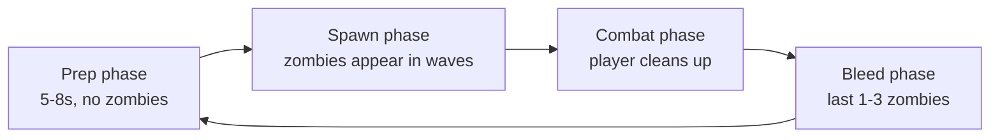
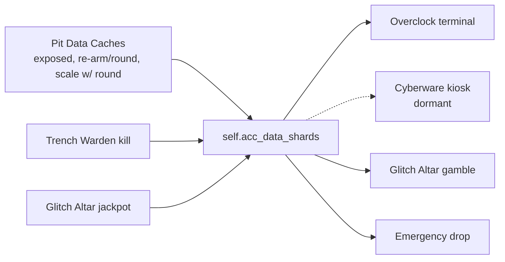
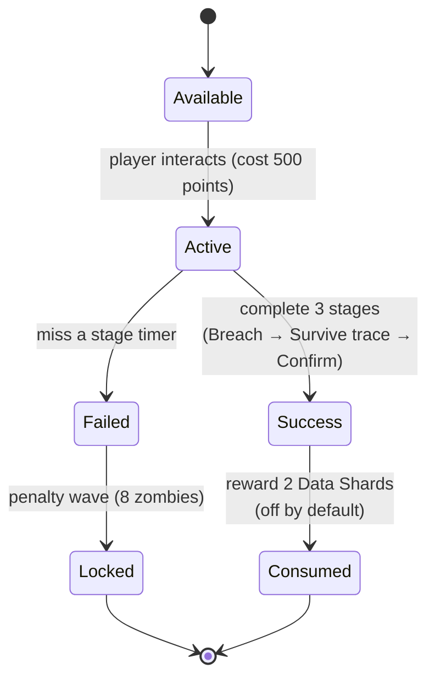

# 05 - Mechanics

Deep-dive on the systems that make the map tick. If `03_progression_and_skills.md` is the "what", this is the "how it actually plays moment to moment".

## Round & Pacing Model

A zombies round has an implicit structure; we make ours explicit and tune each phase.

We tune two levers that stock BO3 mostly leaves alone:

### 1. Spawn Cadence, Not Just Count

Stock BO3 spawns zombies in small batches gated by alive-count. We keep that but **add deliberate "pressure pulses"**: elites (and the events they gate) spawn on a scheduled cadence *inside* a round rather than via random spawn overrides (`_acc_elites.gsc` — "spawning is driven by pressure pulses, not random spawn overrides"). This prevents the late-game from being "train for 2 minutes, kill the last 3".

### 2. Elite Timing

Elites don't just spawn randomly. They spawn **at inflection points**:

- Shielded elites spawn **at the end of a wave**, forcing you to shift from chaff clearing to priority targeting.
- Teleporters spawn **during a wave**, splitting your attention.
- EMP elites spawn **just before bleed**, preventing the lull.

This means the **texture** of a round is predictable (you can plan) but the **moment** is tense (you must execute).

### 3. Early round pacing (rounds 1–4) — boost NEUTRALIZED

We originally compressed stock BO3's slow opening with an early-round spawn-count boost. **That boost is now NEUTRALIZED** (user 2026-06-24): spawn count follows the **base game**. `_acc_early_round_pacing.gsc` is kept ONLY to carry the modifier-round spawn multiplier.

| Lever | Rule |
|---|---|
| **Spawn count** | `level.max_zombie_func` is still chained through `acc_max_zombie_override`, but the early-round multipliers are **1.0** (`ACC_EARLY_SPAWN_MULT` / `ACC_EARLY_SPAWN_MULT_R1`, "was 1.45 / 1.50"). Base-game `get_zombie_count_for_round` + stock per-player scaling own the per-round total. The only live pass-through is the modifier-round multiplier `level.acc_mod_round_zombie_mult` (e.g. the **Thin Herd** modifier from `_acc_modifiers.gsc`). Bump the constants above 1.0 to re-enable an early boost. |
| **Move speed** | No longer handled here — the early-round speed bump moved to the all-round speed curve in `_acc_zombie_speed.gsc` (which replaced the Rampage Inducer, 2026-06-14). This module is spawn-count only now. |

**Code**: [`_acc_early_round_pacing.gsc`](../scripts/zm/zm_abandoned_cyber_city/_acc_early_round_pacing.gsc) — `post_zm_main()` chains `level.max_zombie_func` from `scripts/zm/zm_abandoned_cyber_city.gsc` immediately after `zm_usermap::main()`, still inside `main()` so the chain exists before round 1. Constants: `ACC_EARLY_ROUND_MAX`, `ACC_EARLY_SPAWN_MULT`, `ACC_EARLY_SPAWN_MULT_R1`.

### 4. Map-wide perk scatter (every 3rd round)

**Replaced the Lab alcove-door rotation on 2026-07-24.** The 10 perk machines live on **10 pads
spread across the whole map** (Plaza = permanent Quick Revive; Lab ×2; Alley; Market; Helipad;
Vault; the jukebox under-room; Abyss Layer 2 past the first soul door; the Exchange) and the perk→pad assignment **reshuffles
at random at the start of every round divisible by 3** — `_acc_perk_scatter.gsc::round_watcher()`,
keyed on `acc_round_start` (`ACC_SCATTER_INTERVAL = 3`). The opening layout is random per run. A
player standing where a machine lands is pushed out of its front face (never wedged inside — the
successor of the doors-era no-trap rule). A player who owns a perk's **Mega** can spend **2 Empty
Mega Bottles** at its machine to **pin** that perk to its current pad for the rest of the game
(perk + pad both leave the rotation; successor of the 2026-07-07 permanent door unlock). Dev mode
runs the same scatter as normal play. Full spec: [10_perks.md](10_perks.md); pad ledger: [02_layout.md](02_layout.md).

> **Superseded paths.** The old machine-reskin rotation (`_acc_map_randomizer::roll_perk_rotation`, keyed on `acc_decontamination_complete`) is **disabled/inert** — it targeted `acc_lab_perk_a..d` machines that were never placed (disabled 2026-06-16). The **decontamination / zone-seal hazard was also removed** (2026-06-22 — "never part of the final design"): no zone is ever sealed and no evac warning fires. `_acc_decontamination.gsc` now only re-emits `acc_decontamination_complete` each round so `_acc_lockdown[_challenge]` can reuse its zone helpers.

## Point Economy

Stock BO3 kill awards are **replaced** (not modified) by our own table:

| Kill type | Points |
|---|---|
| Regular kill | 70 |
| Headshot kill | 110 |
| Knife / melee kill | 100 |

Stock BO3 per-hit points (10 per damaging hit) are **suppressed by default** (kill-only economy, user 2026-06-18) — `score_per_hit` returns 0 unless the `acc_hit_points` dvar is set to 1. (reconciled to code 2026-07-11)

**WONDER-WEAPON MONEY NERF (user 2026-07-26):** kills whose killing weapon is wonder-tier pay
**HALF** base points — "a global nerf to wonderweapons since they are so strong". The halving
scales `base` before the co-op split (killer share + pool both halve; solo body 70→30, headshot
110→50 after the 10-unit floor) and applies to trench-zombie kills too (30→10). Identity =
`_acc_points.gsc::is_wonder_kill` (elemental bows, Thundergun, Winter's Howl, D13 Sector, Skull,
Dragon Gauntlet, Blast-O-Matic, THE CYBERJACK — a mirror of `_acc_damage`'s wonder set, kept in
sync by comment). The Ledger flat +10 and boss bounty awards are NOT halved.

### Why these numbers

- Regular-kill points **70** (user 2026-06-23: raised 40 -> 70, above the stock 60 for a generous body-kill economy).
- Headshot **110** / knife **100** (user 2026-06-23: headshot 100 -> 110) as the payout for skill-expressing kills.
- ~1.57x multiplier from regular -> headshot still means **aiming is worth it even when you're not stacking Overclocks**.
- Combined with the 2.5x headshot damage multiplier (see "Headshot Multiplier" above), a skilled aim player earns both more points *and* more kills per minute.

### Co-op Kill-Point Split (70 / 30)

When a zombie is killed, the point award is distributed:

- **Killer**: gets **70%** of the kill's base points.
- **Other qualifying damage contributors**: split the remaining **30%** equally among themselves.
- **Solo (no other qualifying contributors)**: the killer gets **100%**. No penalty for playing solo.

**Payouts are quantized to 10-point units** - a verified BO3 engine constraint:
the stock score API rounds every award UP to a multiple of 10
(`_zm_score.gsc:528`; see [14_stock_api_verification.md](14_stock_api_verification.md)),
so shares are computed in 10-pt chunks with leftover chunks going to the
earliest contributors. Totals across players always equal the full base award
exactly (no inflation; no rounding exploit). The killer's 70% rounds to the
nearest 10.

**Multipliers (Double Points, Payroll Ledger) are re-applied by us.** Because we
**replace** the stock kill award (our `register_score_event` callback returns 0),
the stock score path where Double Points applies its ×2 (`_zm_score::get_points_multiplier`)
never sees our points. So `award_player` re-applies the same team-scoped
`zombie_point_scalar` the powerup sets (×2 while active), and the Payroll Ledger
bonus is then added as a **flat +10 AFTER** that scaling (`ACC_LEDGER_KILL`; Double
Points does NOT boost it — no ×2.2 multiplicative stack). Any future
points-affecting powerup that works through the stock score-event path will
likewise need re-applying here. (Bug history: Double Points silently did nothing
on kills until this was added, 2026-06-23.)

Example payouts (regular kill = **70** pts base; killer share 49 → **50**, pool = 20):

| Players who contributed | Killer gets | Others get | Total granted |
|---|---|---|---|
| Killer only (solo) | 70 | - | 70 |
| Killer + 1 other | 50 | 20 | 70 |
| Killer + 2 others | 50 | 10 / 10 | 70 |
| Killer + 3 others | 50 | 10 / 10 / 0 | 70 |

Same split for a **110**-pt headshot (killer share 77 → **80**, pool = 30); a
**100**-pt knife kill works the same with killer share 70:

| Players who contributed | Killer gets | Others get | Total granted |
|---|---|---|---|
| Killer only | 110 | - | 110 |
| Killer + 1 other | 80 | 30 | 110 |
| Killer + 2 others | 80 | 20 / 10 | 110 |
| Killer + 3 others | 80 | 10 / 10 / 10 | 110 |

On a small pool some contributors can still receive 0 (e.g. a regular kill split
four ways: the 20-pt pool only has two 10-pt chunks) - acceptable: headshots are
where assist money lives, and the 5% qualification bar below still gates who is
in the pool at all. (Killer share formula: `int( base × 0.70 / 10 + 0.5 ) × 10`,
`_acc_points.gsc:358`.)

### Anti-Exploit Rules (hard-enforced in code)

The split system is a natural target for cheese. Every rule below is enforced in `_acc_points.gsc`.

1. **Per-player damage is capped at the zombie's max HP.** Overshooting a dying zombie doesn't inflate your damage share. Example: regular zombie has 150 HP. Player A deals 500 damage with a PaP'd AK-47 pre-kill. Recorded contribution: 150, not 500.
2. **Minimum contribution threshold: 5% of zombie max HP** to qualify for a share. This kills the "tag-and-run" exploit where you hit every zombie with 1 damage and vulture a share on everything. A 150-HP zombie requires 7.5 damage from a player for that player to count.
3. **Only player-sourced damage counts.** Environmental kills (fall damage, fire, etc.) and AI-sourced damage (if any exotic setup) do not create a damage record.
4. **Per-player aggregation.** The same player's shots on the same zombie sum to one record. You cannot inflate "contributor count" by switching weapons, reloading, etc.
5. **Disconnected / invalid players at payout time are skipped.** If a player contributed 50% of damage then disconnected, the 30% pool redistributes among remaining qualifiers; nobody "inherits" the disconnected player's share, and no share is dropped on the ground.
6. **Killer-rule overrides.** If the killer is somehow invalid (disconnected in the same frame they fired the killing shot - rare but possible), the full base is split equally among remaining qualifiers as a fallback. No points are lost.

### Exploits we explicitly chose NOT to defend against

- **Coordinated kill-stealing.** Player A softens a zombie to 20 HP with an AK-47, Player B knifes it for a 100-point knife kill. Player B gets 70. Player A only contributed damage, so they get 30. **This is intended as a coordinated play**, not an exploit. If you and a teammate want to split roles (suppressor + finisher), the math supports it.
- **Headshot-hunt coordination.** Similar to above: one player tickles the zombie down, the other headshots for 100. Intended.

### Comeback Bonus (full-death respawn) — user 2026-06-26

To support players who have a bad start, a player who **fully bleeds out and respawns** the next round comes
back with their money **set to exactly `500 × round_number`** (round 20 → **$10,000**). It is a **set, not an
add**: whatever they kept through the death is wiped and replaced with the floor.

- **Why a set, not a top-up:** stock BO3 `penalty_died` is **0.0**, so players actually *keep* their money on a
  bleed-out respawn (this map does not override that). A pure add would make intentionally dying *profitable*
  (a death-farm). Setting to exactly `500 × round` means dying can never net more than the floor, and a rich
  player who dies drops to it — so death finally carries a real cost while broke players get their comeback.
- **Trigger = full death only.** A teammate reviving you from last stand does **not** qualify — a revive happens
  before you bleed out, so it never fires the stock `bled_out` notify the watcher keys on. The very first spawn
  of a match never bleeds out either. So only a genuine die-and-respawn pays out. (Practically co-op-only:
  in solo, a down either auto-revives via Quick Revive — money kept — or ends the game.)
- **Implementation:** `watch_comeback_death()` flags `acc_comeback_pending` on `bled_out`;
  `acc_points::on_player_spawned()` (registered in `acc_main`'s spawn dispatch) consumes the flag on the next
  spawn and calls `comeback_set_score()` (`zm_score::player_reduce_points("take_all")` then
  `add_to_player_score(500 × round)`). Tuning lever: `ACC_COMEBACK_PER_ROUND` (default **500**) in
  [`_acc_points.gsc`](../scripts/zm/zm_abandoned_cyber_city/_acc_points.gsc).

### Stock-Award Override Status (built)

The override is **wired and live**. `_acc_points::init()` registers `suppress_stock_kill_score` on the stock `"death"` and `"ballistic_knife_death"` score events (`zm_score::register_score_event`, `_acc_points.gsc:104-105`), and that callback **returns 0** (`:204`) so stock never awards its own 60/100/130 — `_acc_points` owns 100% of kill awards. The per-hit `"damage"` events are **also overridden by us** (register our own `score_per_hit`, `:111-113`), and that callback **returns 0 by default** (`:211`), so per-hit points are removed — not left on stock (see the kill-only economy note above). No double-award.

### Design Interaction Notes

- **Widow's Wine perk** (see [10_perks.md](10_perks.md)): its base grenade **damage boost was removed** (`_acc_damage.gsc` no longer grants frag damage), so there is no "Widow's-boosted frag" damage layer — but any grenade splash kill still feeds the 70/30 split normally. The perk doesn't bypass the split. (reconciled to code 2026-07-11)
- **Deadshot perk** (see [10_perks.md](10_perks.md)): the 1.3x headshot bonus is per-player — only applies to the shooter's damage, not the share others earn from a Deadshot player's kill.
- **Meltdown capstone** (AoE kills from the Cyberware tier-3 Overclock branch — a **dormant** node while the Cyberware tree is disabled by default): the AoE kill from Meltdown still counts as "the caster's kill" for point purposes (the AoE source is the weapon; the player who fired is the killer).
- **Multi-kill bonus (+50 per extra zombie killed within 0.5s)**: previously part of this doc's Point Economy section - **cut for now** to keep the point system surface area small. The 2x headshot multiplier plus the precision weapon tier (FAL, Drakon, Intervention) already rewards the playstyle a multi-kill bonus was targeting. Re-add as a modifier in `_acc_modifiers.gsc` if playtest feedback wants it.

### Data Source

- Points module: [`scripts/zm/zm_abandoned_cyber_city/_acc_points.gsc`](../scripts/zm/zm_abandoned_cyber_city/_acc_points.gsc).
- Damage recording is fed from `_acc_damage.gsc::on_ai_damage`, which calls `_acc_points::record_damage` on every player-sourced hit.

## Headshot Multiplier (skill lever)

Each gun's GDT carries a hit-location multiplier (`locHead`/`locHelmet`), **normalized across the whole roster to 5.0** (headshot-excluded shotguns = 1.0) by `tools/normalize_gun_loc.js`. The engine bakes that into the incoming damage; `_acc_damage.gsc` then applies our **headshot temper** as a SEPARATE multiplicative factor (`n_hs_temper`):

- **Regular zombies + elites**: `ACC_HEADSHOT_MULT = 0.5` → `5.0 × 0.5` = **2.5× body** (user 2026-06-25).
- **Bosses (boss + mini-boss)**: `ACC_BOSS_HEADSHOT_MULT = 0.8` → `5.0 × 0.8` = **4× body** (user 2026-07-08; was 0.6 = 3×).
- **Limb / body hits**: untouched (stock).
- **Headshot-excluded guns** (Tac-19 / Olympia, `locHead 1.0`): no map bonus → **1× (flat)**.

| Target | Body shot | Head shot (ours) |
|---|---|---|
| Regular zombie / elite | 1.0x | **2.5x** |
| Boss / mini-boss | 1.0x | **4.0x** |

### Why it's a skill lever

- Spray-and-pray players barely notice the change - most of their rounds go center-mass.
- Aim-focused players effectively **double their damage-per-bullet** against chaff, letting them clear rounds faster, conserve ammo, and spend more time on positioning.
- **Boss fights become aim tests.** A boss-round Avogadro taken with clean headshots dies in ~60% the time it would from body shots. Miss, spray, and the fight drags on while the round's chaff and sibling bosses (see [08_enemies.md](08_enemies.md)) pile up — which can snowball into a wipe.

### Stacking with Perks / Cyberware / Overclocks

> **Cyberware status:** the Cyberware-node bonus layers below (**Amplifier**, **Overload**) are **dormant** — the Cyberware tree is disabled by default (`acc_cyberware_on 0`), so today only the Deadshot perk, PaP tier, and weapon Overclock/ability layers actually feed the pool. The math below holds if the tree is re-enabled.

**Bonuses ADD, reductions multiply.** Damage *bonuses* (Deadshot, Cyberware, PaP tier, abilities) are summed into one bonus factor — a literal sum, so a 1.3x and a 1.3x give **2.6x, not 1.69x**. The **headshot temper is NOT in that sum** — it's a separate multiplicative factor (×0.5 reg / ×0.8 boss, on top of the engine `locHead`), so it tempers ONLY the loc-inflation, not the PaP/Deadshot/Cyberware bonuses (that's what keeps a PaP headshot a clean 2.5x of the boosted body instead of ballooning). Damage *reductions* (per-gun balance cuts, shielded-elite frontal resist, boss per-hit cap) stay multiplicative and apply last: `final = damage × locHead × (bonus sum, or 1 if none) × headshot_temper × reductions`.

Bonus layers summed on a single headshot (each ADDS its value into the pool):

- **Deadshot perk** (1.3, or 1.5 with American Sniper Mega — no double dip; see [10_perks.md](10_perks.md))
- Cyberware **Amplifier (OC Tier 1)** (`+15%` weapon damage) — 1.15
- Cyberware **Overload (Tier 2 OC branch)** (`+30%` crit damage on headshots) — 1.30
- **PaP custom tier** (1.33 / 1.67 / 2.00 for T1–T3; the `_up` transform is deferred to T2, and `acc_weapon_balance_mult` normalizes base/`_up`/twin so this ladder is the only PaP damage lever)
- Weapon **Overclock** if rolled (e.g. AR **Overpressure** at 1.5 ADS)
- Weapon ability **Precision Mode** (auto-crit = 4.0) / **Slug Round** (3.0) / **Kinetic Battery** (3.0) when active

(Base weapon damage and the stock ~1.5x weapon-GDT headshot mult are already baked into the incoming `damage` before any of this.)

Because bonuses ADD instead of multiply, big stacks no longer explode geometrically — e.g. a regular-zombie headshot with Mega Deadshot (1.5) + Overload (1.30) + PaP T3 (2.0) sums the pool to 4.8, then `× locHead 5.0 × temper 0.5` = **12× the raw body shot** — strong, but not the ~100x a geometric stack would reach. **Intended** — rewards the precision archetype without runaway multiplication.

### Deadshot Effective Damage Table (with our multiplier)

Effective head:body with Deadshot (no PaP/Cyberware in the pool). Deadshot ADDS into the bonus pool, which the headshot temper (×0.5 reg / ×0.8 boss) then scales on top of the engine `locHead 5.0`:

| Target | Body | Headshot (no Deadshot) | + Deadshot (1.3) | + Mega Deadshot (1.5) |
|---|---|---|---|---|
| Regular zombie / elite | 1.0x | **2.5x** | 5.0 × 1.3 × 0.5 = **3.25x** | 5.0 × 1.5 × 0.5 = **3.75x** |
| Boss / mini-boss | 1.0x | **4.0x** | 5.0 × 1.3 × 0.8 = **5.2x** | 5.0 × 1.5 × 0.8 = **6.0x** |

Layer on the full Cyberware/Overclock/PaP stack (all summed into the bonus factor) and the precision-on-head build still scales hard, but additively rather than geometrically. Playtest will tell us if this is fun or broken; tuning levers in [10_perks.md](10_perks.md).

### Synergistic Overclocks

- **Adaptive Aim (AR)**: headshots refund one round to the magazine. The 2.5x headshot damage + ammo refund makes clean aim functionally infinite at range.
- **Overpressure (Sniper)**: there is no "Thermal Lock" OC — the actual sniper Overclock pool is Reactive Powder / Overpressure / Adaptive Aim. Overpressure's ADS-damage boost cashes in our 2.5x cleanly. (reconciled to code 2026-07-11)
- **Reactive Powder (Sniper)**: the Overclock still exists as a flag, but its 50% headshot-AoE damage effect is **no longer wired** in `_acc_damage` (the `reactive_powder_aoe` layer is legacy/unused). (reconciled to code 2026-07-11)

### Implementation

Hook is `scripts/zm/zm_abandoned_cyber_city/_acc_damage.gsc::on_ai_damage`. Multiplier constants are at the top of that file for easy tuning without a docs round-trip.

### Tuning backstop

If the headshot bonus feels broken in playtest (likely for snipers / FAL), we can:

- Knock regular and boss down (regular is 2.5x, boss 4.0x now).
- Or split by elite class: regular 2.5x, elites 1.5x (bullet sponges feel less silly).
- Or flip the boss rule: bosses get NO extra headshot bonus, but they have an exposed "crit spot" that takes a larger one.

Decision deferred to Phase 6 playtest.

## Data Shard Economy (detailed flow)

**Data Shards are a TRENCH-ONLY economy (user, 2026-06-19).** Every shard the run produces comes from
descending into the dangerous underground trench — there is no topside faucet. This is the whole point of
the trench: it is the dangerous place, and shards are the reward for braving it. The loop is fully
underground — you earn in the exposed pit and spend in the Foundry room.

- **SOURCE — Pit Data Caches:** two caches sit on the open trench-pit floor (the amped-horde danger zone,
  reached for free off the stairs — no door). Each pays once per round to the first looter, then shows
  "depleted" and re-arms next round. Yield is **effectively FLAT** (base count 3): the `cache_yield` formula
  (`base + int( round / acc_cache_scale_rounds )`, capped at `acc_cache_yield_max`) still exists, but
  `acc_cache_scale_rounds` defaults to **9999**, so the scaling term is 0 for all normal rounds and caches pay a
  flat count (round scaling removed, user 2026-06-19). (reconciled to code 2026-07-11)
- **SOURCE — Trench Warden:** the recurring trench boss grants `int( round / acc_boss_shards_round_div )` shards
  (default divisor **3**) to every player on death — the shared boss-death reward, not a fixed `acc_warden_shard_reward` (no such dvar exists).
- **SOURCE — Glitch Altar:** the jackpot boon (net-negative EV — see below).
- **SOURCE — Passive trench income (user, 2026-06-26):** simply *standing in a trench layer* pays **1 Data
  Shard every N seconds**, where N shrinks with depth — **L1 (Bus Station pit) 45s, L2 31s, L3 20s, L4 12s,
  L5 7s** — so deeper = more reward for the greater risk. **Per-player** (each player who braves the pit
  earns their own; no shared pool). The clock counts only while underground (it does NOT tick on the surface
  or in Paradise) and resets the instant you leave the trench; it carries across layer changes (paid at the
  current layer's rate). Cap-clamped by the shard cap, so it stops at the cap and resumes after spending.
  Tunable via `acc_trench_income*` (docs/22). Implemented in `_acc_bus_trench.gsc::trench_shard_income`.
- The **topside elite drop is OFF by default** (`acc_elite_shard_drop` 0); flip it on to restore the old
  1-shard corpse pickup if you want a surface trickle.

### The Foundry (where shards are spent)

All the deep sinks live in the enclosed underground room, entered from the pit through the buyable
`enter_under_plaza` door (1500 points — a one-time investment to unlock your spend hub): the **Overclock
terminal** and the **Glitch Altar** (with the Exo Suit station, ammo crates, and the Neural Expansion Bay
perk-slot vendor also script-spawned down here by `_acc_glitch_altar.gsc`). So you brave the pit to *earn*,
then duck into the room to *spend* without surfacing. (The **Cyberware kiosk is dormant** — the tree was
removed from play 2026-06-19, so the kiosk is no longer spawned and its Lab fallback trigger is gated off in
`_acc_cyberware.gsc::init()` behind `acc_cyberware_on` (default 0). The Overclock terminal is the sole live
weapon-upgrade sink; re-enable the tree with `acc_cyberware_on 1`.)

> **Note (2026-06-19):** an earlier elite-kill *diminishing-returns* rule is now inert — the topside elite
> drop is **off by default** (`acc_elite_shard_drop 0`), so elites are no longer a default shard source, and
> the DR branch was gated on a `source_tag` that was never produced. The anti-farm pressure now comes from the
> trench danger + per-round cache re-arm. (The counter reset still lives in `_acc_elites.gsc` in case the
> topside drop is flipped back on.)

## Risk/Reward Events

### Hack Terminal (Bus Station)

**Location:** the `acc_hack_terminal` trigger is at `x[319,383] y[1980,2044] z[-240,-144]` — **down in the corp trench**, on the trench floor (top `z=-240`), east side by the pit cache. The trench is a pit cut into the Bus Station room (`corp_zone` x[-781,819] y[1148,2748]), so this is still "Bus Station" — but you drop in / take the stairs to reach it, you do **not** find it on the main floor. It sat at `z[0,96]` until 2026-07-15 (`gen_interactives.js`'s `useTrigger()` hardcodes `z[0,96]` and predates the trench cut, which replaced the z=0 slab under it), leaving it 168u over a standing player's head and the event uncallable in every run.

State machine — the **greybox stage set** (channel / survive / channel), the interim shipped in `_acc_events_hack.gsc`:

- **Stage 1 "Breach"**: hold `[USE]` on the terminal until the channel meter fills.
- **Stage 2 "Survive"**: survive the trace window; any player's zombie kills purge the trace early (team-wide, counted via the verified zombie-death callback).
- **Stage 3 "Confirm"**: return to the terminal and hold `[USE]` again in time.

Cost **500 points** (`ACC_HACK_ACTIVATION_COST_POINTS`). The **2 Data Shard** reward (`ACC_HACK_REWARD_SHARDS`) is gated behind `acc_hack_shard_drop` (default **0 = OFF**), so a successful hack grants **0 shards by default** — this topside objective's shard reward is off in the trench-only economy; flip the dvar on to restore it. Each stage runs back-to-back; fail any stage and the terminal locks for the run (penalty wave of 8 zombies). **Parallel Processing** (Cyberware sr2a, `self.acc_cw_events_retry`) would grant **one** retry whose tuning rotates — longer hold, longer trace, and headshot-only purge kills at round 11+ — so it isn't a replay; the retry code still ships but is **dormant** while the Cyberware tree is disabled (`acc_cyberware_on 0`).

> **Design vs shipped.** The interim stage set exists because stage 2 originally required reliable Shielded-elite uptime that the elite density can't yet guarantee. `_acc_events_hack.gsc` carries a `TODO(acc-design)` to restore the original kill-stage set — **10 kills / 40s**, **3 Shielded elites / 60s**, **15 headshots / 45s** — once the elite pressure pulses are validated.

### Vault Overload (Vault) — RETIRED

The "Vault Overload" 90-second hold event was **retired 2026-07-07** (user): `acc_events_overload::init()` is commented out in `_acc_main.gsc`, and its `acc_overload_terminal` trigger + point struct were deleted from the `.map`. Nothing reads `level.acc_overload_state`; the `#using` is kept for an easy restore. The Hack Terminal is now the map's single risk/reward side event.

### Why the Hack event exists

- It **gates Shards behind optional burst pressure**, keeping the base (trench-only) Data Shard economy tight.
- Failing it has a real penalty (locked terminal + spawn wave), not just "try again later".

## Player Movement / Slide Feel (`_acc_movement.gsc`)

Base movement feel is a **global** mechanic — every player, no item or perk gate. It lives in
its own module (`acc_movement::init` from `acc_main`, `on_player_spawned` dispatched like the
other modules, exactly one watcher per player via a stop-notify) because it is the layer
principle #4 below ("movement solves most problems") actually rests on.

- **Slide-jump momentum carry (user 2026-07-15).** Jumping out of a slide keeps the slide's
  speed instead of dropping to a walk. Two `SetVelocity` writes: a **pre-jump top-up** when the
  jump button is pressed while still grounded inside `acc_slide_jump_grace` (0.5s after the
  slide), and a **liftoff restore** on the ground→air edge as a fallback for a tap the 20Hz poll
  missed. Both preserve the player's own heading (no rubber-banding) and their z. Floored at
  half the slide speed, so a player who braked out of a slide stays braked.
- **It is item-agnostic by construction.** It records your **actual velocity** on the last
  sliding tick, so whatever was live during the slide (Rocket Shield ×2.0, PhD Slider ×1.75,
  nitro burst, Boots, Stamin-Up — already 2.2×-capped) is simply what gets preserved. It writes
  only velocity and never a speed flag, so it cannot cancel or be cancelled by any speed system
  (full matrix: [09_boss_items.md](09_boss_items.md) "Stacking and Interaction Notes"). It also
  only ever RAISES speed, so it cannot cancel a boss fling or knockback.

### Engine slide tuning — duration + steering (`apply_engine_slide_tuning`)

**BO3 ships a 62-dvar `slide_*` engine family** (recovered 2026-07-15 from the Treyarch string
table in `<tools>\bin\cod2map64.exe`, descriptions verbatim; independently corroborated by the
[T7Overcharged dvar hash list](https://github.com/JariKCoding/T7Overcharged) — the two sources
are provably non-circular). These are **global** (all-players), set once from `init()`:

| Dvar | Treyarch's description | Ours |
|---|---|---|
| `slide_maxTimeBase` / `slide_maxTime` / `slide_maxTimeReduced` | "The max time in ms the player is allowed to slide for" (base / — / reduced state) | **×1.25** (`acc_slide_duration_scale`) |
| `slide_enable_tweak_left_right` | "Allow the player to adjust their velocity to the left/right while sliding" | **1** (was off → "you basically can't turn") |
| `slide_friction_amount` | "The amount of friction to apply while sliding" | untouched (`acc_slide_friction_scale` 1.0) |
| `slide_min_continue_velocity` | "Required speed a player must sliding to continue sliding" | untouched |
| `slide_deadzoneTweek` | "The threshold the amount of right or left movement must overcome for it to be applied" | untouched (steering sensitivity, if needed) |

- **Setting engine movement dvars from GSC is stock practice, not a hack:** `_zm.gsc:215-225`
  ("New movement disabled for Zombies") does exactly this unconditionally in the ZM path with no
  `sv_cheats` gate; shipped community precedent for an engine *gameplay* dvar is ColDog's Deadshot
  (`setDvar("perk_weapSpreadMultiplier", .4225)`); our own is `bg_fallDamageMinHeight`. Nothing in
  stock reads or writes any `slide_*` dvar, and `acc_main::init()` runs after `zm_usermap::main()`,
  so our write lands last. (Known *negative* results — UGX's `setClientDvar("player_sprintSpeedScale")`
  and kelson8's `SetDvar("noclip")` — are **per-player client dvars / cheat-protected**, a different
  class; they do not apply to a global engine dvar.)
- **THE SLIDE IS DUAL-GATED** — it ends at whichever fires first: the `slide_maxTime*` **timer** or
  the `slide_min_continue_velocity` **speed floor** that `slide_friction_amount` drives you toward.
  **If the slide doesn't feel ~25% longer, that is the diagnosis** — the speed gate is binding and
  the timer is slack; the next lever is `acc_slide_friction_scale` → 0.8, not a bigger timer.
- **Two traps the code is built around** (don't simplify them away): `SetDvar` on an **unregistered**
  dvar silently creates a dead script dvar and no-ops — failure looks identical to success, so the
  code **probes with `getdvarstring(name,"")` first** and skips + logs if absent. And **dvars persist
  across map loads** within a Steam session, so `SetDvar(x, getdvarfloat(x)*1.25)` would **compound**
  (1.25 → 1.56 → 1.95…) on every restart; the code captures the pristine default once per session
  into its own `acc_slide_orig_*` dvar and always scales from that (idempotent).
- **Why the dvar and not a script velocity-rotation loop for steering** (rejected on evidence):
  **GSC cannot read the movement stick** — T7 exposes only boolean button states
  (`JumpButtonPressed`, …); `GetNormalizedMovement` does not exist. A script loop could only steer
  toward **view yaw** (look-steering — a different, worse feel), and the server caps at **20 Hz**
  (`shared.gsh:263` `SERVER_FRAME .05`; there is no faster server wait — `waitframe()` does not
  exist), so it would be 20 discrete velocity steps/sec = steppy, i.e. exactly the jank we are
  removing. The engine dvar reads the real analog stick at engine tick rate.

**THE RULE (three attempts to learn it, 2026-07-15 — see CHANGELOG):**
**`SetMoveSpeedScale` is not a momentum lever. Momentum is velocity.** The scale multiplies
*input-driven* movement, so holding a slide's boost past the slide, or decaying it, just makes
the player **walk** fast — which reads as ice, not momentum (and leaked a free ~1s of 2× walking
after every slide). Slide speed FLAGS are therefore ON only while `IsSliding()` is literally
true. Once airborne the engine does not decelerate horizontal velocity, and on landing its own
ground friction bleeds the excess off: **the engine already does the smoothing** a ramp was
trying to fake. A release fade is only right for a *timed* buff expiring on its own clock (the
Gas Tank burst — `acc_utility::speed_fade_release`), never for a slide ending, which is a
movement-state change. Why polling and not events: the engine's `slide_begin`/`slide_end`/`jump`
notifies are **MP-only and never fire in ZM**, so `IsSliding()` at 20Hz is the only channel —
which is exactly why the pre-jump top-up (catching the *button*) has to exist at all.

## Encounter Design Principles

Hard rules for any fight in the map:

1. **Every encounter has at least 2 outs.** No single-exit spaces. The only exception is the boss room (committed fight).
2. **No invisible damage.** Every source of damage has a visual tell.
3. **HP scaling is conservative.** Elites never become bullet sponges. Difficulty comes from spawn density and utility (EMP drain, teleport flanks).
4. **Movement solves most problems.** Any 1v1 with a zombie, including elites, can be outrun by an unupgraded player. Elite *density* is the threat, not individual stats.
5. **No cheap deaths.** If a player loses a run, they should be able to name the decision that killed them.

## Downed & Revive Mechanics

- Stock BO3 behavior preserved: down -> bleed out in 30s -> die or be revived.
- **Subroutine Caching** (a Cyberware `sr2b` node) would double bleed to 60s, but it is **dormant** — the Cyberware tree is disabled by default (`acc_cyberware_on 0`), so **30s** is the live bleed-out. The effect code still ships (`_acc_cyberware.gsc`, `ACC_CW_BLEEDOUT_MULT 2.0`); re-enable the tree to reach it.
- **Self-revive purchase:** not implemented in code — no self-revive purchase trigger or cost (4000 points + 2 Data Shards) exists. A Cyberware discount flag (`acc_cw_selfrevive_shard_discount = 0.5`, `_acc_cyberware.gsc`) is reserved for a *future* self-revive module but is currently unused (Caching would have halved that Shard cost). (reconciled to code 2026-07-11)
- **PhD Flopper perk** (see `10_perks.md`) isn't a save — but a dive-to-prone nova explosion clears nearby zombies, giving you a repositioning window before a second hit lands. Not a "downed prevention" layer but a "recovery option" layer.
- **Ghost Shroud boss item** is the clutch 1-HP save; stacks independently with Jugger-Nog's doubled HP pool to maximize survival time before the save is even needed.

## Emergency Drop System

Spend 3 Data Shards at the power switch to call an **emergency drop** - a random Care Package-style drop at the closest safe zone. Drop can be one of:

> **Where:** the map has exactly ONE power switch — the Bus Station breaker at `(-752, 2250, 1)` (`script_string "corp"`, north-west, on the west wall). Its `acc_power_corp` trigger is `x[-761,-697] y[2218,2282] z[0,96]`, i.e. the floor you stand on to flip the breaker. The `acc_power_vault` copy is `triggerenable(false)`d every run by `_acc_map_randomizer::disable_dead_side_emergency_triggers()` (`roll_power_switch_side()` is hardcoded `"corp"` since the vault switch prefab was removed), so `acc_power_corp` is the only live one — hence "the" switch, not "any". Until 2026-07-15 that trigger was stranded at the generator's original `x[735,799] y[1950,2014]` spot ("beside corp switch") after the switch prefab was relocated away in 2026-06-18 and the trench turned that spot into open air over the east stairs — so the clutch button was uncallable in every run. **Prompt conflict — the trap this box walked into (2026-07-15):** the new footprint **fully contains** the switch's own `use_elec_switch` (world `x[-747,-728] y[2242,2259] z[39,61]`) on all three axes. `emergency_loop` gating on the `power_on` flag does **not** save you: it checks the flag *after* `waittill("trigger")`, so it gates the **action**, while the `trigger_use` **prompts from map load** regardless. Pre-power that left two overlapping `trigger_use` ents on the breaker — if the engine picked the emergency one, `[F]` fired our notify, we no-op'd (power is off), and **the power could never be turned on: an unwinnable run.** The real guard is `_acc_emergency_drop::emergency_prompt_gate` — `triggerenable(false)` until the `power_on` flag, then re-armed **live-side only** (a blanket re-enable would resurrect the dead-side copy the randomizer disabled). Only the *pre-power* window ever conflicts: stock `_zm_power` `delete()`s `use_elec_switch` on power-on. **Any future trigger placed on top of another trigger needs this same prompt-level gate — action-level gating is not enough.**

- Max ammo (all players)
- 2 minute insta-kill
- 2 minute double points
- Full perk (random) granted to caller

Weights are biased by round: early rounds lean economy (double points, max ammo), late rounds lean survival (full perk, insta-kill).

Emergency drops are a **clutch button**. 3 Shards is meaningful (third of a full build), so you don't spam them. They exist so that a player with Shards banked and a terrible situation has a lever to pull.

## Glitch Altar System (the shard gamble)

The dangerous Bus Station **trench** is also a **casino**. A **Glitch Altar** sits in the Plaza-facing trench
room: **gamble Data Shards** (default **2**, dvar `acc_altar_cost`) for a **weighted jackpot** on a short
cooldown (`acc_altar_cooldown`, 6 s). Roughly **65% boons / 35% glitch-curses** (user 2026-06-24, riskier
"spice it up" tune — was 72/28), odds telegraphed in the use hint. Curses **never instant-down** you.
Implemented in `_acc_glitch_altar.gsc` — a script-spawned hold-USE trigger + glowing core, **pure GSC** (no
geometry, ships `-GscOnly`).

- **Boons (65%):** Max Ammo (15) · Insta-Kill (13) · Double Points (12) · a random free Perk (8) · **Shard Jackpot** (15, +4 shards) · **Mega Win** (2, free Perk + Insta-Kill — the marquee ~2% top prize).
- **Curses (35%, never down you):** **Surge** (16 — an immediate burst of trench zombies via `acc_bus_trench::spawn_corp_surge`) · **Corruption** (11 — lose up to 2 banked shards) · **Dud** (8 — nothing, you lose the spin).

Distinct from the Emergency Drop (the *guaranteed* 3-shard clutch button): the Altar is **higher variance**
with a real downside, and its shard EV per spin is **negative** (the partial jackpot can't be farmed — the
altar is a sink, the boons are the value). This is the user-chosen answer to "what do Data Shards do"
(2026-06-18, workflow `underground-shards-design`); the other live shard sink is the **Overclock terminal**
in the Foundry (reached through the deeper-access door). (The Cyberware kiosk that once shared the room is
**dormant** — see "The Foundry" above.) All payouts are live dvars
(`acc_altar_jackpot` / `acc_altar_surge` / `acc_altar_drain`) for tuning.

## Feedback Loops (summary)

Positive loops (encourage skilled play):

- **Trench dives -> Data Shards -> Overclocks -> better kills -> deeper, safer trench runs.** Primary Shard loop. (The Cyberware tree is dormant by default — the Overclock terminal is the live upgrade path.)
- **Kills -> points -> box / PaP / perks -> clear rounds faster.** Primary point loop.
- **Hack success -> Shards (+ a Parallel Processing retry only if the Cyberware tree is re-enabled) -> better positioning -> more kills.**

Negative loops (punish bad decisions):

- **Fail Hack -> terminal locks + penalty wave -> 500 points and a Shard source wasted.**
- **Skip the trench -> no Shards -> under-fund Overclocks -> under-powered late game.**
- **Greedy camping -> elite pressure pulse -> forced into bad position -> down -> resource drain.**

Both loops are deliberate. The map wants you to feel rewarded and punished for the same decisions on different runs.

## Module Map (all built)

The systems above ship as `_acc_*` modules under `scripts/zm/zm_abandoned_cyber_city/`, orchestrated by `acc_main::init()` (~48 active modules total):

1. `_acc_data_shards.gsc` - per-player Data Shard currency + HUD bridge.
2. `_acc_cyberware.gsc` - Cyberware node graph, purchase validation, effect application. **Loaded but dormant** — the tree/kiosk is gated behind `acc_cyberware_on` (default 0); its flag-reader code stays as harmless no-ops. The live weapon-upgrade path is the Overclock terminal.
3. `_acc_overclocks.gsc` - weapon Overclock registry, per-run pool roll, apply / re-roll (the live weapon-upgrade sink — the Overclock terminal).
4. `_acc_elites.gsc` - elite spawning (pressure pulses), per-round cadence, elite classes.
5. `_acc_events_hack.gsc` - the Hack Terminal side event. (`_acc_events_overload.gsc` exists but is **retired** — see above.)
6. `_acc_map_randomizer.gsc` - per-run state roll (power side, box pool, wallbuy pool).
7. `_acc_boss.gsc` - boss-round orchestration (shared roster; boss rounds every 9 from round 9, mini-boss first at round 10 — see [08_enemies.md](08_enemies.md)).
8. `_acc_emergency_drop.gsc` - the clutch button.
9. `_acc_modifiers.gsc` - optional per-run modifiers (see [06_replayability.md](06_replayability.md)).

`_acc_` prefix = "abandoned cyber city" namespace, to clearly separate from stock `_zm_*` scripts. The full module list lives in `acc_main::init()` and the module README.
