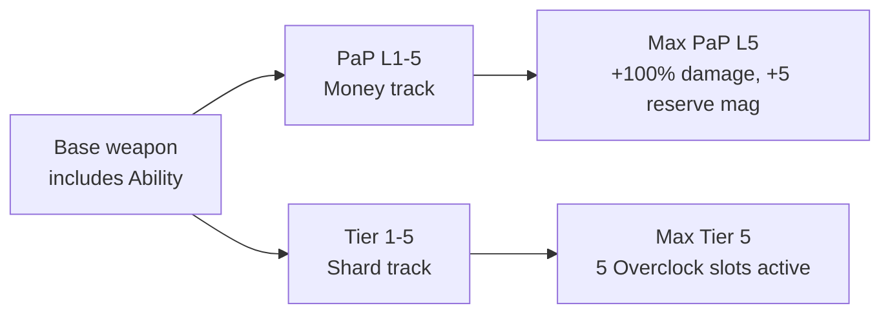

# 05 - Weapons

The arsenal, the Overclock system, custom perks, and the wonder weapon candidates. Most of the within-run replayability weight lives here because Overclocks randomize per run.

> **⚠️ ARSENAL RESTRICTED (user, 2026-06-14).** There are **no wall buys** (all removed at
> load by `_acc_map_randomizer::remove_all_wallbuys()`); every gun comes from the Mystery Box,
> which `register_mystery_box_pool()` restricts by clearing `is_in_box` on the whole stock CSV
> roster and re-enabling only a chosen set. **Box target = Tac-19, Locus, FN FAL, AK-47**
> (user, 2026-06-14). Only **Locus** (`sniper_fastbolt`) is stock and live now; **Tac-19**
> (`s1_tac19`), **FN FAL** (`t6_fal`), **AK-47** (`s1_ak47`/`t6_ak47`) are Skye weapon-pack
> imports being installed — see **[docs/32](32_box_weapon_import_staging.md)** for the staging
> + download list. **Interim box = ICR-1 + Man-O-War + Locus** until the imports land. The
> full 16-weapon roster below is the *aspirational design spec*, not the current dispense set.

Enemies are in a separate doc: [11_enemies.md](11_enemies.md).

## Roster Structure (v1.0)

Each primary-weapon category has **three tiers**:

- **Normal** - reliable, wallbuy-placed, predictable access.
- **Bad** - box-only, weaker or more awkward than the normal tier; a "bad roll" when you hit the box.
- **Strong** - box-only, iconic / premium; the roll you're hoping for.

Plus: 1 starting pistol, 1 melee upgrade (wallbuy), 1 lethal grenade (starting), 1 tactical grenade (wallbuy).

Four categories x three tiers + four utility slots = **16 weapons** in v1.0.

## The 16-Weapon Roster

| # | Weapon | Category | Tier | Source | Placement |
|---|---|---|---|---|---|
| 1 | **B23R** | Pistol | Starter | Import (MW series) | Spawn loadout |
| 2 | **Haymaker 12** | Shotgun | Normal | Stock BO3 | Wallbuy (Service Alley) |
| 3 | **Brecci** | Shotgun | Bad | Stock BO3 | Mystery Box only |
| 4 | **Tac-19** | Shotgun | Strong | Import (Advanced Warfare) | Mystery Box only |
| 5 | **ICR-1** | AR full-auto | Normal | Stock BO3 | Wallbuy (Corp Plaza) |
| 6 | **XR-2** | AR full-auto | Bad | Stock BO3 | Mystery Box only |
| 7 | **AK-47** | AR full-auto | Strong | Import | Mystery Box only |
| 8 | **M14 EBR** | Semi-auto AR | Normal | Import (MW2) | Wallbuy (Corp Plaza) |
| 9 | **G3** | Semi-auto AR | Bad | Import (WAW) | Mystery Box only |
| 10 | **FN FAL** | Semi-auto AR | Strong | Import (BO1 / BO2) | Mystery Box only |
| 11 | **Intervention** | Sniper | Normal | Import (MW2) | Wallbuy (Rooftop Helipad) |
| 12 | **Locus** | Sniper | Bad | Stock BO3 | Mystery Box only |
| 13 | **Drakon** | Sniper | Strong | Stock BO3 | Mystery Box only |
| 14 | **Bowie Knife** | Melee upgrade | - | Stock BO3 | Wallbuy (near perk) |
| 15 | **Frag Grenade** | Lethal grenade | Starter | Stock BO3 | Spawn loadout |
| 16 | **EMP Grenade** | Tactical grenade | - | Custom (authored) | Wallbuy (Server Vault) |

**Import / custom count**: 7 imports + 1 custom = 8 non-stock weapons. The other 8 are stock BO3.

## Design Logic

### Why three tiers per category

- **Normal tier (wallbuy)** gives every category a reliable access point. Skilled players can commit to a specialty (shotgun main, sniper main) without being held hostage by the Mystery Box.
- **Bad tier (box)** creates real "bad roll" moments. If the box lands on a Brecci or XR-2, you either burn another 950 on the box or make it work. This preserves the gamble tension that makes the box fun. Without a "bad" tier, box rolls start to feel samey.
- **Strong tier (box)** is the jackpot. Iconic CoD guns the player *wants* to roll. Finding a FAL or Intervention is a moment.

### Pattern rationale

Shotgun fans always buy Haymaker 12 on wallbuy. They also *hope* the box rolls a Tac-19. They *groan* if it rolls a Brecci. That emotional range across a single category is what a good box does. Three tiers execute that cleanly.

### Category coverage: no SMG, no LMG

v1.0 intentionally ships with only **shotgun, AR full-auto, semi-auto AR, sniper** primary categories. Skipped:

- **SMG** - Reflex archetype leans on shotgun + Phase Step instead. Kuda-class SMGs are a post-1.0 add.
- **LMG** - No category slot for v1.0. The Subroutine "Economy" archetype uses ARs or snipers. An iconic LMG (M60, RPD) is tracked as a post-1.0 import.

Impact on Overclock pools:
- **SMG** and **LMG** Overclock families are still defined in `_acc_overclocks.gsc::build_family_pools()` but have no weapons classified into them. Pools remain dormant for post-1.0 re-activation.

## Per-Weapon Detail

### Starter Pistol

**1. B23R** - 3-round burst pistol (Beretta 93R-style). Import from MW2 / MW3. Replaces stock M1911 as starting weapon. Burst-fire is a skill weapon in round 1-3 - tap for single bursts, sweep for panic clears. PaP placeholder: **"B23R Triple Threat"**. Import notes: community ports exist from MW2/MW3. Author GDT at `weapons/zm/sp/b23r_zm.gdt` patterned on stock pistol GDTs.

### Shotgun Category

**2. Haymaker 12 (normal, wallbuy)** - stock BO3 automatic shotgun. 1500 wallbuy at Service Alley. Reliable, forgiving, auto-fire for panic moments. PaP: "Haymaker 12 Hades". Overclock family: shotgun.

**3. Brecci (bad, box)** - stock BO3 semi-auto pump shotgun, lower per-shot damage than Haymaker, awkward cone. "I spent 950 points for THIS?" energy. Exists as a designed bad-roll. PaP: "Fully Brecci'd". Overclock family: shotgun (you'll want Spread Cone if you get it).

**4. Tac-19 (strong, box)** - directed-energy single-shot blast shotgun, import from Advanced Warfare. Auto-charges between shots; each blast is concentrated energy (not buckshot). **The best crowd-control gun in the game** - its role is killing many enemies fast, not burst-damage on single targets. PaP placeholder: **"Tac-19 Overcharge"**. Overclock family: shotgun.

Unique rules for this weapon:
- **No headshot multiplier applies.** Energy blasts dissipate too wide for head-hits to register. Damage is flat across hit location. Coded in `_acc_damage.gsc::is_applicable_weapon()`.
- **Base damage is bumped above stock shotgun values** to compensate for no headshot bonus AND to push it into "best crowd control" territory. Tune at authoring time in `tac19_zm.gdt` (target: one-shot kills chaff through round ~20 base, ~35 at PaP L3, ~45 at PaP L5 + Tier 5).
- **Always-on crowd-control profile (added 2026-06-14).** Mechanically the Skye `s1_tac19` is an 8-pellet `weaponClass spread` hitscan shotgun (`shotCount 8`), so its GDT carries a non-perk-gated profile that leans into crowd control: **small range buff x1.5** (`maxDamageRange` 550→825, `minDamageRange` 900→1350 base / 1100→1650 `_up`), **FMJ over-penetration** (`penetrateType` none→`large`, pellets pierce a line of zombies), **wider blast "girth"** (hip spread x1.25 — `hipSpreadStandMin` 7→8.75, `hipSpreadMax` 10→12.5, etc., so the 8 pellets fan across a wider arc; `adsSpread` stays 0 → ADS is still a precise single-target shot), traded against **−15% per-pellet damage** (x0.85 — `damage` 175→148.75, PaP 255→216.75). Baked by `tools/apply_recoil_overhaul.js` (`GUNS[tac19].baseline = { range: 1.5, penetrate: "large", damage: 0.85, spread: 1.25 }`) into the base + `_up` + all 11 perk twins; tune every knob in that one config object. The `multishotBaseDamage*` pellet-cap fields stay untouched. Implementation: the weapon-variant twin section in `_acc_weapon_variants.gsc` + `tools/gen_weapon_variant_gdt.js` (`--range` / `--damage` / `--spread` / `--penetrate`).
- **Against bosses it under-performs.** Full boss + mini-boss have too much HP and not enough adjacent chaff for Tac-19's area damage to shine. If you're boss-fighting with a Tac-19 primary, swap to your secondary or hope your teammate has a sniper.

Import notes: pull model/anims/sound from AW community ports; author GDT at `weapons/zm/sp/tac19_zm.gdt`. The damage-curve bump and the no-headshot rule are the two design knobs that define this weapon - they are explicit balance levers, not accidents.

### AR Full-Auto Category

**5. ICR-1 (normal, wallbuy)** - stock BO3 full-auto AR, BO3's SCAR-analog silhouette. Tight recoil, moderate RoF, reliable generalist. 1500 wallbuy at Corp Plaza. PaP: "ICR Outperformer". Overclock family: ar.

**6. XR-2 (bad, box)** - stock BO3 energy-based AR. Lower effective DPS than ICR-1 at zombie ranges, weird handling. The AR bad-roll. PaP: "XR-2 Ultramax". Overclock family: ar.

**7b. AE4 (strong, box) — ✅ LIVE** (Skye **AW `s1_ae4`**, added 2026-06-14, docs/33). AW **directed-energy AR** — the cyberpunk energy gun. 160 dmg @ 500 RPM but **penetrates** (pierces a zombie train), clip 36, tight spread. Balance **×0.22**. Shares the AR **Focus Fire** ability + AR Overclock pool with the AK-47. (Energy muzzle-flash VFX waived — references an unbundled IW FX; fires/sounds fine.)

**7c. Ripper (strong, box) — ✅ LIVE** (Skye **Ghosts `iw6_ripper`**, added 2026-06-14, docs/33). **Convertible SMG⇄AR** (Evo Pro III) — the map's most mechanically unique gun; weapon-switch toggles SMG mode (190 dmg/674 RPM) ⇄ AR mode (140 dmg/968 RPM) mid-fight. Implemented as 4 `altWeapon`-linked assets. Balance **×0.25** (both modes ~ASM1/AK band). SMG family: **Whirlwind** ability + SMG Overclock pool. NO perk twins (convertible altWeapon conflicts with the twin-swap engine). PaP name: **"R1PJ4W-A2"**.

**7. AK-47 (strong, box) — ✅ LIVE** (Skye **BO2 `t6_ak47`**, added 2026-06-14, see docs/33). Full-auto AR, the AR jackpot. Balance **×0.23** (raw 200 dmg @ 750 RPM — highest in the box pool; lands sustained DPS just above the ASM1). Ability: **Focus Fire** (next 6 shots auto-crit 4×, 25s cd). Overclock family: **ar** (Burst Coil / Overpressure / Piercing / Adaptive / Overheat / Subcritical). PaP placeholder: **"Reznov's Revenge"** (homage to the BO1 easter egg). _Import notes: most-ported weapon in CoD history; we used TheSkyeLord's BO2 port._

### Semi-Auto AR Category

**8. M14 EBR (normal, wallbuy)** - MW2 import. Semi-auto marksman rifle, clean trigger, high per-shot damage. 1500 wallbuy at Corp Plaza (separate slot from ICR-1). PaP placeholder: **"M14 Enforcer"**. Overclock family: ar (shared with full-auto ARs). Import notes: iconic DMR, community ports exist.

**9. G3 (bad, box)** - World at War import. Semi-auto battle rifle, slower feel, dated silhouette. The semi-auto bad-roll. PaP placeholder: **"G3 Purger"**. Overclock family: ar. Import notes: WAW asset, ports exist but may need animation tuning for BO3 rig.

**10. FN FAL (strong, box)** - BO1/BO2 import. Semi-auto 7.62 battle rifle; trigger-discipline gun. Overload + Meltdown Cyberware capstone turns this into a precision monster. PaP placeholder: **"FAL Overwrite"**. Overclock family: ar. Import notes: multiple mature BO3 community ports exist.

### Sniper Category

**11. Intervention (normal, wallbuy)** - MW2 import. Bolt-action sniper. Clean one-shot baseline, but with a slower rechamber than Drakon and no magazine depth. 3500 wallbuy at Rooftop Helipad. PaP placeholder: **"Intervention Apex"**. Overclock family: sniper. Import notes: most-loved sniper in CoD history; community ports are thorough and well-tested. **Deployment risk**: because this is a wallbuy, the import has to work cleanly before playable greybox testing is meaningful. Fallback plan: swap to Drakon at wallbuy if the Intervention port is unstable on first compile.

**12. Locus (bad, box)** - stock BO3 bolt-action sniper. Solid gun mechanically - but when the box could roll a Drakon, hitting Locus is disappointing. "Not the one you wanted" energy. PaP: "Locus Lockdown". Overclock family: sniper.

**13. Drakon (strong, box)** - stock BO3 semi-auto sniper. **The best sniper in the game.** Why it's the strong tier and not Intervention: the 2x headshot multiplier (see [06_mechanics.md](06_mechanics.md)) plus a semi-auto trigger means a skilled player out-DPSes any bolt-action. Drakon rewards aim without punishing follow-up - the peak synergy weapon with the Overclock/"Sniper" Cyberware archetype (Overload + Meltdown on a semi-auto = absurd training room cleans). PaP: "Diplomat". Overclock family: sniper. Landing this roll on the box is the jackpot. TODO(acc-tune): may need a small damage-per-shot nerf in playtest if the semi-auto + 2x headshot combo is flat-out broken; first-pass leave stock values.

### Utility Slots

**14. Bowie Knife (melee upgrade, wallbuy)** - stock BO3. 3000 wallbuy near one of the perk machines. One-shot zombies through round ~10 base. Huge round 4-9 spike. Does **not** inherit Cyberware weapon damage buff in v1.0 (different damage hook). Cyber Cleaver visual reskin is a Phase 5 art task - same GDT.

**15. Frag Grenade (starter lethal)** - stock BO3. Spawn with 2, max 4. Meltdown capstone makes grenade kills chain via AoE.

**16. EMP Grenade (custom tactical, wallbuy)** - authored custom grenade. 250 wallbuy re-ammo at Server Vault. Regular zombies: 2s stun. Shielded elites: shield disabled 4s. Teleporter elites: teleport disabled 8s. EMP elites: no effect. Phase 4 GSC authoring work in a new `_acc_weapon_emp_grenade.gsc`; design sketch below in "Custom Weapon GSC Notes".

## Weapon Progression (dual-track)

Every weapon in the roster progresses on **two parallel tracks** (money and Shards) plus has an **intrinsic ability** (free):



Both tracks apply independently. A weapon at **PaP L5 + Tier 5** has +100% damage, +5 reserve mag, 5 active Overclocks, and its ability is available from round 1 on cooldown.

### Pack-a-Punch Levels (money)

Each level raises damage and reserve mag cumulatively.

| Level | Damage bonus | Reserve mag bonus | Cost | Cumulative cost |
|---|---|---|---|---|
| L1 | +20% | +1 | 5,000 | 5,000 |
| L2 | +40% | +2 | 7,500 | 12,500 |
| L3 | +60% | +3 | 10,000 | 22,500 |
| L4 | +80% | +4 | 12,500 | 35,000 |
| L5 | +100% | +5 | 15,000 | **50,000** |

- All levels applied at the Pack-a-Punch machine in the Lab. No separate secondary PaP slot needed - it's one machine with 5 interactions.
- Buying L3 requires L2 already applied, L4 requires L3, etc. Linear progression.
- A weapon cannot skip levels.

### Tiers (Data Shards)

Each tier unlocks **one Overclock slot** that is **permanently applied** (the Overclock is rolled from the weapon's family pool at tier-up, stays for the run).

| Tier | Overclock slots active | Cost (Shards to advance from previous tier) | Cumulative Shards |
|---|---|---|---|
| Base | 0 | - | 0 |
| T1 | 1 | 1 | 1 |
| T2 | 2 | 2 | 3 |
| T3 | 3 | 3 | 6 |
| T4 | 4 | 4 | 10 |
| T5 | 5 | 5 | **15** |

- Advancing a tier **rolls a new Overclock** from the weapon's family pool and adds it to the active set. You cannot have two identical Overclocks active; if the roll duplicates an existing one, re-roll (no Shard penalty).
- Re-rolling an **existing tier's** Overclock costs 1 Shard. Choose tier, choose new roll.
- Tiers applied at the **Overclock Terminal in the Lab** (same location as before; renamed role).

### Weapon Abilities (intrinsic)

Every weapon **category** has one signature ability, hotkey-triggered with cooldown. Free - no buy, no gate. Available from round 1.

| Category | Ability | Cooldown | Effect |
|---|---|---|---|
| Pistol (B23R) | Triple Tap | 15s | Next shot fires the 3-round burst as one tight cluster (effective 3x damage on a single target) |
| AR full-auto — **AK-47** + **AE4** (`t6_ak47` / `s1_ae4`, LIVE) | **Focus Fire** | 25s | Next 6 shots auto-crit (4×, ignore hit-loc) — full-auto burst. Both ARs share this category ability. Replaces the spec's Stabilizer (5s zero-recoil needs a baked-GDT swap, Phase 4). docs/33. |
| AR semi-auto (M14 EBR, G3, FAL) | Precision Mode | 30s | Next 3 shots auto-crit (4x damage, ignore hit-loc) |
| Shotgun (Haymaker 12, Brecci, Tac-19) | Slug Round | 20s | Next shot is a slug: 2x range, 3x single-target damage, tight cone |
| Sniper (Drakon, Locus, Intervention) | Thermal Vision | 30s | 3s see-through-walls on all enemies in view cone |
| Melee (Bowie Knife) | Whirlwind | 20s | 360 spin hits all enemies within 96 units, insta-kill chaff until round ~15 |
| Frag Grenade | Extended Fuse | 15s | Next throw auto-airbursts at optimal height |
| EMP Grenade | Overcharge | 20s | Next throw's stun duration is 2x baseline |
| Wonder weapons | *(use their built-in heavy-attack / alt-fire)* | per-weapon | See wonder weapon sections below |

Ability activation: **hotkey** (default: hold-then-press on your secondary action button; final bind TBD during Phase 4 LUI / input work).

Cooldowns tick down while the weapon is equipped **and** while holstered (so swapping weapons mid-cooldown doesn't cheese the system).

### Maxed weapon cost

A fully-upgraded weapon costs **50,000 Points + 15 Data Shards**. That's a huge commitment - expect one maybe two maxed weapons in a round-40 run, not your whole arsenal. Forces weapon-choice decisions and rewards sticking with a main weapon.

### Tier vs PaP vs Ability interaction

- **PaP stats multiply into the base damage**, so all Overclocks and abilities benefit from PaP.
- **Overclocks stack with each other** (where they make sense mechanically). Overpressure + Adaptive Aim + Piercing all active = very scary semi-auto headshot rifle.
- **Abilities ignore tier** - a Tier 0 / PaP L0 weapon still has its ability. Useful in emergency.

### A fully upgraded "bad-tier" weapon can still outperform a base "strong"

Example: PaP L5 + T5 Brecci (bad-tier shotgun) vs base Tac-19 (strong-tier shotgun). The Brecci wins on sustained DPS thanks to compounding buffs. This is intentional - investment rewards specialization, the tier system is about **roll excitement**, not an absolute power ranking.

## The Overclock System

Each weapon family has a **pool of 4-6 Overclocks**. Overclocks are unlocked via the **Tier system** above - advancing a weapon's tier from T1 to T5 unlocks 5 total Overclock slots, filled with random draws from that weapon's family pool.

### Pools and Active Weapons

- **AR family** (Burst Coil, Overpressure, Piercing Rounds, Adaptive Aim, Overheat, Subcritical). Active weapons: ICR-1, XR-2, AK-47, M14 EBR, G3, FN FAL.
- **Shotgun family** (Spread Cone, Breach, Concussive, Reflow). Active weapons: Haymaker 12, Brecci, Tac-19.
- **Sniper family** (Thermal Lock, Penetration Round, Reactive Powder, Quick Chamber). Active weapons: Drakon, Locus, Intervention.
- **SMG family** (Swarm, Reflex Fire, Coolant Flow, Shrapnel, Micro-Boost). Active weapons: **none in v1.0** (dormant pool).
- **LMG family** (Sustained Fire, Suppression, Reload Drum). Active weapons: **none in v1.0** (dormant pool).
- **Pistol, Melee, Grenade**: no Overclock pool. Tiers still advance (for stat / slot purposes if we add those later) but no Overclock roll triggers.

### How rolls work

- At each tier-up, the Terminal picks a random Overclock from the weapon's family pool that isn't already active on that weapon.
- If the family pool is exhausted (e.g. shotgun family has 4 Overclocks and you've unlocked T4), further tiers simply don't add new Overclocks - they still cost Shards and unlock the slot, but the slot is empty unless a re-roll elsewhere frees one up.
- Re-rolling a specific tier's Overclock costs **1 Shard**; new roll cannot duplicate an already-active Overclock on the weapon.
- Pools are **NOT re-rolled per run**. All Overclocks in a family pool are draftable each run; the randomization is **per tier-up**, not per run. This reverses my earlier design (previous spec had a random 3-active-per-run per family - that system is replaced by the tier-driven reveal).

### Semi-auto ARs share the AR pool

M14 EBR, G3, and FAL classify as `"ar"` family for Overclock purposes. The AR Overclock list has some options that favor sustained full-auto (Overheat, Subcritical) and others that favor precision semi-auto (Overpressure, Adaptive Aim) - the random roll creates interesting build puzzles regardless of whether you rolled a full-auto or semi-auto AR.

### Replayability via Overclock rolls

- A single weapon with 5 Overclock slots drafted from a 6-Overclock pool = 6 distinct "miss" permutations per fully-maxed weapon.
- Across your 2 main weapons, that's 36+ distinct run-end states for just weapon Overclocks, not counting which weapons you pick or which items you equipped.

## Perks

Full perk roster, costs, effects, and stacking rules live in **[13_perks.md](13_perks.md)**. Perks that are especially weapon-relevant:

- **Deadshot** (3,500): 1.5x headshot damage + auto-aim to head on ADS. Stacks multiplicatively with our 2x/3x headshot multiplier. Keystone for precision builds (FAL, Intervention, Drakon, M14 EBR).
- **Speed Cola** (3,500): +50% reload, faster perk drinking, faster equipment swap. Best on Tac-19 / AK-47 / Haymaker 12.
- **Double Tap 2.0** (2,000): +33% fire rate + 3% damage. Compounds with PaP L5 + Tier 5 on full-auto ARs.
- **Widow's Wine** (4,000): +50% frag damage + radius, +50% EMP stun duration + radius. Grenade-heavy builds.
- **Aura Blast** (2,500): active 3s stun on 400u radius, 120s CD. Clutch in Overload event and boss add-waves.

Overall: **no perk cap** in this map, 9 perks available, 4 locked out per run. See [13_perks.md](13_perks.md).

## Wonder Weapons (v1.0 ships with TWO)

Two wonder weapons, each a hard counter to one specific boss. **No counter overlap** - players must pursue both if they want easier boss fights, and missing one means the corresponding boss is noticeably harder.

| Wonder Weapon | Type | Boss Counter | Acquisition Gate |
|---|---|---|---|
| **Signal Staff** | Ranged, AoE data pulses | Subroutine Core (full boss, r30+) | Vault Overload completed + 5 Data Shards |
| **Vibro Cleaver** | Wide-arc energy melee | Juggernaut Host (mini-boss, r10/20) | Hack Terminal completed + 5 Data Shards |

### Signal Staff (ranged wonder weapon)

- **Form**: two-handed staff emitting directed signal pulses. Cyber-adjacent fiction: engineered to disrupt the same corporate-AI network that reanimated the city.
- **Primary fire**: aimed pulse burst - 3-round directed energy AoE cone, medium range, 4-round magazine, slow recharge.
- **Alt fire**: ground-slam shockwave - 360-degree AoE, knocks back all enemies in ~400 unit radius, long cooldown.
- **Ammo**: recharges passively (like stock wonder weapons); no reserve pool.
- **Boss interaction (Subroutine Core)**:
  - Deals **+300% damage** to the Core specifically (the weapon is literally built to disrupt its signal network).
  - Charged pulse can **skip a Core phase transition's debuff window** (power-disable or perk-disable) if fired at the moment of transition. A mechanical reward for timing knowledge.
- **Versus everything else**: an excellent ranged AoE, competitive with Tac-19 for chaff clear but slower tempo.
- **Overclocks (all 3 always active, applied is random per use)**:
  - *Broadcast*: pulse cone widens ~50%.
  - *Interference*: hit enemies take +50% damage from all sources for 3s.
  - *Overflow*: every 5th pulse is a "burst" that deals 3x damage.
- **Acquisition**: craft at the **Subterranean Lab terminal**. Requires Vault Overload completed this run + 5 Data Shards spent. Without Overload completion, the staff cannot be crafted.
- **Status**: **custom weapon, Phase 4 authoring.** Planned module `scripts/zm/zm_abandoned_cyber_city/_acc_wonder_signal_staff.gsc`.

### Vibro Cleaver (wonder melee)

- **Form**: large one-handed resonance blade - a mono-edge axe-cleaver hybrid. Wide arc on swing. Visibly hums / vibrates in first-person.
- **Primary attack**: wide horizontal swing, hits up to 4 enemies in front 180-degree arc. One-shot kills chaff through round ~30.
- **Heavy attack**: charged overhead strike (0.5s wind-up), deals 3x swing damage, can parry charges.
- **Parry mechanic**: if heavy-attack wind-up completes *while a Juggernaut Host is mid-charge at you*, the strike counters the charge - knocks the Host on its back, staggers for 3 seconds, deals massive damage.
- **Boss interaction (Juggernaut Host)**:
  - Deals **+300% damage** to the Host on any hit.
  - Parry-on-charge is the skill-expression version of the counter: land one and the mini-boss is effectively solo'd by a good player.
- **Versus everything else**: best melee weapon in the game by a mile (replaces Bowie Knife in a maxed build), but short-range obviously.
- **Overclocks (all 3 always active, applied is random per use)**:
  - *Resonance*: kills leave a 2s damage-over-time field that affects remaining enemies in swing arc.
  - *Counterstroke*: parrying a melee attack (zombie lunge or Host charge) refunds the heavy-attack cooldown.
  - *Phase Blade*: swings pass through walls for 0.5s after each use - emergency escape tool.
- **Acquisition**: craft at the **Server Vault terminal**. Requires Hack Terminal completed this run + 5 Data Shards spent. Without Hack completion, the cleaver cannot be crafted.
- **Status**: **custom weapon, Phase 4 authoring.** Planned module `scripts/zm/zm_abandoned_cyber_city/_acc_wonder_vibro_cleaver.gsc`.

### Design Notes

- **Why craft-gated on side events.** Side events (Hack Terminal, Vault Overload) previously just gave Data Shards and a minor shortcut. Now each also unlocks a wonder weapon. This raises the value of completing them without making them mandatory - you can still beat the map without wonder weapons; the corresponding boss just takes much longer.
- **Why +300% vs specific bosses (and not a generic "anti-boss" buff).** Forces players to pick the *right* tool for the *right* boss. Brings flavor into mechanics: staff for the machine boss, melee for the brute boss. No "wonder weapon = god mode against everything" problem.
- **Why wonder weapons don't route through the Overclock Terminal.** Their Overclocks are intrinsic (all 3 always active, applied is random). Cleaner UX; respects the specialness of the acquisition gate. Classifier (`_acc_overclocks.gsc::weapon_name_to_family`) returns `"none"` for them.
- **Why only two wonder weapons (not three or four).** Two map cleanly onto the two boss archetypes. A third would dilute the counter-weapon identity and ask the player to grind more.
- **Co-op note**: wonder weapons are per-player. In 4-player co-op, if each player crafts both wonder weapons, boss fights become trivial. Intentional: 4-player co-op is supposed to trivialize some content. Solo players who want to beat r30+ must commit to the side event loop.

## Custom Weapon GSC Notes

### EMP Grenade

New module for Phase 4: `scripts/zm/zm_abandoned_cyber_city/_acc_weapon_emp_grenade.gsc`. Responsibilities:

- Register a weapon GDT entry based on a stock grenade (use frag shell, swap effects).
- Hook `grenade_exploded` or equivalent; apply per-enemy-class status in blast radius.

Planned stub:

```gsc
// _acc_weapon_emp_grenade.gsc (planned, Phase 4)
on_emp_grenade_explosion( position, thrower )
{
    zombies = get_zombies_in_radius( position, 300 );
    for ( i = 0; i < zombies.size; i++ )
    {
        z = zombies[ i ];
        if ( isdefined( z.acc_is_elite ) && z.acc_is_elite )
        {
            apply_elite_emp_debuff( z );
        }
        else
        {
            z thread apply_regular_stun( 2.0 );
        }
    }
}
```

### Cyber Cleaver flavor (Bowie reskin)

Phase 5 asset work only. Mechanically identical to Bowie Knife.

## Boss-Drop Items

Bosses drop random passive-buff items on death, Machin[a]-style. 6 items in the pool, 2 equipped slots per player. See [12_boss_items.md](12_boss_items.md) for the full design. Cross-referenced here because item effects interact with weapon progression: Kinetic Battery's 3x next-shot is multiplicative with PaP L5 damage and any active Overclocks; Neural Boots' movement buff makes the Slug Round shotgun ability viable at closer ranges; Payroll Ledger feeds +10% Points into every kill so funding 50k-Point PaP L5 across multiple weapons becomes realistic; etc.

## Data Sources (for the code)

- Weapon family lookups: `_acc_overclocks.gsc::weapon_name_to_family()`.
- Wallbuy pool weights (normal-tier weapons): `_acc_map_randomizer.gsc::roll_wallbuy_pool()`.
- Mystery Box pool (bad + strong weapons): `_acc_map_randomizer.gsc::register_mystery_box_pool()`.
- Weapon abilities: `_acc_weapon_abilities.gsc` (Phase 4 implementation; stubbed now).
- Boss-drop items: `_acc_boss_items.gsc` (Phase 4 implementation; stubbed now).
- Zone manifest: `zone_source/zm_abandoned_cyber_city.zone` (stock guns ride in via the `zm_levelcommon_weapons.csv` stringtable; only custom/imported weapons get their own `weaponfull` lines).

All must stay in sync. Changing the roster means updating everything above.

## Out-of-Scope for v1.0

- Additional pistols beyond B23R.
- Tactical rifles, launchers, energy SMGs.
- Additional shotguns, ARs, snipers beyond the 3-tier-per-category structure (expansion is a post-1.0 "content drop" pattern).
- Weapon-inherent Overclocks (all Overclocks applied via Lab terminal).
- Weapon variants (same model, different stats) - too much design surface for v1.0.

## Post-1.0 Weapon Ideas

- SMG category re-add: Kuda (normal stock) + MP5 import (strong) + Weevil (bad stock).
- LMG category re-add: BRM (normal stock) + M60 or RPD import (strong) + Dingo (bad stock).
- Second starter pistol option (M1911 returns as an alternate starter, selectable before map load).
- Wonder weapon expansion: author the two unchosen candidates from the list above.
