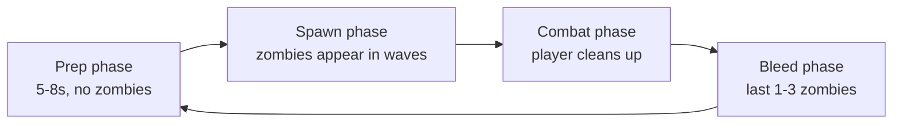
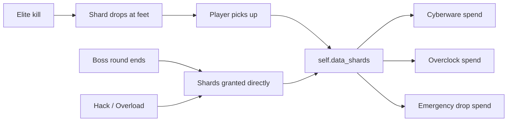
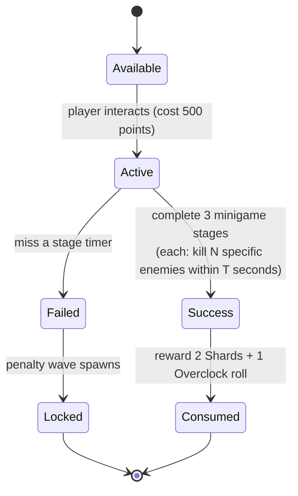
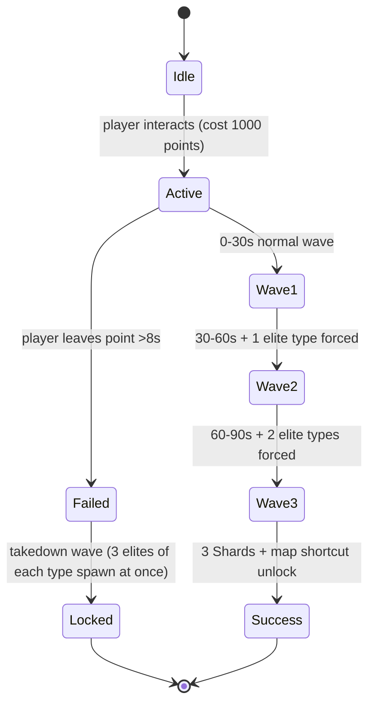

# 06 - Mechanics

Deep-dive on the systems that make the map tick. If `04_progression_and_skills.md` is the "what", this is the "how it actually plays moment to moment".

## Round & Pacing Model

A zombies round has an implicit structure; we make ours explicit and tune each phase.

We tune two levers that stock BO3 mostly leaves alone:

### 1. Spawn Cadence, Not Just Count

Stock BO3 spawns zombies in small batches gated by alive-count. We keep that but **add deliberate "pressure pulses"**: every 3rd round past round 10, an extra wave of 8-12 zombies spawns at the ~50% mark of the round. This prevents the late-game from being "train for 2 minutes, kill the last 3".

### 2. Elite Timing

Elites don't just spawn randomly. They spawn **at inflection points**:

- Shielded elites spawn **at the end of a wave**, forcing you to shift from chaff clearing to priority targeting.
- Teleporters spawn **during a wave**, splitting your attention.
- EMP elites spawn **just before bleed**, preventing the lull.

This means the **texture** of a round is predictable (you can plan) but the **moment** is tense (you must execute).

### 3. Early round pressure (rounds 1–4)

Stock BO3 front-loads a slow walk phase; we **compress that window** so the first minutes are a real setup phase (doors, training lanes, Shard routing) instead of idle cleanup. **Lab perk lineup** updates only **after** [decontamination](03_layout.md#decontamination-zones-round-hazard), not at round start.

| Lever | Rule |
|---|---|
| **Spawn count** | Multiply stock `[[ level.max_zombie_func ]]( n_max, n_round )` output: **×1.40** on round **1**, **×1.35** on rounds **2–4** (integer **ceil**). From round **5**, multiplier **×1.0**. Other systems (e.g. **Shortened Rounds** modifier) multiply on top of this. |
| **Move speed** | On zombie AI spawn, apply **`setmovespeedscale( 1.15 )`** for rounds **1–4** (stacks with stock anim tier). **Sprint** modifier skips this boost (see `07_replayability.md`). |

**Code**: [`_acc_early_round_pacing.gsc`](../scripts/zm/zm_abandoned_cyber_city/_acc_early_round_pacing.gsc) — `post_zm_main()` chains `level.max_zombie_func` from `scripts/zm/zm_abandoned_cyber_city.gsc` after `zm_usermap::main()`, still inside `main()` so the chain exists before round 1; `init()` registers `callback::on_ai_spawned` for speed. Constants: `ACC_EARLY_SPAWN_MULT_R1`, `ACC_EARLY_SPAWN_MULT`, `ACC_EARLY_SPEED_SCALE`, `ACC_EARLY_ROUND_MAX`.

### 4. Decontamination before Lab perk rotation

Each round’s **script order** (see [03_layout.md](03_layout.md)):

1. **`acc_round_start`** (or stock `start_of_round`) — round counter advances; zombies can spawn per stock rules.
2. **Decontamination** — one eligible zone (Market, Alley, Vault, or Roof) is declared contaminated per the run’s seal schedule; **20s** to evacuate or die; zone **seals permanently** (rounds **1–4** only for new seals).
3. **`acc_decontamination_complete`** — safe to update machine states that assume players are not mid-evacuation.
4. **Lab perk re-roll** — `roll_perk_rotation()` runs; Lab machines show the new **4-of-9** lineup.

Rounds **5+** still emit **(2)** with **no new permanent seal**, but the **20s** window may be **0s** or skipped in implementation — perk roll still waits for the **complete** notify so one code path handles all rounds.

## Point Economy

Stock BO3 kill awards are **replaced** (not modified) by our own table:

| Kill type | Points |
|---|---|
| Regular kill | 40 |
| Headshot kill | 100 |
| Knife / melee kill | 100 |

Stock BO3 per-hit points (10 per damaging hit) are kept unchanged.

### Why these numbers

- Lower regular-kill points (40, down from stock 60) to slow pure spray gameplay.
- Raised headshot/knife kills (100) as the payout for skill-expressing kills.
- 2.5x multiplier from regular -> headshot means **aiming is worth it even when you're not stacking Overclocks**.
- Combined with the 2x headshot damage multiplier (see "Headshot Multiplier" above), a skilled aim player earns both more points *and* more kills per minute.

### Co-op Kill-Point Split (70 / 30)

When a zombie is killed, the point award is distributed:

- **Killer**: gets **70%** of the kill's base points.
- **Other qualifying damage contributors**: split the remaining **30%** equally among themselves.
- **Solo (no other qualifying contributors)**: the killer gets **100%**. No penalty for playing solo.

**Payouts are quantized to 10-point units** - a verified BO3 engine constraint:
the stock score API rounds every award UP to a multiple of 10
(`_zm_score.gsc:528`; see [19_stock_api_verification.md](19_stock_api_verification.md)),
so shares are computed in 10-pt chunks with leftover chunks going to the
earliest contributors. Totals across players always equal the full base award
exactly (no inflation; no rounding exploit). The killer's 70% rounds to the
nearest 10.

Example payouts (regular kill = 40 pts base; killer share 28 → 30):

| Players who contributed | Killer gets | Others get | Total granted |
|---|---|---|---|
| Killer only (solo) | 40 | - | 40 |
| Killer + 1 other | 30 | 10 | 40 |
| Killer + 2 others | 30 | 10 / 0 | 40 |
| Killer + 3 others | 30 | 10 / 0 / 0 | 40 |

Same split for a 100-pt headshot or knife kill (killer share = 70):

| Players who contributed | Killer gets | Others get | Total granted |
|---|---|---|---|
| Killer only | 100 | - | 100 |
| Killer + 1 other | 70 | 30 | 100 |
| Killer + 2 others | 70 | 20 / 10 | 100 |
| Killer + 3 others | 70 | 10 / 10 / 10 | 100 |

On a low-value kill some contributors can receive 0 (the pool only has one
10-pt chunk) - acceptable: headshot/knife kills are where assist money lives,
and the 5% qualification bar below still gates who is in the pool at all.

### Anti-Exploit Rules (hard-enforced in code)

The split system is a natural target for cheese. Every rule below is enforced in `_acc_points.gsc`.

1. **Per-player damage is capped at the zombie's max HP.** Overshooting a dying zombie doesn't inflate your damage share. Example: regular zombie has 150 HP. Player A deals 500 damage with a PaP'd AK-47 pre-kill. Recorded contribution: 150, not 500.
2. **Minimum contribution threshold: 5% of zombie max HP** to qualify for a share. This kills the "tag-and-run" exploit where you hit every zombie with 1 damage and vulture a share on everything. A 150-HP zombie requires 7.5 damage from a player for that player to count.
3. **Only player-sourced damage counts.** Environmental kills (fall damage, fire, etc.) and AI-sourced damage (if any exotic setup) do not create a damage record.
4. **Per-player aggregation.** The same player's shots on the same zombie sum to one record. You cannot inflate "contributor count" by switching weapons, reloading, etc.
5. **Disconnected / invalid players at payout time are skipped.** If a player contributed 50% of damage then disconnected, the 30% pool redistributes among remaining qualifiers; nobody "inherits" the disconnected player's share, and no share is dropped on the ground.
6. **Killer-rule overrides.** If the killer is somehow invalid (disconnected in the same frame they fired the killing shot - rare but possible), the full base is split equally among remaining qualifiers as a fallback. No points are lost.

### Exploits we explicitly chose NOT to defend against

- **Coordinated kill-stealing.** Player A softens a zombie to 20 HP with an AK-47, Player B knifes it for a 100-point knife kill. Player B gets 70. Player A only contributed damage, so they get 30. **This is intended as a coordinated play**, not an exploit. If you and a teammate want to split roles (suppressor + finisher), the math supports it.
- **Headshot-hunt coordination.** Similar to above: one player tickles the zombie down, the other headshots for 100. Intended.

### Stock-Award Override Status

The module intends to **fully replace** stock kill awards. Stock BO3 awards 60/100/130 per kill via `_zm_score::player_killed_event` (or similar). At first compile the override is not yet wired - players may receive stock + our awards (double). First-playtest fix; TODO marker in [`_acc_points.gsc::init()`](../scripts/zm/zm_abandoned_cyber_city/_acc_points.gsc).

### Design Interaction Notes

- **Widow's Wine perk** (see [13_perks.md](13_perks.md)): grenade damage boost applies to the grenade owner, so splash kills via Widow's-boosted frags still feed the 70/30 split normally. The perk doesn't bypass the split; it just makes those grenades more likely to land the final blow.
- **Deadshot perk** (see [13_perks.md](13_perks.md)): the 1.5x headshot multiplier is per-player — only applies to the shooter's damage, not the share others earn from a Deadshot player's kill.
- **Meltdown capstone** (AoE kills from Cyberware tier-3 Overclock branch): the AoE kill from Meltdown still counts as "the caster's kill" for point purposes (the AoE source is the weapon; the player who fired is the killer).
- **Multi-kill bonus (+50 per extra zombie killed within 0.5s)**: previously part of this doc's Point Economy section - **cut for now** to keep the point system surface area small. The 2x headshot multiplier plus the precision weapon tier (FAL, Drakon, Intervention) already rewards the playstyle a multi-kill bonus was targeting. Re-add as a modifier in `_acc_modifiers.gsc` if playtest feedback wants it.

### Data Source

- Points module: [`scripts/zm/zm_abandoned_cyber_city/_acc_points.gsc`](../scripts/zm/zm_abandoned_cyber_city/_acc_points.gsc).
- Damage recording is fed from `_acc_damage.gsc::on_ai_damage`, which calls `_acc_points::record_damage` on every player-sourced hit.

## Headshot Multiplier (skill lever)

Stock BO3 applies a small per-weapon headshot damage multiplier baked into each weapon's GDT (roughly 1.5x for most guns). We **multiply on top of that** to sharpen the aim skill ceiling:

- **Regular zombies + elites**: damage is multiplied by **2.0x** on any head-hit, on top of stock.
- **Bosses (mini-boss + full boss)**: **3.0x**.
- **Limb / body hits**: untouched (stock).

Effective numbers (roughly, assuming stock weapon headshot mult ~1.5x):

| Target | Body shot | Head shot (stock) | Head shot (ours) |
|---|---|---|---|
| Regular zombie / elite | 1.0x | ~1.5x | ~3.0x |
| Boss | 1.0x | ~1.5x | ~4.5x |

### Why it's a skill lever

- Spray-and-pray players barely notice the change - most of their rounds go center-mass.
- Aim-focused players effectively **double their damage-per-bullet** against chaff, letting them clear rounds faster, conserve ammo, and spend more time on positioning.
- **Boss fights become aim tests.** A 30-round Subroutine Core with clean headshots dies in ~60% the time it would from body shots. Miss, spray, and the fight drags into phase-3 power/perk debuffs (see Boss phases in [11_enemies.md](11_enemies.md)) which can snowball into a wipe.

### Stacking with Perks / Cyberware / Overclocks

The multiplier is **multiplicative** with every other damage buff. A maxed precision build chains all of these on a single headshot:

- Base weapon damage
- Stock weapon headshot multiplier (~1.5x)
- Our headshot multiplier (2.0x regular / 3.0x boss)
- **Deadshot perk** (1.5x additional headshot damage, see [13_perks.md](13_perks.md))
- Cyberware **Overclock Tier 1** (`+15%` weapon damage) - 1.15x
- Cyberware **Overload (Tier 2 OC branch)** (`+30%` crit damage on headshots) - 1.30x
- Weapon **Overclock** if rolled (e.g. AR **Overpressure** at 1.5x ADS)
- **Double Tap** perk (+3% damage, small but stacks)
- Weapon ability **Precision Mode** (auto-crit next 3 shots = 4x) if active

On a PaP L5 + Tier 5 FAL with Deadshot + Overload + Precision Mode active + good Overclock rolls, a headshot on an elite can one-tap well past round 40. Boss headshots with the full stack are absurd. **Intended**. Rewards the precision archetype.

### Deadshot Effective Damage Table (with our multiplier)

Stock weapon headshot GDT multiplier assumed ~1.5x for illustration:

| Target | Body | Headshot (no Deadshot) | Headshot + Deadshot |
|---|---|---|---|
| Regular zombie / elite | 1.0x | 1.5 × 2.0 = **3.0x** | 1.5 × 2.0 × 1.5 = **4.5x** |
| Boss | 1.0x | 1.5 × 3.0 = **4.5x** | 1.5 × 3.0 × 1.5 = **6.75x** |

Layer on full Cyberware/Overclock/PaP stack and the precision-on-head build starts one-tapping content meant to be round-50 level. Playtest will tell us if this is fun or broken; tuning levers in [13_perks.md](13_perks.md).

### Synergistic Overclocks

- **Adaptive Aim (AR)**: headshots refund one round to the magazine. The 2x headshot damage + ammo refund makes clean aim functionally infinite at range.
- **Thermal Lock (Sniper)**: 0.5s aim guarantees a headshot hitbox. Cashes in our 2x/3x cleanly.
- **Reactive Powder (Sniper)**: headshots deal 50% AoE damage - AoE is of the *buffed* headshot damage, so it scales with our multiplier too.

### Implementation

Hook is `scripts/zm/zm_abandoned_cyber_city/_acc_damage.gsc::on_ai_damage`. Multiplier constants are at the top of that file for easy tuning without a docs round-trip.

### Tuning backstop

If 2x / 3x feels broken in playtest (likely for snipers / FAL), we can:

- Knock regular down to 1.5x / boss 2.5x.
- Or split by elite class: regular 2x, elites 1.5x (bullet sponges feel less silly), bosses 3x unchanged.
- Or flip the boss rule: bosses get NO extra headshot multiplier, but they have an exposed "crit spot" that takes 3x.

Decision deferred to Phase 6 playtest.

## Data Shard Economy (detailed flow)

### Why Shards Drop for Elites Instead of Auto-Granting

- Skill check: you must finish the elite *and* survive long enough to grab the Shard. High-pressure situations can forfeit Shards.
- Co-op politics: whoever grabs it gets it. Encourages communication without forcing it.
- Visual feedback: Shards glint on the ground, giving a tactile "progress" signal.

### Diminishing Returns

To prevent low-round elite farming:

- Past round 10, elite Shard yield is normal.
- Between rounds 1-10, elite Shard drops reduce to 50% after the second elite kill that round.
- The Subroutine Tier 1 passive (+1 Shard per 2 min) has **no cap**, so a skilled run that stays long on a round still nets value.

## Risk/Reward Events

### Hack Terminal (Corporate Plaza)

State machine:

- **Stage 1**: kill 10 zombies within 40 seconds. Easy baseline.
- **Stage 2**: kill 3 Shielded elites within 60 seconds. Forces elite uptime.
- **Stage 3**: kill 15 zombies using headshots within 45 seconds. Skill check.

Each stage runs back-to-back. Fail at any stage and the terminal is locked for the run. Success is one of the cleanest Shard/Point returns available.

**Parallel Processing** (Subroutine Tier 2) allows a second attempt; the second attempt stages rotate (different elite types, different zombie counts) so it's not a replay.

### Vault Overload (Server Vault)

90-second hold event. Player stands on a point; leaving the point pauses progress.

- You **can** leave the point briefly (≤8s) to reposition. Longer and it fails.
- The "map shortcut unlock" for the run opens a direct path from Server Vault to Rooftop Helipad (bypasses Corp). This is a tangible quality-of-life reward for nailing the event.

### Why These Two Events Exist

- They **test different skills**: Hack = burst objective clearing, Vault = sustained positional defense.
- They **gate Shards behind optional pressure**, keeping the base Data Shard economy tight.
- Failing them has a real penalty (spawn wave), not just "try again later".

## Encounter Design Principles

Hard rules for any fight in the map:

1. **Every encounter has at least 2 outs.** No single-exit spaces. The only exceptions are Vault Overload (point defense by design) and the boss room (committed fight).
2. **No invisible damage.** Every source of damage has a visual tell.
3. **HP scaling is conservative.** Elites never become bullet sponges. Difficulty comes from spawn density and utility (EMP drain, teleport flanks).
4. **Movement solves most problems.** Any 1v1 with a zombie, including elites, can be outrun by an unupgraded player. Elite *density* is the threat, not individual stats.
5. **No cheap deaths.** If a player loses a run, they should be able to name the decision that killed them.

## Downed & Revive Mechanics

- Stock BO3 behavior preserved: down -> bleed out in 30s -> die or be revived.
- **Subroutine Caching** doubles bleed to 60s.
- **Self-revive** (when carried): 1-time use, 10s revive animation. Purchase cost 4000 points + 2 Data Shards. Caching halves the Shard cost.
- **Aura Blast perk** (see `13_perks.md`) isn't a save — but the 3s stun on 400u radius gives you a repositioning window before a second hit lands. Not a "downed prevention" layer but a "recovery option" layer.
- **Ghost Shroud boss item** is the clutch 1-HP save; stacks independently with Jugger-Nog's doubled HP pool to maximize survival time before the save is even needed.

## Emergency Drop System

Spend 3 Data Shards at any power switch to call an **emergency drop** - a random Care Package-style drop at the closest safe zone. Drop can be one of:

- Max ammo (all players)
- 2 minute insta-kill
- 2 minute double points
- Random Overclock scroll (apply to any weapon for free)
- Full perk (random) granted to caller

Weights are biased by round: early rounds lean economy (double points, max ammo), late rounds lean survival (full perk, insta-kill).

Emergency drops are a **clutch button**. 3 Shards is meaningful (third of a full build), so you don't spam them. They exist so that a player with Shards banked and a terrible situation has a lever to pull.

## Feedback Loops (summary)

Positive loops (encourage skilled play):

- **Kills -> Shards -> Cyberware -> better kills.** Primary loop.
- **Overclocks -> weapon power -> elite kills easier -> more Shards -> more Overclocks.** Secondary loop.
- **Hack / Overload success -> map shortcut / extra attempts -> better positioning -> more kills.**

Negative loops (punish bad decisions):

- **Fail Hack -> lose a Shard source -> under-fund Cyberware -> under-powered late game.**
- **Miss elite kills -> miss Shards -> can't buy emergency drop -> clutch situations get worse.**
- **Greedy camping -> pressure pulse wave -> forced into bad position -> down -> resource drain.**

Both loops are deliberate. The map wants you to feel rewarded and punished for the same decisions on different runs.

## GSC System Sketch (for when we start scripting in Phase 3)

Rough modules we'll end up writing, in priority order:

1. `_acc_data_shards.gsc` - currency per player, pickup entity, HUD bridge.
2. `_acc_cyberware.gsc` - skill node graph, purchase validation, effect application, respec.
3. `_acc_overclocks.gsc` - weapon Overclock registry, per-run pool roll, application / re-roll.
4. `_acc_elites.gsc` - elite spawning logic, per-round cadence, elite classes.
5. `_acc_events_hack.gsc`, `_acc_events_overload.gsc` - side events.
6. `_acc_map_randomizer.gsc` - per-run state roll (power side, PaP path, perk pool, wallbuy pool).
7. `_acc_boss.gsc` - boss round orchestration.
8. `_acc_emergency_drop.gsc` - clutch button.
9. `_acc_modifiers.gsc` - optional modifiers (see `07_replayability.md`).

`_acc_` prefix = "abandoned cyber city" namespace, to clearly separate from stock `_zm_*` scripts.
