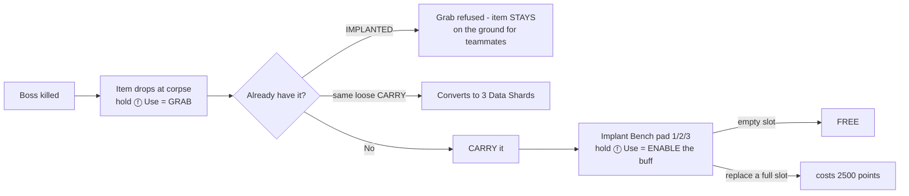

# 09 - Boss Items

Machin[a]-style randomized passive-buff items dropped on boss kills. Shape your build around what bosses give you; high variance, high reward.

## At a Glance

- **14 items** in the drop pool: Gas Tank, Loot Stash, Repair Kit, Rocket Shield, Phase Serum, Boots (**+10% move** — buffed from 8% 2026-07-14), Lucky Horseshoe, **Turbocharger (Havoc)** (a hyper-niche Havoc-only mod, added 2026-07-07), **Plasma Generator** (+10% energy-weapon damage, added 2026-07-14), **Battery** (boss zaps absorbed → +20% speed surge for 5 s + a blue-green screen aura instead of the slow, 10 s cooldown — buffed from 12 s 2026-07-09, added 2026-07-08), **Berzerker** (+35% melee swing speed at 5% max HP per connecting melee — regular knife bash / Leviathan Axe / Action Figure / Ballistic Knife stab, added 2026-07-11), **High Caliber Rounds** (+25% BULLET-gun damage — the ballistic counterpart, pushes builds toward bullet guns; excludes energy weapons, added 2026-07-14), and **Warhead Bomber** (+20% explosive damage, added 2026-07-14), and **Hive Node** (the pool's co-op **SUPPORT beacon** — a heal+shield aura *plus* a double-tap-jump "Bloom" burst that full-heals / ranged-revives / shields the whole squad, with a reward-the-medic points+shards loop so a support player is paid for the slot; added 2026-07-16). **Plasma Generator + Warhead Bomber are the 2026-07-14 SPLIT of the old "Nuclear Energy" item** (which was +10% to explosive OR energy) into two separately-tunable implants. The two tactical grenades (Li'l Arnie + Monkey Bomb) were moved to mystery-box rolls 2026-06-24 — see the note under "The items". (Pool + slot count are live in `_acc_boss_items.gsc`: `init()` logs the live `pool=` size, `ACC_ITEM_SLOTS_PER_PLAYER 3`.)
- **3 active items** per player (2 → 3, user 2026-07-09; three bench pads = Slot 1 / 2 / 3, in the Plaza Implant Lab AND Paradise; filling an empty slot is FREE, replacing a full slot = 2500 pts).
- **Every boss drops exactly 1 item, guaranteed** (user 2026-07-07): every roster boss (Phantom / Rogue Protector / Avogadro / Panzer / Trench Warden-Brutus) routes its death reward through `_acc_boss::grant_unified_boss_reward` → `acc_boss_items::grant_challenge_reward` — the old per-tier chance roll was removed. (`acc_boss_items::on_boss_death` was the legacy full-boss drop path — dead code since the "Subroutine Core" full boss became unreachable 2026-06-22, `_acc_boss.gsc:118` / README.) **Exception:** the **Glitch Stalker** is a *frequent* mini-boss (spawns every 2nd round from round 4; count scales `floor((round-2)/2)`, min 1 — r4=1, r6=2, r8=3, … so it grows past 3) and deliberately does **not** drop items (killer gets 1 Data Shard instead) — dropping every spawn round would flood the pool (`_acc_boss_glitch::glitch_death_watch`, user 2026-06-22).
- **Every dropped item glows** (user 2026-07-07): a small coloured "loot" glow (default dim amber) makes pickups easy to spot on the dark ground. Uses the client-side `acc_perk_lights` glow pipeline; live dvar `acc_item_glow_color` (0 = off). The glow despawns with the pickup. The aura sits at **ground level** — anchored to a separate invisible `tag_origin` host at the drop origin (a few units under, live dvar `acc_item_glow_z`), NOT on the lifted item model — so it reads as a pool of light on the floor beneath the item rather than floating above it. The host is torn down with the pickup in `cleanup_pickup()`.
- **Reactor Surge success drops 1 random pool item** (user 2026-07-16): surviving the surge now spawns one free-for-all item pickup at the armer (same `grant_challenge_reward` pickup as a boss drop, dupe handling included) on top of everyone's +5 shards + the shared Fire Sale. `_acc_reactor.gsc::run_surge`; see [docs/28](28_trench_systems_guide.md).
- **Regular zombies** also have a tiny drop chance (user 2026-06-27; rates halved 2026-06-29; split 2026-07-19): every non-boss zombie death independently rolls **0.25%** to drop a random pool item (free-for-all world pickup) **and** **0.17%** to grant **one Empty Mega Bottle to the killer only** (direct grant, not shared). **The Lucky Horseshoe raises both ×1.5** for its carrier — item 0.25% → 0.375%, Mega Bottle 0.17% → 0.255%. Bosses/mini-bosses are excluded (they keep their guaranteed drops). Live dvars: `acc_zombie_item_drop_chance` (default `0.0025`) / `acc_zombie_bottle_drop_chance` (default `0.0017`). Code: `_acc_boss_items::on_zombie_death_drop`.
- **Duplicates** (user 2026-07-08 rework): an item you already have **IMPLANTED** (any slot) **cannot be
  grabbed at all** — the grab is refused ("Already implanted" print) and the pickup **stays on the ground**
  (glow + 60 s lifetime intact) so a teammate who lacks it can still take it. Per-grabber check, so co-op
  free-for-all drops behave correctly. Only a duplicate of your loose **CARRY** (picked up, not yet enabled —
  transient per-player state no teammate can see or use) still converts to 3 Data Shards.
- **Drops always land on the floor** (root-caused 2026-07-08 after "still floating — the glow is airborne
  too"): every drop origin routes through **`acc_utility::drop_floor_origin`**. A plain down-trace from the
  death origin **starts inside the dying enemy's own body** — a solid AI hit returned the hit ON the corpse,
  which pinned hovering-boss drops (Rogue Protector / Avogadro) mid-air; ground zombies never showed it. The
  helper **steps through ACTOR/PLAYER hits** (≤8 × 4u) down to real **world geometry** (stock idiom
  `fraction < 1 && !isdefined(tr["entity"])`), accepts solid non-AI surfaces (brushmodel bridges/platforms),
  and keeps the origin on a true miss (never buries). Live dvar `acc_drop_floor_snap` (1 = on); step/miss
  diagnostics on the dev `drops_debug` channel. Model seats were verified against the props' real
  `.xmodel_bin` vertex bounds — all three 4×-scaled props are base-pivot (≤2u error), so `model_z` values
  stand; `acc_drop_scale_lift_add` (additive, scaled items only, default 0) remains as a fine-tune knob.
- **Lost when you DIE OUT** (user 2026-06-26): bleeding out (a real death, not a revived down) wipes **all** implant slots — their buffs go with them, and you respawn implant-less and must find + re-implant new ones. A revived down keeps your implants. Implemented in `_acc_boss_items::lose_implants_on_bleed_out` (per-player stock `"bled_out"` notify). Also no persistence across runs (run-end resets everything).

## Separate From Mega Bottles

**This doc covers the 13-item implantable pool only.** Bosses also drop a separate **Empty Mega Bottle** resource (guaranteed per player per boss kill) used to upgrade perks to their Mega variants. Mega Bottles do not take the active-item slot and are not part of the pool described here. See [10_perks.md](10_perks.md#mega-bottles-system) for the Mega Bottle acquisition + persistence rules; per-perk Mega effects are under **Perk reference (base + Mega)** in the same doc.

## Drop Mechanics

> **v4 (2026-07-09): THREE active slots.** (v3 2026-06-23 introduced the bench-gate with
> two slots.) Picking an item up only CARRIES it; you ENABLE its buff at an Implant Bench —
> **three pads** (Slot 1 / 2 / 3 — you pick which slot by which pad you use), in both the
> Plaza Implant Lab and Paradise. Filling an EMPTY slot is **free**; once all slots are
> full, implanting another **replaces that pad's slot for 2500 pts**. So any empty slot is
> always free ("first three free"). A sound plays on each implant.

### Acquisition flow
1. **Bosses drop items.** Every boss kill drops a random pool item at the corpse, **guaranteed** (user 2026-07-07; the frequent Glitch Stalker is the exception — it gives a Data Shard instead). Hold **ⓕ Use** to **grab** it — this only **carries** it (HUD: `CARRYING <item>`); the buff is NOT active yet. Uncollected drops despawn after **60 s** (`ACC_ITEM_DROP_LIFETIME_SEC`). Grabbing an item you already have **IMPLANTED** is **refused** — the pickup stays on the ground for teammates (user 2026-07-08; was a +3-shard conversion that consumed the drop). Grabbing a duplicate of the item you already loosely **carry** → **+3 Data Shards**. Grabbing a NEW item while already carrying a different (un-enabled) one **drops the old one back to the ground** (re-grabbable) — it's never lost. (An already-implanted item stays implanted.)
2. **Enable it at an Implant Bench** — the Plaza bench is in the gated **Implant Lab** side-room off the Plaza spawn (buy the tight-entrance door, `enter_implant`, **1500**, to reach it; 2026-06-26). **Three pads** (2 → 3, 2026-07-09), Slot 1 / 2 / 3, spread as a **staggered arc** across the room (**relayout 2026-07-10**: the lab was **widened east** — wall x-40 → x180, room now x[-720,180] — and the three pads moved out of the old tight south-wall row into the open EAST clear area, clear of the Exchange staircase's SW corner and every wall — user "the 3 benches are cluttered and one is right next to a wall"). Hold **ⓕ Use** on a pad to **implant** the carried item into that slot → buff goes active (HUD: `IMPLANT 1 <item>` / `IMPLANT 2 <item>` / `IMPLANT 3 <item>`). A confirmation sound plays. Paradise has its own 3-pad row (south-west, by the Mystery Box).
3. **Three active items at a time** (2 → 3, user 2026-07-09). Implanting into an **empty** slot is **FREE** (so your first three are free). Once **all** slots are full, using a pad **replaces that pad's slot** for **2500 points** (removing that slot's previous buff) — you choose which to lose by which pad you use. Carrying a new item does nothing until you bench it.
   - **The single engine tactical slot** is shared by the two box-rolled grenade weapons (Li'l Arnie + Monkey Bomb — see the note below; they are NOT boss-drop implants). The engine has only one tactical, so the **last one granted is the grenade you actually throw** ("last one wins", `player.acc_tactical_owner`); losing it hands the tactical back to the other.

### The items (pool of 14)

> **The two tactical-grenade items moved OUT of this pool (user 2026-06-24).** Li'l Arnie (Octobomb) and
> Monkey Bomb (Cymbal Monkey) are no longer boss drops — they are now rare **mystery-box** tactical pre-rolls
> (Monkey Bomb **1%** / Li'l Arnie **0.5%**). See
> [`_acc_map_randomizer.gsc::acc_box_tactical_preroll`](../scripts/zm/zm_abandoned_cyber_city/_acc_map_randomizer.gsc)
> + `acc_boss_items::watch_box_tactical_grab`. **The tactical grant never touches your gun slots**
> (fix 2026-07-17): the AW box driver **skips `zm_weapons::weapon_give` for a floated tactical** — stock
> treated the octobomb as a PRIMARY (it's not in `level.zombie_tactical_grenade_list`; only
> `cymbal_monkey` is stock-registered) and at the 2-gun limit **traded away the held gun**. The
> `watch_box_tactical_grab` finalizer owns the complete give (slot + ammo 4 + thrown callback; a
> knife-to-share grabber is covered via the weapon object on the `"user_grabbed_weapon"` notify arg), and
> `octobomb` is now also registered as a level tactical in `acc_boss_items::init` so every other give
> path is offhand-safe too. After they left, the pool was 6; items **7–10** (Lucky
> Horseshoe / Turbocharger / Nuclear Energy / Battery / Berzerker) were added later, then High Caliber Rounds
> (item 12, 2026-07-14). On 2026-07-14 Nuclear Energy was **split** into **Plasma Generator** (item 9, energy)
> + **Warhead Bomber** (item 13, explosive), then **Hive Node** (item 14, 2026-07-16) and **Dark Magic** (item 15, 2026-07-17),
> so the live pool is **15** (IDs 1–15). **Item 15 is the hard cap** — the `acc_implants` clientfield packs `item.num` into a
> 4-bit nibble, so a 16th numbered item would need the wire widened (`_zm_aetherium_hud.gsc`/`.csc`).

| ID | Item | Model | Buff | How to use |
|----|------|-------|------|-----------|
| 1 | **Gas Tank** | nitrous tank (`p7_zm_zod_nitrous_tank`) | **Nitro burst** — +100% move speed for 5 s | **Double-tap the Sprint button** to trigger. Runs the full 5 s (uncancellable), then a **60 s** lockout — can't re-trigger until fully recharged. (No on-screen NITRO bar — the HUD charge bar was removed 2026-06-28 to free the co-op hudelem pool; the burst still works.) |
| 2 | **Loot Stash** | locked money bag (`p7_wes_money_bag` — T7 Assets carve 2026-07-08; was the gold brick) | **+10 pts/kill, flat** — NO headshot tier, and **Double Points does NOT boost it** (DP still ×2's the base kill points, just not this bonus; user 2026-06-29 nerf, was 10/15 +5/+10 DP). A **Nuke still pays the holder 500** (scaled by Double Points). | Passive, KILLER only. Logic in `_acc_points` (`award_killer_with_ledger` + `ledger_nuke_watch`; `ACC_LEDGER_KILL 10` / `ACC_LEDGER_NUKE 500`). |
| 3 | **Repair Kit** | first-aid box (`p7_spl_first_aid_box` — T7 Assets carve 2026-07-08; was the carpenter power-up icon) | **+10 HP/sec** passive health regen (user 2026-07-11: back to 10, was briefly 13; `ACC_OVERCHARGE_REGEN 10`) | Passive (caps at max health; pauses while downed). |
| 4 | **Rocket Shield** | rocket shield (`wpn_t7_zmb_zod_rocket_shield_world`) | **Mobility + the REAL shield** (user 2026-07-15 rework) — **+100% speed while sliding** (×2.0, was ×1.75; **carries through a slide-jump** — the boost holds for a 0.5s grace after the slide ends [a slide-jump stands you up for a few grounded frames first, so an airborne-only latch missed it] and the speed is topped back up the moment the jump button is pressed while grounded in the grace [with a mid-air liftoff restore as fallback, both along your current heading, both floored at half slide speed so a braked player stays braked]. **The carry itself is global and item-agnostic** — it lives in `_acc_movement.gsc` and preserves your ACTUAL velocity, so this ×2.0 is simply part of what it carries; the item owns only the ×2.0 flag. 2026-07-15, `acc_slide_jump_grace`), a forward lunge on slide-start (250, was 200), **2× jump height** (×1.42 velocity ≈ 2× apex), **and the native ZNS rocket shield equipment** (`zod_riotshield`): sits in the equipment slot (Dpad-down — NOT a gun slot), **blocks ALL damage from behind while stowed on your back**, blocks in front while held, melee-power = rocket-boost bash (ammo-driven charges, refilled by Max Ammo). Shield HP: **effectively 750** (`acc_rocket_shield_hp`; stock pool is a GDT-baked 1850 with NO runtime setter, so `acc_shield_damage` scales every blocked hit up by 1850/750 before the stock damage fn — bar stays linear, bash self-costs stay stock-priced); when zombies destroy it the item **regrants a fresh one after 60 s** (`acc_rocket_shield_regrant_sec`), and respawns regrant too. | Passive — slide, jump, and press Dpad-down to wield the shield. **Zero new pipeline:** stock `zm_usermap.gsc` already `#using`s `_zm_weap_rocketshield`, whose autoexec registers the equipment + `_zm_weap_riotshield`'s damage-absorb callback + the `zmInventory.shield_health` clientuimodel (the Aetherium HUD kit already ships the blue shield-health bar + icon, and the kill-feed already names `zod_riotshield` kills); every asset ships in `zm_levelcommon`, so the grant is the stock `zm_equipment::buy( "zod_riotshield" )`. (dvars `acc_rocket_slide_mult` / `acc_rocket_jump_mult` / `acc_rocket_slide_kick` / `acc_rocket_shield_regrant_sec`) |
| 5 | **Phase Serum** | MOTD surgical vial (`p7_zm_mob_vial_surgical_lrg` — T7 Assets carve 2026-07-08; was the generic perk bottle) | **Phase-boss suppression aura** (user 2026-06-29 nerf, was a cloak; Phantom added 2026-07-11) — any **Glitch Stalker within ~350u is slowed to 1/5 speed AND loses its blink** (its glitch ability), and any **Phantom in the same aura is slowed by 30%** (milder: its gait only — teleports keep working). Both can still SEE + chase you — just hindered, not blinded. Regular horde unaffected. | Passive. Dvars `acc_phase_serum_radius` (350) / `acc_phase_serum_slow` (0.2, Glitch) / `acc_phantom_serum_slow` (0.7, Phantom). Aura check shared in `acc_utility::serum_aura_active`; consumers `_acc_boss_glitch::acc_serum_suppressed` + `_acc_boss_phantom::phantom_speed_think`. |
| 6 | **Boots** | boots prop (`p7_boots_safehouse_01`) | **Mobility** — **+10% move speed everywhere** (buffed from +8% 2026-07-14). (Does NOT cancel the trench slow — user 2026-06-21; only the Exo Suit does that, `_acc_utility.gsc:495`, docs/29.) | Passive. `acc_boots_mult` 1.10. (user 2026-06-18, buffed 2026-07-14) |
| 7 | **Lucky Horseshoe** (was "Lucky Clover" — renamed 2026-07-08 to follow the real model; internal id `lucky_clover` + all `acc_clover_*` dvars unchanged) | vintage iron horseshoe (`p7_ra2_tool_vintage_horseshoe` — T7 Assets carve 2026-07-08; no clover/charm model exists in ANY T7 source, the horseshoe is the luck icon) | **Drop luck** — while implanted, YOUR kills raise the zombie random-item drop chance **0.25% → 0.375%** and the Mega-Bottle chance **0.17% → 0.255%** (both ×1.5, `acc_clover_mult`) **and** add a **0.5%/kill** chance to drop a random power-up (full_ammo / insta_kill / double_points / nuke), bypassing the per-round cap, **and boost mystery-box rare odds**. Works in Paradise. | Passive, KILLER only. Per-player. Live dvars `acc_clover_mult` / `acc_clover_powerup_chance` / `acc_clover_box_*`. (user 2026-06-27, retuned 2026-06-29, box-luck nerfed 2026-07-05; **defaults rescaled 2026-07-09** — the old thresholds were tuned for the 482-weight pool and had silently become a no-op after the 2026-07-06 pool rescale to ~3400+) |
| 8 | **Turbocharger (Havoc)** | car carburetor (`p7_ban_debris_car_carburetor` — T7 Assets carve 2026-07-08; was the Insta-Kill orb) | **Havoc-only — 0 charge-up time.** While implanted, any **Havoc** (the Apex beam rifle) the carrier holds fires with **no wind-up** — the script charge gate is skipped, so it rips like a normal auto instead of the 1.25 s spool. **Deliberately hyper-niche: does nothing unless you actually own a Havoc** (equip it without one and it's a wasted slot). The `(Havoc)` in the name is the on-screen tell. | Passive. Read by `_acc_havoc_charge` via `self.acc_item_turbocharger` (set by `apply_turbocharger`). (user 2026-07-07) |
| 9 | **Plasma Generator** | DE death-ray sphere coil (`p7_zm_ctl_deathray_sphere_coil` — tesla-ball apparatus, T7 Assets carve 2026-07-15 `acc_t7_props_items2.gdt`, ×1.5 scale; was the ray-gun energy ball placeholder, which stays live as the Data Shard model) | **+10% energy-weapon damage.** While implanted, the carrier's hits from an **energy weapon** (Havoc / Tac-19 / AE4 / Blast-O-Matic / CEL-3 / Triple Take / Peacekeeper — `is_energy_weapon`) deal +10% (additive bonus layer). The **ENERGY half** of the old Nuclear Energy item (split into Plasma + Warhead 2026-07-14 so energy & explosive are tuned separately). | Passive. Read by `_acc_damage::on_ai_damage` via `attacker.acc_item_plasma` (set by `apply_plasma`). `ACC_ITEM_PLASMA_MULT` in `_acc_damage.gsc`. (user 2026-07-14) |
| 12 | **High Caliber Rounds** | DE flak AA round (`p7_zm_ctl_ammo_flak_bullet_01` — a literal giant brass bullet, T7 Assets carve 2026-07-15 `acc_t7_props_items2.gdt`, ×4 scale ≈ 36u standing round; was the max-ammo power-up orb placeholder) | **+25% BULLET-gun damage.** While implanted, the carrier's **bullet** hits (`MOD_PISTOL_BULLET` / `MOD_RIFLE_BULLET` / `MOD_HEAD_SHOT` — `is_bullet_mod`) from **non-energy** guns deal +25% (additive bonus layer). The **ballistic counterpart** — designed to push builds toward conventional bullet guns; deliberately **excludes energy weapons** (`is_energy_weapon`) so a bullet gun and an energy gun are boosted by different items. Melee / grenades / projectiles never carry a bullet MOD, so they're naturally unaffected. | Passive. Read by `_acc_damage::on_ai_damage` via `attacker.acc_item_high_caliber` (set by `apply_high_caliber`). `ACC_ITEM_HIGH_CALIBER_MULT` in `_acc_damage.gsc`. (user 2026-07-14) |
| 13 | **Warhead Bomber** | BO3 AMWS drone missile (`projectile_t7_drone_amws_missile` — a real finned warhead lying on its side, on-theme drone tech; T7 Assets carve 2026-07-15 `acc_t7_props_items2.gdt`, ×4 scale ≈ 37u; was the nuke power-up orb placeholder) | **+20% explosive damage.** While implanted, the carrier's **explosive** hits (grenades / launchers / any `MOD_EXPLOSIVE`/`MOD_PROJECTILE` — `is_explosive_mod`) deal +20% (additive bonus layer). MOD-based, so it covers **thrown grenades (frag / Monkey Bomb / Octobomb) and the Mahem & War Machine launchers** — not just the held launchers. Deliberately **excludes energy weapons** (`is_energy_weapon`, user 2026-07-15): an energy *projectile* gun like the **Havoc** reports `MOD_PROJECTILE` (which `is_explosive_mod` matches) but is an ENERGY gun owned by Plasma, not an explosive — without the guard, holding both implants double-dipped it (+10% + +20%). With it, Plasma / Warhead / High Caliber cover **disjoint** classes (energy / explosive / bullet), each gun boosted by at most one. (The Fire Bow / Thundergun / Winter's Howl are deliberately NONE of the three items, user 2026-07-14.) The **EXPLOSIVE half** of the old Nuclear Energy item (split into Plasma + Warhead 2026-07-14), at a higher rate. | Passive. Read by `_acc_damage::on_ai_damage` via `attacker.acc_item_warhead` (set by `apply_warhead`). `ACC_ITEM_WARHEAD_MULT` in `_acc_damage.gsc`. (user 2026-07-14) |
| 10 | **Battery** | Der Eisendrache ceramic battery (`p7_zm_ctl_battery_ceramic` — own install-side carve GDT) | **Boss-zap absorber.** While implanted AND off cooldown, a boss zap (Phantom chain special / Rogue Protector close-range zap / Avogadro bolt+aura) does **NOT slow** the carrier — it instead grants a **+20% move speed surge for 5 s** plus a **light blue-green full-screen aura** (the trench-warning tint recipe) and its own distinct **"electric voltage" SFX** (`acc_battery_zap`). Then the battery **recharges for 10 s** (`acc_battery_cooldown_sec`; user 2026-07-09 buff, was 12 s): **one surge per 10 s** (no refresh-on-re-zap). **While the surge is active (the 5 s window) a second zap is absorbed** so it can't hinder your boost (user 2026-07-08 fix — the slow used to multiply against the active surge and net a slowdown); only a zap during the **later recharge window** (surge ended, cooldown not up) slows you normally. The zap's chip **damage still applies** (Avogadro/Protector damage is a separate call) — only the slow is converted. When ready, supersedes the Mega Electric Cherry −10% softening. | Passive. The three zap applicators in `_acc_elites.gsc` gate on `acc_battery_ready()` (`self.acc_item_volt_battery` + cooldown) → `acc_battery_surge()`; boost via `recompute_move_speed`, aura via `battery_aura()`. **NOT the legacy Kinetic Battery** (dormant v1 item; distinct flag on purpose). Dvars `acc_battery_boost_mult` / `acc_battery_boost_sec` / `acc_battery_cooldown_sec` / `acc_battery_aura_alpha`. (user 2026-07-08) |
| 11 | **Berzerker** | Wolf Bow death skull (`rune_prison_death_skull` — already registered install-side by the HB21 bow dep packs, zero new asset work; ×4 scale, added 2026-07-11) | **+35% melee swing speed, paid in blood.** The **four** melee surfaces swing 35% faster: the **regular knife bash**, the **Leviathan Axe** (stacks with its +10%/PaP-tier spd twins), the **Action Figure** (stacks with its +33%/tier fast twins), and the **Ballistic Knife**'s held stab (its own `_acc_brz` twins on base + PaP). Every melee that **connects** costs **5% of MAX HP** as **real damage** — red flash, and it **resets the engine HP-regen timer** (the point of it being damage); PhD does not negate it (MOD_UNKNOWN); clamped to a **50%-of-max-HP floor** so it can never down you (at/below the floor you keep the speed and stop paying). Debounced per **swing** (150 ms) — a Leviathan cleave through a crowd taxes once; whiffs are free (only connecting swings pay). **The floor was 1 HP until 2026-07-15 and that was a self-kill bug, not a safety net** — see Caveats. Guns are completely untouched; a **Widow's-Wine knife is NOT the regular knife** (no speed, no tax while WW holds the melee slot). | Passive. Speed = pre-baked GDT twins on all four legs (no runtime melee-speed setter exists; `tools/oneshots/gen_berzerker_twins.js`): Leviathan via the `brz` variant axis (`_acc_weapon_variants::axis_brz`), AF via a parallel `_brz` fast-twin ladder (`_acc_pap_levels`), knife-bash via the **EXPERIMENTAL** `acc_berzerker_melee` melee-slot swap (bare-fist swipe — see Caveats), Ballistic Knife stab via its `knife_ballistic[_upgraded]_acc_brz` twins (`tools/oneshots/gen_ballistic_brz_twins.js`, also read by the held-STAB path in `_acc_damage.gsc`). Tax = `_acc_damage::berzerker_melee_tax` off `self.acc_item_berzerker`, triggered via the debounced `berzerker_try_tax()`. Dvar `acc_berzerker_hp_frac` (0.05). (user 2026-07-11; **fix 2026-07-14:** the Leviathan Axe swung faster but never paid the tax — its fractional hits-to-kill block value-returns in `on_ai_damage` ABOVE the general melee-tax block, so the axe now charges the tax at its own return site.) |

| 14 | **Hive Node** | Zetsubou bio-specimen egg/pod (`p7_zm_isl_specimen_container_egg` — **MODEL SWAP 2026-07-17**; was `p7_spl_first_aid_box`, the **same model as Repair Kit**, which read as "very confusing" on the ground — user. The egg is an organic "hive node" silhouette, 100% distinct from the white med box. **No new carve** — the `_egg` was already carved+installed STATIC-rigid in `acc_t7_props_deco.gdt` for the abyss-deco slice; `tag_origin`-only, no `j_` joint, so it converts as a rigid pickup — unlike the SKINNED `specimen_container_mutant` vats that fail. 51×54×60u base pivot, `model_z 2`, `model_scale 0.7` → ~42u — user "cut the size down 30%" 2026-07-17.) | **Co-op SUPPORT beacon** (the pool's only team-support item, user 2026-07-16). **Passive aura** (~300u, `acc_hive_radius`): every player in range — **you included, so it's a real self-sustain solo** — gets **+15 HP/s regen** (`acc_hive_regen`; Repair Kit is 10 and self-only) **and −15% incoming damage** (`acc_hive_dr`, applied in `_acc_elites::apply_player_mitigations`, stacking multiplicatively with Exo/Savior). **Active "Bloom" burst** (**double-tap Jump**, 60 s lockout `acc_hive_cd`): **full-heals** every player in range, **ranged-revives** any downed teammate (`zm_laststand::remote_revive`, a no-op on the healthy), and drops a strong **−50% shield for 5 s** (`acc_hive_bubble_dr` / `acc_hive_bubble_sec`). **Reward-the-medic:** a **covered teammate's kill** pays each in-aura Hive carrier **+10 pts** (`acc_hive_commission`); each teammate the Bloom **revives** pays the carrier **2 Data Shards + 250 pts**, each it **heals** **+50 pts** — so playing support is worth a slot. | Passive aura + double-tap **Jump** to Bloom. Coverage/shield ride self-expiring timestamps (`acc_hive_covered_until` / `acc_hive_bubble_until`); effect in `_acc_boss_items` (`apply_hive` / `hive_aura_loop` / `hive_watch` / `hive_bloom_burst` / `hive_on_kill`), DR in `_acc_elites`. |

| 15 | **Dark Magic** | SoE Apothicon purple-emissive glyph (`p7_zm_zod_symbol_96_apothicon_purple_emissive` — the Aether/dark-magic sigil, self-glows purple; **already packed**, `.zone` xmodel line :799, live as L4 abyss decor in `_acc_abyss_deco`, so **no carve**. A flat ~96u glyph → lies as a glowing floor sigil under the loot glow; `model_z 2`, `model_scale 1.0`, tune at the Plaza dev-scatter.) | **Death-insurance self-implant** (user 2026-07-17). Works **solo + co-op**. **On DOWN → REVIVE** (Quick Revive self-revive in solo, or a teammate in co-op): you **keep the first 4 perks you bought** — the engine strips perks at `player_downed`, and this re-grants them at `player_revived`. **Quick Revive is skipped** and never counts as one of the 4 (user: "that perks selection skips over quick revive"). **On REAL DEATH (bleed out) → RESPAWN**: you come back with **ALL your weapons (with their Pack-a-Punch tier) + Juggernog** — every gun including **hero/wonder weapons** (Fire Bow, Thundergun; "all weapons, no matter what", user 2026-07-17), restored with their tiers; Mule Kick is re-granted if your non-hero gun count needs the slot. A full death does **not** restore the other perks (that's the down/revive case only). **Uniquely survives your own bleed-out** (every other implant is lost) so the insurance keeps working across deaths; to make it one-shot instead, delete the two-line `dark_magic` skip in `lose_implants_on_bleed_out`. | Passive. Effect + trackers in `_acc_boss_items` (`apply_dark_magic` / `dark_magic_track_perks` [first-4 via the `perk_bought` notify] / `dark_magic_revive_watch` / `dark_magic_death_watch` + `dark_magic_respawn_watch` + `dark_magic_do_death_restore` / `dark_magic_gun_latch` + `dark_magic_capture_loadout`). Guns restored via `zm_weapons::weapon_give` + the PaP tier re-stamped on `self.acc_pap_tier`; Jugg via `zm_perks::give_perk("specialty_armorvest", false)`. **CO-OP REVIVE FIX 2026-07-19 (live co-op failure — partner revived with no perks back):** the co-op manual-revive path notifies `player_revived` BEFORE the revive executes (`_zm_laststand.gsc revive_success()` :1430 notify → :1432 `reviveplayer()`), unlike solo `auto_revive` (notifies at the END, :1351→:1392, the only lane live-tested) — the old one-shot +0.1s restore behind the `is_player_valid` 5-way gate could silently skip on the co-op timing with no retry. Now `dark_magic_do_revive_restore` retries any missing tracked perk over a ~5s window (0.25s ticks) until the set holds ~1s; aborts on re-down/bleed-out; re-pushes the implants HUD CF. **The implant is SELF-benefit: the DOWNED player must have Dark Magic IMPLANTED (bench), not merely carried.** Live co-op re-test still owed. |

All IDs/names show `id - name` in the pickup prompt, the messages, and the HUD. Models are link-verified (errorlog-clean) and per-item floor-lifted (`model_z`) so they don't sink in.

### In-game effect blurbs (`desc`, 2026-07-11; moved off the HUD lines 2026-07-12)

Before 2026-07-11 **no UI surface said what an item actually does** — only `id - name` (effects lived
only in this doc). Every pool item carries a one-line `desc` in `build_item_pool()` shown on:
the **pickup hint** (`Hold ⓕ to grab Lucky Horseshoe - Luckier drops and box rolls` — so you know
what it does BEFORE grabbing) and the **pause-menu Implant Panel** (below). **2026-07-12 rework**
(user: "I'd rather just have Implant 1 - Loot Stash"): the numeric `id` was dropped from **every**
player-facing string (`display_for()` is now name-only). **Later the same day the in-game display
went full PNG** (user pack `cyber_city_implant_hud`, v3 holo set; "just placing pngs on top of the
implant pngs"):

- **In-game HUD = `CoD.AccImplantRow`** (`acc_hud.lua`): four always-on bars drawn 230×42 (v4 962×176 art) on the
  left HUD (x 32, from y 220 — the old text lines' column): three **slot cards** (baked `IMPLANT N
  // SLOT 0N` labels + an EMPTY hex window) + the **HOLDING card** (V2 pack) for a
  carried-but-not-benched item. When a slot/carry is filled, that item's **256×256 hex emblem
  chip** (`i_acc_emblem_<item>`, glyph-only) overlays the bar's right window (glyph = 92% of bar
  height, x-center at 90.1% of bar width per the v4 README). **States are pure
  image swaps**: lit card ↔ `_dim` card (35% desat / 60% bright / 50% alpha BAKED into the dim
  art — no code alpha on top). **The GSC `IMPLANT N`/`CARRYING` hudelem text lines were DELETED**
  from `sync_items_hud` (+ `destroy_items_hud` retired) — up to 4 per-client hudelems freed;
  `sync_items_hud` is now just the clientfield push. Asset recipe = the gun-badge pipeline
  (docs/19): PNGs in `source_data/acc_perk_shaders/_images/`, `image.gdf` blocks, `image,` zone
  lines, `tools/deploy_perk_shaders.ps1`.
- **Pause-menu Implant Panel** (`AetheriumStartMenu.lua`): the same four bars + emblem overlays at
  the **EXACT in-game coords** (x32 / y220 / 230×42 / stride 48) so pausing OVERLAPS and covers the
  in-game bars (user 2026-07-12: "the menu needs to overlap the in game HUD") — with the **name +
  desc text KEPT beside each card** to the right (x274→790) (user: "the
  description stays cause thats the most important in the menu") — `Loot Stash:  Extra points on
  every kill`, no `IMPLANT N` prefix (the card art carries the label), empty slots show only the
  dim card's EMPTY window; the carried item's amber name/desc line sits beside the HOLDING card.
- **Data bridge**: `_acc_boss_items.gsc::push_implants_clientfield` (called from `sync_items_hud`,
  the single item-change sync point) packs four 4-bit `item.num` nibbles (Slot 1/2/3 + carried,
  0 = empty) into the **16-bit `toplayer` clientfield `acc_implants`** — registered in
  `_zm_aetherium_hud.gsc/.csc` (lockstep, appended last) and bridged to the same-named UI model
  (same path as `acc_shards`/`acc_badges`; the clientuimodel pool is full, docs/11). Only ids cross
  the wire — BOTH Lua consumers mirror the per-num strings/art locally: `ACC_IMPLANT_INFO`
  (name/desc/emblem, `AetheriumStartMenu.lua`) and `ACC_IMPLANT_EMBLEMS` (emblem images,
  `acc_hud.lua`). **Keep both in sync with `build_item_pool()` on any item add/rename/reword**,
  and `item.num` must stay ≤ 15 (4-bit nibble). The whole PNG display rides this one existing
  wire — zero new clientfields/uimodels/hudelems.

**TWO desc surfaces (user 2026-07-14):** the GSC `item.desc` feeds the in-game **PICKUP HINT** and stays
vague/router-safe; the **PAUSE-MENU** shows the ACTUAL NUMBERS from a SEPARATE table, `ACC_IMPLANT_INFO`
in `AetheriumStartMenu.lua` (e.g. pickup hint `More bullet gun damage` ↔ pause-menu `+25% bullet gun
damage`). The pause menu is where exact magnitudes belong; the pickup hint can't carry them (router). Keep
`ACC_IMPLANT_INFO[num].desc` numeric and in sync with the item table above on any add/reword.

Rules for writing the GSC `item.desc` (the PICKUP HINT — enforced by the comment on `item()`):

1. **Vague wording per docs/31** — direction only, NO magnitudes (`Faster melee but drains some
   health`, never `+35% melee speed`). Exact values live in the pause menu + the table above.
2. **Router-safe**: the desc rides a `SetHintString`, so it must never contain the substrings
   `for` / `cost` / `buy` / `purchase` / `mystery` / `rack` / `bottle` / `permanently` / `door` /
   `power` — the LUI cursor-hint router (`ZMCursorHintNew.lua`) keys on those and would hijack the
   pickup hint into a blank weapon/perk card (memory `lui-cursorhint-router-loose-weapon-matcher`).
   (This is why the numeric strings live ONLY in `ACC_IMPLANT_INFO`, never copied into the GSC desc.)
3. **Short** (~30 chars) — it shares the pickup-hint line and a single pause-menu row.

### Real pickup models (T7 Assets carve, 2026-07-08)

Five placeholder models (three power-up orbs + the gold brick + the generic perk bottle) were
replaced with **real props carved from the MidgetBlaster "T7 Assets V2.7" rar** (already in the
user's Downloads — the same proven slice pipeline as the exchange-room decor pilot, see the
`.zone` comment + `tools/external_assets_manifest.ps1` "items slice" entry). Install-side:
`source_data\acc_t7_props_items.gdt` + `model_export\_midgetblaster\props\{p7_mp_waterpark,
p7_mp_wes,p7_mp_rome,p7_zm_genesis,p7_mp_banzai}`. Materials whose colormaps didn't ship in the
dump reference their stock `i_mtl_*_c` names (the pilot's proven stock-resolve pattern; build
errorlog is the verdict). **Playtest polish (2026-07-08, applies to ALL drops):** horseshoe/vial/carburetor
read tiny at 1× → per-item `model_scale` (**×4.0 all three**, user after seeing ×2ish) applied via `SetScale`
in `spawn_pickup` (script_model-safe). The loot glow is now **dim amber** (`acc_perk_lights`
index 13 = amber at **25%** brightness, generated `fx_perk_glow_amber_dim`; Mule Kick keeps full
amber index 5) and sits low (`ACC_ITEM_GLOW_Z_DEF −40`). **Dev-mode visual QA:**
`_acc_boss_items::dev_scatter_items()` lays out one pickup of every pool item on a ground-checked
3-column grid (170 u spacing, wraps to as many rows as the pool needs — 13 items = 5 rows;
`find_clear_ground` skips spots whose floor trace lands >24 u above the plaza floor) on the
open Plaza floor — persistent, spawn-struct anchored, `level.acc_dev`-gated per docs/22. **RE-ENABLED
2026-07-15** (user "place all items in the Plaza so I can test, behind dev mode") — the `init()` call
passes **no filter** so the FULL 13-item grid drops; it takes an optional space-separated id filter
(e.g. `"turbocharger battery"`) if a future pass wants a subset. Comment the two lines out again for the
next publish build (dev default 0 already makes it inert for subscribers). Dev + god are armed for the
test session via the `level.acc_dev/acc_god = true;` hardcodes in `acc_resolve_dev_flags()` (the
2026-07-15 single-launcher workflow — `PLAY_NORMAL.bat` is the only play script; docs/22).

### Caveats / honest framing
- **Granting the Octobomb / Cymbal Monkey works via a CSV row only** (no `.zone` weapon line). Both weapon defs already ship in `zm_levelcommon` (the common fastfile every usermap loads — assetlist lines 6175/6225), so a row in `gamedata/weapons/zm/zm_levelcommon_weapons.csv` makes `is_weapon_included` true and `GetWeapon("octobomb"/"cymbal_monkey")` resolves at runtime. **Do NOT add `weapon,<name>_zm` to the `.zone`** — that forces a re-pack from a GDT source not on disk and errors `Unable to load weapon` (an earlier self-inflicted build error, since corrected).
- **The thrown grenade's BEHAVIOR (attract / spore / explode) has to be manually activated — the HACK (2026-06-18).** `GiveWeapon` alone makes the grenade *throwable*, but the thrown projectile "just sits there": the attract/explode logic lives in a per-player watcher thread (`player_handle_octobomb` / `player_handle_cymbal_monkey`) that stock starts ONLY from `zm_weapons::weapon_give`, which fires the registered `level.zombie_weapons_callbacks[weapon]`. Our grant uses a **raw** `GiveWeapon`, which skips that path, so the watcher never starts. Fix: `give_octobomb` / `give_monkey_bomb` now dispatch the callback themselves — `self thread [[ level.zombie_weapons_callbacks[w] ]]()` — **verbatim the stock dispatch at `_zm_weapons.gsc:2791-2793`**. The watchers self-guard (notify/endon), so the revive re-grant is safe; no `#using` or clientfield needed (it's a `level` field). The SoE/DLC3 **spore / glow / lightning FX are absent from this install** so the visuals won't render, but the gameplay (attract + damage + detonate) is fully server-side and works.
- **Rocket Shield "slide lasts 1.5× longer" isn't literally possible** — *as a **per-player** effect.* Shipped as a **forward distance lunge** on slide-start (slide carries you farther) + the slide speed boost. The **2× jump height** is a per-player upward velocity **multiply** (×1.42 → apex ~2×, since height ∝ velocity²; NOT the global `jump_height` dvar, which is all-players + persists).
  - ⚠️ **PARTIALLY RETRACTED 2026-07-15 — the old blanket claim "BO3 exposes no slide-duration lever" was FALSE.** BO3 ships a **62-dvar `slide_*` engine family** including `slide_maxTime` *("The max time in ms the player is allowed to slide for")* and `slide_enable_tweak_left_right` *("Allow the player to adjust their velocity to the left/right while sliding")* — descriptions are Treyarch's own, recovered from the string table in `<tools>\bin\cod2map64.exe` and independently corroborated by the [T7Overcharged dvar hash list](https://github.com/JariKCoding/T7Overcharged) (provably non-circular: each source has `slide_*` dvars the other lacks). These are **GLOBAL** (all-players), which is why the per-player framing above still stands — but the map-wide slide feel IS tunable, and now is: see [05_mechanics.md](05_mechanics.md) "Player Movement / Slide Feel" + `_acc_movement::apply_engine_slide_tuning`. **Do not "disprove" this by scanning retail `BlackOps3.exe` — it is packed and stores dvars by hash, so the controls (`bg_gravity`/`jump_height`/`cg_fov`) come back empty too; that scan is void, not negative.**
- **Detection uses the right engine builtin per trigger** (the `*_begin` notifies are MP-only, so we poll): Gas Tank double-tap reads **`SprintButtonPressed()`** — the raw sprint-KEY edge — because `IsSprinting()` latches continuously true under ZM auto-sprint and so can never register the second tap (that was the "Gas Tank does nothing" bug). Rocket Shield slide reads **`IsSliding()`** (the dedicated slide-state builtin) because `GetStance()` only ever returns stand/crouch/prone — never a slide value (that was the "slide doesn't work" bug). Jump + lunge still read `IsOnGround`/velocity. Tune the feel with the dvars below.
- **Turbocharger is a cross-module flag, not a weapon edit.** It cannot touch the Havoc's GDT `fireDelay` at runtime, and it does not need to. `apply_turbocharger` just sets `self.acc_item_turbocharger = true`; the Havoc charge owner (`_acc_havoc_charge::havoc_charge_loop`) already polls every 50 ms, and while that flag is set it **never engages the charge gate** — so the beam rifle keeps its base GDT `fireDelay 0.1` press-guard and simply fires when held, i.e. no wind-up. "0 charge-up" is therefore *the gate being absent*, not a literal 0 ms timer. Because the effect lives entirely inside the Havoc loop's `IsSubStr(cur.name, "apex_beam_rifle")` gate, the item is **inert on every other weapon** — that's why it's pointless without a Havoc. Removing it (bench swap, or dying out) clears the flag, so the normal script charge returns on the next trigger pull.
- **Berzerker's +35% is three different twin swaps, and the knife leg is EXPERIMENTAL (2026-07-11).** There
  is NO runtime melee-speed setter in this engine, so every leg is a pre-baked GDT clone with its timing
  fields ÷1.35 (`tools/oneshots/gen_berzerker_twins.js` → 9 blocks in `acc_weapon_variants.gdt`):
  - **Leviathan** rides the variant engine — a new trailing `brz` axis (`axis_brz`, the turbo precedent:
    token active for all guns, twins baked LEVIATHAN-only) with one `_brz` form per PaP-tier form, so the
    implant stacks with the +10%/tier spd twins (`leviathan_acc_brz` / `_acc_spd1_brz` / `_up_acc_spd2_brz` /
    `_up_acc_spd3_brz`).
  - **Action Figure** is OUTSIDE the variant engine (its PaP is the in-place fast-twin ladder), so it gets a
    parallel `_brz` ladder (`t8_melee_figure[_fastN]_brz`): `acc_pap_actionfigure` packs up whichever ladder
    matches the flag, and `_acc_boss_items::berzerker_af_reconcile` swaps carried forms at implant/unequip
    (+ a 0.5 s watch so a later box pull upgrades too). That watch **defers** while another system owns a
    weapon transaction (`acc_box_grabbing` / `acc_pap_busy` / `laststand` / `is_drinking`) and re-converges on
    the next tick — the same defer set `_acc_weapon_variants::reconcile` carries. Without it, box-pulling the
    figure itself (a real roll, weight 40) landed the swap mid-grab: the give/take deleted the box's pending
    switch target while `GetCurrentWeapon()` was still transitional, so the view snapped back to the old gun
    with the `_brz` figure holstered (fixed 2026-07-15). The guard sits on the **watch**, not on
    `berzerker_af_reconcile` — `remove_berzerker` calls reconcile directly *during* laststand (stock notifies
    `bled_out` before clearing the flag) and then ends the watch, so guarding reconcile would strand the
    figure on the `_brz` ladder.
  - **Regular knife (EXPERIMENTAL — user: "if you cant do the knife thats fine but please try"):** the
    quick-melee is gated by the MELEE-SLOT weapon def (the mechanism stock Bowie/Widow's-Wine use via
    `zm_utility::set_player_melee_weapon`), but the stock `knife` def ships in fastfiles only — **no public
    GDT exists** (swept the install, T7-GDT-Backup, and the web) and no knife viewmodel/anims ship in the
    tools. So `acc_berzerker_melee` is a melee-slot clone of the AF pack's `t8_actionfigure_melee` (the only
    melee-slot GDT on disk) with timings ÷1.35, `meleeDamage 150` (stock-knife parity) and **emptied
    gun/world models → a bare-fist rage swipe** (engine-legal: stock ships `weapon,bare_hands_mp`). The
    Widow's-Wine `w_widows_wine_prev_knife` restore pointer is retargeted on both apply and remove so losing
    WW always hands back the right knife. **LIVE-QA (next session):** (a) confirm the melee-slot def's
    timing really gates the bash speed (all evidence says yes — the AF pack's melee-slot sibling carries its
    own distinct melee timing fields), (b) confirm the bare-fist swipe reads OK. If either fails, the knife
    leg is a one-line disable (the `berzerker_apply_knife` call in `apply_berzerker`) — the axe + AF legs
    stand on the proven twin mechanics regardless.
  - **HUD (2026-07-11): a BRZ chip in the gun-badge row** (`acc_badges` bit 3, `_acc_gun_badges::
    pred_berzerker`, art `i_acc_badge_berzerker` from the user's badges_17_enhanced_v3 pack) lights while
    the implant is in AND the held weapon is one it speeds up (Leviathan Axe / Action Figure — the same
    name tests as `acc_damage::berzerker_melee_weapon`'s held-gun leg). The knife-bash surface is
    deliberately NOT a badge trigger (the melee slot is armed while holding any gun — it would pin the
    badge on permanently; spec is "the badge shows on your melee weapons").
- **The Berzerker "1-HP floor" was a DEATH TRAP, not a safety net — fixed 2026-07-15 (floor = 50% of max HP).**
  Reported by the user as "Widow's Wine kills me if I have Berzerker and hit many zombies". **Widow's Wine is
  innocent** — the WW contact explosion is `MagicGrenadeType( sticky_grenade_widows_wine, ... )` =
  `MOD_GRENADE_SPLASH`, and both `berzerker_try_tax` call sites gate on `is_melee_mod`, so the blast never
  reaches the tax. (Your own WW grenade also deals you exactly 0: stock `widows_wine_damage_callback` returns
  0 for it, and the perk-override chain THREADS the value through every callback rather than first-wins, so
  nothing clobbers that guard. The "first != -1 wins" rule in memory applies to `check_player_damage_callbacks`,
  a *different* chain.) The real cause was the old clamp `if ( self.health <= dmg ) dmg = self.health - 1;` —
  it did not merely *prevent* a down, it **converged on exactly 1 HP and pinned you there** (250 → 1 in ~21
  swings). Since the tax is deliberately REAL damage that resets the engine HP-regen timer, re-firing every
  150 ms while cleaving meant you could **never regen off 1 HP** — so the next zombie melee downed you. That
  melee is also what *triggers* the WW contact explosion, which is why the explosion got the blame: it is the
  marker of the killing hit, not its cause. Scales with crowd size because that is the **connect rate** (every
  swing lands in a crowd; whiffs are free), never per-victim damage. **Lesson: a floor that the mechanic
  converges ONTO is a resting state, not a limit — pick it so the resting state is survivable.** Now
  `ACC_BRZ_TAX_FLOOR_FRAC 0.50` (dvar `acc_berzerker_hp_floor_frac`), with the last tax partial so it lands
  exactly ON the floor. Known minor amplifier, left as-is: the 150 ms debounce is shorter than the fastest
  swing cycle (~194 ms), so one cleave whose hits sweep a big crowd over >150 ms can tax twice — harmless now
  that the floor is survivable (it just reaches the floor a swing sooner).
- **Turbo "delay after running" was the GDT `sprintOutTime` → fixed with the TURBO TWIN AXIS (2026-07-08).** The ported Havoc ships `sprintOutTime 0.98` (every other Apex gun: 0.3) — the engine blocks firing until the sprint-out transition completes, so a turbo carrier (no script charge to mask it) ate a raw ~1 s first-shot delay out of sprint; ZM auto-sprint made this read as "first hip-fire bullet is slow" too. A GDT field is baked per weapon def (no per-player runtime setter exists), and the user wants the fast sprint-out **only with the Turbocharger** — so it ships as a twin swap: **8 hand-cloned turbo forms** (`apex_beam_rifle[_up]_acc_[recoil50_][fastreload_]turbo`, `acc_weapon_variants.gdt`) bake **`sprintOutTime 0.2`**, while all 8 normal forms keep **0.98**. The **`turbo` variant axis** in `_acc_weapon_variants.gsc` (`axis_turbo`, driven by `self.acc_item_turbocharger`) swaps a held/stowed Havoc to the turbo form at implant and back at unequip (implant pokes `request_reconcile` = instant at the bench). Turbo is the **trailing token** in canonical order so every non-Havoc gun degrades to its recoil/reload twins (turbo forms are baked Havoc-ONLY; the allow-list filters them). **Race guard:** `reconcile` defers while `self.acc_havoc_gated` so a swap can never eat the gated ammo.

### Tuning dvars (live, no rebuild)
| Dvar | Default | Effect |
|------|---------|--------|
| ~~`acc_boss_item_chance_mini`~~ / ~~`acc_boss_item_chance_full`~~ | — | **DEAD** — the per-tier chance roll was removed (every boss drop is guaranteed, user 2026-07-07); the legacy full boss itself became unreachable dead code 2026-06-22. |
| `acc_drop_model_z` | 24 | global fallback floor-lift for drop models (per-item `model_z` overrides) |
| `acc_item_glow_color` | 13 | `acc_perk_lights` colour index of the loot glow (13 = dim amber; 0 = off) |
| `acc_item_glow_z` | -40 | Z offset of the ground glow host below the drop origin |
| `acc_bench_off_x` | 153 | Plaza bench CENTER-pad (Slot 2) X offset from the spawn struct (staggered-arc relayout 2026-07-10; was -40) |
| `acc_bench_off_y` | -359 | Plaza bench CENTER-pad Y offset from the spawn struct — the deepest pad, near the south wall (arc back point) |
| `acc_bench_off_z` | -35 | bench Z offset from the Plaza spawn struct (it sat too high; 2026-06-18) |
| `acc_bench_lab_sep` | 175 | Plaza-only: X half-spread of the two OUTER pads from the center pad (Slot 1 at −sep, Slot 3 at +sep) |
| `acc_bench_lab_stagger` | 60 | Plaza-only: Y forward-offset (toward the north doorway) of the two OUTER pads → the pads read as an arc, not a line |
| `acc_bench_pad_sep` | 80 | **Paradise-only now** (`_acc_glitch_altar`): half-spacing of that row's 3 pads (−2·sep / 0 / +2·sep = 160 apart). The Plaza bench no longer reads this (it uses `acc_bench_lab_sep`) |
| `acc_bench_pad_radius` | 40 | each bench pad's use-trigger radius (small so the pad volumes don't overlap) |
| `acc_move_scale_cap` | 2.2 | hard ceiling on the move-speed BOOST product (two mobility items can now stack); clamped before the boss/trench slows multiply |
| `acc_gas_dtap_ms` | 350 | Gas Tank double-tap-sprint window (ms) |
| `acc_gas_burst_mult` | 2.0 | Gas Tank nitro burst move-speed multiplier (+100%) |
| `acc_gas_regen_sec` | 60 | Gas Tank cooldown/regen seconds after the 5 s burst (= NITRO bar refill time) |
| `acc_rocket_slide_mult` | 2.0 | Rocket Shield slide move-speed multiplier (+100%; 2026-07-15 rework, was 1.75) |
| `acc_mega_flopper_slide_mult` | 1.75 | PhD Flopper Mega slide move-speed multiplier (+75%, slide-gated) |
| `acc_boots_mult` | 1.10 | Boots item move-speed multiplier (+10% everywhere, buffed from 1.08 2026-07-14; does NOT negate the trench slow, user 2026-06-21) |
| `acc_arnie_scale` | 1.0 | Li'l Arnie (octobomb) visual scale — 1.0 = stock size |
| `acc_rocket_slide_kick` | 250 | Rocket Shield slide-start forward lunge (2026-07-15 rework, was 200) |
| `acc_slide_jump_grace` | 0.5 | Post-slide momentum grace (s): slide boosts stay latched this long after the slide ends so a slide-jump (which stands you up first) carries the speed; shared by Rocket Shield + PhD Slider Mega |
| `acc_speed_fade_decay` | 0.4 | **Timed-buff** release fade (s): the Gas Tank nitro burst eases 2x→1x instead of snapping in one tick (`acc_utility::speed_fade_release`, sole caller); 0 = instant drop. **Deliberately NOT used by the slide boosts** — see the momentum note below |
| `acc_rocket_jump_mult` | 1.42 | Rocket Shield jump velocity multiply (~2× apex height; height ∝ velocity²) |
| `acc_rocket_shield_hp` | 750 | Rocket Shield: EFFECTIVE riot-shield hit points (user 2026-07-15; stock GDT pool is 1850 with no runtime setter — `acc_shield_damage` scales each blocked hit by 1850/750) |
| `acc_rocket_shield_regrant_sec` | 60 | Rocket Shield: delay before a zombie-DESTROYED riot shield is regranted to the implant holder (user 2026-07-15: 1 min, was 30 s; respawn regrants are immediate) |
| `acc_battery_boost_mult` | 1.20 | Battery item surge multiplier (+20% move) when a boss zap is absorbed |
| `acc_battery_boost_sec` | 5.0 | Battery item surge duration (s) — also the screen-aura window |
| `acc_battery_cooldown_sec` | 10.0 | Battery recharge after a proc; a zap during it slows normally (one surge per cooldown) (user 2026-07-09: 12 → 10) |
| `acc_battery_aura_alpha` | 0.15 | Battery blue-green full-screen aura opacity while surging — subtle wash (user 2026-07-08: 0.35 was too opaque; 0 = off) |
| `acc_berzerker_hp_frac` | 0.05 | Berzerker blood tax: fraction of MAX HP paid per connecting melee (0 = free swings; the +35% speed is GDT-baked and not dvar-tunable) |
| `acc_berzerker_hp_floor_frac` | 0.50 | Berzerker blood tax **floor**: the tax stops at this fraction of MAX HP — at/below it you keep the +35% speed and pay nothing. This is what you SIT at while cleaving (the tax holds the regen timer down), so it must stay clear of a one-tap. **Was a 1-HP floor until 2026-07-15 — that was the self-kill bug (see Caveats).** Clamped to 0.9; `0` re-creates the old 1-HP pin — don't. |

### Implementation (all in `_acc_boss_items.gsc` unless noted)
- **State:** `player.acc_carried_item` (picked up, no buff) + `player.acc_equipped_items` (a **fixed `ACC_ITEM_SLOTS_PER_PLAYER`-element array**, 3 since 2026-07-09 = the single source of truth; index i = Slot i+1 / Pad i+1; `""` = empty slot) + `player.acc_tactical_owner` (which grenade weapon owns the single tactical slot — last-one-wins). `ACC_ITEM_SLOTS_PER_PLAYER = 3`. There is no scalar "active item" and no "first-done" bool — "is it implanted" scans all slots via `player_has_item()`, and "free" is simply `slot_is_empty(slot)`.
- **Bench (three pads, staggered arc 2026-07-10):** `spawn_bench()` polls the `player_respawn_point` struct, then spawns **three** pads via `spawn_bench_pad(org, slot)`: the CENTER pad (Slot 2) at `base = struct + (acc_bench_off_x 153, acc_bench_off_y -359, acc_bench_off_z -35)` ≈ (-75,-490), and the two OUTER pads at `base + (∓sep, +stag, 0)` — Slot 1 west ≈ (-250,-430), Slot 3 east ≈ (100,-430) — where `sep = acc_bench_lab_sep 175` (X spread) and `stag = acc_bench_lab_stagger 60` (Y forward toward the north doorway). So the outer pads sit forward of the center pad → an **arc facing the entrance**, not a cramped line, in the **widened east clear area** (lab east wall moved x-40 → x180) away from the Exchange staircase (SW). Each pad is a `script_model` + look-at-gated `trigger_radius_use` (`acc_bench_pad_radius` 40) with `acc_bench_slot` = its fixed target index. Clearances: ≥40u off the east wall, ≥70u off the Exchange staircase + its buy triggers, ≥38u off the south wall; ~96u gaps between tables. **(Plaza uses `acc_bench_lab_*`; the shared `acc_bench_pad_sep` now drives only the Paradise row in `_acc_glitch_altar`.)** Collision clips mirror these origins in `tools/add_prop_clips.js` (`lab_bench_slot1/2/3`). `bench_use_loop()` reads its pad's slot: `equip_slot(player, slot, carried)` (which `unequip_slot`s the old occupant first), free into an empty slot or `ACC_BENCH_SWAP_COST` (2500) to replace a full one, plays `acc_item_implant`, and clears the carry.
- **Tactical "last one wins":** `apply_arnie_octobomb`/`apply_monkey_bomb` set `acc_tactical_owner`; the `*_regrant_on_spawn` threads regrant only the owner; each `remove_*` hands the tactical to the surviving grenade (or clears it). Prevents the two regrant threads from fighting and the unequip from disarming a co-resident grenade.
- **Implant sound:** `acc_item_implant` alias (`sound/aliases/acc_audio.csv`), 2D wav at `sound_assets/acc/fx/item_implant.wav` (48k/16-bit mono via `tools/convert_wav_48k_mono.ps1`). Played **once at the bench commit** (never in an `apply_*`, or it would re-fire on every respawn-regrant). A new wav needs a **game-closed build** so the `/MIR` sound sync can purge the (otherwise file-locked) `CachedBanks` and the linker rebuilds the `.sabs`/`.sabl` bank.
- **Move-speed clamp:** two mobility items can now stack, so `_acc_utility::recompute_move_speed` caps the **boost product** at `acc_move_scale_cap` (2.2) to prevent clip-through-geometry / nav desync. The clamp runs **before** the boss/trench slows (fixed 2026-07-15) so a slow can never be masked by it — see the ordering note in *Stacking and Interaction Notes*.
- **Glitch suppression (Phase Serum):** `apply_arnie_cloak` sets `player.acc_phase_serum = true` and **clears** the legacy `acc_cloak_glitch` flag (`_acc_boss_items.gsc:1218-1219`; the header comment at :1211 spells it out — "It NO LONGER hides you"). The live effect is a **suppression aura** (user 2026-06-29 NERF, was a glitch-only cloak), read by `_acc_boss_glitch::acc_serum_suppressed` (`:163`): any Glitch Stalker within `acc_phase_serum_radius` (350) is slowed to `acc_phase_serum_slow` (1/5) speed in `glitch_speed_think` (`:151`) **and** skips its blink in `glitch_blink_loop` — it can still SEE + chase you, just nullified, not blinded (matches the item-table row above). This is deliberately **NOT** `zm_utility::increment_ignoreme` (that hid you from the *entire* horde = invulnerable, the rejected bug); the regular horde always sees you. The Stalker's per-AI `host.closest_player_override = &glitch_pick_uncloaked_target` picker (`:336`) still ships and strips `acc_cloak_glitch` players before delegating to the stock factory picker, but since nothing sets that flag true anymore the old cloak path is **inert** — a serum holder is targeted exactly like stock.
- **Speed buffs** (nitro burst, slide, boots, battery surge) ride `_acc_utility::recompute_move_speed`; regen + jump/slide impulses are self-contained polling threads.
- **Gas Tank NITRO bar (REMOVED 2026-06-28):** the on-screen NITRO bar was removed to free the co-op hudelem pool — `apply_gas_tank` no longer threads `gas_bar_loop`, and `ensure_gas_bar` is a disabled no-op that allocates nothing. The nitro burst itself still works (via `gas_tank_watch`, double-tap sprint); the dormant `gas_bar_loop`/`gas_charge_frac` bodies remain in the file and can be restored from git history. (reconciled to code 2026-07-11)

## Design Logic

### Why 3 slots out of 11

- A 3-slot inventory forces trade-offs. 13 items across several distinct build axes (mobility / economy / survival / weapon-mod / melee / anti-boss) mean the three you wear say a lot about your build intent.
- Wearing them all would remove the decision.
- With 13 items in the pool and 3 slots, **there are C(13,3) = 286 possible equipped triples** per run. Meaningful run-to-run combinatorial variance on top of drop RNG.

### Why random drops and not player choice

- RNG drops create run variance. Same pool, different runs get different builds.
- Forced choice would converge on the optimal loadout across players; random keeps build adaptation a skill in itself.
- Duplicate-to-Shards (loose carry) means even a "useless" repeat drop contributes something (3 Shards), while an already-implanted duplicate is left on the ground for a teammate.

### Why no persistence across runs

- This is a zombies map. Per-run resets are the genre norm. Persistence would break our explicit "no meta-progression" stance in [00_overview.md](00_overview.md).
- Mastery is measured in *pattern recognition across runs*, not inventory hoarding.

### Why every boss drop is guaranteed (was: full boss 100% / mini 50%)

- Boss kills take real time and coordination; a guaranteed item matches the commitment (user 2026-07-07 — the old 50% mini-boss roll made boss rounds feel unrewarding half the time).
- Pacing comes from the **boss cadence** instead: the mini-boss (Trench Warden) first appears at power-on, and full boss rounds land every 9 rounds (r9 = 1 boss, r18 = 2, r27 = 3), the count and types dealt from the shared no-duplicate roster (docs/08).
- With 13 items in the pool and ~1 drop per boss, all three slots fill over the first few boss rounds and implanted-duplicate refusals leave later drops for teammates.

## Stacking and Interaction Notes

- **Intentionally synergistic combos** (all reference live items):
  - **Boots + Battery** — +8% move always, and a boss zap flips into a further +20% surge (5 s, 10 s cooldown) instead of a slow: the anti-boss mobility build.
  - **Gas Tank + Rocket Shield** — nitro burst + slide/jump mobility for the pure kiting build (the `acc_move_scale_cap` 2.2 clamp keeps it in bounds).
  - **Loot Stash + Lucky Horseshoe** — economy engine: flat +10/kill plus the Horseshoe's power-up/drop luck feed each other on long kill streaks.
  - **Plasma Generator + an energy build** — +10% on Havoc/Tac-19/AE4/Blast-O-Matic/CEL-3/Triple Take/**Peacekeeper** (moved to energy 2026-07-14); **RW1** left for High Caliber, **Thundergun** for none. **The Triple Take (2026-07-11) is the item's signature gun:** the +10% lifts its 3-bolt per-trigger toward the MORS per-shot at every PaP tier (docs/04). **The CEL-3 Cauterizer** joined the energy list 2026-07-11 — a modest synergy on a B-tier gun; the Peacekeeper stays a ballistic (non-energy) shotgun by design.
  - **Warhead Bomber + an explosive build** — +20% on grenades / Monkey Bomb / Octobomb / the Mahem & War Machine launchers, stacking with the Mega Flopper explosive layer. (Fire Bow / Thundergun / Winter's Howl get NO implant synergy — user 2026-07-14.) Higher than Plasma's +10% because explosive damage is spikier and rarer per-hit.
  - **Plasma + Warhead together** — the old Nuclear Energy's full coverage, now costing **two** slots (10% energy AND 20% explosive) — a deliberate opportunity cost the single item never had. Each gun is still boosted by **at most one** of the two: energy guns take only Plasma, explosives only Warhead (the Havoc's energy-projectile double-dip was closed 2026-07-15).
  - **High Caliber Rounds + a bullet-gun build** — +25% on every conventional bullet gun (ARs / SMGs / snipers / pistols / LMGs — incl. **RW1**, moved to bullet 2026-07-14). The Peacekeeper moved OUT to energy. It is the **deliberate mirror of Nuclear**: the two items partition the arsenal (energy/explosive vs bullet), so your implant choice keys off your primary. Because it excludes energy weapons, a player running an energy build gets nothing from it and vice-versa — the tension the pair is designed to create (user 2026-07-14: "push players toward bullet guns a bit more").
- **Redundant on paper but fine:** two mobility items (Boots + Rocket Shield) both feed speed but cover different states (constant vs slide/jump); the clamp stops a runaway.
- **Speed-system composition matrix (audited 2026-07-15, user "make sure everything works
  together... knowing all the possible combinations"):** every speed effect composes
  MULTIPLICATIVELY through the single writer `_acc_utility::recompute_move_speed` — grep-verified
  that `SetMoveSpeedScale` has exactly ONE live call site and every flag below has exactly one
  owner module, so **no equip/unequip/perk path can cancel another system's effect**; the worst
  any combination does is hit the 2.2x cap.
  | Effect | Mult | Flag / mechanism | Lifetime |
  |---|---|---|---|
  | Stamin-Up (base perk) | engine +move | engine-side (`_zm_perk_staminup`) — UNDER the scale, everything below multiplies on top | while owned |
  | The Flash (Stamin-Up Mega) | 1.15 | `acc_flash_speed` | always-on while Mega'd; cleared on Mega loss + respawn-reapplied |
  | Neural Boots | 1.20 | `acc_item_neural_boots` | while implanted |
  | Boots | 1.10 | `acc_item_boots` | while implanted |
  | Cyberware Reflex T1 | 1.10 | `acc_cw_rx1_speed` | while owned |
  | Battery surge | 1.20 | `acc_battery_boost` | 5s after an absorbed zap |
  | Savior Mega | 1.15 | `acc_savior_speed` | while a teammate is down |
  | Gas Tank nitro | 2.0 | `acc_gas_burst` | 5s burst → **timed-buff fade** |
  | PhD Slider slide | 1.75 | `acc_mega_flopper_speed` | **while `IsSliding()` only** (instant off) |
  | Rocket Shield slide | 2.0 | `acc_rocket_slide_speed` | **while `IsSliding()` only** (instant off) |
  | Timed-buff fade | ≤2.0 decaying | `acc_speed_fade_scale` (`speed_fade_release`) | ≤`acc_speed_fade_decay` (0.4s); Gas Tank only; canceled on re-arm/unequip/respawn |
  | **Boost cap** | **2.2** | `acc_move_scale_cap` — clamps the BOOST product, **applied BEFORE the two slow rows below** | — |
  | Boss zap slows | 0.60–0.90 | strongest-of + flat stack add | 3s windows |
  | Trench slow | ≤0.90 reduction | layer vs Exo tier | while below coverage |
  | Mega Widow's stance | 2.6/10/15 | `acc_mww_stance_speed`, applied AFTER the cap *and* the slows (stance ratios <1 keep absolute speed sane), own 16x cap | while low-stance |

  **ORDER IS LOAD-BEARING: the cap clamps the BOOST product, THEN the slows multiply**
  (fixed 2026-07-15 — a real balance change). The cap used to run LAST, *after* the slows, under
  a comment claiming that order stopped the clamp masking the slow. That was exactly backwards:
  a ceiling applied after a slow is what DISCARDS it, because `min(B × 0.70, 2.2)` and
  `min(B, 2.2)` are the same **2.2** for every boost product `B ≥ 2.2/0.70 = 3.14`. A stacked
  player was therefore **silently immune to boss stuns** — and the stacks were trivial to reach:
  Rocket Shield slide (2.0) × PhD Slider (1.75) = **3.5** (both latch on the same `IsSliding()`,
  so they *always* co-occur), or nitro (2.0) × Rocket slide (2.0) = **4.0**. The trench slow was
  swallowed identically (free Exo-tier coverage while sliding/nitro'ing), and the deliberate
  boss-slow tuning — the anti-stack add and the Mega Electric Cherry −10% softening (docs/10) —
  collapsed to one indistinguishable 2.2, so Power Surge conferred no benefit over not owning it.
  Capping the boost FIRST means every slow multiplies a bounded value and always costs its full
  percentage: 4.0 → cap 2.2 → ×0.70 = **1.54**. Below the old immunity threshold the bug merely
  under-delivered (e.g. nitro × Boots × Reflex T1 = 2.42 → the −30% arrived as −23%); it is now
  exactly −30% at every stack size. The Mega Widow's stance factor still sits outside the base cap
  on purpose (its 2.6/10/15× must survive 2.2, and being >1 it masks nothing).
  **`SetMoveSpeedScale` IS NOT A MOMENTUM LEVER — MOMENTUM IS VELOCITY** (learned the hard way
  across three attempts, 2026-07-15; full story in CHANGELOG). The scale multiplies
  INPUT-driven movement, so holding a slide's 2x past the slide (a grace window) or decaying it
  (a release ramp) just makes the player *walk* at 2x — reads as ice, and leaks a free ~1s of 2x
  walking after every slide. Both were built and rejected on feel. Hence: **slide flags are ON
  only while `IsSliding()` is literally true**, and the slide-jump carry is a **velocity**
  mechanic living globally in `_acc_movement.gsc` (see its header). A fade is only correct for a
  **timed** buff expiring on its own clock (the Gas Tank burst), where the movement state is not
  changing — never for a slide ENDING, which is a state change. Once airborne the engine does not
  decelerate horizontal velocity, and on landing its ground friction bleeds the excess off
  naturally: the engine already does the smoothing a ramp was trying to fake.
  The **momentum carry is mixing-safe by construction**: it records the ACTUAL velocity of the
  last sliding tick — so whatever stack was live during the slide (nitro × slide capped at 2.2,
  Boots, Stamin-Up's engine base, …) is exactly what a slide-jump preserves, with zero per-item
  wiring — and it only ever RAISES speed toward that recording (never lowers), so it cannot
  cancel a boss fling/knockback either. It writes only VELOCITY and never a speed flag, so it
  cannot collide with any system in the table above. Gas + slide interleave: the burst flag is
  time-gated (not slide-gated) so it survives jumps on its own and is simply part of the
  recorded velocity if you slide-jump mid-burst.
- **Weapon-eligibility tags on the mystery-box card (user 2026-07-13):** the box weapon-pickup card
  (`PromptMysteryBox.lua`) advertises which weapon-gated implant helps a rolled gun via a bracket tag
  on the description — **`[ENERGY]`** → Plasma Generator (item 9), **`[EXPLOSIVE]`** → Warhead Bomber (item 13), **`[MELEE]`** → Berzerker
  (item 11; on the Leviathan Axe + Action Figure + Ballistic Knife stab — the universal knife-BASH leg
  is on every gun so it is not a per-gun tag), **`[TURBO]`** → Turbocharger (item 8; Havoc only). Tag source = `AetheriumWeapons.lua`
  (header comment holds the tag→predicate map); only the three weapon-gated items get tags. Add a new
  tag there when a future item keys off a weapon type (docs/19). Memory `box-gun-card-via-clientfield-not-hint`.
  **High Caliber Rounds (item 12) deliberately gets NO box tag** (2026-07-14): it buffs *nearly every*
  gun (all ballistic guns), so a `[BULLET]` tag would light on almost every box roll and read as noise —
  the same reasoning that leaves Berzerker's universal knife-bash leg un-tagged. A tag earns its place only
  when it flags a *narrow* weapon-specific synergy (energy/explosive/Havoc). The gun-badge chip still shows
  per-held-weapon whether High Caliber is currently helping (bit 4, `pred_high_caliber`).

## Co-op Notes

- Each player has their own 3-slot inventory.
- Items are per-player (a boss drop is grabbed by one player, not team-wide). The guaranteed-drop-per-boss reward loop (`grant_unified_boss_reward`) still pays every player their points / shards / Mega Bottle.
- Free-for-all drops behave correctly in co-op: the per-grabber duplicate check leaves an item a teammate lacks on the ground even if the killer already has it implanted.

## Stock-Override Concerns

- Stock BO3 already has some boss drops (e.g. max-ammo powerups on mini-boss kill). We keep those behaviors untouched — item drops are **additional**, not replacements.

## Implementation Status

**Shipped.** The map compiled clean 2026-06-12 and the item system is fully wired in
[`_acc_boss_items.gsc`](../scripts/zm/zm_abandoned_cyber_city/_acc_boss_items.gsc): all 11 pool
items are built in `build_item_pool()` with real `apply_*`/`remove_*` effects, the 3-pad bench
(`spawn_bench`) is placed in the Plaza Lab + Paradise, and the guaranteed boss-drop path runs
through `_acc_boss::grant_unified_boss_reward` → `grant_challenge_reward`. The Loot Stash points
bonus lives in [`_acc_points.gsc::award_killer_with_ledger`](../scripts/zm/zm_abandoned_cyber_city/_acc_points.gsc).

## Out of Scope

- **Item upgrades.** No "+1" tier system on any item. Flat items; richness comes from combinations.
- **Item sets.** No bonus for wearing related items ("full mobility set: +5% extra"). Kept simple.
- **Trading items between players.** You can't hand an implant to a teammate mid-run. Drop-unequip-pickup (loose carry) is the only informal hand-off path; an already-implanted item left on the ground for a teammate is the co-op sharing route.
- **Permanent item unlocks / meta-progression.** No cross-run unlocks (see "Why no persistence").

---

## Shipped model reference (consolidated from docs/09, the retired model-upgrade audit)

The old "model-upgrade checklist" (docs/09) is superseded: its high-priority swaps **shipped**, and its
first Greyhound-catalog swap batch was reverted after teaching the durable lesson below. The still-true
facts live here now.

### How a stock/carved model swap works
- **Stock xmodels load by NAME** — an upgrade just changes the `setmodel()` / `#precache("model", …)` and
  puts the name on an `xmodel,<name>` line in `zone_source\zm_abandoned_cyber_city.zone` (stock power-up
  orbs like the nuke are runtime-loaded and need no zone line). A model-name swap touches no geometry, so
  the build is **`-GscOnly`** (no LED bake). **The build ERRORLOG is the oracle for "does it pack"** —
  a campaign-only model logs `xmodel '<name>' is missing` and shows nothing.
- **The Greyhound runtime catalog is NOT what the Mod Tools LINKER can pack.** Greyhound dumps models
  loaded in the *game*; the linker needs the model's *source asset* in the install's GDT/asset DB. That
  gap reverted an entire "zod family = proven" swap batch 2026-06-22 (memory
  `greyhound-catalog-not-modtools-packable`). The fix that unblocked everything is the **T7-dump carve
  pipeline** (`tools/xmodel_bin_inspect.js` for material/vertex bounds, `tools/gen_t7_carve_gdt.js` to
  auto-author the carve GDT from the `.xmodel_bin`s), which packs *any* dump model via an install-side
  GDT. The boss-item props (above) and the station remodel (below) both ride it; the Battery ships from
  its own `p7_zm_ctl_battery_ceramic.gdt`.

### Station models (shipped 2026-07-09, de-dup complete)
Every interactive station now has a distinct, use-case-correct model — the 6-way `p7_cai_sign_inteactive_kiosk`
and 3-way `p7_cai_work_table_metal_03_white` reuses are GONE. All picks were bounds-measured and spawn at
`SetScale 1.0` so collision == visual (`SetScale` does NOT rescale a `script_model`'s collision); collision
clips were re-cut to the new footprints.

| Station | Model | Notes |
|---|---|---|
| Implant Bench (3 pads; this doc) | `p7_zm_isl_table_operating` — Zetsubou operating table (79×24×42) | surgical implant read; no longer shares the Exo workbench |
| Exo Suit Station (Foundry + Paradise) | `p7_cry_cryogen_pod_exterior` — Cryogen stasis pod (58×53×114) | origin mid-body → +63 z lift (`_acc_exo::spawn_station_at`) |
| Neural Expansion Bay | `p7_zm_sta_drop_pod_console_blue` — Gorod drop-pod console (49×44×71) | — |
| Weapon Overclock terminal | `p7_zm_sta_dragon_network_data_terminal` — Gorod network terminal (48×34×78) | replaced the theatre ticket kiosk |
| Glitch Altar base | `p7_ram_altar` — Citadel stone altar (162×66×58) | core orb `p7_fxanim_zm_stal_ray_gun_ball_mod` hovers ~14u above |
| Reactor Surge Plinth | `p7_ris_generator_lg_01_blue` — Rise industrial generator (92×46×50) | yaw 270→0 |
| Armory weapon rack | `p7_con_cargo_train_armory_cabinet` — Conduit armory cabinet (138×18×48) | long axis spans the two pads |
| Armory bottle exchange | `p7_zm_vending_wonder` — Wonderfizz chassis (74×56×110) | **STOCK** — packs from gdtDB, no carve |
| Transfer Vault stations ×4 | `p7_out_monitor_atm` — ATM totem (37×34×103) | model spawns −80 z |
| Ammo Crate (L2/L5/Paradise) | `west_ammo_crate_model` — [West] Ammo Crates pack, ZeRoY S4 crate (29×33×25) | **remodeled 2026-07-12** (replaced the Shangri-La stack carve; EC-machine-style model-only lift, marker `source_data\acc_west_ammo_crate.gdt`). Model x-bounds NOT origin-centered (−19.6/+9.3) → clips center at spawn x−5. No `_col` LOD → clip-dependent |
| Data Cache (**4** plaza + 2 pit) | `p7_cai_stacking_cargo_crate` — stacking cargo crate (64×64×48) | **model reverted from the computer tower 2026-07-10** (user preferred the crate); crate origin at base → **0 z lift**. Crate ships a `_col` LOD so it self-collides; belt-and-suspenders clips are `add_prop_clips.js` `plaza_cache_1..4` + `pit_cache_w/e`. 4th plaza cache added for 4-player parity (path to Market door) |
| Data Shard pickup / Altar orb core | `p7_fxanim_zm_stal_ray_gun_ball_mod` | shared on purpose (the orb IS the shard motif) |

Install-side: `source_data\acc_t7_props_stations.gdt` (+ `acc_t7_props_items.gdt` for the pickups), registered
in `tools/external_assets_manifest.ps1` + CREDITS.md.

### Boss / elite tells (shipped as SetModel + eye-tint + aura, no new xmodels)
The Greyhound boss/elite model swaps did NOT pack, so the readability tells ship as **client-FX + stock
`SetModel`** instead (verified against the live code):
- **Glitch Stalker** — `SetModel("c_sat_zmb_zombie_toxic_1")` (WetEgg toxic body; head is included so the
  engine-attached charred head is Detached) + **teal eyes** via the `accEyeTint` clientfield
  (`_acc_boss_glitch.gsc:303,313`). `accPhantomAura` stays Phantom/Core-only.
- **Shielded elite** — `SetModel("c_t8_zmb_mob_zombie_body3")` chain-armor MOB body + MOB head, `no_gib`
  (the armor never comes off) = the tell (`_acc_elites.gsc:333,339`). The old rocket-shield back-attach
  was **REMOVED** 2026-07-03 (the `wpn_t7_zmb_zod_rocket_shield_world` zone line stays only for the Rocket
  Shield boss item).
- **Teleporter / EMP elites** — recoloured eyes via `accEyeTint` only (`_acc_elites.gsc:433,471`). It's a
  single on/off bit today; a per-actor colour index is a future widening.
- **Full boss "Subroutine Core"** — `run_full_boss` / `spawn_subroutine_core` (with their Giant-body +
  teal-eye + aura reskin) are **unreachable dead code** (removed 2026-06-22, `_acc_boss.gsc:118`). The live
  boss visuals are carried by the every-9 roster (Phantom / Avogadro / Panzer / Rogue-Civil Protector) plus
  the Trench Warden (NSZ Brutus external pack). See docs/08 for the enemy roster.
