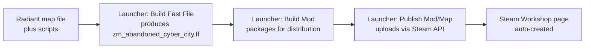

# 09 - Language and Publishing (High Level)

Quick reference doc. Skim-read for context, don't memorize.

## What Language Is the Map Written In?

BO3 custom maps are **not written in one language**. You touch three:

### 1. GSC / CSC - the main gameplay language

- **GSC** = GameScript (server-side). Handles round logic, perks, zombies, custom systems. 95% of your custom code.
- **CSC** = ClientScript (client-side). Same language, runs on each player's machine. HUD glue, local effects.
- **Syntax**: C-like. Curly braces, semicolons, if/while/for, functions. No classes.
- **Feel**: like writing JavaScript-meets-C with explicit threads.
- **Files**: `.gsc`, `.csc`. Plain text. Edit in VS Code.

Minimal example:

```gsc
#include scripts\shared\util_shared;
#include scripts\zm\_zm_utility;

main()
{
    level thread on_player_spawned();
}

on_player_spawned()
{
    level endon( "end_game" );
    while ( 1 )
    {
        level waittill( "connected", player );
        player thread give_welcome_bonus();
    }
}

give_welcome_bonus()
{
    self endon( "disconnect" );
    self.score += 500;
    self iprintln( "Welcome to Abandoned Cyber City" );
}
```

Key concepts:
- `self` = the entity the script is running on (usually a player).
- `level` = global game state.
- `thread` runs a function concurrently (like a coroutine, not a real thread).
- `endon("event")` kills the thread when the event fires.
- `waittill("event")` suspends until the event fires.
- `#include` pulls in another GSC file's functions.

As a SWE: if you're comfortable with JavaScript or C, you'll be productive in GSC inside a weekend. The learning curve is the **engine vocabulary** (what events exist, what callbacks hook where, which stock functions do what), not the language.

### 2. LUI - the UI layer

- **LUI** = Lua-based UI framework. Used for menus, HUD widgets, the eventual Cyberware skill-tree screen.
- Lua script + a declarative layout layer (similar in spirit to HTML/CSS).
- Steeper learning curve than GSC. We defer LUI work until we need a real UI (Phase 4 in `08_milestones.md`).

### 3. Asset definitions (GDT) - technically not a language, but you'll edit these

- **GDT** = Game Data Table. Plain text, key=value pairs.
- Defines weapons, materials, sounds, FX as structured data.
- Edited through APE (the Asset Property Editor), which is just a friendlier front-end on top of GDT files.

### The One-Sentence Summary

**You'll write GSC for ~95% of custom work, edit GDT files to define assets, and touch LUI only when the map needs a real UI.**

## How Does It Get on Steam?

Workshop publishing is handled by the **Launcher** tool that ships with the Mod Tools. There's no separate upload step, no manual Steam SDK dance.

### Flow



### Prerequisites

1. **Own BO3 on Steam.**
2. **BO3 Mod Tools installed** (free, via Steam Tools).
3. **Steam account logged in** with the Steam client running - Launcher uses your existing Steam session to authenticate.
4. **A working fast file** - your map must compile cleanly.
5. **A Workshop thumbnail image** - a 512x512 PNG. Not technically required; heavily recommended. Can be a placeholder.

### Publishing Steps (what the Launcher actually does for you)

1. In Launcher, select your map.
2. **File -> Publish Mod/Map** (or the equivalent "Publish to Steam Workshop" button).
3. Fill in: **Title**, **Description**, **Tags** (Zombies, Custom Map), **Thumbnail**, **Visibility** (Public / Friends / Private).
4. Click **Upload**.
5. Launcher packages your fast file + a small manifest, uploads via the Steam Workshop API, and creates a Workshop item under your Steam account.
6. Steam gives you a Workshop URL. Done.

### Updating vs. Publishing New

- **First publish**: creates a new Workshop item.
- **Update**: same "Publish" flow on the same map overwrites the existing Workshop item as a new version. Subscribers get the update automatically.
- **Versioning**: Steam doesn't expose version tags to players well. We'll manage semver in the Workshop description text and git tags.

### Visibility Modes

- **Public**: anyone can find, download, rate.
- **Friends-only**: your Steam friends see it in their friend Workshop listings.
- **Private / Hidden**: only people with the direct URL can subscribe. **Use this for early playtests.**

Our plan: ship the first "box room" as **Private**. Only a friend with the URL can see it. When we hit v1.0, flip to Public.

### Steam Workshop Page Anatomy (what players see)

- Thumbnail + title.
- Description (Markdown-ish; supports BBCode tags like `[b]`, `[url]`, `[img]`).
- Screenshot carousel (5-10 screenshots recommended at release).
- Tags.
- File size, subscriber count, rating.
- Comments section (players report bugs here; monitor it).

### Real Talk: What Can Go Wrong

- **Launcher can't find Steam session**: ensure Steam is running and logged in before launching Launcher.
- **Upload fails mid-upload**: usually network flakiness. Retry.
- **Workshop item shows "broken" on subscribers**: fast file compile error slipped through. Rebuild, republish.
- **Subscribed but map doesn't appear in zombies menu**: map wasn't properly registered in the mod; usually a Launcher zone source issue. Rebuild.
- **Rejected for TOS**: rare. Happens if assets obviously violate copyright (custom music from licensed tracks, etc.). Stock BO3 assets are fine.

### You Don't Need

- A separate Steam developer account.
- A fee.
- App IDs or Steamworks setup.
- Anyone's approval. Publishing is one-click.

## Summary for Skimmers

- **Language**: GSC (C-like) for gameplay, LUI (Lua) for UI, GDT (key/value text) for asset definitions.
- **Publish**: click a button in Launcher, Launcher handles Steam. Start with a Private Workshop item for testing, flip to Public at v1.0.
- **Iteration**: same button updates the same Workshop item. Subscribers auto-update.
