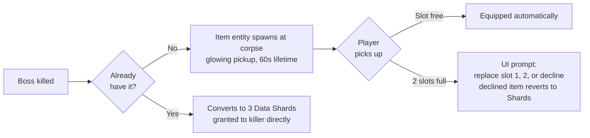

# 12 - Boss Items

Machin[a]-style randomized passive-buff items dropped on boss kills. Shape your build around what bosses give you; high variance, high reward.

## At a Glance

- **6 items** in the drop pool.
- **2 equipped slots** per player (cannot wear more).
- Drops from both **mini-boss** (50% chance) and **full boss** (guaranteed).
- **Duplicates** convert to 3 Data Shards.
- **No persistence across runs** - items are lost on death / run-end.

## Separate From Mega Bottles

**This doc covers the 6-item equippable pool only.** Bosses also drop a separate **Empty Mega Bottle** resource (guaranteed per player per boss kill) used to upgrade perks to their Mega variants. Mega Bottles do not take one of the 2 item slots and are not part of the pool described here. See [13_perks.md](13_perks.md#mega-bottles-system) for the Mega Bottle acquisition + persistence rules; per-perk Mega effects are under **Perk reference (base + Mega)** in the same doc.

## Drop Mechanics

- Drop chance:
  - **Juggernaut Host** (mini-boss, rounds 10, 20): **50% chance** to drop one item.
  - **Subroutine Core** (full boss, round 30+): **100% guaranteed** drop per boss kill.
  - With a 6-item pool, reaching round 50 yields roughly 4-5 drops (1 r10 + 1 r20 + 1 r30 + 1 r40 + 1 r50, with the mini-boss 50% RNG). You'll typically see 4 of 6 items by round 40, so **expect your 2 equipped to be a gradually-filled-and-swapped set**, not a fast "lucky combo" lock-in.
- Drop item is **random from the pool**. No weighting (uniform).
- Drop entity spawns at the boss corpse origin; anyone can pick up.
- Dropped but uncollected items despawn after **60 seconds** (long enough to finish the boss cleanup, short enough that you can't bank them indefinitely).

## Slot Model

Each player has 2 item slots (`slot_a`, `slot_b`). Items worn are **visible** via a small HUD indicator (Phase 4 LUI work).

You can **unequip** an item at any time via the Cyberware Kiosk (Spawn Plaza) - drops it on the ground for 30 seconds, giving you or a teammate a chance to pick it up.

You **cannot** swap between two equipped items' slots freely - slots are just organizational, effects don't care which slot.

## The 6 Items

### 1. Neural Boots (feet archetype)

- **Effect**: +20% movement speed while holding a primary weapon (not pistol, not melee alone).
- **Build fit**: Reflex / Mobility archetype. Pairs with the Shotgun Slug Round ability (close + fast = point-blank murder), with Phase Step Cyberware (distance covered per slide increases proportionally), and with the Tac-19 (get to crowds fast, then blast).
- **Counter-synergy**: Sniper builds don't care much. You're holding still to aim.
- **Stats anywhere**: flat +20% on the base move speed value, stacks multiplicatively with Cyberware Reflex Tier 1 (+10% sprint) for a ~32% combined sprint speed boost.

### 2. Overclocked Gauntlets (hands archetype)

- **Effect**: +15% reload speed, +15% weapon swap speed.
- **Build fit**: high-ammo-consumption weapons (Haymaker 12, Tac-19 with its mandatory between-shot recharge, AK-47 spam builds). Pairs with Coolant Flow SMG Overclock for a reload-speed monster (irrelevant in v1.0 since no SMGs but archetype-accurate).
- **Counter-synergy**: Snipers reload so rarely this is a meh pick for them. Still nets a small swap-speed benefit.

### 3. Targeting Visor (head archetype)

- **Effect**:
  - **HP bars** render over all zombies in view cone while aiming down sights.
  - **Elite enemies** highlighted through walls within 50m.
  - Does NOT show boss HP over the world (boss has a dedicated UI element).
- **Build fit**: snipers (you see exactly when an elite is about to die to your next shot), semi-auto ARs (trigger discipline becomes informed), coordinator role in 4p co-op ("shielded elite behind the door, 1200 HP").
- **Counter-synergy**: shotgun players rarely ADS; wasted on them unless paired with the Slug Round ability.

### 4. Kinetic Battery (back archetype)

- **Effect**: every 10 kills builds a charge. The next shot fired while charged deals **3x damage** and **auto-aims to the nearest enemy in view cone**. Charge persists through rounds until consumed.
- **Build fit**: any weapon with heavy single-shot payoff. FAL, Intervention, PaP L5 Locus - you one-tap bosses more often. Also great on Tac-19 (the auto-aim gives it the single-target punch it otherwise lacks).
- **Counter-synergy**: pistol or knife-only builds won't generate enough kills per round to cycle the charge meaningfully.
- **Tuning lever**: 10 kills can be raised to 15 in playtest if Battery feels runaway.

### 5. Ghost Shroud (chest archetype)

- **Effect**: on taking lethal damage, drop to 1 HP + **2 seconds of invulnerability + 50% movement speed** during the invuln. **Internal cooldown 90 seconds.**
- **Build fit**: survival builds. Stacks with **Jugger-Nog** (bigger HP pool delays when Shroud's lethal-save triggers; more generous clutch window) and **Aura Blast** perk (after Shroud's invuln ends, 3s enemy stun from Aura Blast covers your reposition).
- **Counter-synergy**: none - it's universally good.
- **Anti-exploit**: the cooldown is "internal to the player who owns the Shroud", not "since pickup". You can't unequip + re-equip to reset.

### 6. Payroll Ledger (implant archetype)

- **Effect**: **+10% Points** earned on any kill you contribute to. Applied after the 70/30 co-op split so the boost affects *your personal share*, not the base award everyone's sharing from.
- **Build fit**: long runs of any build. Pumps Points so you can afford multiple PaP L5 maxes + all 4 perks + Mule Kick + emergency Box rolls. Pairs especially well with Kinetic Battery (big kill streaks = big Ledger multiplier accumulation).
- **Counter-synergy**: none - it's universally applicable. Short runs (<round 15) won't see much difference.
- **Stacking rules**:
  - With **Double Points powerup**: *multiplicative*. Double Points doubles the base, Ledger adds +10% on top. Effective +120% during the powerup window.
  - With **Double Tap perk**: kills faster due to fire rate + damage, Ledger multiplies on more kills per minute. Compounds effectively.
  - With **Widow's Wine perk**: grenade kills still award base kill Points; Ledger applies +10% to those too. Grenade-heavy builds benefit.
  - With **another player's Ledger**: nope. Each player gets the +10% only on THEIR share.
- **Anti-exploit**:
  - +10% is applied to each player's **computed share**, not to the base award. Prevents the exploit of "tag for 1 damage, claim 30% * 1.10 of what the killer earned".
  - Integer floor-rounding on the bonus. A 4-Point share yields 4 × 1.10 = 4.4 → 4 Points (no bonus on tiny shares). Prevents the "let my teammate kill it to share-farm me" abuse.
- **Thematic note**: the ledger is a small neural implant that logs every bounty your brain registers. Corporate black-ops used them for payroll tracking. You scavenged one off a pre-collapse executive.

## Design Logic

### Why 2 slots out of 6

- A 2-slot inventory forces trade-offs. 6 items across 5 distinct build axes (mobility / reload / info / burst / survival / economy) means the 2 you wear say a lot about your build intent.
- 6 slots (= wear them all) would remove the decision.
- 2 slots also keeps the UX budget modest (only 2 HUD icons, no complex wardrobe screen).
- With 6 items in the pool and 2 slots, **there are C(6,2) = 15 possible equipped pairs** per run. Meaningful run-to-run combinatorial variance on top of drop RNG.

### Why random drops and not player choice

- RNG drops create run variance. Same pool, different runs get different builds.
- Forced choice would converge on the optimal item pair across players; random keeps build adaptation a skill in itself.
- Duplicate-to-Shards means even "useless" repeat drops contribute something (3 Shards = weapon tier upgrade cost).

### Why no persistence across runs

- This is a zombies map. Per-run resets are the genre norm. Persistence would break our explicit "no meta-progression" stance in [00_overview.md](00_overview.md).
- Mastery is measured in *pattern recognition across runs*, not inventory hoarding.

### Why full boss = guaranteed, mini-boss = 50%

- Full bosses (round 30+) take real time and coordination; 100% reward matches the commitment.
- Mini-bosses are earlier and easier; 50% keeps the round 10 / 20 loop interesting (sometimes you get an item, sometimes just Shards).
- Over a full 50-round run you'd see roughly **1 item at round 10, 1 at 20 (on average), 1 at 30, 1 at 40, 1 at 50 = 4-5 drops**. That fills both slots + starts generating duplicate-to-Shard conversions from round 30+. With 6 items in the pool, you'll rarely see all 6 unless you push past round 60.

## Stacking and Interaction Notes

- **Two-item combos** that are intentionally synergistic:
  - Boots + Battery: run fast, charge the shot, delete a single target.
  - Visor + Shroud: tank a mistake, know when the next mistake is coming.
  - Gauntlets + Boots: best for Tac-19 / Haymaker sustained spray builds.
  - Ledger + Battery: economy monster (big kills = big Points via Ledger bonus + Battery burst proc).
  - Ledger + Shroud: long-survival econ. You live forever, you get paid on every kill.
- **Two-item combos** that feel redundant (info):
  - Visor + Shroud feels redundant on paper but actually covers different axes (info vs panic button).
  - Ledger + Gauntlets is the one "weakest pairing" (both are passive support; nothing actively powerful), but even that is fine for a careful pure-economy build.
  - There's no pairing that's actually bad - all 6 items are universally useful at some level.

## Co-op Notes

- Each player has their own 2-slot inventory.
- Items are per-player (boss drop is picked up by one player, not team-wide).
- In 4p co-op, multiple Shrouds are possible - 4 players with Shroud + Jugger-Nog + Aura Blast on cooldown = extremely forgiving survival layer during the same 120s Aura Blast cooldown window. **Explicitly fine** for 4p - co-op is allowed to be easier.

## Stock-Override Concerns

- Stock BO3 already has some boss drops (e.g. max-ammo powerups on mini-boss kill). We keep those behaviors untouched - item drops are **additional**, not replacements.

## Implementation Status

Phase 4 authoring. Module stub at [`scripts/zm/zm_abandoned_cyber_city/_acc_boss_items.gsc`](../scripts/zm/zm_abandoned_cyber_city/_acc_boss_items.gsc). All 6 items defined as structs with their effect functions stubbed. The stubs log behavior so you can see drops firing in console before the effects are wired up. The Payroll Ledger bonus is the one "already wired" item - its +10% Points multiplier is applied in [`_acc_points.gsc::award_player`](../scripts/zm/zm_abandoned_cyber_city/_acc_points.gsc).

## Tuning Levers (for playtest)

If items feel broken:

- Knock Kinetic Battery's multiplier from 3x to 2x (or raise kill-cost from 10 to 15).
- Make Ghost Shroud cooldown 120s instead of 90s.
- Reduce Neural Boots to +15%.
- Reduce Payroll Ledger to +5% (or cap its benefit at body-shot Points only, letting headshot Points bypass).

If items feel underwhelming:

- Bump Gauntlets to +25% reload speed.
- Add auto-aim radius to Battery.
- Extend Shroud invuln from 2s to 3s.
- Bump Ledger to +15%.

All in constants at the top of `_acc_boss_items.gsc` and `_acc_points.gsc` (for the Ledger bonus).

## Out of Scope for v1.0

- **Item upgrades.** No "Kinetic Battery +1" tier system. Flat items; richness comes from combinations.
- **Item sets.** No bonus for wearing 2 related items ("full mobility set: +5% extra"). Kept simple.
- **Trading items between players.** Cannot give your Shroud to a teammate mid-run. Drop-unequip-pickup is the only hand-off path.
- **Permanent item unlocks.** No "once you've picked up all 5 across all your runs" unlock.
