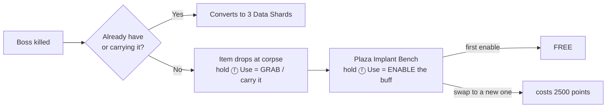

# 12 - Boss Items

Machin[a]-style randomized passive-buff items dropped on boss kills. Shape your build around what bosses give you; high variance, high reward.

## At a Glance

- **6 items** in the drop pool (the two tactical grenades, Li'l Arnie + Monkey Bomb, moved to mystery-box rolls 2026-06-24 — see the note under "The 6 items").
- **2 active items** per player (two Plaza bench pads = Slot 1 / Slot 2; filling an empty slot is FREE, replacing a full slot = 2500 pts).
- Drops from both **mini-boss** (50% chance) and **full boss** (guaranteed).
- **Regular zombies** also have a tiny drop chance (user 2026-06-27): every non-boss zombie death independently rolls **0.4%** to drop a random pool item (free-for-all world pickup) **and** **0.4%** to grant **one Empty Mega Bottle to the killer only** (direct grant, not shared). Bosses/mini-bosses are excluded (they keep their guaranteed drops). Live dvars: `acc_zombie_item_drop_chance` / `acc_zombie_bottle_drop_chance` (default `0.004`). Code: `_acc_boss_items::on_zombie_death_drop`.
- **Duplicates** convert to 3 Data Shards.
- **Lost when you DIE OUT** (user 2026-06-26): bleeding out (a real death, not a revived down) wipes **both** implant slots — their buffs go with them, and you respawn implant-less and must find + re-implant new ones. A revived down keeps your implants. Implemented in `_acc_boss_items::lose_implants_on_bleed_out` (per-player stock `"bled_out"` notify). Also no persistence across runs (run-end resets everything).

## Separate From Mega Bottles

**This doc covers the 8-item implantable pool only.** Bosses also drop a separate **Empty Mega Bottle** resource (guaranteed per player per boss kill) used to upgrade perks to their Mega variants. Mega Bottles do not take the active-item slot and are not part of the pool described here. See [13_perks.md](13_perks.md#mega-bottles-system) for the Mega Bottle acquisition + persistence rules; per-perk Mega effects are under **Perk reference (base + Mega)** in the same doc.

## Drop Mechanics

> **v3 (2026-06-23): bench-gated, TWO active slots.** Picking an item up only
> CARRIES it; you ENABLE its buff at the Plaza Implant Bench, which is now **two
> pads** (Slot 1 / Slot 2 — you pick which slot by which pad you use). Filling an
> EMPTY slot is **free**; once both slots are full, implanting a third **replaces
> that pad's slot for 2500 pts**. So any empty slot is always free ("first two
> free"). A sound plays on each implant. The previous single-slot v2 and the
> original 6 items are superseded (legacy section kept below for design history).

### Acquisition flow
1. **Bosses drop items.** A random pool item drops at the corpse (Brutus / Glitch Stalker **50%**, Subroutine Core **100%**). Hold **ⓕ Use** to **grab** it — this only **carries** it (HUD: `CARRYING <item>`); the buff is NOT active yet. Uncollected drops despawn after **60 s**. Grabbing an item you already carry/have → **+3 Data Shards**. Grabbing a NEW item while already carrying a different (un-enabled) one **drops the old one back to the ground** (re-grabbable) — it's never lost. (An already-implanted item stays implanted.)
2. **Enable it at the Plaza Implant Bench** — now in the gated **Implant Lab** side-room off the Plaza spawn (buy the tight-entrance door, `enter_implant`, **1500**, to reach it; 2026-06-26). **Two pads**, Slot 1 and Slot 2. Hold **ⓕ Use** on a pad to **implant** the carried item into that slot → buff goes active (HUD: `IMPLANT 1 <item>` / `IMPLANT 2 <item>`). A confirmation sound plays. The implant is on the player; a sound plays each time.
3. **Two active items at a time.** Implanting into an **empty** slot is **FREE** (so your first two are free). Once **both** slots are full, using a pad **replaces that pad's slot** for **2500 points** (removing that slot's previous buff) — you choose which to lose by which pad you use. Carrying a new item does nothing until you bench it.
   - **Two grenade items (Li'l Arnie + Monkey Bomb)** both want the single tactical slot — the engine has only one. They're allowed in two slots, but the **last one implanted is the grenade you actually throw** ("last one wins"); removing it hands the tactical back to the other. The HUD shows both as implanted.

### The 6 items

> **The two tactical-grenade items moved OUT of this pool (user 2026-06-24).** Li'l Arnie (Octobomb) and
> Monkey Bomb (Cymbal Monkey) are no longer boss drops — they are now rare **mystery-box** tactical pre-rolls
> (Monkey Bomb **1%** / Li'l Arnie **0.5%**). See
> [`_acc_map_randomizer.gsc::acc_box_tactical_preroll`](../scripts/zm/zm_abandoned_cyber_city/_acc_map_randomizer.gsc)
> + `acc_boss_items::watch_box_tactical_grab`. The pool is back to **6** items (IDs renumbered).

| ID | Item | Model | Buff | How to use |
|----|------|-------|------|-----------|
| 1 | **Gas Tank** | nitrous tank | **Nitro burst** — +100% move speed for 5 s | **Double-tap the Sprint button** to trigger. Runs the full 5 s (uncancellable), then a **60 s** lockout — can't re-trigger until fully recharged. A **NITRO bar** on the left HUD shows the charge: full **cyan** = ready; it drains to empty over the burst, then refills **orange** over the 60 s regen. |
| 2 | **Loot Stash** | gold brick (`zombietron_gold_brick`) | **+10 pts/kill, +15/headshot** — rising to **+15 / +25 with Double Points** (additive DP boost, not ×2); a **Nuke pays the holder 500** (1000 w/ Double Points) | Passive, KILLER only. FLAT bonus; 15/25 aren't multiples of 10 so they're **banked** to net exact (user 2026-06-26). Logic in `_acc_points` (`award_killer_with_ledger` + `ledger_nuke_watch`). |
| 3 | **Repair Kit** | carpenter icon | **+10 HP/sec** passive health regen | Passive (caps at max health; pauses while downed). |
| 4 | **Rocket Shield** | rocket shield | **Mobility** — +35% speed while sliding, a forward lunge on slide-start, **2× jump height** | Passive — just slide and jump. |
| 5 | **Phase Serum** | perk-bottle vial | **Cloak — Glitch Stalker ONLY** — the Glitch Stalker can't see/target you (including the Glitch Purge glitches — they ignore a cloaked carrier; user 2026-06-24); the regular horde still attacks | Passive. (Glitch-only by design — a full horde cloak made you invulnerable.) |
| 6 | **Boots** | boots prop (`p7_boots_safehouse_01`) | **Mobility** — **+8% move speed everywhere**. (No longer cancels the trench slow — user 2026-06-21; only the Exo Suit does that, docs/47.) | Passive. (user 2026-06-18) |
| 7 | **Lucky Clover** | X2 orb (`p7_zm_power_up_double_points` — placeholder; the X2 reads as "double luck") | **Drop luck** — while implanted, YOUR kills double the zombie random-item + Mega-Bottle drop chance (0.4%→0.8%) **and** add a **0.5%/kill** chance to drop a random power-up (full_ammo / insta_kill / double_points / nuke), bypassing the per-round cap. Works in Paradise. | Passive, KILLER only. Per-player (each co-op player runs their own). Live dvars `acc_clover_mult` / `acc_clover_powerup_chance`. (user 2026-06-27) |

All IDs/names show `id - name` in the pickup prompt, the messages, and the HUD. Models are link-verified (errorlog-clean) and per-item floor-lifted (`model_z`) so they don't sink in.

### Caveats / honest framing
- **Granting the Octobomb / Cymbal Monkey works via a CSV row only** (no `.zone` weapon line). Both weapon defs already ship in `zm_levelcommon` (the common fastfile every usermap loads — assetlist lines 6175/6225), so a row in `gamedata/weapons/zm/zm_levelcommon_weapons.csv` makes `is_weapon_included` true and `GetWeapon("octobomb"/"cymbal_monkey")` resolves at runtime. **Do NOT add `weapon,<name>_zm` to the `.zone`** — that forces a re-pack from a GDT source not on disk and errors `Unable to load weapon` (that was an earlier self-inflicted build error, since corrected).
- **The thrown grenade's BEHAVIOR (attract / spore / explode) has to be manually activated — the HACK (2026-06-18).** `GiveWeapon` alone makes the grenade *throwable*, but the thrown projectile "just sits there": the attract/explode logic lives in a per-player watcher thread (`player_handle_octobomb` / `player_handle_cymbal_monkey`) that stock starts ONLY from `zm_weapons::weapon_give`, which fires the registered `level.zombie_weapons_callbacks[weapon]`. Our boss-item grant uses a **raw** `GiveWeapon`, which skips that path, so the watcher never starts. Fix: `give_octobomb` / `give_monkey_bomb` now dispatch the callback themselves — `self thread [[ level.zombie_weapons_callbacks[w] ]]()` — **verbatim the stock dispatch at `_zm_weapons.gsc:2791-2793`**. The watchers self-guard (notify/endon), so the revive re-grant is safe; no `#using` or clientfield needed (it's a `level` field). The SoE/DLC3 **spore / glow / lightning FX are absent from this install** (in no fastfile here) so the visuals won't render, but the gameplay (attract + damage + detonate) is fully server-side and works.
- **Rocket Shield "slide lasts 1.5× longer" isn't literally possible** — BO3 exposes no per-player slide-duration lever. Shipped as a **forward distance lunge** on slide-start (slide carries you farther) + the +35% slide speed. The **2× jump height** is a per-player upward velocity **multiply** (×1.42 → apex ~2×, since height ∝ velocity²; NOT the global `jump_height` dvar, which is all-players + persists).
- **Detection uses the right engine builtin per trigger** (the `*_begin` notifies are MP-only, so we poll): Gas Tank double-tap reads **`SprintButtonPressed()`** — the raw sprint-KEY edge — because `IsSprinting()` latches continuously true under ZM auto-sprint and so can never register the second tap (that was the "Gas Tank does nothing" bug). Rocket Shield slide reads **`IsSliding()`** (the dedicated slide-state builtin) because `GetStance()` only ever returns stand/crouch/prone — never a slide value (that was the "slide doesn't work" bug). Jump + lunge still read `IsOnGround`/velocity. Tune the feel with the dvars below.

### Tuning dvars (live, no rebuild)
| Dvar | Default | Effect |
|------|---------|--------|
| `acc_boss_item_chance_mini` | **1.0 (TEMP)** | mini-boss (Brutus / Glitch Stalker) drop chance. **Design value is 0.5** — currently forced to 100% for testing (2026-06-18); set `0.5` to restore. |
| `acc_boss_item_chance_full` | 1.0 | full-boss (Subroutine Core) drop chance |
| `acc_drop_model_z` | 24 | global fallback floor-lift for drop models (per-item `model_z` overrides) |
| `acc_bench_off_x` | 0 | bench X offset from the Plaza spawn struct (0 = centred on the spawn X, behind the spawns) |
| `acc_bench_off_y` | -350 | bench Y offset from the spawn struct — pushes the pair SOUTH to ~59u in front of the south wall (against the back wall, out of the open middle; user 2026-06-24) |
| `acc_bench_off_z` | -35 | bench Z offset from the Plaza spawn struct (it sat too high; 2026-06-18) |
| `acc_bench_pad_sep` | 80 | half-distance between the two bench pads along **X** (they sit at ±this, 160 apart, a row parallel to the south wall) |
| `acc_bench_pad_radius` | 40 | each bench pad's use-trigger radius (small so the two pad volumes don't overlap) |
| `acc_move_scale_cap` | 2.2 | hard ceiling on the total move-speed multiplier (two mobility items can now stack) |
| `acc_gas_dtap_ms` | 350 | Gas Tank double-tap-sprint window (ms) |
| `acc_gas_burst_mult` | 1.50 | Gas Tank nitro burst move-speed multiplier (+50%) |
| `acc_gas_regen_sec` | 60 | Gas Tank cooldown/regen seconds after the 5 s burst (= NITRO bar refill time) |
| `acc_rocket_slide_mult` | 1.35 | Rocket Shield slide move-speed multiplier (+35%) |
| `acc_mega_flopper_slide_mult` | 1.35 | PhD Flopper Mega slide move-speed multiplier (+35%, slide-gated) |
| `acc_boots_mult` | 1.08 | Boots item move-speed multiplier (+8% everywhere; no longer negates the trench slow, user 2026-06-21) |
| `acc_arnie_scale` | 0.33 | Li'l Arnie (octobomb) visual scale — 1.0 = stock size |
| `acc_rocket_slide_kick` | 200 | Rocket Shield slide-start forward lunge |
| `acc_rocket_jump_mult` | 1.42 | Rocket Shield jump velocity multiply (~2× apex height; height ∝ velocity²) |

### Implementation (all in `_acc_boss_items.gsc` unless noted)
- **State:** `player.acc_carried_item` (picked up, no buff) + `player.acc_equipped_items` (a **fixed 2-element array** = the single source of truth; index 0 = Slot 1 / Pad 1, index 1 = Slot 2 / Pad 2; `""` = empty slot) + `player.acc_tactical_owner` (which grenade item owns the single tactical slot — last-one-wins). `ACC_ITEM_SLOTS_PER_PLAYER = 2`. The old scalar `acc_active_item` and the `acc_bench_first_done` bool are **gone** — "is it implanted" scans both slots via `player_has_item()`, and "free" is simply `slot_is_empty(slot)`.
- **Bench (two pads):** `spawn_bench()` polls the `player_respawn_point` struct then spawns **two** pads via `spawn_bench_pad(org, slot)` (each a `script_model` + `trigger_radius_use`, `acc_bench_slot` = fixed target index). The pair sits **against the Plaza south wall** (interior face y=-540), **behind the spawn points** and out of the open central training area (user 2026-06-24, was in the wide-open middle), laid **side by side along X** (`acc_bench_pad_sep` 80 → 160 apart, `acc_bench_pad_radius` 40) so their use-volumes don't overlap. `bench_use_loop()` reads its pad's slot: `equip_slot(player, slot, carried)` (which `unequip_slot`s the old occupant first), free into an empty slot or `ACC_BENCH_SWAP_COST` (2500) to replace a full one, plays `acc_item_implant`, and clears the carry.
- **Tactical "last one wins":** `apply_arnie_octobomb`/`apply_monkey_bomb` set `acc_tactical_owner`; the `*_regrant_on_spawn` threads regrant only the owner; each `remove_*` hands the tactical to the surviving grenade item (or clears it). Prevents the two regrant threads from fighting and the unequip from disarming a co-resident grenade.
- **Implant sound:** `acc_item_implant` alias (`sound/aliases/acc_audio.csv`), 2D wav at `sound_assets/acc/fx/item_implant.wav` (a UI-equip SFX converted to 48k/16-bit mono via `tools/convert_wav_48k_mono.ps1`). Played **once at the bench commit** (never in an `apply_*`, or it would re-fire on every respawn-regrant). A new wav needs a **game-closed build** so the `/MIR` sound sync can purge the (otherwise file-locked) `CachedBanks` and the linker rebuilds the `.sabs`/`.sabl` bank.
- **Move-speed clamp:** two mobility items can now stack, so `_acc_utility::recompute_move_speed` caps the total at `acc_move_scale_cap` (2.2) to prevent clip-through-geometry / nav desync.
- **Cloak (Phase Serum):** `apply_arnie_cloak` sets a custom `player.acc_cloak_glitch` flag — deliberately **NOT** `zm_utility::increment_ignoreme` (that hid you from the *entire* horde = invulnerable, the rejected bug). The Glitch Stalker honors it by setting **`host.closest_player_override = &glitch_pick_uncloaked_target`** on every spawn: stock `get_closest_valid_player` consults this per-AI picker FIRST (`_zm_utility.gsc:1472`) to derive BOTH the Stalker's movement target (`favoriteenemy`) and its melee target (`enemy`), so the cloak now hides you from its **whole behavior** — follow + melee + blink + charge — not just the two blink/charge calls (the old scope, which let it still walk up and hit you = the "Phase Serum doesn't work" bug). The picker strips cloaked players then delegates to the stock factory target picker (via the `level.closest_player_override` pointer) so everyone else is targeted exactly as stock; the regular horde always sees you. All players cloaked → the Stalker has no target and idles.
- **Speed buffs** (nitro burst, slide +15%) ride `_acc_utility::recompute_move_speed`; regen + jump/slide impulses are self-contained polling threads.
- **Gas Tank NITRO bar:** `gas_bar_loop` (threaded on equip, ended on `acc_gas_tank_removed`) reuses the verified `hud::createBar` widget (left HUD stack, y≈108/122). `gas_tank_burst` stamps `acc_gas_burst_start`; `gas_charge_frac` derives the 0..1 fill from elapsed time (drain over `ACC_GAS_BURST_SEC`, refill over `ACC_GAS_REGEN_SEC`), polled at 20 Hz so it glides. Created/destroyed with the item (single-active).

## The 6 Items (LEGACY — superseded by the v2 table above)

> **LEGACY (pre-2026-06-17).** The detailed designs below describe the *original*
> 6 items. The live pool was redesigned model-first (see the **Item IDs + buffs**
> table above) — Gas Tank / Li'l Arnie / Teddy Bear / Repair Kit / Rocket Shield /
> Monkey Bomb. Items 1-3 reuse three of the effects described below (move speed /
> charged-shot / +points); the rest are superseded by the new self-contained buffs.
> This section is kept for the effect-design rationale pending a full rewrite.

### 1. Neural Boots (feet archetype)

- **Effect**: +20% movement speed while holding a primary weapon (not pistol, not melee alone).
- **Build fit**: Reflex / Mobility archetype. Pairs with the Shotgun Slug Round ability (close + fast = point-blank murder), with Phase Step Cyberware (distance covered per slide increases proportionally), and with the Tac-19 (get to crowds fast, then blast).
- **Counter-synergy**: Sniper builds don't care much. You're holding still to aim.
- **Stats anywhere**: flat +20% on the base move speed value, stacks multiplicatively with Cyberware Reflex Tier 1 (+10% sprint) for a ~32% combined sprint speed boost.

### 2. Overclocked Gauntlets (hands archetype)

- **Effect**: +15% reload speed, +15% weapon swap speed.
- **Build fit**: high-ammo-consumption weapons (Haymaker 12, Tac-19 with its mandatory between-shot recharge, AK-47 spam builds). Pairs with Coolant Flow SMG Overclock for a reload-speed monster (irrelevant in v1.0 since no SMGs but archetype-accurate).
- **Counter-synergy**: Snipers reload so rarely this is a meh pick for them. Still nets a small swap-speed benefit.

### 3. Targeting Visor (head archetype)

- **Effect**:
  - **HP bars** render over all zombies in view cone while aiming down sights.
  - **Elite enemies** highlighted through walls within 50m.
  - Does NOT show boss HP over the world (boss has a dedicated UI element).
- **Build fit**: snipers (you see exactly when an elite is about to die to your next shot), semi-auto ARs (trigger discipline becomes informed), coordinator role in 4p co-op ("shielded elite behind the door, 1200 HP").
- **Counter-synergy**: shotgun players rarely ADS; wasted on them unless paired with the Slug Round ability.

### 4. Kinetic Battery (back archetype)

- **Effect**: every 10 kills builds a charge. The next shot fired while charged deals **3x damage** and **auto-aims to the nearest enemy in view cone**. Charge persists through rounds until consumed.
- **Build fit**: any weapon with heavy single-shot payoff. FAL, Intervention, PaP L5 Locus - you one-tap bosses more often. Also great on Tac-19 (the auto-aim gives it the single-target punch it otherwise lacks).
- **Counter-synergy**: pistol or knife-only builds won't generate enough kills per round to cycle the charge meaningfully.
- **Tuning lever**: 10 kills can be raised to 15 in playtest if Battery feels runaway.

### 5. Ghost Shroud (chest archetype)

- **Effect**: on taking lethal damage, drop to 1 HP + **2 seconds of invulnerability + 50% movement speed** during the invuln. **Internal cooldown 90 seconds.**
- **Build fit**: survival builds. Stacks with **Jugger-Nog** (bigger HP pool delays when Shroud's lethal-save triggers; more generous clutch window) and **PhD Flopper** perk (after Shroud's invuln ends, a dive-to-prone nova explosion clears nearby enemies to cover your reposition).
- **Counter-synergy**: none - it's universally good.
- **Anti-exploit**: the cooldown is "internal to the player who owns the Shroud", not "since pickup". You can't unequip + re-equip to reset.

### 6. Payroll Ledger (implant archetype)

- **Effect**: a **flat Points bonus to the KILLER per kill — +10 regular / +15 headshot**, rising to **+15 / +25 while Double Points is active** (the Double-Points boost is an *additive* +5 / +10, NOT the base's ×2). Killer only (not split to assists). *(History: started as +10%, but the stock round-to-10 swallowed it; flat since 2026-06-23, DP-additive + banked since 2026-06-26.)*
- **Build fit**: long runs of any build. Pumps Points so you can afford multiple PaP L5 maxes + all 4 perks + Mule Kick + emergency Box rolls. Pairs especially well with Kinetic Battery (big kill streaks = more flat bonuses banked).
- **Counter-synergy**: none - it's universally applicable. Short runs (<round 15) won't see much difference.
- **Stacking rules**:
  - With **Double Points powerup**: the per-kill bonus rises to **+15 (regular) / +25 (headshot)** — an additive bump, on top of the base that Double Points separately doubles.
  - With **Double Tap perk**: kills faster due to fire rate + damage, so more per-kill bonuses banked per minute. Compounds effectively.
  - With **Widow's Wine perk**: grenade kills still award base kill Points; the flat Ledger bonus applies to those too. Grenade-heavy builds benefit.
  - With **another player's Ledger**: nope. Each Ledger pays only its own holder's kills.
- **Money granularity (banking)**:
  - The bonus is added to the killer's **own** award only (not the co-op share pool), so a "tag for 1 damage" assist never earns it.
  - Zombies money only moves in multiples of 10 (the stock score API rounds every award UP to 10 - see [19_stock_api_verification.md](19_stock_api_verification.md)). Because +15 / +25 aren't multiples of 10, `award_killer_with_ledger` **banks** the sub-10 remainder on the killer and flushes it on a later kill, so the **net** payout is exactly +15 / +25 even though the on-screen floater alternates +10 / +20.
- **Thematic note**: the ledger is a small neural implant that logs every bounty your brain registers. Corporate black-ops used them for payroll tracking. You scavenged one off a pre-collapse executive.

## Design Logic

### Why 2 slots out of 6

- A 2-slot inventory forces trade-offs. 6 items across 5 distinct build axes (mobility / reload / info / burst / survival / economy) means the 2 you wear say a lot about your build intent.
- 6 slots (= wear them all) would remove the decision.
- 2 slots also keeps the UX budget modest (only 2 HUD icons, no complex wardrobe screen).
- With 6 items in the pool and 2 slots, **there are C(6,2) = 15 possible equipped pairs** per run. Meaningful run-to-run combinatorial variance on top of drop RNG.

### Why random drops and not player choice

- RNG drops create run variance. Same pool, different runs get different builds.
- Forced choice would converge on the optimal item pair across players; random keeps build adaptation a skill in itself.
- Duplicate-to-Shards means even "useless" repeat drops contribute something (3 Shards = weapon tier upgrade cost).

### Why no persistence across runs

- This is a zombies map. Per-run resets are the genre norm. Persistence would break our explicit "no meta-progression" stance in [00_overview.md](00_overview.md).
- Mastery is measured in *pattern recognition across runs*, not inventory hoarding.

### Why full boss = guaranteed, mini-boss = 50%

- Full bosses (round 30+) take real time and coordination; 100% reward matches the commitment.
- Mini-bosses are earlier and easier; 50% keeps the round 10 / 20 loop interesting (sometimes you get an item, sometimes just Shards).
- Over a full 50-round run you'd see roughly **1 item at round 10, 1 at 20 (on average), 1 at 30, 1 at 40, 1 at 50 = 4-5 drops**. That fills both slots + starts generating duplicate-to-Shard conversions from round 30+. With 6 items in the pool, you'll rarely see all 6 unless you push past round 60.

## Stacking and Interaction Notes

- **Two-item combos** that are intentionally synergistic:
  - Boots + Battery: run fast, charge the shot, delete a single target.
  - Visor + Shroud: tank a mistake, know when the next mistake is coming.
  - Gauntlets + Boots: best for Tac-19 / Haymaker sustained spray builds.
  - Ledger + Battery: economy monster (big kills = big Points via Ledger bonus + Battery burst proc).
  - Ledger + Shroud: long-survival econ. You live forever, you get paid on every kill.
- **Two-item combos** that feel redundant (info):
  - Visor + Shroud feels redundant on paper but actually covers different axes (info vs panic button).
  - Ledger + Gauntlets is the one "weakest pairing" (both are passive support; nothing actively powerful), but even that is fine for a careful pure-economy build.
  - There's no pairing that's actually bad - all 6 items are universally useful at some level.

## Co-op Notes

- Each player has their own 2-slot inventory.
- Items are per-player (boss drop is picked up by one player, not team-wide).
- In 4p co-op, multiple Shrouds are possible - 4 players with Shroud + Jugger-Nog + PhD Flopper = extremely forgiving survival layer, since each player's dive-to-prone nova explosion clears nearby enemies right after their Shroud save. **Explicitly fine** for 4p - co-op is allowed to be easier.

## Stock-Override Concerns

- Stock BO3 already has some boss drops (e.g. max-ammo powerups on mini-boss kill). We keep those behaviors untouched - item drops are **additional**, not replacements.

## Implementation Status

Phase 4 authoring. Module stub at [`scripts/zm/zm_abandoned_cyber_city/_acc_boss_items.gsc`](../scripts/zm/zm_abandoned_cyber_city/_acc_boss_items.gsc). All 6 items defined as structs with their effect functions stubbed. The stubs log behavior so you can see drops firing in console before the effects are wired up. The Payroll Ledger bonus is the one "already wired" item - its +10% Points multiplier is applied in [`_acc_points.gsc::award_player`](../scripts/zm/zm_abandoned_cyber_city/_acc_points.gsc).

## Tuning Levers (for playtest)

If items feel broken:

- Knock Kinetic Battery's multiplier from 3x to 2x (or raise kill-cost from 10 to 15).
- Make Ghost Shroud cooldown 120s instead of 90s.
- Reduce Neural Boots to +15%.
- Lower the Loot Stash / Payroll Ledger per-kill bonus (`ACC_LEDGER_KILL`/`_DP`, `ACC_LEDGER_HEADSHOT`/`_DP` in `_acc_points.gsc`).

If items feel underwhelming:

- Bump Gauntlets to +25% reload speed.
- Add auto-aim radius to Battery.
- Extend Shroud invuln from 2s to 3s.
- Bump Ledger to +15%.

All in constants at the top of `_acc_boss_items.gsc` and `_acc_points.gsc` (for the Ledger bonus).

## Out of Scope for v1.0

- **Item upgrades.** No "Kinetic Battery +1" tier system. Flat items; richness comes from combinations.
- **Item sets.** No bonus for wearing 2 related items ("full mobility set: +5% extra"). Kept simple.
- **Trading items between players.** Cannot give your Shroud to a teammate mid-run. Drop-unequip-pickup is the only hand-off path.
- **Permanent item unlocks.** No "once you've picked up all 5 across all your runs" unlock.
