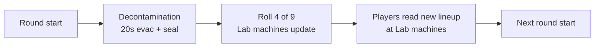

# 13 - Perks

Full roster, costs, **base + Mega** descriptions (table + prose), per-slot randomization, stacking behavior, and the baseline player-HP / zombie-damage model.

## Player HP Baseline

- **Without Jugger-Nog**: player dies in **3 zombie melee hits**.
- **With Jugger-Nog**: player dies in **6 zombie melee hits**.

These are the authoritative tuning targets. Player max HP and zombie melee damage values in the GDT are chosen to hit these numbers; if stock BO3 values drift, we tune to preserve the 3 / 6 rule.

## Roster (9 perks)

Six stock BO3 perks (tuned) + three custom. **No 4-perk cap in this map** — players can equip all 9 simultaneously if they can afford them. This is a deliberate deviation from stock BO3 to match our "systems stack" design language.

| # | Perk | Cost | Base (what it does) | Mega name | Mega (what the upgrade adds) |
|---:|---|---:|---|---|---|
| 1 | **Jugger-Nog** | 4,000 | Doubles max HP so you take **6** zombie melee hits to die instead of **3** (authoritative survivability perk). | **Ultimate Tank** | **+1** extra hit vs melee (7 total); **immune** to Subroutine Core phase debuffs that disable power/perks for others (see details). |
| 2 | **Quick Revive** | 2,500 | **Much faster** teammate revives; **+30% faster** HP regen after damage; solo keeps **one self-revive** per run. | **Savior** | Revive time drops to **~35%** of stock; after any revive, **reviver + revived** get **+15% move speed** for **5s**. |
| 3 | **Speed Cola** | 3,500 | **+50%** reload; **~40%** shorter perk-drink animation; **~30%** faster weapon + equipment swap. | **Sleight of Hand Expert** | **+65%** reload (beats base); faster **grenade throw/cook**; with Gauntlets → ~**89%** total reload reduction. |
| 4 | **Double Tap 2.0** | 2,000 | **+33%** fire rate, **+3%** damage (stock DT2 formula). | **Gun Slinger** | **+50%** fire rate (over stock +33%); keeps **+3%** damage; insane with Stabilizer + PaP. |
| 5 | **Stamin-Up** | 2,000 | **+10%** move speed; **longer** sprint bar (**not** unlimited — ~**2×** stock duration). | **The Flash** | **Unlimited** sprint; **+10%** walk, **+12%** sprint; stacks to **~+48%** sprint with Boots + Reflex. |
| 6 | **Mule Kick** | 3,000 | **Third primary** weapon slot; **3,000** pts (cheaper than stock 4k). | **The Armory** | **+35%** ammo per gun; **2×** lethal + **2×** tactical carry (Frags/EMPs); still 3 primaries. |
| 7 | **Deadshot** | 3,500 | **×1.5** headshot damage; **ADS auto-aim** to head on regulars/elites (**off** vs bosses); ADS-only. | **American Sniper** | **×2** headshot (vs ×1.5 base); **zero recoil**; strongest damage Mega; stacks with our 2×/3× rules. |
| 8 | **Widow's Wine** | 4,000 | Spider **webs** on grenades + melee; melee hit **defense**; **+50%** frag dmg/**+25%** radius; **+50%** EMP stun/**+25%** radius. | **Spiderman** | Spider grenades **one-shot** regular zombies; **6** max grenades (was 4); keeps web melee + dmg boosts. |
| 9 | **Aura Blast** | 2,500 | **Active**: **400u** shockwave, **3s** stun, **120s** CD; boss **immune**; see enemy-type table in details. | **Mega Man** | **800u** radius; **60s** CD; **2 charges** before full recharge. |

**Sources (stock vs custom):** Perks **1–6** are stock BO3 machines (several retuned — costs/effects in table). **7** Deadshot is custom / BO1-style. **8** Widow’s Wine is stock behavior **plus** our grenade damage/radius boosts. **9** Aura Blast is fully custom.

Buying all 9 = **27,500 Points**. Hitting that by round ~25 is possible but requires dedicated economy play (Payroll Ledger boss item + Double Tap kills + high-round headshot farm).

The table above is a **complete at-a-glance** summary (base + Mega). Below, **[Perk reference (base + Mega)](#perk-reference-base--mega)** gives **full paragraphs** you can read start-to-finish, then **Mechanics** for exact numbers. **How** to acquire Mega (bottles, Lab machine, persistence) is in **[Mega Bottles (system)](#mega-bottles-system)**.

## No-Perk-Limit Rule

- The stock BO3 4-perk cap is explicitly **removed** in this map.
- All 9 perks can stack on a single player.
- **Implementation**: override `_zm_perks` slot-limit check at init. See `_acc_perks.gsc` (Phase 3 module, planned).
- **Co-op**: same rule; each player can hold all 9.

### Why remove the cap

- Stock BO3's 4-perk cap is a balance decision Treyarch made to force choice. We're deliberately making a different trade: with no cap, the *choice* becomes **what to buy first** rather than what to forego. A round-10 player can afford ~2-3 perks; a round-30 player can afford most. Order and prioritization matter, not a fixed ceiling.
- Our other systems (Cyberware, Tier, Overclocks, Boss Items) already provide the decision tension. Another forced-choice layer from a perk cap would be redundant.
- It supports the "systems stack" design — the map wants layered progression to be visible to players.

## Perk reference (base + Mega)

Read **top to bottom** for full prose on every perk. Each entry has a **Base** description (what you buy with Points), a **Mega** description (what you unlock with an **Empty Mega Bottle** at a Lab machine when that perk is on rotation — no extra Points), then **Mechanics** with numbers and stacking. Bottle acquisition, persistence, and UI: [Mega Bottles (system)](#mega-bottles-system).

### 1. Jugger-Nog — 4,000 Points

**Base (full description).** Jugger-Nog is the map’s core **survivability** perk. It increases your maximum health so that, against **normal zombie melee**, you die in **six** hits instead of **three** — the “3 hit / 6 hit” rule in [Player HP Baseline](#player-hp-baseline) is built around Jug. The effect is a straight multiplier on max health so it scales cleanly with other HP-related effects. You buy Jug when you want **room for mistakes** and time to reposition; it is the foundation for “face-tank” and training-heavy playstyles.

**Mega: Ultimate Tank (full description).** Ultimate Tank is Jug’s **Mega** tier: you gain **one additional hit** beyond ordinary Jug (so **seven** melee hits to down from full health vs regular zombies, in addition to the doubled pool). You are also **treated specially during the Subroutine Core (full boss) fight**: phase transitions that **disable power** or **disable perks** for the whole team are **ignored or heavily reduced** for you, so you stay more effective when the rest of the squad is nerfed. Exact immunity rules are a tuning target; first pass is **full skip** of those debuffs — see Mechanics.

**Mechanics**

- **+100% max HP** — doubles hits-to-die from **3 to 6** against zombie melee (base Jug).
- **+1 extra hit** beyond Jug's +100% HP: 3 (no Jug) → 6 (Jug) → **7 (Ultimate Tank)** vs melee.
- **Mega — boss immunity**: Subroutine Core phase debuffs (power-disable, perk-disable during transitions) **do not apply** (or apply at reduced severity) to Ultimate Tank. TODO(acc-tune): confirm full skip vs partial.
- **Stacking**: with Cyberware Subroutine Caching (extended bleed-out), you become a tank. With Ghost Shroud boss item (lethal-damage save), you're essentially unkillable for short windows.
- **Implementation**: HP buff is a raw multiplier on `maxhealth`. See `_acc_perks.gsc` (Phase 3 planned).

### 2. Quick Revive — 2,500 Points

**Base (full description).** Quick Revive makes **saving teammates** much faster than stock: the time you spend locked in a revive animation drops from the long default to roughly **two seconds**, which matters when zombies are closing in. We also add **+30% faster natural health regeneration** after you take damage — both the **delay before regen starts** and the **speed of the regen ramp** are improved by 30%, so you return to full health sooner after trades. In **solo**, you still get **one free self-revive per run** (stock behavior). Quick Revive is a **universal** pickup: it helps every role and every build.

**Mega: Savior (full description).** Savior is Quick Revive’s **Mega** tier: revive time is cut to **35% of stock** (e.g. ~**1.75s** from a ~5s baseline), so you spend almost no time vulnerable on the revive. After **any** successful revive, **both** the player who revived and the player who got up receive **+15% movement speed for **5 seconds**, so you can immediately reposition to a safer lane or train. All **base** Quick Revive effects remain: faster regen after damage, faster baseline revives, solo self-revive.

**Mechanics**

- **Faster revive** (stock behavior): 5s revive → ~2s (base).
- **+30% faster health regen** after taking damage: QR shortens the post-damage delay by 30% and speeds the ramp by 30%.
- **Solo self-revive**: one free self-revive per run in solo.
- **Mega — Savior**: revive animation **35% of stock**; **+15% move speed for 5s** on **both** reviver and revived after a successful revive.

### 3. Speed Cola — 3,500 Points

**Base (full description).** Speed Cola is the **animation-speed** perk: you **reload guns faster** (+50% reload speed, stock), you **drink perks faster** (the post-purchase drink animation is shortened by about **40%** so you’re not stuck in place as long), and you **swap weapons and equipment faster** (about **30%** faster swaps for weapons and grenades). It is the default choice for **high-RPM** and **shotgun** play where you are constantly reloading under pressure, and for **perk-buying sprees** when you need to slam multiple drinks between rounds.

**Mega: Sleight of Hand Expert (full description).** Sleight of Hand Expert pushes Speed Cola further: **reload speed becomes +65%** (instead of +50%), so you beat stock Speed Cola on raw reload. You keep all base benefits (faster perk drinking, faster swaps) and gain **faster grenade throw and cook animations**, which matters for Widow’s Wine and EMP play. With the **Overclocked Gauntlets** boss item (+15% reload), the combined reload reduction is on the order of **~89%**, which is effectively **near-instant** reloads on weapons like Haymaker, Tac-19, and AK-47.

**Mechanics**

- **+50% reload speed** (base); **Mega: +65%** reload.
- **Faster perk drinking**: ~40% shorter drink animation after buying a perk.
- **Faster equipment change**: ~30% faster weapon + grenade swap (base).
- **Mega**: faster **lethal** throw/cook animation.
- **Stacking**: Overclocked Gauntlets (+15% reload / +15% swap) is multiplicative; near-instant reloads at full stack.

### 4. Double Tap 2.0 — 2,000 Points

**Base (full description).** Double Tap 2.0 is unchanged from **stock BO3**: you get **+33% fire rate** and a small **+3% damage** bonus on your weapons. It is cheap and scales with everything else (PaP levels, Tier, Overclocks, headshot rules, Deadshot). You buy it when you want **more DPS** without thinking about positioning — it pairs especially well with **marksman** and **AR** builds that already benefit from headshots and reload perks.

**Mega: Gun Slinger (full description).** Gun Slinger is Double Tap’s **Mega** tier: fire rate jumps from **+33%** to **+50%** (a meaningful step up on top of stock Double Tap), while the **+3% damage** line stays. That makes full-auto and burst weapons feel like **chainsaws**, especially when you also trigger the **Stabilizer** weapon ability (zero recoil + extra fire rate for a few seconds). It multiplies with PaP L5, Tier upgrades, and Cyberware damage.

**Mechanics**

- **Base**: **+33%** fire rate, **+3%** damage (stock DT2).
- **Mega — Gun Slinger**: **+50%** fire rate (vs +33% base DT2); **+3%** damage preserved.
- **Stacking**: PaP L5 + Tier 5 + Cyberware + Stabilizer ability; active Stabilizer + Gun Slinger = extreme fire rate.

### 5. Stamin-Up — 2,000 Points

**Base (full description).** Stamin-Up increases your **movement speed by 10%** (we tune higher than stock’s +5% so it’s felt on this map) and **extends how long you can sprint** before you must slow down — but sprint is **not unlimited**. The target is roughly **double** the stock sprint duration before you have to walk. That keeps **Neural Boots**, **Reflex Cyberware**, and other speed items meaningful instead of making Stamin-Up the only speed perk that matters.

**Mega: The Flash (full description).** The Flash is Stamin-Up’s **Mega** tier: you get **unlimited sprint duration** (classic “never run out of sprint” feel), plus **+10% walk speed** and **+12% sprint speed** on top of the base Stamin-Up bonuses. Combined with Neural Boots (+20% with primary out) and Reflex T1, you can reach on the order of **~+48% sprint speed** over baseline — you are built to **kite** and **rotate** forever.

**Mechanics**

- **Base**: **+10%** move speed; extended sprint (**~2×** stock duration), **not** unlimited.
- **Mega — The Flash**: **unlimited** sprint; **+10%** walk, **+12%** sprint (vs base Stamin-Up move bonus).
- **Stacking**: Neural Boots (+20% with primary held); Reflex T1 (+10% sprint, +15% stamina regen); full stack Stamin-Up + Reflex + Boots ≈ **+45%** sprint (base Stamin-Up) / **~+48%** (Mega The Flash) — approximate, playtest.
- **Design**: base Stamin-Up deliberately avoids unlimited sprint so other items aren’t redundant; Mega restores unlimited sprint as the **prestige** upgrade.

### 6. Mule Kick — 3,000 Points

**Base (full description).** Mule Kick gives you a **third primary weapon slot**, so you can run e.g. **close / mid / long** in one life without returning to the box. We price it at **3,000** (below stock’s 4,000) so triple-gun loadouts are realistic in mid-game economy. You buy Mule Kick when you want **flexibility** — different weapon families for different threats — without juggling the box mid-round.

**Mega: The Armory (full description).** The Armory is Mule Kick’s **Mega** tier: you **keep** the third primary, and you gain **+35% ammo capacity per weapon** (reserve magazines), plus **double** your **lethal** and **tactical** grenade slots (e.g. Frags **2→4**, EMPs **2→4** on base counts). If you also have Widow’s **Spiderman** Mega, grenade caps can stack toward a **6** max where specified. The fantasy is **never running dry** in high rounds.

**Mechanics**

- **Base**: third primary; **3,000** pts.
- **Mega — The Armory**: **+35%** ammo per gun; **2×** lethal + **2×** tactical capacity; Spiderman may cap grenades at **6** when combined.

### 7. Deadshot — 3,500 Points

**Base (full description).** Deadshot is a **passive** precision perk: your weapons deal **×1.5 headshot damage** compared to body shots, and while **aiming down sights (ADS)** your aim **snaps toward zombie heads** within your **crosshair cone** (classic Deadshot behavior). **Bosses do not get auto-aim** — you aim manually on big targets. Our map also applies a **global** headshot multiplier (2× regular, 3× boss); Deadshot **multiplies** with that system. Auto-aim is **ADS-only** and **cone-limited** so you cannot 360 snap. This is the **keystone** for DMR, sniper, and tap-fire AR play.

**Mega: American Sniper (full description).** American Sniper is Deadshot’s **Mega** tier: the headshot damage bonus rises from **×1.5** to **×2** (still multiplying with our 2×/3× rules — see Mechanics), and you get **zero recoil on all weapons**, so every gun behaves like a laser. Auto-aim to head on ADS **remains**. This is the **strongest raw damage Mega** on the roster; see [Mega damage stack example](#mega-damage-stack-example).

**Mechanics**

- **Base**: **×1.5** headshot mult; ADS auto-aim to head (regulars/elites); **bosses**: no snap (TODO(acc-impl) in GSC).
- **Stacking (examples)**: regular headshot ≈ **1.5** (Deadshot) × **2.0** (map mult) = **×3.0** vs body; boss headshot ≈ **1.5** × **3.0** = **×4.5** vs body; stacks with PaP, Tier, Overclocks, Cyberware.
- **Anti-exploit**: ADS only; hip fire has no snap.
- **Mega — American Sniper**: **×2** headshot (vs ×1.5 base Deadshot); **zero recoil**; still multiplies with map headshot rules — **highest damage Mega**.

### 8. Widow's Wine — 4,000 Points

**Base (full description).** Widow’s Wine turns your **lethals** into **spider grenades** that **web** zombies (slow to ~**20%** speed for ~**5s**), gives **melee kill** webs on low-HP zombies, and adds a **self-defense** layer: zombies that hit you can **stun themselves** briefly and get webbed. We **extend** stock with **+50% frag damage** and **+25% frag radius**, and **+50% EMP stun duration** with **+25% EMP radius**. You buy Widow’s when you want **crowd control** and **grenade scaling**; it pairs with Meltdown Cyberware, EMP strats, and Aura Blast for layered CC.

**Mega: Spiderman (full description).** Spiderman is Widow’s **Mega** tier: spider grenade explosions **instantly kill normal zombies** regardless of round HP (elites and bosses still use normal damage rules). You can hold up to **6** grenades (vs **4** stock). All **base** Widow’s behaviors remain: webs, melee defense, and the +50%/+25% frag and EMP boosts.

**Mechanics**

- **Base**: spider webs on lethals; melee-kill webs; melee-hit self-defense web (per-hit, not per-frame).
- **Base — our numbers**: Frag **+50%** dmg, **+25%** radius; EMP **+50%** stun, **+25%** radius.
- **Mega — Spiderman**: spider grenades **1-shot** regular zombies; **6** max grenades; base dmg/radius boosts preserved.
- **Stacking**: Aura Blast (different CC window); Cyberware Fission + elemental PaP for chip.

### 9. Aura Blast — 2,500 Points

**Base (full description).** Aura Blast is our **custom active perk**: you press the **perk ability** hotkey (default **G** / **D-pad Up** — see [14_controls_and_hud.md](14_controls_and_hud.md); final bind Phase 4) to emit a **shockwave** from your body. Enemies in a **400-unit** radius are **stunned for 3 seconds** (with different rules per enemy type — bosses are **immune**). The ability has a **120-second cooldown** from when you use it. It is priced at **2,500** because the long cooldown prevents spam; it’s a **clutch** button for repositioning, saving a teammate, or stabilizing Vault Overload.

**Mega: Mega Man (full description).** Mega Man is Aura Blast’s **Mega** tier: the blast **radius doubles** to **800 units** (huge area — often half the Lab), cooldown drops to **60 seconds**, and you store **two charges** so you can stun **twice** back-to-back before waiting for a full recharge. Stun duration and per-enemy rules stay the same as base unless noted in Mechanics.

**Mechanics**

- **Activation**: perk-ability hotkey; `bind g notify acc_perk_ability` (PC) until LUI.
- **Base — radius 400u, stun 3s**, CD **120s** from activation.
- **Enemy rules**: zombies — full stun; shielded elites — shield down for stun; teleporters — no teleport; EMP elites — **1s** stun; mini-boss — **50%** duration (~1.5s), can interrupt charge; **full boss — immune**.
- **Mega — Mega Man**: **800u** radius; **60s** CD; **2 charges**.
- **HUD**: cooldown ring (Phase 4 LUI).
- **Build fit**: Reflex + Phase Step; Overload defense; panic peel.

## Mega Bottles (system)

**Mega** perk tiers (Savior, Gun Slinger, Ultimate Tank, etc.) are **not** bought with Points. They unlock by spending **Empty Mega Bottles** at Lab machines when the base perk is in the current rotation — full **Mega** descriptions are in [Perk reference (base + Mega)](#perk-reference-base--mega) under each perk’s **Mega: … (full description)**.

### Acquisition Loop

- **Drop rate**: **1 Empty Mega Bottle is guaranteed on every boss kill** — both mini-boss (Juggernaut Host, rounds 10 / 20) and full boss (Subroutine Core, rounds 30+).
- **Additional to** the 6-item boss-drop pool — Mega Bottles do NOT take one of the 6 item-pool slots. They are a separate drop resource.
- **Inventory**: unlimited stack, per-player (counter on `self.acc_mega_bottles`).
- **In 4p co-op**, each player independently receives 1 bottle per boss kill.
- **Realistic rate**: 50-round run with 5 boss kills (r10 + r20 + r30 + r40 + r50) = **5 Mega Bottles per player max**. You cannot Mega all 9 perks in a single run. Decisions matter.

### Usage

1. You must **already own the base perk** (bought normally from a Lab machine).
2. The base perk must be **currently in the round's rotation** at one of the 4 Lab machines.
3. Interact with that machine → UI prompt "Apply Mega? (1 Empty Mega Bottle)".
4. Consume 1 Mega Bottle → the base perk upgrades to its Mega variant.
5. **No Points cost** — the bottle IS the cost.

### Persistence Rule

Once a perk is Mega'd on a player, the Mega effect is **sticky** for the rest of the run:

- **If you die** and lose the base perk, your Mega flag remains on `self.acc_mega_perks[perk_id]`.
- **If you re-buy the perk** from a machine (after respawn), it immediately applies the Mega variant — no second Mega Bottle required.
- **Run-end**: all Mega flags cleared (like all other run state).

This means: **the Mega Bottle is a one-time investment per perk per run**. Death doesn't punish your Mega progression.

### Cross-Round Timing Tension

- **You get a Mega Bottle at round 10** (Juggernaut Host kill).
- **You decide you want to Mega Jug**.
- **But Jug isn't in the current (round 11) rotation**.
- **You wait**. Maybe 1-3 rounds until Jug rotates back in.
- **Jug rotates in at round 13**. You rush to Lab, interact, consume bottle, Jug becomes Ultimate Tank.

This mirrors the existing perk-rotation decision texture. Mega-ing a perk is a **two-step commitment**: 1) own the perk, 2) wait for rotation, 3) apply bottle. Players will strategize which perk to Mega first based on current round and rotation odds.

### Mega damage stack example

PaP L5 + Tier 5 FAL + American Sniper + Gun Slinger + Overload Cyberware + Precision Mode ability + clean headshot on an elite:

- Base damage × 1.5 (stock weapon GDT headshot mult) × 2.0 (our headshot mult) × **2.0 (American Sniper Mega)** × 1.15 (Cyberware Oc1) × 1.30 (Overload Cyberware T2) × 4.0 (Precision Mode ability) × 1.5 (Overpressure Overclock if rolled) = **~108x damage** per headshot.

On a round-50 boss with Signal Staff's +300% counter damage skipped, that's still the 4.5x boss-headshot multiplier stacked = **~163x damage per hit**.

Absurd. Intended for late-game power-fantasy. Tune via the levers at the bottom of the doc if playtest shows this is *unfun* absurd rather than *earned* absurd.

### Co-op Notes

- Mega Bottles are per-player. 4p = 4 bottles per boss kill collectively (but each player holds their own).
- Cannot give a Mega Bottle to a teammate.
- In 4p, a full boss kill means 4 players each get +1 bottle. Over 5 bosses = 20 bottles total. Teams can coordinate who Mega's what for efficient role specialization.

### Mega HUD

HUD indicators:

- **Mega Bottle counter** next to Data Shards counter (lower-left). Format: `Bottles: 2`.
- **Mega-flagged perks** show a distinct perk icon (e.g. gold border) in the perk row.
- **Machine prompt** when standing near a rotating machine that dispenses a perk you own: "[Hold F] Apply Mega (1 Bottle)".

See [14_controls_and_hud.md](14_controls_and_hud.md) for HUD element spec.

### Implementation

- [`scripts/zm/zm_abandoned_cyber_city/_acc_mega_bottles.gsc`](../scripts/zm/zm_abandoned_cyber_city/_acc_mega_bottles.gsc) is the dedicated module (Phase 3/4 authoring).
- Drop hook: `_acc_boss.gsc` calls `_acc_mega_bottles::on_boss_death(killer)` on both mini-boss death (`watch_mini_boss_death`) and full boss death (in `run_full_boss` tail).
- Mega flags: `self.acc_mega_perks[specialty_string]` is set true when Mega applied. Perk machines check this flag when dispensing.
- Effect application: when a Mega'd perk is acquired, the perk's `on_acquire` function checks `self.acc_mega_perks[id]` and applies the Mega deltas in addition to base effects.

### Tuning Levers

- **Drop rate too generous**: only full bosses drop Mega Bottles (mini-bosses give 50% chance).
- **Drop rate too stingy**: mini-bosses give 2 bottles each.
- **Mega too strong**: reduce specific Mega effects (e.g. American Sniper 2x → 1.75x, Gun Slinger +50% → +40%).
- **Rotation timing frustrating**: allow Mega application at ANY perk machine as long as the player owns the base perk (decouple from rotation). Simpler but less texture.

## Perk Availability: Per-Round Rotating Lab Machines

**All 9 perks are consolidated to the Laboratory.** There are **4 perk machines** in the Lab, and nowhere else on the map. The 4 machines randomly reassign to 4 of the 9 perks (no duplicates). The other 5 perks are **unavailable for purchase** that round.

**Critical timing (v1.0):** The new lineup is **not** rolled at the first frame of the round. **Lab perk machines re-roll only after the round’s [decontamination phase](03_layout.md#decontamination-zones-round-hazard) completes** — i.e. after the **20s** evacuation window ends and the contaminated zone is sealed (rounds **1–4**), or after the **0s** tick when no new zone seals (**round 5+**). Players rushing the Lab at round start may still see **last round’s** perks until decontamination closes.

### How it works

- **Round 1 rotation**: rolled **after** round 1’s decontamination completes (see [03_layout.md](03_layout.md)).
- **Subsequent rotations**: same — **after** each round’s decontamination phase, not at `acc_round_start`.
- **Machine assignments are team-wide.** Every player sees the same 4 options at the Lab that round (once the roll has run).
- **Purchase is per-player.** One player buying Jug from Machine A doesn't block teammates from also buying Jug from the same machine that round.
- **Owned perks retain across rounds.** The rotation only changes what's *available at machines*, not what any player is holding. If you bought Jug in round 3 and Jug isn't in the round 4 rotation, you still have Jug.

### Rotation Rules

**Hard constraints:**

1. **No duplicates in the 4-slot rotation.** 4 distinct perks per round.
2. **Equal weights in v1.0.** Each of the 9 perks has 1/9 odds for any slot. Jugger-Nog is in the pool at the same weight as everything else - no guaranteed-placement rule.
3. **Round 1 gets a rotation.** You might buy Jug immediately, or might have to wait several rounds. See probability notes below.

**Soft rules (tuning surface):**

- **Locked-out set changes every round** - a perk unavailable this round can reappear next round.
- **No "can't repeat 3 rounds in a row" cooldown** on any perk in v1.0. Could be added as a mitigation if a perk gets cheesed too often.
- **No weight bump on high-value perks** in v1.0. Pure random. If playtest shows Jug-less early runs feel terrible, we weight Jug up or guarantee it in the first-round roll.

### Probability Notes

- Probability a specific perk (e.g. Jug) appears in a single round's rotation: **4/9 ≈ 44.4%**.
- Probability Jug does NOT appear for N consecutive rounds:
  - 1 round: 5/9 = 55.6%.
  - 3 rounds: (5/9)^3 ≈ 17.1%.
  - 5 rounds: (5/9)^5 ≈ 5.3%.
  - 10 rounds: (5/9)^10 ≈ 0.3%.
- **A Jug-less round 5 run has a ~5% probability.** About 1 in 20 runs will force Jug-less play until round 6+. If that feels terrible in playtest, we add a weight bump or a "Jug guaranteed in first-round rotation" rule. See "Tuning Levers" below.

### Per-run variance

- C(9, 4) = **126 distinct 4-perk rotations** possible each round (just the set, not the ordering).
- Every round re-rolls independently. A 50-round run has 50 independent rolls; the space of run histories is effectively unbounded.
- The player's skill is **route management** (Lab visits cost time) + **patience** (waiting for the right rotation) + **value recognition** (knowing which of the 4 offered is most worth your Points).

### Player Adaptation (the real skill loop)

Each round the player asks:

1. **What's in the rotation?** (Only answerable by running to Lab and checking - costs time.)
2. **What do I already own?** (Don't re-route for perks you have.)
3. **What can I afford?** (Point budget.)
4. **What's worth waiting for?** (If this round offers only Stamin-Up + Mule Kick + Deadshot + Widow's Wine and you're down-to-die at 1-hit, skip perk buy and save Points for next round hoping Jug rolls.)

Missing a perk this round is OK. It'll cycle back. **Patience and route management become core skills.**

### Decision tension created

1. **Lab travel time is real.** Every round you weigh "is it worth the trip?" The Lab is in one corner of the map; you'll be 1-2 zones away at round start typically.
2. **Single-round perk windows are cheap.** If Jug rolls up, it's probably worth buying now. Waiting to "see if more options appear" means Jug might be gone for 3+ more rounds.
3. **Buy order matters more than ever.** Cheap perks (Double Tap 2,000 / Stamin-Up 2,000) look tempting when offered, but Jug (4,000) is objectively more valuable. Sometimes you skip a cheap offer this round to save Points for a hoped-for Jug next round.
4. **Lab is now the map's "pulse."** Every round transition, every player eyes the Lab. It changes the rhythm of the map - Ameliorama-style "check the shop between waves" but triggered round-by-round.

### Implementation

- [`_acc_map_randomizer.gsc::roll_perk_rotation()`](../scripts/zm/zm_abandoned_cyber_city/_acc_map_randomizer.gsc) runs **after** `acc_decontamination_complete` (or equivalent **20s** delay when a seal applies), **not** immediately on `acc_round_start`. Until `_acc_decontamination.gsc` exists, stub with `wait 20` after round start or a single `waittill( "acc_decontamination_complete" )`.
- `level.acc_perk_rotation` (array of 4 perk specialty strings) holds the current round's machines.
- Each Lab perk machine in Radiant reads its slot index (`lab_a`, `lab_b`, `lab_c`, `lab_d`) and looks up `level.acc_perk_rotation[slot_index]`.
- Visual transition **after decontamination**: machine advertisement / skin switches to the new perk. (Phase 4 art/LUI work.)
- Round flow: `_acc_main.gsc::watch_round_transitions` emits `acc_round_start` → decontamination system runs → **`acc_decontamination_complete`** → `_acc_map_randomizer.gsc` re-rolls perks.

## Perk Machine Behavior

- **Interaction**: hold [use] on active perk machine.
- **Power gate**: machines require map power on.
- **Perks retained through down/revive**: yes (stock behavior).
- **Perks lost on death (respawn)**: yes (stock behavior).
- **Quick Revive auto-refund in solo**: once per run, first death only.
- **No max cap**: the "has space for perk" check in stock BO3 is bypassed.

## Powerup Interactions

- **Insta-Kill**: Deadshot's +1.5x headshot still applies during Insta-Kill (redundant for regulars since they insta-die, but relevant for elites/bosses).
- **Double Points**: 2x base kill Points BEFORE 70/30 split, Payroll Ledger's +10% on top.
- **Max Ammo**: no perk interaction.
- **Carpenter**: no perk interaction.
- **Perk Bottle** (random perk drop): not in v1.0.

## Co-op Perk Rules

- Perks are **per-player**.
- No shared lockout — multiple players can buy the same perk at the same machine simultaneously.
- Reviving does NOT drop perks.
- Dying (not reviving from down in time) drops all perks.

## Full Stacking Example — "Swiss Army Player" Build

A player with **all 9 perks** + good Cyberware + boss items + PaP L5 + Tier 5 FAL:

- **HP**: 6-hit survival from zombies (Jug).
- **HP regen**: +30% (Quick Revive).
- **Reload / swap speed**: +50% reload + +15% reload (Gauntlets if equipped) + ~30% swap (Speed Cola) + 15% swap (Gauntlets).
- **Move speed / sprint**: +10% move (Stamin-Up) + +10% sprint (Reflex T1) + +20% (Neural Boots if equipped) + extended sprint duration.
- **Fire rate**: +33% (Double Tap).
- **Headshot damage**: 1.0 (base) × 1.5 (Deadshot) × 2.0 (our mult) × 1.3 (Overload Cyberware if picked) × other Tier/PaP modifiers = massive.
- **Grenade damage**: +50% frag dmg, +25% radius (Widow's Wine).
- **Stun on demand**: Aura Blast (3s, 400u radius, 120s CD).
- **Weapon slots**: 3 primaries (Mule Kick).
- **Web on melee hit**: self-defense layer (Widow's Wine).

Add **Cyberware full branch** + **2 Boss Items** + **PaP L5 + Tier 5 with 5 Overclocks** on 2 weapons = our peak power fantasy. Reaching that takes a full 30+ round commitment; it's a reward for sustained play, not a baseline.

## Implementation Status

Phase 3 Planned: `_acc_perks.gsc` module to be authored. Responsibilities:

- Remove the 4-perk cap by overriding `_zm_perks::give_perk` logic.
- Register Aura Blast as an active-activated perk (hooks a player notify via perk ability hotkey).
- Register Deadshot effects: headshot mult (feeds into `_acc_damage.gsc::on_ai_damage`) + auto-aim flag.
- Register Widow's Wine damage boost (hooks grenade fire events).
- Retune Jug / QR / Speed Cola / Stamin-Up stats from stock defaults.
- Cost override table for our per-perk costs.

Custom perks (Aura Blast, Widow's Wine as modified, Deadshot as a variant) follow the custom perk template workflow in [16_gsc_reference.md](16_gsc_reference.md) section 5.

## Tuning Levers

If perks feel broken after playtest:

- **Jug**: nothing tuning-wise, baked into the 3/6 HP model.
- **Aura Blast**: cooldown 120s → 150s if too spammable.
- **Deadshot**: 1.5x → 1.3x if headshot damage ceiling is too high.
- **Widow's Wine grenade boost**: +50% → +25% if frag/EMP spam dominates late game.
- **Stamin-Up**: sprint duration 2x → 1.5x if speed-running late rounds becomes trivial.

All live in `_acc_perks.gsc` constants (planned Phase 3 authoring).

## Out of Scope for v1.0

- **Other stock perks not listed above** (Electric Cherry, PHD Flopper, etc.) — each adds pipeline complexity (damage pre-hook, fall damage handler) and isn't worth the authoring budget.
- **Perk-a-Holic** powerup (random perk drop): scope cut.
- **Perk Shuffle** modifier: fun idea, not in v1.0.
- **Perk animations / custom bottle art**: stock for all 9 in v1.0; art pass (Phase 5) may add distinct bottles for the 3 custom variants.
