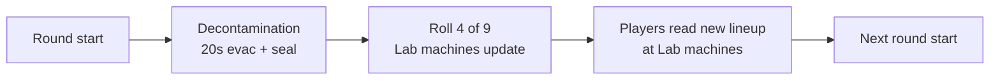

# 13 - Perks

Full roster, costs, **base + Mega** descriptions (table + prose), per-slot randomization, stacking behavior, and the baseline player-HP / zombie-damage model.

## Player HP Baseline

### Stock *Black Ops III* (reference)

- **Without Jugger-Nog:** **3** regular zombie melee hits from full health → down [common BO3 zombies baseline].
- **With Jugger-Nog:** you down on the **5th** melee hit (i.e. **5** hits from full to bleedout — survive **4**, **5th** downs). Sources: [COD Wiki — Juggernog](https://callofduty.fandom.com/wiki/Juggernog) player-facing tables and community testing; *not* a literal “double” hit count vs no-Jug.

### This map (`zm_abandoned_cyber_city`) — authoritative targets

- **Without Jug:** **3** hits → down (same as stock).
- **With Jug:** **6** hits from full to down — **+1 survivable hit vs stock BO3 Jug** (stock is **5**). GDT / zombie melee damage are tuned to this **3 / 6** rule.

If anything drifts in Mod Tools, retune HP/damage to keep **3** and **6**, not necessarily Treyarch’s stock Jug scalar.

## Roster (9 perks)

Six stock BO3 perks (tuned) + three custom. **No 4-perk cap in this map** — players can equip all 9 simultaneously if they can afford them. This is a deliberate deviation from stock BO3 to match our "systems stack" design language.

| # | Perk | Cost | Base (what it does) | Mega name | Mega (what the upgrade adds) |
|---:|---|---:|---|---|---|
| 1 | **Jugger-Nog** | 4,000 | **Stock BO3:** Jug raises max HP — down on **5th** melee from full (vs **3** hits without Jug). **This map:** **6** hits with Jug (**+1** vs stock). | **Ultimate Tank** | **+1** extra hit → **7** before down on this map; **immune to boss abilities** (Subroutine Core / scripted boss disables — see Mechanics). |
| 2 | **Quick Revive** | 2,500 | **Stock BO3:** faster teammate revives; **solo** self-revive rules where applicable. **This map adds** **+30% faster** HP regen after damage. | **Savior** | Revives **40% faster** than **base** QR alone; while **any teammate is down/bleeding out**, you move **+15% faster**. |
| 3 | **Speed Cola** | 3,500 | **Stock BO3:** **+50%** reload; faster **barrier board / repair** animation. **This map adds** **~40%** shorter perk drink + **~30%** faster weapon swap. | **Sleight of Hand Expert** | **+65%** reload (not +50%); **+15%** faster **gun switch**; **+15%** faster **perk drink** (stack on top of base). |
| 4 | **Double Tap 2.0** | 2,000 | **Stock BO3:** Double Tap II **+33%** fire rate; **double-bullet** damage behavior on most bullet weapons (ammo semantics per weapon). **This map’s stacked** numbers: **+33%** RoF, **+3%** damage (see [Double Tap](#4-double-tap-20--2000-points)). | **Gun Slinger** | **+50%** fire rate; **+6% damage total** (+3% over this map’s base DT2 line). |
| 5 | **Stamin-Up** | 2,000 | Stock BO3 Stamin-Up: **longer sprint** before exhaustion and **faster sprint speed**; sprint is still **finite** (not unlimited). | **The Flash** | **Longer sprint** than base Stamin-Up; **+12%** run speed; **×2** walk speed; **×4** crawl speed. |
| 6 | **Mule Kick** | **2,500** | Third primary weapon slot. **2,500** Points (stock BO3 **4,000**). | **The Armory** | **+30%** ammo per gun; **+2** extra lethal **+2** extra tactical (flat adds on top of stock counts). |
| 7 | **Deadshot** | 3,500 | **ADS** snap-to-head within cone + **×1.5** headshot vs body; **bosses** get no auto-aim (stock-style Deadshot rules on this map). | **American Sniper** | **1.75×** headshot multiplier (replaces 1.5× from base); **no recoil** on guns. |
| 8 | **Widow's Wine** | 4,000 | Stock Widow’s webs, melee-kill webs, melee-hit defense; this map adds **+50%/+25%** frag dmg/radius and **+50%/+25%** EMP. | **Spiderman** | **Zombies only:** knife/melee always **one-hit**; spider (web) grenades **one-hit** regular zombies; hold **6** web grenades. |
| 9 | **Aura Blast** | 2,500 | Custom: **400u** shockwave, **3s** stun (per enemy type), **120s** CD; **full bosses immune**. | **Mega Man** | **Bosses can be affected** (see Mechanics) **plus** **800u**, **60s** CD, **2 charges**. |

**Sources (stock vs custom):** Perks **1–6** are stock BO3 machines (several retuned — costs/effects in table). **7** Deadshot is custom / BO1-style. **8** Widow’s Wine is stock behavior **plus** our grenade damage/radius boosts. **9** Aura Blast is fully custom.

**Base vs map layer:** Where a row says **Stock BO3**, that is the retail game behavior (see [Player HP Baseline](#player-hp-baseline) for Jug). Phrases like **This map** or **This map adds** are intentional deviations (Jug **6** hits, QR regen, Speed drink/swap, Widow frag/EMP, **simplified DT2** numbers, **costs**). **Mega** tiers and **Aura Blast** are map-specific; see Mechanics under each perk.

Buying all 9 = **26,500 Points** (Mule Kick **2,500**). Hitting that by round ~25 is possible with dedicated economy play (Payroll Ledger boss item + Double Tap kills + high-round headshot farm).

The table above is a **complete at-a-glance** summary (base + Mega). Below, **[Perk reference (base + Mega)](#perk-reference-base--mega)** gives **full paragraphs** you can read start-to-finish, then **Mechanics** for exact numbers. **How** to acquire Mega (bottles, Lab machine, persistence) is in **[Mega Bottles (system)](#mega-bottles-system)**.

## No-Perk-Limit Rule

- The stock BO3 4-perk cap is explicitly **removed** in this map.
- All 9 perks can stack on a single player.
- **Implementation**: override `_zm_perks` slot-limit check at init. See `_acc_perks.gsc` (Phase 3 module, planned).
- **Co-op**: same rule; each player can hold all 9.

### Why remove the cap

- Stock BO3's 4-perk cap is a balance decision Treyarch made to force choice. We're deliberately making a different trade: with no cap, the *choice* becomes **what to buy first** rather than what to forego. A round-10 player can afford ~2-3 perks; a round-30 player can afford most. Order and prioritization matter, not a fixed ceiling.
- Our other systems (Cyberware, Tier, Overclocks, Boss Items) already provide the decision tension. Another forced-choice layer from a perk cap would be redundant.
- It supports the "systems stack" design — the map wants layered progression to be visible to players.

## Perk reference (base + Mega)

Read **top to bottom** for full prose on every perk. Each entry has a **Base** description (what you buy with Points), a **Mega** description (what you unlock with an **Empty Mega Bottle** at a Lab machine when that perk is on rotation — no extra Points), then **Mechanics** with numbers and stacking. Bottle acquisition, persistence, and UI: [Mega Bottles (system)](#mega-bottles-system).

### 1. Jugger-Nog — 4,000 Points

**Base (full description).** **Stock *Black Ops III*:** Juggernog raises max health so you normally **go down on the 5th** regular zombie melee from full (**3** hits without Jug). **On this map** Jug is tuned **stronger:** **6** melee hits from full to down — **one more** than stock BO3 Jug — per [Player HP Baseline](#player-hp-baseline). Buy Jug for **survivability**, training, and room for mistakes.

**Mega: Ultimate Tank (full description).** **Two bonuses:** (1) **One extra hit** on top of **this map’s** Jug — **7** melee hits from full to down. (2) **Immune to boss abilities** — Subroutine Core **scripted disables** (e.g. power off, perks off, stun fields tied to boss phases) **do not apply** to you the way they apply to the rest of the team. Tuning scope: any **non-wonder-weapon** boss/mega-scripted “turn off player power” effect; see `11_enemies.md` boss sections.

**Mechanics**

- **Stock BO3 (reference):** **3** hits no Jug / **5** hits with Jug (5th hit downs).
- **This map — base Jug:** **3** / **6** — GDT multiplier chosen to hit **6** melee hits with Jug (see baseline).
- **Mega — Ultimate Tank:** **7** hits from full to down on this map; **boss ability immunity** as above. TODO(acc-impl): whitelist boss attack types vs map-wide debuffs.
- **Stacking**: Cyberware Subroutine Caching; Ghost Shroud.

### 2. Quick Revive — 2,500 Points

**Base (full description).** **Stock BO3** Quick Revive: **faster teammate revives** than default. On this map, **+30% faster HP regen after you take damage** (shorter delay before regen starts and faster regen ramp). **Solo:** **self-revive** per stock BO3 where applicable.

**Mega: Savior (full description).** (1) **Revive speed:** with Savior, each revive completes **40% faster** than with **base** Quick Revive alone — multiply your **base QR revive animation duration** by **0.6** (not 40% of stock time unless base QR is explicitly half stock; implementation keys off **base QR** duration). (2) **When a teammate is down** (bleedout / need-revive state): you move **+15% faster** so you can reach them quickly. (Does *not* require both old “reviver + revived” speed burst unless we add it back in playtest.)

**Mechanics**

- **Base**: stock faster revives; **+30%** regen after taking damage; solo self-revive per stock.
- **Mega — Savior**: revive **×0.6 duration** vs **base** QR; **+15% move speed** while **any teammate is in down/bleedout** (Savior owner). TODO(acc-verify): down-state detection hook.

### 3. Speed Cola — 3,500 Points

**Base (full description).** **Stock *Black Ops III*:** Speed Cola is **+50% reload speed** and **faster barrier board / repair animations** (see [Speed Cola](https://callofduty.fandom.com/wiki/Speed_Cola)). It does **not** shorten perk-drinking or weapon-switching in stock BO3. **This map adds** **~40%** shorter perk-drink animation and **~30%** faster weapon + equipment swap for QoL at the Lab.

**Mega: Sleight of Hand Expert (full description).** (1) Reload is **+65%** (not +50%) — that is the **Mega replacement** for the reload line, on top of still being “Speed Cola.” (2) **+15% faster gun switch** and **+15% faster perk drink** — **additional** on top of whatever base Speed Cola already gave for those animations (stack in implementation: multiply remaining time by ~0.85 or add 15% speed — TODO(acc-tune)).

**Mechanics**

- **Stock BO3:** **+50%** reload; faster barrier repair animation.
- **This map — base:** stock reload **plus** **~40%** shorter drink; **~30%** faster swap.
- **Mega**: **+65%** reload; **+15%** gun switch; **+15%** perk drink (on top of **this map’s** drink/swap bonuses).

### 4. Double Tap 2.0 — 2,000 Points

**Base (full description).** **Stock *Black Ops III*:** Double Tap II raises **rate of fire by ~33%** and uses **two projectiles per shot** on most bullet weapons for **double damage per trigger pull** (ammo cost / weapon exceptions per Treyarch — see [Double Tap Root Beer](https://callofduty.fandom.com/wiki/Double_Tap_Root_Beer)). **This map’s design** abstracts stacking with PaP/Tier/Cyberware as **+33%** fire rate and **+3%** flat weapon damage so `_acc_damage` can stay one pipeline; **verify** against the real perk hook when Phase 3 lands.

**Mega: Gun Slinger (full description).** **+50%** fire rate. Damage is **+6% total** — i.e. **+3%** extra on top of **this map’s** base DT2 line (**+3%**), for **6% combined** from Gun Slinger Mega (verify additive vs GDT).

**Mechanics**

- **Stock BO3:** **+33%** RoF; double-bullet damage model on eligible guns.
- **This map — base:** **+33%** RoF; **+3%** damage (design abstraction).
- **Mega — Gun Slinger**: **+50%** fire rate; **+6% damage total** (+3% base map DT2 + **+3%** Mega).

### 5. Stamin-Up — 2,000 Points

**Base (full description).** **Stock BO3** Stamin-Up (`specialty_longersprint`): you get **more sprint time** before your sprint meter is spent and you return to a jog, and **higher sprint speed** — sprint is still **finite** (not endless rush). We are **not** stacking an extra arbitrary “+10% global move” on top of stock for the base perk; behavior matches Treyarch’s baseline unless GSC tuning proves otherwise.

**Mega: The Flash (full description).** **Longer sprint** than base Stamin-Up (Mega layer on top of stock Stamin — exact extension is GSC-tuned). **+12% run speed** on top of base. **Walk speed ×2** and **crawl speed ×4** (multiplicative vs base walk/crawl locomotion — implementation ties to player move-mode; TODO(acc-tune)).

**Mechanics**

- **Base**: stock BO3 Stamin-Up — longer sprint reserve; faster sprint movement; **not** unlimited sprint.
- **Mega — The Flash**: longer sprint than base alone; **+12%** run; **×2** walk; **×4** crawl.
- **Stacking**: Neural Boots (+20% with primary held); Reflex T1 (+10% sprint, +15% stamina regen). Mega **walk ×2 / crawl ×4** are map-specific multipliers on those locomotion states.

### 6. Mule Kick — 2,500 Points

**Base (full description).** Mule Kick gives a **third primary weapon slot** so you can run close / mid / long without returning to the box. **Cost 2,500 Points** (this map’s tuning — below stock 4k for triple-gun fantasy in mid economy).

**Mega: The Armory (full description).** **+30% ammo** capacity per weapon (reserves). **+2** extra **lethal** and **+2** extra **tactical** slots **flat** on top of stock counts (e.g. if stock is 2 frags / 2 EMPs, Armory aims for **4 / 4** before other perks — Widow Spiderman may still cap **web** grenades at **6**).

**Mechanics**

- **Base**: third primary; **2,500** pts.
- **Mega — The Armory**: **+30%** ammo per gun; **+2** lethal, **+2** tactical (additive, not “double all slots” unless stock was 2).

### 7. Deadshot — 3,500 Points

**Base (full description).** **ADS** auto-aim toward heads (cone-limited; **no boss snap**) and **×1.5** headshot damage vs body. Map global headshot multipliers (**2×** trash, **3×** boss) **multiply** with Deadshot. ADS only; hip fire has no snap.

**Mega: American Sniper (full description).** Headshot multiplier is **×1.75** (**replaces** base ×1.5 — you do not double-dip 1.5 and 1.75). **No weapon recoil.** ADS head snap **still applies** to regular targets and elites (not bosses). See [Mega damage stack example](#mega-damage-stack-example).

**Mechanics**

- **Base**: **×1.5** headshot mult; ADS auto-aim (regulars/elites); **bosses**: no snap.
- **Stacking (examples)**: regular headshot ≈ **1.5** × **2.0** (map) = **×3.0** vs body; boss headshot ≈ **1.5** × **3.0** = **×4.5** vs body.
- **Mega — American Sniper**: **×1.75** headshot mult; **zero recoil**; e.g. regular ≈ **1.75 × 2.0 = ×3.5** vs body; boss ≈ **1.75 × 3.0 = ×5.25** vs body.

### 8. Widow's Wine — 4,000 Points

**Base (full description).** **Stock BO3** Widow’s Wine: spider **lethals**, melee-kill webs, self-defense on hit. This map adds **+50%/+25%** frag dmg/radius and **+50%/+25%** EMP stun/radius.

**Mega: Spiderman (full description).** **Zombies only:** **knife/melee always one-hit kills** on ordinary zombies (not bosses/elites unless tuned). **Web (spider) grenades** **one-hit** regular zombies. You can carry **6** web grenades. Elites/bosses keep normal damage/CC rules unless explicitly listed.

**Mechanics**

- **Base**: spider webs; melee defense; +50%/+25% frag; +50%/+25% EMP.
- **Mega — Spiderman**: melee **OHK** zombies; web nade hit **OHK** regular zombies; **6** web nades max.

### 9. Aura Blast — 2,500 Points

**Base (full description).** **400u** radius shockwave, **3s** stun (type-dependent), **120s** CD; **full bosses immune** to the stun (mini-boss may use partial rules — see below). Fully custom perk for this map.

**Mega: Mega Man (full description).** Keeps **800u**, **60s** CD, **2 charges** — and **bosses can be affected** now (see Mechanics): typically **reduced** stun vs trash (e.g. same **3s** window → **50% duration** or **~1.5s**, or interrupt-only — TODO(acc-tune)) so the fight isn’t trivialized.

**Mechanics**

- **Activation**: **crouch + melee chord** until the Phase 4 LUI keybind (BO3 has no console command that fires a script notify — VERIFIED, see `_acc_weapon_abilities.gsc`, whose weapon abilities own the ADS+melee chord; Aura Blast deliberately uses a different chord).
- **Base — radius 400u, stun 3s**, CD **120s** from activation.
- **Enemy rules (base)**: zombies — full stun; shielded elites — shield down for stun; teleporters — no teleport; EMP elites — **1s** stun; mini-boss — **50%** duration (~1.5s); **full boss — immune**.
- **Mega — Mega Man**: **800u**; **60s** CD; **2 charges**; **bosses take stun/interrupt** per tuning (not immune). TODO(acc-impl): boss-specific duration cap.
- **HUD**: cooldown ring (Phase 4 LUI).
- **Build fit**: Reflex + Phase Step; Overload defense; panic peel.

## Mega Bottles (system)

**Mega** perk tiers (Savior, Gun Slinger, Ultimate Tank, etc.) are **not** bought with Points. They unlock by spending **Empty Mega Bottles** at Lab machines when the base perk is in the current rotation — full **Mega** descriptions are in [Perk reference (base + Mega)](#perk-reference-base--mega) under each perk’s **Mega: … (full description)**.

### Acquisition Loop

- **Drop rate**: **1 Empty Mega Bottle is guaranteed on every boss kill** — both mini-boss (Juggernaut Host, rounds 10 / 20) and full boss (Subroutine Core, rounds 30+).
- **Additional to** the 6-item boss-drop pool — Mega Bottles do NOT take one of the 6 item-pool slots. They are a separate drop resource.
- **Inventory**: unlimited stack, per-player (counter on `self.acc_mega_bottles`).
- **In 4p co-op**, each player independently receives 1 bottle per boss kill.
- **Realistic rate**: 50-round run with 5 boss kills (r10 + r20 + r30 + r40 + r50) = **5 Mega Bottles per player max**. You cannot Mega all 9 perks in a single run. Decisions matter.

### Usage

1. You must **already own the base perk** (bought normally from a Lab machine).
2. The base perk must be **currently in the round's rotation** at one of the 4 Lab machines.
3. Interact with that machine → UI prompt "Apply Mega? (1 Empty Mega Bottle)".
4. Consume 1 Mega Bottle → the base perk upgrades to its Mega variant.
5. **No Points cost** — the bottle IS the cost.

### Persistence Rule

Once a perk is Mega'd on a player, the Mega effect is **sticky** for the rest of the run:

- **If you die** and lose the base perk, your Mega flag remains on `self.acc_mega_perks[perk_id]`.
- **If you re-buy the perk** from a machine (after respawn), it immediately applies the Mega variant — no second Mega Bottle required.
- **Run-end**: all Mega flags cleared (like all other run state).

This means: **the Mega Bottle is a one-time investment per perk per run**. Death doesn't punish your Mega progression.

### Cross-Round Timing Tension

- **You get a Mega Bottle at round 10** (Juggernaut Host kill).
- **You decide you want to Mega Jug**.
- **But Jug isn't in the current (round 11) rotation**.
- **You wait**. Maybe 1-3 rounds until Jug rotates back in.
- **Jug rotates in at round 13**. You rush to Lab, interact, consume bottle, Jug becomes Ultimate Tank.

This mirrors the existing perk-rotation decision texture. Mega-ing a perk is a **two-step commitment**: 1) own the perk, 2) wait for rotation, 3) apply bottle. Players will strategize which perk to Mega first based on current round and rotation odds.

### Mega damage stack example

PaP L5 + Tier 5 FAL + American Sniper + Gun Slinger + Overload Cyberware + Precision Mode ability + clean headshot on an elite:

- Base damage × 1.5 (stock weapon GDT headshot mult) × 2.0 (our headshot mult) × **1.75 (American Sniper Mega)** × 1.15 (Cyberware Oc1) × 1.30 (Overload Cyberware T2) × 4.0 (Precision Mode ability) × 1.5 (Overpressure Overclock if rolled) = **~95x damage** per headshot (illustrative — recalc when exact PaP/Tier values are locked).

On a round-50 boss with Signal Staff's +300% counter damage skipped, that's still the 4.5x boss-headshot multiplier stacked = **~163x damage per hit**.

Absurd. Intended for late-game power-fantasy. Tune via the levers at the bottom of the doc if playtest shows this is *unfun* absurd rather than *earned* absurd.

### Co-op Notes

- Mega Bottles are per-player. 4p = 4 bottles per boss kill collectively (but each player holds their own).
- Cannot give a Mega Bottle to a teammate.
- In 4p, a full boss kill means 4 players each get +1 bottle. Over 5 bosses = 20 bottles total. Teams can coordinate who Mega's what for efficient role specialization.

### Mega HUD

HUD indicators:

- **Mega Bottle counter** next to Data Shards counter (lower-left). Format: `Bottles: 2`.
- **Mega-flagged perks** show a distinct perk icon (e.g. gold border) in the perk row.
- **Machine prompt** when standing near a rotating machine that dispenses a perk you own: "[Hold F] Apply Mega (1 Bottle)".

See [14_controls_and_hud.md](14_controls_and_hud.md) for HUD element spec.

### Implementation

- [`scripts/zm/zm_abandoned_cyber_city/_acc_mega_bottles.gsc`](../scripts/zm/zm_abandoned_cyber_city/_acc_mega_bottles.gsc) is the dedicated module (Phase 3/4 authoring).
- Drop hook: `_acc_boss.gsc` calls `_acc_mega_bottles::on_boss_death(killer)` on both mini-boss death (`watch_mini_boss_death`) and full boss death (in `run_full_boss` tail).
- Mega flags: `self.acc_mega_perks[specialty_string]` is set true when Mega applied. Perk machines check this flag when dispensing.
- Effect application: when a Mega'd perk is acquired, the perk's `on_acquire` function checks `self.acc_mega_perks[id]` and applies the Mega deltas in addition to base effects.

### Tuning Levers

- **Drop rate too generous**: only full bosses drop Mega Bottles (mini-bosses give 50% chance).
- **Drop rate too stingy**: mini-bosses give 2 bottles each.
- **Mega too strong**: reduce specific Mega effects (e.g. American Sniper 1.75x → 1.65x, Gun Slinger +50% → +40%).
- **Rotation timing frustrating**: allow Mega application at ANY perk machine as long as the player owns the base perk (decouple from rotation). Simpler but less texture.

## Perk Availability: Per-Round Rotating Lab Machines

**All 9 perks are consolidated to the Laboratory.** There are **4 perk machines** in the Lab, and nowhere else on the map. The 4 machines randomly reassign to 4 of the 9 perks (no duplicates). The other 5 perks are **unavailable for purchase** that round.

**Critical timing (v1.0):** The new lineup is **not** rolled at the first frame of the round. **Lab perk machines re-roll only after the round’s [decontamination phase](03_layout.md#decontamination-zones-round-hazard) completes** — i.e. after the **20s** evacuation window ends and the contaminated zone is sealed (rounds **1–4**), or after the **0s** tick when no new zone seals (**round 5+**). Players rushing the Lab at round start may still see **last round’s** perks until decontamination closes.

### How it works

- **Round 1 rotation**: rolled **after** round 1’s decontamination completes (see [03_layout.md](03_layout.md)).
- **Subsequent rotations**: same — **after** each round’s decontamination phase, not at `acc_round_start`.
- **Machine assignments are team-wide.** Every player sees the same 4 options at the Lab that round (once the roll has run).
- **Purchase is per-player.** One player buying Jug from Machine A doesn't block teammates from also buying Jug from the same machine that round.
- **Owned perks retain across rounds.** The rotation only changes what's *available at machines*, not what any player is holding. If you bought Jug in round 3 and Jug isn't in the round 4 rotation, you still have Jug.

### Rotation Rules

**Hard constraints:**

1. **No duplicates in the 4-slot rotation.** 4 distinct perks per round.
2. **Equal weights in v1.0.** Each of the 9 perks has 1/9 odds for any slot. Jugger-Nog is in the pool at the same weight as everything else - no guaranteed-placement rule.
3. **Round 1 gets a rotation.** You might buy Jug immediately, or might have to wait several rounds. See probability notes below.

**Soft rules (tuning surface):**

- **Locked-out set changes every round** - a perk unavailable this round can reappear next round.
- **No "can't repeat 3 rounds in a row" cooldown** on any perk in v1.0. Could be added as a mitigation if a perk gets cheesed too often.
- **No weight bump on high-value perks** in v1.0. Pure random. If playtest shows Jug-less early runs feel terrible, we weight Jug up or guarantee it in the first-round roll.

### Probability Notes

- Probability a specific perk (e.g. Jug) appears in a single round's rotation: **4/9 ≈ 44.4%**.
- Probability Jug does NOT appear for N consecutive rounds:
  - 1 round: 5/9 = 55.6%.
  - 3 rounds: (5/9)^3 ≈ 17.1%.
  - 5 rounds: (5/9)^5 ≈ 5.3%.
  - 10 rounds: (5/9)^10 ≈ 0.3%.
- **A Jug-less round 5 run has a ~5% probability.** About 1 in 20 runs will force Jug-less play until round 6+. If that feels terrible in playtest, we add a weight bump or a "Jug guaranteed in first-round rotation" rule. See "Tuning Levers" below.

### Per-run variance

- C(9, 4) = **126 distinct 4-perk rotations** possible each round (just the set, not the ordering).
- Every round re-rolls independently. A 50-round run has 50 independent rolls; the space of run histories is effectively unbounded.
- The player's skill is **route management** (Lab visits cost time) + **patience** (waiting for the right rotation) + **value recognition** (knowing which of the 4 offered is most worth your Points).

### Player Adaptation (the real skill loop)

Each round the player asks:

1. **What's in the rotation?** (Only answerable by running to Lab and checking - costs time.)
2. **What do I already own?** (Don't re-route for perks you have.)
3. **What can I afford?** (Point budget.)
4. **What's worth waiting for?** (If this round offers only Stamin-Up + Mule Kick + Deadshot + Widow's Wine and you're down-to-die at 1-hit, skip perk buy and save Points for next round hoping Jug rolls.)

Missing a perk this round is OK. It'll cycle back. **Patience and route management become core skills.**

### Decision tension created

1. **Lab travel time is real.** Every round you weigh "is it worth the trip?" The Lab is in one corner of the map; you'll be 1-2 zones away at round start typically.
2. **Single-round perk windows are cheap.** If Jug rolls up, it's probably worth buying now. Waiting to "see if more options appear" means Jug might be gone for 3+ more rounds.
3. **Buy order matters more than ever.** Cheap perks (Double Tap 2,000 / Stamin-Up 2,000) look tempting when offered, but Jug (4,000) is objectively more valuable. Sometimes you skip a cheap offer this round to save Points for a hoped-for Jug next round.
4. **Lab is now the map's "pulse."** Every round transition, every player eyes the Lab. It changes the rhythm of the map - Ameliorama-style "check the shop between waves" but triggered round-by-round.

### Implementation

- [`_acc_map_randomizer.gsc::roll_perk_rotation()`](../scripts/zm/zm_abandoned_cyber_city/_acc_map_randomizer.gsc) runs **after** `acc_decontamination_complete` (or equivalent **20s** delay when a seal applies), **not** immediately on `acc_round_start`. Until `_acc_decontamination.gsc` exists, stub with `wait 20` after round start or a single `waittill( "acc_decontamination_complete" )`.
- `level.acc_perk_rotation` (array of 4 perk specialty strings) holds the current round's machines.
- Each Lab perk machine in Radiant reads its slot index (`lab_a`, `lab_b`, `lab_c`, `lab_d`) and looks up `level.acc_perk_rotation[slot_index]`.
- Visual transition **after decontamination**: machine advertisement / skin switches to the new perk. (Phase 4 art/LUI work.)
- Round flow: `_acc_main.gsc::watch_round_transitions` emits `acc_round_start` → decontamination system runs → **`acc_decontamination_complete`** → `_acc_map_randomizer.gsc` re-rolls perks.

## Perk Machine Behavior

- **Interaction**: hold [use] on active perk machine.
- **Power gate**: machines require map power on.
- **Perks retained through down/revive**: yes (stock behavior).
- **Perks lost on death (respawn)**: yes (stock behavior).
- **Quick Revive auto-refund in solo**: once per run, first death only.
- **No max cap**: the "has space for perk" check in stock BO3 is bypassed.

## Powerup Interactions

- **Insta-Kill**: Deadshot's +1.5x headshot still applies during Insta-Kill (redundant for regulars since they insta-die, but relevant for elites/bosses).
- **Double Points**: 2x base kill Points BEFORE 70/30 split, Payroll Ledger's +10% on top.
- **Max Ammo**: no perk interaction.
- **Carpenter**: no perk interaction.
- **Perk Bottle** (random perk drop): not in v1.0.

## Co-op Perk Rules

- Perks are **per-player**.
- No shared lockout — multiple players can buy the same perk at the same machine simultaneously.
- Reviving does NOT drop perks.
- Dying (not reviving from down in time) drops all perks.

## Full Stacking Example — "Swiss Army Player" Build

A player with **all 9 perks** + good Cyberware + boss items + PaP L5 + Tier 5 FAL:

- **HP**: **6**-hit survival vs regular zombie melee with Jug on **this map** (stock BO3 Jug = **5** hits — see baseline).
- **HP regen**: +30% (Quick Revive).
- **Reload / swap speed**: +50% reload + +15% reload (Gauntlets if equipped) + ~30% swap (Speed Cola) + 15% swap (Gauntlets).
- **Move speed / sprint**: Stamin-Up (stock longer sprint + faster sprint) + +10% sprint (Reflex T1) + +20% (Neural Boots if equipped); with **Mega** Stamin add **×2 walk / ×4 crawl / +12% run** vs base Stamin-Up layer.
- **Fire rate**: +33% (Double Tap).
- **Headshot damage**: base Deadshot ×1.5 × map mult ×2.0 / ×3.0 × Overload / Tier / PaP; American Sniper Mega uses **×1.75** instead of ×1.5 (see [Deadshot](#7-deadshot--3500-points)).
- **Grenade damage**: +50% frag dmg, +25% radius (Widow's Wine).
- **Stun on demand**: Aura Blast (3s, 400u radius, 120s CD).
- **Weapon slots**: 3 primaries (Mule Kick).
- **Web on melee hit**: self-defense layer (Widow's Wine).

Add **Cyberware full branch** + **2 Boss Items** + **PaP L5 + Tier 5 with 5 Overclocks** on 2 weapons = our peak power fantasy. Reaching that takes a full 30+ round commitment; it's a reward for sustained play, not a baseline.

## Implementation Status

**Implemented (greybox)**: [`_acc_perk_aura_blast.gsc`](../scripts/zm/zm_abandoned_cyber_city/_acc_perk_aura_blast.gsc)
— Aura Blast base tier is live by hijacking the stock-but-unfinished
`_zm_perk_electric_cherry` module (mod tools ship it with Treyarch's own
"TODO update these to proper settings" placeholders). The stock module
provides the full registered machine/bottle/clientfield pipeline for
`specialty_electriccherry`; our module overwrites cost (2,500), hint string,
and the give/take threads with the Aura Blast ability (400u / 3s stun / 120s
CD / bosses immune, crouch+melee activation). Machine in Radiant =
`zm_perk_machine` struct with `script_noteworthy "specialty_electriccherry"`,
model `p7_zm_vending_nuke` (stock placeholder; custom machine model is Phase 5
art). Mega tier (Mega Man) and HUD cooldown ring remain Phase 3/4.

Phase 3 Planned: `_acc_perks.gsc` module to be authored. Responsibilities:

- Remove the 4-perk cap by overriding `_zm_perks::give_perk` logic.
- Register Aura Blast as an active-activated perk (hooks a player notify via perk ability hotkey).
- Register Deadshot effects: headshot mult (feeds into `_acc_damage.gsc::on_ai_damage`) + auto-aim flag.
- Register Widow's Wine damage boost (hooks grenade fire events).
- Retune Jug / QR / Speed Cola / Stamin-Up stats from stock defaults.
- Cost override table for our per-perk costs.

Custom perks (Aura Blast, Widow's Wine as modified, Deadshot as a variant) follow the custom perk template workflow in [16_gsc_reference.md](16_gsc_reference.md) section 5.

## Tuning Levers

If perks feel broken after playtest:

- **Jug**: baked into the **3 / 6** hit model on this map (**6** with Jug vs **5** stock BO3 Jug).
- **Aura Blast**: cooldown 120s → 150s if too spammable.
- **Deadshot**: 1.5x → 1.3x if headshot damage ceiling is too high.
- **Widow's Wine grenade boost**: +50% → +25% if frag/EMP spam dominates late game.
- **Stamin-Up**: sprint duration 2x → 1.5x if speed-running late rounds becomes trivial.

All live in `_acc_perks.gsc` constants (planned Phase 3 authoring).

## Out of Scope for v1.0

- **Other stock perks not listed above** (Electric Cherry, PHD Flopper, etc.) — each adds pipeline complexity (damage pre-hook, fall damage handler) and isn't worth the authoring budget.
- **Perk-a-Holic** powerup (random perk drop): scope cut.
- **Perk Shuffle** modifier: fun idea, not in v1.0.
- **Perk animations / custom bottle art**: stock for all 9 in v1.0; art pass (Phase 5) may add distinct bottles for the 3 custom variants.
