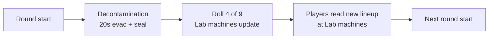

# 13 - Perks

Full roster, costs, effects, per-slot randomization, stacking behavior, and the baseline player-HP / zombie-damage model.

## Player HP Baseline

- **Without Jugger-Nog**: player dies in **3 zombie melee hits**.
- **With Jugger-Nog**: player dies in **6 zombie melee hits**.

These are the authoritative tuning targets. Player max HP and zombie melee damage values in the GDT are chosen to hit these numbers; if stock BO3 values drift, we tune to preserve the 3 / 6 rule.

## Roster (9 perks)

Six stock BO3 perks (tuned) + three custom. **No 4-perk cap in this map** — players can equip all 9 simultaneously if they can afford them. This is a deliberate deviation from stock BO3 to match our "systems stack" design language.

| # | Perk | Source | Cost | Effect |
|---|---|---|---|---|
| 1 | **Jugger-Nog** | Stock | 4,000 | +100% max HP (effectively doubles hits-to-die from 3 → 6) |
| 2 | **Quick Revive** | Stock (retuned) | 2,500 | Faster revives + **+30% faster health regen** after taking damage |
| 3 | **Speed Cola** | Stock (retuned) | 3,500 | +50% reload speed + faster perk-drinking + faster equipment change |
| 4 | **Double Tap 2.0** | Stock | 2,000 | +33% fire rate, +3% damage (stock formula preserved) |
| 5 | **Stamin-Up** | Stock (retuned) | 2,000 | **+10% movement speed** + **extended** sprint duration (NOT unlimited, ~2x stock baseline) |
| 6 | **Mule Kick** | Stock | 3,000 | 3rd primary weapon slot |
| 7 | **Deadshot** | Custom / BO1-style | 3,500 | **1.5x headshot damage multiplier** + **auto-aim to head** when ADS |
| 8 | **Widow's Wine** | Stock (extended) | 4,000 | Default web-grenade mechanic + **increased damage on lethals and non-lethals** |
| 9 | **Aura Blast** | Custom | 2,500 | **Active**: hold [perk ability key] to stun all enemies within 400u for 3s. 120s recharge. |

Buying all 9 = **27,500 Points**. Hitting that by round ~25 is possible but requires dedicated economy play (Payroll Ledger boss item + Double Tap kills + high-round headshot farm).

**On top of the base 9**, each perk has a **Mega variant** unlocked via the Mega Bottle system — see [Mega Bottles](#mega-bottles-upgraded-perk-variants) below.

## No-Perk-Limit Rule

- The stock BO3 4-perk cap is explicitly **removed** in this map.
- All 9 perks can stack on a single player.
- **Implementation**: override `_zm_perks` slot-limit check at init. See `_acc_perks.gsc` (Phase 3 module, planned).
- **Co-op**: same rule; each player can hold all 9.

### Why remove the cap

- Stock BO3's 4-perk cap is a balance decision Treyarch made to force choice. We're deliberately making a different trade: with no cap, the *choice* becomes **what to buy first** rather than what to forego. A round-10 player can afford ~2-3 perks; a round-30 player can afford most. Order and prioritization matter, not a fixed ceiling.
- Our other systems (Cyberware, Tier, Overclocks, Boss Items) already provide the decision tension. Another forced-choice layer from a perk cap would be redundant.
- It supports the "systems stack" design — the map wants layered progression to be visible to players.

## Custom Perk Details

### Aura Blast (replaces Lattice Bond from prior spec)

- **Type**: **active perk**. Unusual for zombies (traditionally passive), but it's a Cyber City design beat — you're an augmented runner with a neural burst.
- **Cost**: 2,500 Points.
- **Activation**: **perk-ability hotkey** (separate from the weapon-ability hotkey — see [14_controls_and_hud.md](14_controls_and_hud.md)). Default bind: **G** (PC) / **D-pad Up** (Gamepad). **TODO(acc-input): final bind decided at LUI binding-screen implementation (Phase 4).**
- **Effect**: an energy shockwave pulse from the player's position. All enemies within **400 units** are **stunned for 3 seconds**:
  - Regular zombies: frozen in place, cannot attack.
  - Shielded elites: shield temporarily disabled for the stun duration (same as EMP Grenade effect).
  - Teleporter elites: teleport cooldown reset to minimum, cannot teleport during stun.
  - EMP elites: **resisted** — only 1s stun (they're EMP-themed; it's poetic).
  - Mini-boss (Juggernaut Host): **50% stun duration** (1.5s). Interrupts a mid-charge.
  - Full boss (Subroutine Core): **immune** — Core has its own phase debuff system; Aura Blast doesn't affect it.
- **Cooldown**: **120 seconds**. Starts from activation (not from cooldown-end).
- **HUD**: cooldown ring icon on HUD (Phase 4 LUI).
- **Build fit**:
  - Reflex archetype: chain with Phase Step Cyberware for repositioning windows during stun.
  - Vault Overload: use to stabilize waves during the event.
  - Emergency clutch: if surrounded and no Lattice Bond equivalent, this is the panic button (without a heal, but the 3s window is usually enough to rotate).
- **Why cheap (2.5k)**: 120s cooldown means it's not spammable. Low cost gets it online early when a player is still learning the map; long cooldown keeps it from being oppressive.

### Deadshot (replaces Void Cache from prior spec)

- **Type**: passive.
- **Cost**: 3,500 Points.
- **Effect**:
  - **+1.5x headshot damage multiplier** applied to the player's weapon output.
  - **Auto-aim to head** when ADS — aim snaps to the closest zombie's head within the player's current crosshair cone. Same as classic Deadshot Daiquiri from BO1.
- **Stacking with our 2x/3x headshot multiplier system**: multiplicative.
  - Regular zombie headshot, player has Deadshot: base × 1.5 (Deadshot) × 2.0 (our mult) = **3.0x** damage vs body.
  - Boss headshot, player has Deadshot: base × 1.5 (Deadshot) × 3.0 (our mult) = **4.5x**.
  - With Overload Cyberware (crit +30% on headshots) + Deadshot + our mult + PaP L5 + Tier 5 Overclocks, precision archetype headshots become extreme. **This is intended and should be playtested.**
- **Build fit**: the precision archetype's keystone perk. FAL, Intervention, M14 EBR, Drakon all benefit dramatically. ICR-1 / AK-47 spray builds benefit less (auto-aim helps, but they don't headshot-prioritize).
- **Auto-aim is off against bosses** — bosses are big enough that manual aim matters. Limiting auto-aim to regular/elite zombies keeps boss fights an aim test. (TODO(acc-impl): this exception needs to be explicit in the perk GSC.)
- **Anti-exploit**: auto-aim is **only active while ADS** (not hip fire). Prevents "never aim, always snap-kill" gameplay. Also caps at zombies in the crosshair cone — can't 360-snap.

### Widow's Wine

- **Type**: passive (but grenades become active).
- **Cost**: 4,000 Points.
- **Effect** (stock BO3 base behavior):
  - Lethal grenades become "spider grenades" — **web zombies** caught in blast, slowing them to ~20% speed for 5 seconds.
  - **Melee kills** on a low-HP zombie web nearby zombies too.
  - Zombies that melee you apply a **brief stun to themselves** and gain a web effect (self-defense).
- **Our addition** (custom): **+damage boost** to lethal and tactical grenades.
  - **Frag Grenade**: +50% explosion damage, +25% radius.
  - **EMP Grenade**: +50% stun duration, +25% radius.
- **Build fit**:
  - Any build benefits from the self-defense web.
  - **Frag-heavy play**: pair with Meltdown Cyberware capstone for chain-AoE deletes.
  - **EMP-heavy play**: pair with Server Vault tactical wallbuy for cheap re-ammo.
- **Stacking**:
  - With Aura Blast: both provide stuns but through different mechanisms. Aura Blast on-demand; Widow's Wine passive on melee. Complementary.
  - With Cyberware Fission (elemental PaP): spider webs + elemental damage = sustained chip damage. Strong synergy.
- **Anti-exploit**: the self-defense web is per-hit, not per-frame. Can't get swarmed and mass-web 20 zombies in a second.

## Stock Perk Detail Updates

### Jugger-Nog (4,000)

- Effectively doubles hits-to-die from **3 to 6** against zombie melee.
- **Stacking**: with Cyberware Subroutine Caching (extended bleed-out), you become a tank. With Ghost Shroud boss item (lethal-damage save), you're essentially unkillable for short windows.
- **Note**: HP buff is a raw multiplier on player maxhealth. See `_acc_perks.gsc` (Phase 3 planned).

### Quick Revive (2,500)

- **Faster revive** (stock behavior): 5s revive → ~2s.
- **+30% faster health regen** after taking damage (our custom addition). In stock BO3, after taking damage, there's a delay before HP regen kicks back in, then slow ramp. QR shortens the delay by 30% and speeds the ramp by 30%.
- **Solo self-revive**: retained as stock behavior (one free self-revive per run in solo).
- **Build fit**: universal. Always a strong early pickup.

### Speed Cola (3,500)

- **+50% reload speed** (stock).
- **Faster perk drinking**: the 3-4 second "drink animation" after buying a perk is shortened by ~40%. Lets you perk up during pauses between rounds.
- **Faster equipment change**: swap-speed for weapons + grenades is ~30% faster.
- **Stacking with Overclocked Gauntlets** (boss item, +15% reload / +15% swap): multiplicative. Maxed-out reload build approaches near-instant reloads on Haymaker 12 / Tac-19 / AK-47.
- **Build fit**: essential on any high-reload-rate weapon; also clutch for fast perk-up chains.

### Stamin-Up (2,000)

- **+10% movement speed** (up from stock +5%).
- **Extended sprint duration** — **NOT unlimited**. Target: ~2x stock sprint duration before you have to walk.
- **Stacking**:
  - Neural Boots (boss item, +20% with primary held): multiplicative. Combined = +32% sprint speed (1.1 × 1.2).
  - Cyberware Reflex Tier 1 (+10% sprint + 15% stamina regen): multiplicative with Stamin-Up's 10%. Combined = +21% speed.
  - Full stack (Stamin-Up + Reflex T1 + Neural Boots): 1.1 × 1.1 × 1.2 ≈ **+45% sprint speed**. Zoom.
- **Why downgrade from unlimited sprint**: unlimited sprint makes every other speed-up item redundant. Extended duration rewards Neural Boots + Reflex stacking instead of making them cosmetic.

### Mule Kick (3,000)

- 3rd primary slot (stock behavior).
- **Cost reduced** from 4,000 to 3,000 to make it more accessible. This encourages carrying all three archetypes (e.g. FAL + Tac-19 + Drakon) rather than always two.

### Double Tap 2.0 (2,000)

- Unchanged from stock.
- **Stacking**: with PaP L5 + Tier 5 + Cyberware Overclock Tier 1 (+15% damage) + our headshot mult + Deadshot = cumulatively massive on the FAL-class weapons.

## Mega Bottles (upgraded perk variants)

Every perk has a **Mega variant** — a named, distinct upgraded version that stacks on top of the base perk's effects. Mega variants are unlocked by applying an **Empty Mega Bottle** to a perk machine dispensing a perk you already own.

### Acquisition Loop

- **Drop rate**: **1 Empty Mega Bottle is guaranteed on every boss kill** — both mini-boss (Juggernaut Host, rounds 10 / 20) and full boss (Subroutine Core, rounds 30+).
- **Additional to** the 6-item boss-drop pool — Mega Bottles do NOT take one of the 6 item-pool slots. They are a separate drop resource.
- **Inventory**: unlimited stack, per-player (counter on `self.acc_mega_bottles`).
- **In 4p co-op**, each player independently receives 1 bottle per boss kill.
- **Realistic rate**: 50-round run with 5 boss kills (r10 + r20 + r30 + r40 + r50) = **5 Mega Bottles per player max**. You cannot Mega all 9 perks in a single run. Decisions matter.

### Usage

1. You must **already own the base perk** (bought normally from a Lab machine).
2. The base perk must be **currently in the round's rotation** at one of the 4 Lab machines.
3. Interact with that machine → UI prompt "Apply Mega? (1 Empty Mega Bottle)".
4. Consume 1 Mega Bottle → the base perk upgrades to its Mega variant.
5. **No Points cost** — the bottle IS the cost.

### Persistence Rule

Once a perk is Mega'd on a player, the Mega effect is **sticky** for the rest of the run:

- **If you die** and lose the base perk, your Mega flag remains on `self.acc_mega_perks[perk_id]`.
- **If you re-buy the perk** from a machine (after respawn), it immediately applies the Mega variant — no second Mega Bottle required.
- **Run-end**: all Mega flags cleared (like all other run state).

This means: **the Mega Bottle is a one-time investment per perk per run**. Death doesn't punish your Mega progression.

### Cross-Round Timing Tension

- **You get a Mega Bottle at round 10** (Juggernaut Host kill).
- **You decide you want to Mega Jug**.
- **But Jug isn't in the current (round 11) rotation**.
- **You wait**. Maybe 1-3 rounds until Jug rotates back in.
- **Jug rotates in at round 13**. You rush to Lab, interact, consume bottle, Jug becomes Ultimate Tank.

This mirrors the existing perk-rotation decision texture. Mega-ing a perk is a **two-step commitment**: 1) own the perk, 2) wait for rotation, 3) apply bottle. Players will strategize which perk to Mega first based on current round and rotation odds.

### The 9 Mega Variants

Each perk's Mega version gets a themed name and a stacked upgrade. Mega effects apply **on top of** the base perk's effects.

#### 1. Quick Revive → **Savior**

- Revive animation time down to **35% of stock** (stock 5s → ~1.75s).
- After a successful revive, **both the reviver and the revived gain +15% movement speed** for 5 seconds.
- Base QR effects preserved: +30% health regen speed, faster revive baseline, solo self-revive retained.

#### 2. Double Tap 2.0 → **Gun Slinger**

- **+50% fire rate** (vs stock +33%). That's ~15% more than base Double Tap on top of raw fire rate.
- Base +3% damage preserved.
- Stacks multiplicatively with PaP L5 + Tier 5 weapon upgrades + AR ability Stabilizer (5s zero recoil + 20% fire rate). Active Stabilizer on a Gun Slinger AR = chainsaw fire rate.

#### 3. Speed Cola → **Sleight of Hand Expert**

- Reload speed **+65%** (vs stock +50%). Speed reload king.
- Faster perk drinking (already on base Speed Cola).
- Faster weapon swap (already on base).
- **New**: faster **lethal use** (grenade throw / cook animation).
- Stacks multiplicatively with Overclocked Gauntlets (+15% reload). Combined: ~89% reload speed reduction. Near-instant reloads on Haymaker 12 / AK-47 / BRM-class weapons.

#### 4. Jugger-Nog → **Ultimate Tank**

- **+1 extra hit** beyond Jug's +100% HP. So: 3 (no Jug) → 6 (Jug) → **7 (Ultimate Tank)**.
- **Immune to boss stuns** — Subroutine Core phase debuffs that normally affect all players (power-disable, perk-disable during phase transitions) either don't apply or apply at reduced severity to an Ultimate Tank player.
  - TODO(acc-tune): spec exactly. Does "immune" mean phase debuffs fully skip, or 50% reduced? First-pass: fully skip. Playtest to adjust.

#### 5. Widow's Wine → **Spiderman**

- **Spider grenades now 1-shot kill regular zombies on explosion** (no HP scaling — instant kill regardless of round). Still damages elites / bosses scaled normally.
- **Max grenade count 6** (vs stock 4).
- Base Widow's Wine web-on-melee defense preserved.
- Base +50% damage / +25% radius on Frag + EMP preserved.

#### 6. Stamin-Up → **The Flash**

- **Unlimited sprint duration** (returns to stock Stamin-Up's pre-nerf behavior).
- **+10% walk speed** (base).
- **+12% sprint speed** (vs base +10%).
- Stacks multiplicatively with Neural Boots (+20% with primary held) and Cyberware Reflex T1. Combined base + Mega + Boots + Reflex = **~48% sprint speed** over baseline.

#### 7. Mule Kick → **The Armory**

- Base 3rd-primary slot preserved.
- **+35% ammo capacity per gun** (reserve mags).
- **Double lethal + double tactical grenade** capacity (Frag 2→4, EMP 2→4 — doubling applies to base counts; Spiderman Mega on top would be max 6 capped).
- Effectively the "never run out of ammo" perk at high rounds.

#### 8. Aura Blast → **Mega Man**

- **Blast radius doubled**: 400u → 800u. Nearly half the Lab at once.
- **Recharge cut in half**: 120s → **60s**.
- **Hold 2 charges** — stun enemies twice in sequence before waiting for recharge.
- Base stun duration (3s) and per-enemy-class behavior preserved.

#### 9. Deadshot → **American Sniper**

- **+2x headshot damage multiplier** (vs base +1.5x). Stacks multiplicatively with our 2x/3x headshot system.
- **Zero recoil on all guns** — every weapon is flat-shot accurate.
- Base auto-aim-to-head when ADS preserved.
- **This is the most damage-significant Mega upgrade.** See damage stacking example below.

### Mega Damage Stack Example

PaP L5 + Tier 5 FAL + American Sniper + Gun Slinger + Overload Cyberware + Precision Mode ability + clean headshot on an elite:

- Base damage × 1.5 (stock weapon GDT headshot mult) × 2.0 (our headshot mult) × **2.0 (American Sniper Mega)** × 1.15 (Cyberware Oc1) × 1.30 (Overload Cyberware T2) × 4.0 (Precision Mode ability) × 1.5 (Overpressure Overclock if rolled) = **~108x damage** per headshot.

On a round-50 boss with Signal Staff's +300% counter damage skipped, that's still the 4.5x boss-headshot multiplier stacked = **~163x damage per hit**.

Absurd. Intended for late-game power-fantasy. Tune via the levers at the bottom of the doc if playtest shows this is *unfun* absurd rather than *earned* absurd.

### Co-op Notes

- Mega Bottles are per-player. 4p = 4 bottles per boss kill collectively (but each player holds their own).
- Cannot give a Mega Bottle to a teammate.
- In 4p, a full boss kill means 4 players each get +1 bottle. Over 5 bosses = 20 bottles total. Teams can coordinate who Mega's what for efficient role specialization.

### Mega HUD

HUD indicators:

- **Mega Bottle counter** next to Data Shards counter (lower-left). Format: `Bottles: 2`.
- **Mega-flagged perks** show a distinct perk icon (e.g. gold border) in the perk row.
- **Machine prompt** when standing near a rotating machine that dispenses a perk you own: "[Hold F] Apply Mega (1 Bottle)".

See [14_controls_and_hud.md](14_controls_and_hud.md) for HUD element spec.

### Implementation

- [`scripts/zm/zm_abandoned_cyber_city/_acc_mega_bottles.gsc`](../scripts/zm/zm_abandoned_cyber_city/_acc_mega_bottles.gsc) is the dedicated module (Phase 3/4 authoring).
- Drop hook: `_acc_boss.gsc` calls `_acc_mega_bottles::on_boss_death(killer)` on both mini-boss death (`watch_mini_boss_death`) and full boss death (in `run_full_boss` tail).
- Mega flags: `self.acc_mega_perks[specialty_string]` is set true when Mega applied. Perk machines check this flag when dispensing.
- Effect application: when a Mega'd perk is acquired, the perk's `on_acquire` function checks `self.acc_mega_perks[id]` and applies the Mega deltas in addition to base effects.

### Tuning Levers

- **Drop rate too generous**: only full bosses drop Mega Bottles (mini-bosses give 50% chance).
- **Drop rate too stingy**: mini-bosses give 2 bottles each.
- **Mega too strong**: reduce specific Mega effects (e.g. American Sniper 2x → 1.75x, Gun Slinger +50% → +40%).
- **Rotation timing frustrating**: allow Mega application at ANY perk machine as long as the player owns the base perk (decouple from rotation). Simpler but less texture.

## Perk Availability: Per-Round Rotating Lab Machines

**All 9 perks are consolidated to the Laboratory.** There are **4 perk machines** in the Lab, and nowhere else on the map. The 4 machines randomly reassign to 4 of the 9 perks (no duplicates). The other 5 perks are **unavailable for purchase** that round.

**Critical timing (v1.0):** The new lineup is **not** rolled at the first frame of the round. **Lab perk machines re-roll only after the round’s [decontamination phase](03_layout.md#decontamination-zones-round-hazard) completes** — i.e. after the **20s** evacuation window ends and the contaminated zone is sealed (rounds **1–4**), or after the **0s** tick when no new zone seals (**round 5+**). Players rushing the Lab at round start may still see **last round’s** perks until decontamination closes.

### How it works

- **Round 1 rotation**: rolled **after** round 1’s decontamination completes (see [03_layout.md](03_layout.md)).
- **Subsequent rotations**: same — **after** each round’s decontamination phase, not at `acc_round_start`.
- **Machine assignments are team-wide.** Every player sees the same 4 options at the Lab that round (once the roll has run).
- **Purchase is per-player.** One player buying Jug from Machine A doesn't block teammates from also buying Jug from the same machine that round.
- **Owned perks retain across rounds.** The rotation only changes what's *available at machines*, not what any player is holding. If you bought Jug in round 3 and Jug isn't in the round 4 rotation, you still have Jug.

### Rotation Rules

**Hard constraints:**

1. **No duplicates in the 4-slot rotation.** 4 distinct perks per round.
2. **Equal weights in v1.0.** Each of the 9 perks has 1/9 odds for any slot. Jugger-Nog is in the pool at the same weight as everything else - no guaranteed-placement rule.
3. **Round 1 gets a rotation.** You might buy Jug immediately, or might have to wait several rounds. See probability notes below.

**Soft rules (tuning surface):**

- **Locked-out set changes every round** - a perk unavailable this round can reappear next round.
- **No "can't repeat 3 rounds in a row" cooldown** on any perk in v1.0. Could be added as a mitigation if a perk gets cheesed too often.
- **No weight bump on high-value perks** in v1.0. Pure random. If playtest shows Jug-less early runs feel terrible, we weight Jug up or guarantee it in the first-round roll.

### Probability Notes

- Probability a specific perk (e.g. Jug) appears in a single round's rotation: **4/9 ≈ 44.4%**.
- Probability Jug does NOT appear for N consecutive rounds:
  - 1 round: 5/9 = 55.6%.
  - 3 rounds: (5/9)^3 ≈ 17.1%.
  - 5 rounds: (5/9)^5 ≈ 5.3%.
  - 10 rounds: (5/9)^10 ≈ 0.3%.
- **A Jug-less round 5 run has a ~5% probability.** About 1 in 20 runs will force Jug-less play until round 6+. If that feels terrible in playtest, we add a weight bump or a "Jug guaranteed in first-round rotation" rule. See "Tuning Levers" below.

### Per-run variance

- C(9, 4) = **126 distinct 4-perk rotations** possible each round (just the set, not the ordering).
- Every round re-rolls independently. A 50-round run has 50 independent rolls; the space of run histories is effectively unbounded.
- The player's skill is **route management** (Lab visits cost time) + **patience** (waiting for the right rotation) + **value recognition** (knowing which of the 4 offered is most worth your Points).

### Player Adaptation (the real skill loop)

Each round the player asks:

1. **What's in the rotation?** (Only answerable by running to Lab and checking - costs time.)
2. **What do I already own?** (Don't re-route for perks you have.)
3. **What can I afford?** (Point budget.)
4. **What's worth waiting for?** (If this round offers only Stamin-Up + Mule Kick + Deadshot + Widow's Wine and you're down-to-die at 1-hit, skip perk buy and save Points for next round hoping Jug rolls.)

Missing a perk this round is OK. It'll cycle back. **Patience and route management become core skills.**

### Decision tension created

1. **Lab travel time is real.** Every round you weigh "is it worth the trip?" The Lab is in one corner of the map; you'll be 1-2 zones away at round start typically.
2. **Single-round perk windows are cheap.** If Jug rolls up, it's probably worth buying now. Waiting to "see if more options appear" means Jug might be gone for 3+ more rounds.
3. **Buy order matters more than ever.** Cheap perks (Double Tap 2,000 / Stamin-Up 2,000) look tempting when offered, but Jug (4,000) is objectively more valuable. Sometimes you skip a cheap offer this round to save Points for a hoped-for Jug next round.
4. **Lab is now the map's "pulse."** Every round transition, every player eyes the Lab. It changes the rhythm of the map - Ameliorama-style "check the shop between waves" but triggered round-by-round.

### Implementation

- [`_acc_map_randomizer.gsc::roll_perk_rotation()`](../scripts/zm/zm_abandoned_cyber_city/_acc_map_randomizer.gsc) runs **after** `acc_decontamination_complete` (or equivalent **20s** delay when a seal applies), **not** immediately on `acc_round_start`. Until `_acc_decontamination.gsc` exists, stub with `wait 20` after round start or a single `waittill( "acc_decontamination_complete" )`.
- `level.acc_perk_rotation` (array of 4 perk specialty strings) holds the current round's machines.
- Each Lab perk machine in Radiant reads its slot index (`lab_a`, `lab_b`, `lab_c`, `lab_d`) and looks up `level.acc_perk_rotation[slot_index]`.
- Visual transition **after decontamination**: machine advertisement / skin switches to the new perk. (Phase 4 art/LUI work.)
- Round flow: `_acc_main.gsc::watch_round_transitions` emits `acc_round_start` → decontamination system runs → **`acc_decontamination_complete`** → `_acc_map_randomizer.gsc` re-rolls perks.

## Perk Machine Behavior

- **Interaction**: hold [use] on active perk machine.
- **Power gate**: machines require map power on.
- **Perks retained through down/revive**: yes (stock behavior).
- **Perks lost on death (respawn)**: yes (stock behavior).
- **Quick Revive auto-refund in solo**: once per run, first death only.
- **No max cap**: the "has space for perk" check in stock BO3 is bypassed.

## Powerup Interactions

- **Insta-Kill**: Deadshot's +1.5x headshot still applies during Insta-Kill (redundant for regulars since they insta-die, but relevant for elites/bosses).
- **Double Points**: 2x base kill Points BEFORE 70/30 split, Payroll Ledger's +10% on top.
- **Max Ammo**: no perk interaction.
- **Carpenter**: no perk interaction.
- **Perk Bottle** (random perk drop): not in v1.0.

## Co-op Perk Rules

- Perks are **per-player**.
- No shared lockout — multiple players can buy the same perk at the same machine simultaneously.
- Reviving does NOT drop perks.
- Dying (not reviving from down in time) drops all perks.

## Full Stacking Example — "Swiss Army Player" Build

A player with **all 9 perks** + good Cyberware + boss items + PaP L5 + Tier 5 FAL:

- **HP**: 6-hit survival from zombies (Jug).
- **HP regen**: +30% (Quick Revive).
- **Reload / swap speed**: +50% reload + +15% reload (Gauntlets if equipped) + ~30% swap (Speed Cola) + 15% swap (Gauntlets).
- **Move speed / sprint**: +10% move (Stamin-Up) + +10% sprint (Reflex T1) + +20% (Neural Boots if equipped) + extended sprint duration.
- **Fire rate**: +33% (Double Tap).
- **Headshot damage**: 1.0 (base) × 1.5 (Deadshot) × 2.0 (our mult) × 1.3 (Overload Cyberware if picked) × other Tier/PaP modifiers = massive.
- **Grenade damage**: +50% frag dmg, +25% radius (Widow's Wine).
- **Stun on demand**: Aura Blast (3s, 400u radius, 120s CD).
- **Weapon slots**: 3 primaries (Mule Kick).
- **Web on melee hit**: self-defense layer (Widow's Wine).

Add **Cyberware full branch** + **2 Boss Items** + **PaP L5 + Tier 5 with 5 Overclocks** on 2 weapons = our peak power fantasy. Reaching that takes a full 30+ round commitment; it's a reward for sustained play, not a baseline.

## Implementation Status

Phase 3 Planned: `_acc_perks.gsc` module to be authored. Responsibilities:

- Remove the 4-perk cap by overriding `_zm_perks::give_perk` logic.
- Register Aura Blast as an active-activated perk (hooks a player notify via perk ability hotkey).
- Register Deadshot effects: headshot mult (feeds into `_acc_damage.gsc::on_ai_damage`) + auto-aim flag.
- Register Widow's Wine damage boost (hooks grenade fire events).
- Retune Jug / QR / Speed Cola / Stamin-Up stats from stock defaults.
- Cost override table for our per-perk costs.

Custom perks (Aura Blast, Widow's Wine as modified, Deadshot as a variant) follow the custom perk template workflow in [16_gsc_reference.md](16_gsc_reference.md) section 5.

## Tuning Levers

If perks feel broken after playtest:

- **Jug**: nothing tuning-wise, baked into the 3/6 HP model.
- **Aura Blast**: cooldown 120s → 150s if too spammable.
- **Deadshot**: 1.5x → 1.3x if headshot damage ceiling is too high.
- **Widow's Wine grenade boost**: +50% → +25% if frag/EMP spam dominates late game.
- **Stamin-Up**: sprint duration 2x → 1.5x if speed-running late rounds becomes trivial.

All live in `_acc_perks.gsc` constants (planned Phase 3 authoring).

## Out of Scope for v1.0

- **Other stock perks not listed above** (Electric Cherry, PHD Flopper, etc.) — each adds pipeline complexity (damage pre-hook, fall damage handler) and isn't worth the authoring budget.
- **Perk-a-Holic** powerup (random perk drop): scope cut.
- **Perk Shuffle** modifier: fun idea, not in v1.0.
- **Perk animations / custom bottle art**: stock for all 9 in v1.0; art pass (Phase 5) may add distinct bottles for the 3 custom variants.
