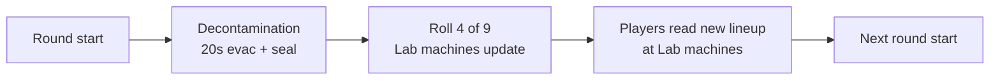

# 13 - Perks

Full roster, costs, **base + Mega** descriptions (table + prose), per-slot randomization, stacking behavior, and the baseline player-HP / zombie-damage model.

> **Final requirements:** [perk_abilities.md](perk_abilities.md) is the **finalized, at-a-glance requirement list** (every perk's abilities, base + Mega) as of 2026-06-14. This doc is the detailed spec, kept in sync with it — **where they differ, perk_abilities.md wins.** Code is being updated to match these numbers.

## Player HP Baseline

### Stock *Black Ops III* (reference)

- **Without Jugger-Nog:** **3** regular zombie melee hits from full health → down [common BO3 zombies baseline].
- **With Jugger-Nog:** you down on the **5th** melee hit (i.e. **5** hits from full to bleedout — survive **4**, **5th** downs). Sources: [COD Wiki — Juggernog](https://callofduty.fandom.com/wiki/Juggernog) player-facing tables and community testing; *not* a literal “double” hit count vs no-Jug.

### This map (`zm_abandoned_cyber_city`) — authoritative targets

- **No perk:** **100 HP** → **3** hits to down.
- **Jugger-Nog:** **250 HP** → **6** hits to down (**+1** vs stock BO3 Jug's 5).
- **Ultimate Tank (Jug Mega):** **314 HP** → **7** hits to down.

Hit counts assume ~**45** damage per regular zombie melee hit (HP ÷ ~45 → 100=3rd, 250=6th, 314=7th). Open-field melee damage is a baked GDT value, so confirm the **3 / 6 / 7** counts in-game and retune the HP adds if they drift.

## Roster (9 perks)

Seven stock BO3 perks (retuned) + two custom (Deadshot, PhD Flopper). **No 4-perk cap in this map** — players can equip all 9 simultaneously if they can afford them (`level.perk_purchase_limit = 9`). This is a deliberate deviation from stock BO3 to match our "systems stack" design language. **All 9 perks are live today.**

| # | Perk | Cost | Base (what it does) | Mega name | Mega (what the upgrade adds) |
|---:|---|---:|---|---|---|
| 1 | **Jugger-Nog** | 4,000 | **250 HP** → down on the **6th** zombie melee hit (no perk = 100 HP / 3rd). | **Ultimate Tank** | **314 HP** → down on the **7th** hit; **immune to boss abilities** (Subroutine Core / scripted boss disables). |
| 2 | **Quick Revive** | 2,500 | Revive teammates in **2.0 s**; HP regen starts **15% sooner** after damage; solo self-revive. | **Savior** | Revive in **1.0 s**; regen starts **30% sooner**; **+15% move speed** while any other player is downed. |
| 3 | **Speed Cola** | 3,500 | **+50%** reload; faster **barrier board / repair**. | **Sleight of Hand Expert** | **+75%** reload (replaces +50%). |
| 4 | **Double Tap 2.0** | **5,000** | Fires **2 bullets per shot for 1 round of ammo** (≈**2× damage**; double pellets on shotguns) **plus +33%** rate of fire. Excludes Wonder Weapons / Ballistic Knife / explosives. | **Gun Slinger** | **+40%** fire rate; **weapon-swap time −50%** (≈2× faster swaps). |
| 5 | **Stamin-Up** | 2,000 | Sprint lasts **~12 s** (vs ~4 s no perk); **~4 s** stamina recharge; **+7–8%** move speed (mobility caps ~109%). | **The Flash** | **+15% sprint speed** (×1.15, uniform move scalar). |
| 6 | **Mule Kick** | **2,500** | Third primary weapon slot. | **The Armory** | **+25%** ammo capacity per weapon; **all buys 10% cheaper**. |
| 7 | **Deadshot** | 3,500 | **+1.4** headshot bonus (additive); **−25%** recoil (off the 2.1× map base); **ADS snap-to-head** (not on bosses). | **American Sniper** | **+1.8** headshot (replaces +1.4); **−40%** recoil. |
| 8 | **Widow's Wine** | 4,000 | Web grenades (web un-killed zombies ~20 s); self-defense webbing on hit; webbing melee; restock **2** web grenades/round. | **Spiderman** | Hold up to **6** web grenades; restock **4**/round (instead of 2). |
| 9 | **PhD Flopper** | 2,500 | **Immune to fall damage and your own explosive / grenade / projectile splash**; **slide-to-explode** (starting a slide fires a purple nova that clears nearby zombies, on a cooldown — BO3 ZM has no dive); **explode when you go down** (PhD-flavoured last-stand). | **PhD Slider** | A **bigger / stronger slide + down explosion** — radius **300→500u**, ~**2× damage**, shorter cooldown. |

**Sources (stock vs custom):** Perks **1–6 and 8** are stock BO3 machines (retuned — see table). **7** Deadshot and **9** PhD Flopper are **custom** (from-scratch abilities — not stock BO3 perks). PhD **hijacks the registered stock electric-cherry pipeline + its machine** (the underlying specialty is still `specialty_electriccherry`, exactly as the old Aura Blast placeholder did) — our module `_acc_perk_phd_flopper.gsc` overwrites the cherry cost/hint/give/take and installs a custom `level.perk_damage_override` immunity func; **the ability is entirely our code** (adapted from the shipped HarryBo21 / ColDog PhD Flopper), NOT the stock reload-shockwave. Widow's Wine (8) base is pure stock; its **Spiderman** Mega is custom.

**Mega** tiers are all map-specific. **All 9 perks are live today.**

Buying all 9 = **29,500 Points** (Double Tap **5,000**). Hitting that by round ~25 is possible with dedicated economy play (Payroll Ledger boss item + high-round headshot farm).

The table above is a **complete at-a-glance** summary (base + Mega). Below, **[Perk reference (base + Mega)](#perk-reference-base--mega)** gives **full paragraphs** you can read start-to-finish, then **Mechanics** for exact numbers. **How** to acquire Mega (bottles, Lab machine, persistence) is in **[Mega Bottles (system)](#mega-bottles-system)**.

## No-Perk-Limit Rule

- The stock BO3 4-perk cap is explicitly **removed** in this map.
- All 9 perks can stack on a single player (`level.perk_purchase_limit = 9`).
- **Implementation**: override `_zm_perks` slot-limit check at init. See `_acc_perks.gsc` (Phase 3 module, planned).
- **Co-op**: same rule; each player can hold all 9.

### Why remove the cap

- Stock BO3's 4-perk cap is a balance decision Treyarch made to force choice. We're deliberately making a different trade: with no cap, the *choice* becomes **what to buy first** rather than what to forego. A round-10 player can afford ~2-3 perks; a round-30 player can afford most. Order and prioritization matter, not a fixed ceiling.
- Our other systems (Cyberware, Tier, Overclocks, Boss Items) already provide the decision tension. Another forced-choice layer from a perk cap would be redundant.
- It supports the "systems stack" design — the map wants layered progression to be visible to players.

## Perk reference (base + Mega)

Read **top to bottom** for full prose on every perk. Each entry has a **Base** description (what you buy with Points), a **Mega** description (what you unlock with an **Empty Mega Bottle** at a Lab machine when that perk is on rotation — no extra Points), then **Mechanics** with numbers and stacking. Bottle acquisition, persistence, and UI: [Mega Bottles (system)](#mega-bottles-system).

### 1. Jugger-Nog — 4,000 Points

**Base.** Raises max health to **250 HP** (no-perk base is **100 HP**) — you survive **5** regular zombie melee hits and go **down on the 6th** (no perk: down on the 3rd). Buy Jug for survivability, training, and room for mistakes.

**Mega: Ultimate Tank.** (1) Max health to **314 HP** → survive **6** hits, **down on the 7th**. (2) **Immune to boss abilities** — scripted Subroutine Core disables (power off, perks off, boss-phase stun fields) do not apply to you the way they do to the rest of the team. Scope: any non-wonder-weapon boss/mega "turn off player power" effect; see `11_enemies.md`.

**Mechanics**

- **HP / hit counts** (at ~45 dmg per zombie melee): **100 HP → 3rd · 250 HP → 6th · 314 HP → 7th**. Open-field melee damage is a baked GDT value — confirm hit counts in-game.
- **Stacking**: Cyberware Subroutine Caching; Ghost Shroud.

### 2. Quick Revive — 2,500 Points

**Base.** **Revive teammates in 2.0 s** (vs 3.0 s with no perk). **HP regen starts 15% sooner** after you take damage — begins at **2.04 s** instead of the **2.4 s** baseline (an earlier *start*, not a faster heal rate). **Solo:** self-revive per stock BO3 where applicable.

**Mega: Savior.** (1) **Revive in 1.0 s** — half of base QR's 2.0 s. (2) **HP regen starts 30% sooner** (begins at 1.68 s) — upgraded from base QR's 15%. (3) **+15% move speed** (×1.15) while any *other* player is downed / bleeding out; clears the moment nobody is down (your own down does not count).

**Mechanics**

- **Revive time:** no perk **3.0 s** → base QR **2.0 s** → Savior **1.0 s**.
- **Regen delay:** baseline **2.4 s** → base QR **2.04 s** (15% sooner) → Savior **1.68 s** (30% sooner). Heal rate is unchanged; the % is the delay reduction.
- **Move speed:** Savior **×1.15** while a teammate is in last-stand (multiplicative with other speed buffs).

### 3. Speed Cola — 3,500 Points

**Base.** **+50% reload speed** and **faster barrier board / repair** animations (stock). Weapon swap is **not** a Speed Cola effect — it lives on Double Tap's Gun Slinger Mega. *(A faster perk-drink animation was considered but **cut** 2026-06-14 — the drink anim is shared map-wide with no per-perk lever, so it can't be gated to Speed Cola owners.)*

**Mega: Sleight of Hand Expert.** **+75% reload** (replaces the base +50%), delivered by the per-gun `fastreload` weapon-variant twin (`reloadTime ×0.857` layered on the engine's +50%).

**Mechanics**

- **Reload:** base **+50%** (stock engine, off the specialty) → Mega **+75%** (replaces, not additive; the `fastreload` weapon-variant twin layers `reloadTime ×0.857` on top of the engine +50%).
- **Barrier repair:** faster (stock).

### 4. Double Tap 2.0 — 5,000 Points

*The full stock Double Tap II Root Beer — kept as-is (the extra bullet can't be stripped from a usermap, so we embrace + balance around it).*

> **Design decision (2026-06-14):** the base perk IS the stock `specialty_doubletap2` machine,
> which fires an **extra bullet per shot** (≈2× damage). There is no usermap-side way to remove
> that, so we **keep Double Tap 2.0** (the old "convert to a rate-only 1.0" plan is cancelled) and
> price/balance around what we have: **5,000** (up from ~2,000) because doubling bullet output is
> a major damage perk. The Mega (Gun Slinger) adds fire rate + swap via the `fastfire` twin.

**Base (Double Tap 2.0).** **Fires 2 bullets per shot for the cost of 1 round of ammo** (double pellets on shotguns) — effectively **~2× damage output** — **plus +33% rate of fire** (stock). Does **not** apply to Wonder Weapons, the Ballistic Knife, or explosive weapons.

**Mega: Gun Slinger.** **+40% fire rate** (on top of the 2.0 base); **weapon-swap time reduced 50%** (≈2× faster weapon swaps — moved here from Speed Cola).

**Mechanics**

- **Damage:** the stock 2.0 extra bullet ≈ **×2** output per trigger pull (1 ammo spent), excluding WW / ballistic knife / explosives.
- **Fire rate:** base **+33%** → Gun Slinger **+40%** (`fastfire` twin, `fireTime ×0.714`).
- **Weapon swap (Mega only):** **−50%** swap time (×0.5 duration).

### 5. Stamin-Up — 2,000 Points

**Base.** Sprint lasts **~12 s** (vs ~4 s with no perk); stamina refills in **~4 s** after it depletes; **+7–8% movement speed** (overall mobility caps ~109%). Sprint is still finite. (Stock BO3 engine values.)

**Mega: The Flash.** **+15% sprint speed** (×1.15) — applied as a uniform move-speed scalar (BO3 has no sprint-only speed lever, so it raises all movement). No sprint-duration change (base already grants the ~12 s reserve).

**Mechanics**

- **Sprint duration:** no perk **~4 s** → Stamin-Up **~12 s** → The Flash unchanged.
- **Move speed:** base Stamin-Up **+7–8%** → The Flash adds **×1.15**.
- **Stacking**: Neural Boots, Reflex T1 (multiplicative speed terms).

### 6. Mule Kick — 2,500 Points

**Base.** A **third primary weapon slot** so you can run close / mid / long without returning to the box.

**Mega: The Armory.** **+25% ammo capacity** per weapon (reserves); **all buys 10% cheaper** — every point purchase (wallbuys, ammo, perks, Pack-a-Punch, Mystery Box) costs **10% less** (×0.9) while you hold The Armory.

**Mechanics**

- **Base**: third primary; **2,500** pts.
- **Mega — The Armory**: **+25%** reserve ammo per gun; **×0.9** cost on all point purchases.

### 7. Deadshot — 3,500 Points (custom — not a stock BO3 perk)

**Base.** **+1.4 headshot damage bonus**, **−25% weapon recoil** (off the 2.1× map base → 1.575× vanilla), and **ADS snap-to-head** (auto-aim to the nearest head while aiming; not on bosses).

**Mega: American Sniper.** **+1.8 headshot** (replaces the base +1.4 — no double-dip); **−40% recoil** (→ 1.26× vanilla). Head-snap is inherited from base (unchanged).

**Mechanics**

- **Headshot bonus** is **summed** (additive, 2026-06-14) with the map's base headshot bonus (**+2** trash / **+2** boss), then ×stock ~1.5: base Deadshot ≈ 1.5 × (2.0 + 1.4) = **×5.1** trash & boss vs body; American Sniper ≈ 1.5 × (2.0 + 1.8) = **×5.7**.
- **Recoil:** base **−25%** → Mega **−40%** (off the 2.1× map base; delivered by the `recoil25`/`recoil40` weapon-variant twins).

### 8. Widow's Wine — 4,000 Points

**Base (stock BO3 Widow's Wine).** Your lethal becomes **Widow's Wine grenades** (sticky / Semtex-like) — zombies caught in the blast but not killed are trapped in webs (~**16 s** frozen close in, ~**12 s** slowed further out — stock `WIDOWS_WINE_COCOON_DURATION`/`_SLOW_DURATION`). **Self-defense webbing:** when a zombie melees you, you release a web burst trapping nearby zombies. **Webbing melee:** meleeing a zombie webs/slows it. Web grenades **restock 2 at the start of each round** (also on Max Ammo and from blue spider-drop pickups).

**Mega: Spiderman.** Hold up to **6** web grenades; **restock 4 each round** (instead of 2).

**Mechanics**

- **Base**: web grenades, self-defense webbing, webbing melee, **2**/round restock — all stock.
- **Mega — Spiderman**: **6** max web grenades; **4**/round restock.

### 9. PhD Flopper — 2,500 Points (custom ability — hijacks the stock cherry pipeline)

**Base.** Three abilities: **(1) Immunity** — you take **no fall damage** and **no splash damage from your own explosives, grenades, or projectiles** (rockets, frags, the launcher, etc. can't hurt you). **(2) Slide-to-explode** — starting a **slide** fires a **nova** that clears the zombies around you (on a cooldown). BO3 ZM has the sprint-slide but **no dolphin-dive** (confirmed in-game 2026-06-15), so it triggers off the engine `isSliding()` directly — not the BO1/BO2 dive-to-prone. **(3) Explode when you go down** — entering last-stand fires a PhD-flavoured explosion, buying you space to be revived. The blast is a **purple/void Apothicon burst** (stock `dlc4/genesis/fx_apothicon_fury_spawn_in_exp`) + the **Nuke-powerup "whoomp"** sound (`evt_nuke_flash`) + a screen-shake.

**Mega: PhD Slider.** A **bigger / stronger slide + down explosion** on a **shorter slide cooldown** (8s → 5s). Read live from the Mega flag: the explosion **radius grows 300→500u** and deals roughly **2× damage**. It is a **working Mega** — not a declarative tier; the Empty Mega Bottle sets the flag and the bigger nova fires immediately.

**Mechanics**

- **Trigger**: passive — fall-damage / self-splash immunity is always on; the nova fires when you start a **slide** (cooldown-gated), and again when you enter last-stand. No input chord.
- **Base**: custom fall-damage + self-splash immunity (via a `level.perk_damage_override` func), a slide-triggered nova, and a down-state explosion. Radius **300u**, base damage, **8s** slide cooldown.
- **Mega — PhD Slider**: the same slide + down nova at radius **500u**, ~**2× damage**, and a **5s** slide cooldown (read live from the Mega flag — implemented, not a TODO).
- **Blast FX/sound**: the burst centres on the **zombie you slid into** (nearest in-radius zombie = the impact point, not the player) — a stock purple **Apothicon void-burst** (`dlc4/genesis/fx_apothicon_fury_spawn_in_exp` — source ships in the Mod Tools; `def_explosion` is the fallback), `evt_nuke_flash` (the Nuke powerup boom, guaranteed-loaded), and an `Earthquake`. The original `grenadeExplosionEffect` was just the tiny engine poof and `zmb_phdflop_explo` isn't in this map's soundbanks (silent). A *bespoke* purple FX would need the FX Editor / a custom import.
- **Zombies explode**: every zombie the nova kills pops apart — **head-gib** (`zombie_utility::zombie_head_gib`, the Nuke powerup's own dismember, called on the live zombie pre-kill) + a **torso gore burst** (`level._effect["zombie_guts_explosion"]`) + a **capped corpse-fling** (`StartRagdoll`+`LaunchRagdoll`, the stock Thunder Wall pattern; cap 6 / Mega 8). Gated on `health <= damage` so a living **boss** is only chipped, never gibbed/ragdolled. All stock — no import.
- **Implementation**: `_acc_perk_phd_flopper.gsc` **hijacks the registered stock `_zm_perk_electric_cherry` pipeline + machine** — it overwrites the cherry cost/hint/give/take and installs the `level.perk_damage_override` immunity func, then layers the slide / down explosion in our code (adapted from the shipped HarryBo21 / ColDog PhD Flopper). The underlying specialty stays `specialty_electriccherry` (HasPerk / rotation / HUD / Mega plumbing all key off it). The old `_acc_perk_electric_cherry.gsc` was **deleted**.
- **Skin**: machine = stock placeholder `p7_zm_vending_nuke` model (fits PhD's explosion theme and avoids a game-rip vending import); icon = Ronan's Cyberpunk "exo_flopper" (`i_acc_perk_phd_base` / `_mega`) on the LUI perk bar; bottle = stock `zombie_perk_bottle_cherry`.
- **Build fit**: aggressive movement + crowd clearing on landing; self-explosive-safety; down-state self-defense.

## Mega Bottles (system)

**Mega** perk tiers (Savior, Gun Slinger, Ultimate Tank, etc.) are **not** bought with Points. They unlock by spending **Empty Mega Bottles** at Lab machines when the base perk is in the current rotation — full **Mega** descriptions are in [Perk reference (base + Mega)](#perk-reference-base--mega) under each perk’s **Mega: … (full description)**.

### Acquisition Loop

- **Drop rate**: **1 Empty Mega Bottle is guaranteed on every boss kill** — both mini-boss (Juggernaut Host, rounds 10 / 20) and full boss (Subroutine Core, rounds 30+).
- **Additional to** the 6-item boss-drop pool — Mega Bottles do NOT take one of the 6 item-pool slots. They are a separate drop resource.
- **Inventory**: unlimited stack, per-player (counter on `self.acc_mega_bottles`).
- **In 4p co-op**, each player independently receives 1 bottle per boss kill.
- **Realistic rate**: 50-round run with 5 boss kills (r10 + r20 + r30 + r40 + r50) = **5 Mega Bottles per player max**. You cannot Mega all 9 perks in a single run. Decisions matter.

### Usage

1. You must **already own the base perk** (bought normally from a Lab machine).
2. The base perk must be **currently in the round's rotation** at one of the 4 Lab machines.
3. Interact with that machine → UI prompt "Apply Mega? (1 Empty Mega Bottle)".
4. Consume 1 Mega Bottle → the base perk upgrades to its Mega variant.
5. **No Points cost** — the bottle IS the cost.

### Persistence Rule

Once a perk is Mega'd on a player, the Mega effect is **sticky** for the rest of the run:

- **If you die** and lose the base perk, your Mega flag remains on `self.acc_mega_perks[perk_id]`.
- **If you re-buy the perk** from a machine (after respawn), it immediately applies the Mega variant — no second Mega Bottle required.
- **Run-end**: all Mega flags cleared (like all other run state).

This means: **the Mega Bottle is a one-time investment per perk per run**. Death doesn't punish your Mega progression.

### Cross-Round Timing Tension

- **You get a Mega Bottle at round 10** (Juggernaut Host kill).
- **You decide you want to Mega Jug**.
- **But Jug isn't in the current (round 11) rotation**.
- **You wait**. Maybe 1-3 rounds until Jug rotates back in.
- **Jug rotates in at round 13**. You rush to Lab, interact, consume bottle, Jug becomes Ultimate Tank.

This mirrors the existing perk-rotation decision texture. Mega-ing a perk is a **two-step commitment**: 1) own the perk, 2) wait for rotation, 3) apply bottle. Players will strategize which perk to Mega first based on current round and rotation odds.

### Mega damage stack example

PaP L5 + Tier 5 FAL + American Sniper + Overload Cyberware + Precision Mode ability + clean headshot on an elite:

- Base damage, then the headshot **crit bonus** (the stock GDT headshot mult **+** our **+2.0** trash bonus **+** American Sniper **+1.8**, which **ADD** — additive stacking, 2026-06-14 — they do *not* multiply), then × 1.15 (Cyberware Oc1) × 1.30 (Overload Cyberware T2) × 4.0 (Precision Mode ability) × 1.5 (Overpressure Overclock if rolled) = a large multiple per headshot (illustrative — recompute once the additive crit total + exact PaP/Tier values are locked).

On a boss the headshot bonus is the **same +2.0 as on trash** (the boss no longer carries a higher headshot multiplier — `ACC_BOSS_HEADSHOT_MULT = 2.0`), so American Sniper's **+1.8** adds equally against any target.

Absurd. Intended for late-game power-fantasy. Tune via the levers at the bottom of the doc if playtest shows this is *unfun* absurd rather than *earned* absurd.

### Co-op Notes

- Mega Bottles are per-player. 4p = 4 bottles per boss kill collectively (but each player holds their own).
- Cannot give a Mega Bottle to a teammate.
- In 4p, a full boss kill means 4 players each get +1 bottle. Over 5 bosses = 20 bottles total. Teams can coordinate who Mega's what for efficient role specialization.

### Mega HUD

HUD indicators:

- **Mega Bottle counter** next to Data Shards counter (lower-left). Format: `Bottles: 2`.
- **Mega-flagged perks** show a distinct perk icon (e.g. gold border) in the perk row.
- **Machine prompt** when standing near a rotating machine that dispenses a perk you own: "[Hold F] Apply Mega (1 Bottle)".

See [14_controls_and_hud.md](14_controls_and_hud.md) for HUD element spec.

### Implementation

- [`scripts/zm/zm_abandoned_cyber_city/_acc_mega_bottles.gsc`](../scripts/zm/zm_abandoned_cyber_city/_acc_mega_bottles.gsc) is the dedicated module (Phase 3/4 authoring).
- Drop hook: `_acc_boss.gsc` calls `_acc_mega_bottles::on_boss_death(killer)` on both mini-boss death (`watch_mini_boss_death`) and full boss death (in `run_full_boss` tail).
- Mega flags: `self.acc_mega_perks[specialty_string]` is set true when Mega applied. Perk machines check this flag when dispensing.
- Effect application: when a Mega'd perk is acquired, the perk's `on_acquire` function checks `self.acc_mega_perks[id]` and applies the Mega deltas in addition to base effects.

### Tuning Levers

- **Drop rate too generous**: only full bosses drop Mega Bottles (mini-bosses give 50% chance).
- **Drop rate too stingy**: mini-bosses give 2 bottles each.
- **Mega too strong**: reduce specific Mega effects (e.g. American Sniper +1.8 → +1.6 headshot bonus, Gun Slinger +40% → +35% fire rate).
- **Rotation timing frustrating**: allow Mega application at ANY perk machine as long as the player owns the base perk (decouple from rotation). Simpler but less texture.

## Perk Availability: Per-Round Door-Gated Lab Alcoves

**All 9 perks are consolidated to the Laboratory**, each in its **own door-gated alcove** on the Lab north wall (nowhere else on the map). **IMPLEMENTED 2026-06-16** (`tools/add_perk_alcoves.js` geometry + `_acc_perk_doors.gsc`): every round, a **random 3 of the 9 alcove doors open** (`acc_perk_door_<specialty>` `script_brushmodel` gates); the other 6 are walled off and **unbuyable that round**. The roll re-shuffles each round (`acc_round_start`). A closed door blocks *access to the machine* only — a perk you already own keeps working. **Dev: all 9 open** (follows `acc_open_map`; force with `acc_perk_doors_all_open 1`); a ship build launches `acc_open_map 0` to enable the rotation.

*(Supersedes the earlier "4 machines reassign to 4-of-9" plan — that targeted `acc_lab_perk_a..d` machines that were never placed, so `_acc_map_randomizer::watch_round_for_perk_rotation` was inert and is now disabled. The map has all 9 real machines; gating is purely the door layer.)*

**Tuning levers:** `ACC_PERK_DOORS_OPEN_PER_ROUND` in `_acc_perk_doors.gsc` (default 3-of-9) — raise if a starved feel emerges. The doors currently re-roll on `acc_round_start` (round start), NOT gated to the decontamination-complete tick the old plan used; revisit if the timing should align with decon.

### How it works

- **Round 1 rotation**: rolled **after** round 1’s decontamination completes (see [03_layout.md](03_layout.md)).
- **Subsequent rotations**: same — **after** each round’s decontamination phase, not at `acc_round_start`.
- **Machine assignments are team-wide.** Every player sees the same 4 options at the Lab that round (once the roll has run).
- **Purchase is per-player.** One player buying Jug from Machine A doesn't block teammates from also buying Jug from the same machine that round.
- **Owned perks retain across rounds.** The rotation only changes what's *available at machines*, not what any player is holding. If you bought Jug in round 3 and Jug isn't in the round 4 rotation, you still have Jug.

### Rotation Rules

**Hard constraints:**

1. **No duplicates in the 4-slot rotation.** 4 distinct perks per round.
2. **Equal weights in v1.0.** Each of the 9 perks has 1/9 odds for any slot. Jugger-Nog is in the pool at the same weight as everything else - no guaranteed-placement rule.
3. **Round 1 gets a rotation.** You might buy Jug immediately, or might have to wait several rounds. See probability notes below.

**Soft rules (tuning surface):**

- **Locked-out set changes every round** - a perk unavailable this round can reappear next round.
- **No "can't repeat 3 rounds in a row" cooldown** on any perk in v1.0. Could be added as a mitigation if a perk gets cheesed too often.
- **No weight bump on high-value perks** in v1.0. Pure random. If playtest shows Jug-less early runs feel terrible, we weight Jug up or guarantee it in the first-round roll.

### Probability Notes

- Probability a specific perk (e.g. Jug) appears in a single round's rotation: **4/9 ≈ 44.4%**.
- Probability Jug does NOT appear for N consecutive rounds:
  - 1 round: 5/9 ≈ 55.6%.
  - 3 rounds: (5/9)^3 ≈ 17.1%.
  - 5 rounds: (5/9)^5 ≈ 5.3%.
  - 10 rounds: (5/9)^10 ≈ 0.28%.
- **A Jug-less first 5 rounds has a ~5% probability.** If that feels terrible in playtest, add a weight bump or a "Jug guaranteed in first-round rotation" rule, or raise the machine count. See "Tuning Levers" below.

### Per-run variance

- C(9, 4) = **126 distinct 4-perk rotations** possible each round (just the set, not the ordering).
- Every round re-rolls independently. A 50-round run has 50 independent rolls; the space of run histories is effectively unbounded.
- The player's skill is **route management** (Lab visits cost time) + **patience** (waiting for the right rotation) + **value recognition** (knowing which of the 4 offered is most worth your Points).

### Player Adaptation (the real skill loop)

Each round the player asks:

1. **What's in the rotation?** (Only answerable by running to Lab and checking - costs time.)
2. **What do I already own?** (Don't re-route for perks you have.)
3. **What can I afford?** (Point budget.)
4. **What's worth waiting for?** (If this round offers only Stamin-Up + Mule Kick + Deadshot + Widow's Wine and you're down-to-die at 1-hit, skip perk buy and save Points for next round hoping Jug rolls.)

Missing a perk this round is OK. It'll cycle back. **Patience and route management become core skills.**

### Decision tension created

1. **Lab travel time is real.** Every round you weigh "is it worth the trip?" The Lab is in one corner of the map; you'll be 1-2 zones away at round start typically.
2. **Single-round perk windows are cheap.** If Jug rolls up, it's probably worth buying now. Waiting to "see if more options appear" means Jug might be gone for 3+ more rounds.
3. **Buy order matters more than ever.** Cheap perks (Double Tap 2,000 / Stamin-Up 2,000) look tempting when offered, but Jug (4,000) is objectively more valuable. Sometimes you skip a cheap offer this round to save Points for a hoped-for Jug next round.
4. **Lab is now the map's "pulse."** Every round transition, every player eyes the Lab. It changes the rhythm of the map - Ameliorama-style "check the shop between waves" but triggered round-by-round.

### Implementation

- [`_acc_map_randomizer.gsc::roll_perk_rotation()`](../scripts/zm/zm_abandoned_cyber_city/_acc_map_randomizer.gsc) runs **after** `acc_decontamination_complete` (or equivalent **20s** delay when a seal applies), **not** immediately on `acc_round_start`. Until `_acc_decontamination.gsc` exists, stub with `wait 20` after round start or a single `waittill( "acc_decontamination_complete" )`.
- `level.acc_perk_rotation` (array of 4 perk specialty strings) holds the current round's machines.
- Each Lab perk machine in Radiant reads its slot index (`lab_a`, `lab_b`, `lab_c`, `lab_d`) and looks up `level.acc_perk_rotation[slot_index]`.
- Visual transition **after decontamination**: machine advertisement / skin switches to the new perk. (Phase 4 art/LUI work.)
- Round flow: `_acc_main.gsc::watch_round_transitions` emits `acc_round_start` → decontamination system runs → **`acc_decontamination_complete`** → `_acc_map_randomizer.gsc` re-rolls perks.

## Perk Machine Behavior

- **Interaction**: hold [use] on active perk machine.
- **Power gate**: machines require map power on.
- **Perks retained through down/revive**: yes (stock behavior).
- **Perks lost on death (respawn)**: yes (stock behavior).
- **Quick Revive auto-refund in solo**: once per run, first death only.
- **No max cap**: the "has space for perk" check in stock BO3 is bypassed.

## Powerup Interactions

- **Insta-Kill**: Deadshot's +1.4 headshot bonus still applies during Insta-Kill (redundant for regulars since they insta-die, but relevant for elites/bosses).
- **Double Points**: 2x base kill Points BEFORE 70/30 split, Payroll Ledger's +10% on top.
- **Max Ammo**: no perk interaction.
- **Carpenter**: no perk interaction.
- **Perk Bottle** (random perk drop): not in v1.0.

## Co-op Perk Rules

- Perks are **per-player**.
- No shared lockout — multiple players can buy the same perk at the same machine simultaneously.
- Reviving does NOT drop perks.
- Dying (not reviving from down in time) drops all perks.

## Full Stacking Example — "Swiss Army Player" Build

A player with **all 9 live perks** + good Cyberware + boss items + PaP L5 + Tier 5 FAL:

- **HP**: **250 HP** → 6-hit survival with Jug; **314 HP** → 7 hits with Ultimate Tank.
- **HP regen**: starts 15% sooner (Quick Revive) / 30% sooner (Savior).
- **Revive**: 2.0 s (Quick Revive) / 1.0 s (Savior).
- **Reload**: +50% reload (Speed Cola) / +75% (Sleight of Hand Expert).
- **Move / sprint**: ~12 s sprint + ~7–8% move (Stamin-Up); +15% sprint speed (The Flash); +15% move while a teammate is down (Savior); plus Cyberware / Boss-item speed terms (multiplicative).
- **Fire rate**: +33% (Double Tap 2.0 base) / +40% (Gun Slinger); Gun Slinger also cuts weapon-swap time 50%. Base also fires an extra bullet per shot (≈2× dmg).
- **Headshot damage**: +1.4 (Deadshot) / +1.8 (American Sniper) **added** to the map's +2 trash / +2 boss headshot bonus (additive stacking, 2026-06-14); recoil −25% / −40%.
- **Weapon slots**: 3 primaries (Mule Kick); +25% ammo & all buys 10% cheaper (The Armory).
- **Crowd control**: Widow's Wine web grenades + self-defense webbing + webbing melee (6 grenades / 4-per-round restock with Spiderman); PhD Flopper slide-to-explode nova clears zombies (and explodes when you go down) — immune to fall + your own splash damage throughout.

Add **Cyberware full branch** + **2 Boss Items** + **PaP L5 + Tier 5 with 5 Overclocks** on 2 weapons = our peak power fantasy. Reaching that takes a full 30+ round commitment; it's a reward for sustained play, not a baseline.

## Implementation Status

> **⚠️ Spec finalized 2026-06-14; GSC reconciled to it the same day.** The requirements are the **table + per-perk prose above** (kept in sync with [perk_abilities.md](perk_abilities.md)). The ledger below is the **implemented-vs-spec status** after the overhaul. The old pre-finalization audit (further down) is kept only for code-location reference.

### Implemented ledger (code now matches the spec)

**Legend:** ✅ done in GSC (cited) · 🎨 GDT/APE only — no GSC lever, see [30](30_perk_gdt_radiant_spec.md)/[31](31_ape_perk_gdt_walkthrough.md) · 🧪 confirm number in-game.

- **Jugger-Nog** — ✅ base 250 HP (`_acc_perks.gsc` `ACC_JUGG_HEALTH_ADD=150`); ✅ Ultimate Tank 314 HP (`_acc_mega_bottles.gsc:420` `n_player_health_boost=64`); ✅ boss immunity (`_acc_boss.gsc::protect_immune_players_during_debuff`). 🧪 confirm 6/7 hit counts.
- **Quick Revive** — ✅ base revive 2.0s / Savior 1.0s (`_acc_perks.gsc::qr_revive_time` via `self.get_revive_time` hook; watcher `qr_revive_watcher`); ✅ base regen 15% / Savior 30% sooner (`qr_regen_booster`, `ACC_QR_REGEN_DELAY_BASE=0.85` / `_SAVIOR=0.70`); ✅ Savior +15% speed (`savior_speed_watcher` + `_acc_utility.gsc:155`).
- **Speed Cola** — ✅ +50% reload + barrier (stock); ✅ Mega +75% reload via the `fastreload` weapon-variant twin (`reloadTime ×0.857` layered on the engine +50%; baked 2026-06-14, `_acc_weapon_variants.gsc::axis_reload`); ✂️ faster perk-drink **cut** (shared map-wide anim, no per-perk lever). Weapon-swap belongs to Double Tap's Gun Slinger.
- **Double Tap 2.0** — ✅ **kept as stock Double Tap 2.0** (`specialty_doubletap2`, extra bullet ≈2× dmg) — the "convert to a rate-only 1.0" plan is **cancelled** (can't strip the extra bullet from a usermap); priced **5,000** (`set_perk_costs`) and balanced around it; ✅ **damage buff removed** (`_acc_damage.gsc` DT block + defines deleted); ✅ Gun Slinger **+40%** fire rate **and** −50% weapon-swap via the `fastfire` twin (`fireTime ×0.714` + raise/drop `×0.5`; retuned from +50%/−75% 2026-06-14, `axis_fire`). Card "Double Tap 2.0".
- **Stamin-Up** — ✅ base stock sprint; ✅ The Flash ×1.15 move (`_acc_utility.gsc:151`); ✅ sprint-duration override removed (`_acc_mega_bottles.gsc`).
- **Mule Kick** — ✅ base 3rd primary (stock); 🎨 Armory +25% ammo cap (GDT; GSC fills via `armory_apply`); ✅ Armory **all buys 10% cheaper at POINT OF SALE** (charge **and** displayed price) — done by **vendoring 5 stock files** and repurposing the dormant `pers_double_points` cost hook (gated on the Armory Mega flag, ×0.9): `_zm_pers_upgrades_functions` (perk + stock-PaP charge), `_zm_weapons` (wallbuy/ammo — inert now wall buys are removed), `_zm_magicbox` (box, per-player), `_zm_perks` (perk hint), plus `_acc_pap_levels` tier-up. The old spend-rebate (`armory_discount_watcher`) was **removed**. Co-op display reflects the toucher on shared triggers (perks); box/tier are per-player-exact. See docs/22 + CHANGELOG. ✅ +2 grenade fill removed.
- **Deadshot** — ✅ base **+1.4** headshot (`_acc_damage.gsc` `ACC_DEADSHOT_MULT`) + ADS snap, no boss; ✅ American Sniper **+1.8** headshot (`ACC_DEADSHOT_MEGA_MULT=1.8`, replaces base — no double dip); both **add** into the headshot bonus sum (additive stacking, 2026-06-14), not multiply; ✅ base −25% / Mega −40% recoil via `recoil25`/`recoil40` twins (off the 2.1× map base; baked 2026-06-14, `axis_recoil`).
- **Widow's Wine** — ✅ base webs / self-defense / webbing melee (stock); ✅ +50% frag damage removed; ✅ Spiderman melee + web OHK removed (`_acc_damage.gsc`); ✅ restock base 2 / Spiderman 4 per round (`_acc_mega_bottles.gsc::widow_round_restock_watcher`); 🎨 Spiderman hold 6 (GSC fills the clip; GDT clip cap — doc 30).
- **PhD Flopper** — ✅ **live.** Custom ability hijacking the registered stock `_zm_perk_electric_cherry` pipeline + machine: `_acc_perk_phd_flopper.gsc` overwrites the cherry cost/hint/give/take (cost **2,500**) and installs a `level.perk_damage_override` immunity func, then layers our own ability (adapted from the shipped HarryBo21 / ColDog PhD Flopper): ✅ immunity to fall damage **and** your own explosive / grenade / projectile splash; ✅ dive-to-prone grenade-explosion nova (jump → slide with a real height drop); ✅ explode-on-down last-stand. The underlying specialty stays `specialty_electriccherry` (HasPerk / rotation / HUD / Mega plumbing key off it). The old `_acc_perk_electric_cherry.gsc` was **deleted**. ✅ **PhD Slider** Mega is a **working tier** (not a TODO) — read live from the Mega flag, the dive + down explosion grows to radius **500u** (from 300u) and ~**2× damage**. 🎨 machine = stock placeholder `p7_zm_vending_nuke` (fits PhD's explosion theme, avoids a game-rip vending import); icon = Ronan "exo_flopper" (`i_acc_perk_phd_base`/`_mega`); bottle = stock `zombie_perk_bottle_cherry`.

---

**Original pre-finalization audit (for code locations only):** Audited 2026-06-13, GSC fixes applied 2026-06-14 (24-agent audit → per-perk research+verify → hand-applied, `lint_gsc_xref.js` clean). The non-GSC remainder is detailed in **[30_perk_gdt_radiant_spec.md](30_perk_gdt_radiant_spec.md)**.

> **⚠️ The Status column in the table below is PRE-FINALIZATION and now STALE.** It predates the 2026-06-14 weapon-variant twin matrix + perk overhaul. Several rows are wrong — e.g. Speed Cola "+65% / drink", "Double Tap 2.0", American Sniper "×1.75 / no recoil", Deadshot "−25% / −50%", and the "GDT-only / cut" verdicts on reload / fire-rate / recoil (all now **built** via `_acc_weapon_variants.gsc` twins). **Trust the "Implemented ledger" above, not this table** — it's kept only for the `file:line` code citations.

**Status legend:** **OK** = real code grants it (cited). **OK\*** = GSC implemented
but the exact tuning number needs an in-game confirm (depends on a baked GDT
constant). **PARTIAL** = GSC half done, full magnitude needs a GDT bump (doc 30).
**STOCK** = provided by the stock pipeline once the specialty is given. **GDT** =
no GSC lever; needs an Asset-Editor edit (doc 30). **MISSING** = no backing /
spec blocker.

### Two cross-cutting facts

1. **Baked weapon stats are delivered via the weapon-variant twin matrix** (UPDATED
   2026-06-14 — this fact was originally "zero `.gdt`, no GSC lever"). The map now ships
   `source_data/acc_weapon_variants.gdt` (generated by `tools/apply_recoil_overhaul.js`):
   fire rate, recoil, reload timing, weapon-swap, and ammo *capacity* are each a cloned
   "twin" GDT the GSC swaps in while the qualifying perk is held (`_acc_weapon_variants.gsc`
   axes). So Deadshot recoil, Gun Slinger rate/swap, Sleight reload, and Armory ammo are all
   **built**, not "no GSC lever". Blast radius (Widow frag) is still an APE-only GDT edit —
   see [doc 30](30_perk_gdt_radiant_spec.md).
2. **`_acc_perks.gsc` now exists** (authored 2026-06-14) and hosts the base-perk
   GSC retuning (Jug 3/6, QR regen, Savior revive + speed). Cap-removal stays
   inline in the entry script.

### Per-perk ability ledger

**Citations re-verified 2026-06-14** against literal code by a 55-agent audit
(each requirement opened + adversarially refuted; stale line numbers corrected
below). The earlier prose `45`-damage melee assumption was disproved and the
grenade-fill field bug was found and fixed — see the notes.

| Perk (specialty) | Ability | Status | Where (or why not) |
|---|---|---|---|
| **Jug** (`armorvest`) | base 6-hit model | OK\* | `_acc_perks.gsc::tune_jugg_health` sets `zombie_perk_juggernaut_health=150` → **250 HP** (read live by `_zm_perks.gsc:803`). **Melee correction:** the open-field melee that downs you is a **baked GDT stat NOT readable from script** — the in-script `60` (`_zm_spawner.gsc:358`) is the *board-hit* value, and "@ melee 45" was an unverified assumption. Exact hit count **must be confirmed in-game**; if not 6, retune `ACC_JUGG_HEALTH_ADD` (the only lever) |
| | cost 4,000 | OK | `zm_abandoned_cyber_city.gsc:326` |
| | Mega Ultimate Tank +1 hit | OK\* | `_acc_mega_bottles.gsc:418` armorvest case = `+50` HP → **300 HP**, survives revives via stock `health_reboot` recompute. "+1 over base" inherits base Jug's in-game melee confirmation |
| | Mega boss-ability immunity | OK | `_acc_boss.gsc::protect_immune_players_during_debuff` re-grants immune holders' perks during disable_*_for. *Caveat: power-off is a global flag, so the holder's traps still go dark — only owned perks are preserved* |
| **Quick Revive** (`quickrevive`) | base faster teammate revive | STOCK | `_zm_laststand.gsc:1156` halves revive to 1.5s when the reviver owns the specialty |
| | base +30% HP regen after damage | OK\* | `_acc_perks.gsc::qr_regen_booster` (regen window opens ~30% sooner, then parallel ramp). *Verified: ZM has NO per-player regen-rate hook (MP-only), so "earlier start" is the strongest GSC-reachable interpretation — design call: accept, or reword card to "+30% faster regen start"* |
| | base solo self-revive; cost 2,500 | STOCK / OK | stock; cost `…gsc:327` |
| | Mega Savior revive ×0.6 | OK | `_acc_perks.gsc::savior_revive_time` via `self.get_revive_time` hook, consumed at `_zm_laststand.gsc:1163` (1.5s→0.9s; sole writer of the hook — grep-confirmed) |
| | Mega Savior +15% move while teammate down | OK | `_acc_perks.gsc::savior_speed_watcher` + `×1.15` term in `_acc_utility.gsc:155` |
| **Speed Cola** (`fastreload`) | base +50% reload + barrier | STOCK | engine response to the specialty |
| | base ~40% shorter drink; ~30% faster swap; cost 3,500 | GDT / OK | **No GSC lever (proven):** grep over stock = zero drink-/swap-time setters; anim/timing assets, APE-only and map-wide — [doc 30](30_perk_gdt_radiant_spec.md); cost `…gsc:328` |
| | Mega +65% reload / +15% switch / +15% drink | GDT | no GSC reload/swap setter (proven); unconditional GDT or **cut** — [doc 30](30_perk_gdt_radiant_spec.md) |
| **Double Tap 2.0** (`doubletap2`) | base +33% fire rate | STOCK | engine-granted free with the specialty (doc abstracts DT to damage-only) |
| | base +3% damage | OK | `_acc_damage.gsc:294-300` (×1.03) |
| | cost 2,000 | OK | `…gsc:329` |
| | Mega Gun Slinger +40% fire rate | DONE | **No runtime lever** (grep-proven: no fire-rate setter/dvar anywhere; stock DT2's +33% is hardcoded to the specialty, `_zm_perk_doubletap2.gsc` has zero rate code). Done via the **`fireTime` weapon-variant swap** — the `fastfire` twin (`fireTime ×0.714`) is `GiveWeapon`'d while Gun Slinger is active (`axis_fire`, baked 2026-06-14) ([doc 30](30_perk_gdt_radiant_spec.md)) |
| | Mega Gun Slinger +6% damage | OK | `_acc_damage.gsc:294-300` (×1.06, true if/else replaces base — no double-dip) |
| **Stamin-Up** (`staminup`) | base longer/faster sprint; cost 2,000 | STOCK / OK | engine-driven; cost `…gsc:330` |
| | Mega Flash longer sprint | OK | `_acc_mega_bottles.gsc:475` `SetSprintDuration(6.0)` (4.0 stock) + respawn re-apply |
| | Mega Flash +12% run | OK | `_acc_utility.gsc:151` `SetMoveSpeedScale ×1.12` |
| | Mega Flash ×2 walk / ×4 crawl | **cut** | **Engine-impossible (proven):** grep over stock returns ONLY `SetMoveSpeedScale` (uniform) + `SetSprintDuration` — no per-stance walk/crawl setter exists in GSC, GDT, or Radiant. Strike from the card |
| **Mule Kick** (`additionalprimaryweapon`) | base third primary; cost 2,500 | STOCK / OK | pure stock (owning the specialty grants the 3rd slot — **no `additionalprimaryweapon_limit=3` line exists in our code**; old citation was wrong); cost `…gsc:331` |
| | Mega Armory +2 lethal / +2 tactical | PARTIAL | `armory_apply` fills the **lethal/tactical CLIP** to cap (**field bug fixed 2026-06-14:** `SetWeaponAmmoStock` → `SetWeaponAmmoClip`; ZM carries grenades in the clip, `_zm.gsc:4582`). The `+2`-over-stock needs the grenade-GDT carry cap raised in APE — [doc 30](30_perk_gdt_radiant_spec.md) |
| | Mega Armory +25% ammo (reserves) | DONE (2026-06-14) | +25% reserve via the **"ammo" weapon-variant twin** (`maxAmmo`/`startAmmo` ×1.25, gated on the Mega flag — the only way to raise a GDT-baked cap per-player, since the engine clamps reserve to `maxAmmo`, proven). `apply_mega_effects` calls `reconcile()` to swap in the twin, then `armory_apply` `GiveMaxAmmo`-fills to the raised cap; `armory_maxammo_watcher` refills on every Max Ammo; box guns only (`axis_ammo` in `_acc_weapon_variants.gsc`, baked by `tools/apply_recoil_overhaul.js`). Doubles the twin matrix 110→230 |
| **Deadshot** (`deadshot`) | base ADS head-snap, no boss snap | STOCK + OK | stock snap; boss snap suppressed by `DisableAimAssist()` on the boss actor (`_acc_boss.gsc:218,371`) |
| | base ×1.5 headshot; cost 3,500 | OK / OK | `_acc_damage.gsc:429-435`; cost `…gsc:332` |
| | Mega American Sniper ×1.75 (replaces 1.5) | OK | `_acc_damage.gsc:429-435` (true if/else, no double-dip) |
| | Mega no recoil | GDT | **No GSC recoil setter exists** (grep = only vehicle/turret kick fields). Needs a `_norecoil` weapon-variant swap in APE — [doc 30](30_perk_gdt_radiant_spec.md) — or cut |
| | Mega snap still on regulars/elites | STOCK | stock |
| **Widow's Wine** (`widowswine`) | base webs / melee / defense | STOCK | stock |
| | base +50% frag damage | OK | `_acc_damage.gsc:305-309` (×1.50) |
| | base +25% frag radius | GDT | `explosionRadius` ×1.25 in APE — [doc 30](30_perk_gdt_radiant_spec.md). (A GSC `RadiusDamage`-on-detonation hack exists but double-counts + ignores falloff — APE preferred) |
| | base +50% EMP stun / +25% radius; cost 4,000 | **strike** | **Spec blocker (proven):** stock Widow's Wine registers NO EMP component — no asset to edit, no hook tying EMP to `specialty_widowswine`. Re-scope or strike. cost `…gsc:333` |
| | Mega Spiderman melee OHK zombies | OK | `_acc_damage.gsc:192-199` |
| | Mega Spiderman web-grenade OHK | OK | `_acc_damage.gsc:206-214` (gated on `level.w_widows_wine_grenade`) |
| | Mega Spiderman 6 web grenades | PARTIAL | `_acc_mega_bottles.gsc` widowswine case fills the **lethal CLIP** to 6 (**field bug fixed 2026-06-14:** `…AmmoStock` → `…AmmoClip`, the field stock reads at `_zm_perk_widows_wine.gsc:214/294`). If the engine clamps the clip to the grenade GDT carry cap (<6), raise it in APE — [doc 30](30_perk_gdt_radiant_spec.md); if not, now fully met. **Confirm in-game** |
| **PhD Flopper** (`electriccherry`) | base fall + self-splash immunity; slide-to-explode nova; explode-on-down; cost 2,500 | OK | custom ability hijacking the registered stock `_zm_perk_electric_cherry` pipeline + machine — `_acc_perk_phd_flopper.gsc` overwrites cost/hint/give/take + installs `level.perk_damage_override`; specialty stays `specialty_electriccherry`; slide nova via engine `isSliding()` + purple Apothicon FX (`dlc4/genesis/fx_apothicon_fury_spawn_in_exp`) + `evt_nuke_flash` sound; prior `_acc_perk_electric_cherry.gsc` deleted |
| | Mega PhD Slider (bigger/stronger slide + down explosion) | OK | working tier — read live from the Mega flag: radius 300→500u, ~2× damage, 8s→5s slide cooldown |

### Shared systems

- **No-perk-cap removal — OK.** `level.perk_purchase_limit = 9`
  (`zm_abandoned_cyber_city.gsc:193`), consumed by the live stock buy-gate
  (`_zm_utility.gsc:5876`/`:5889`).
- **Per-round rotation — brain OK, body STUB.** `roll_perk_rotation()` rolls/stores
  fine, but `apply_perk_rotation_to_machines` is a `TODO(acc-geom)` stub and **no
  `acc_lab_perk_*` entities exist in Radiant**, so the rolled array is never consumed —
  all 9 perks are always buyable; the 4-of-9 lockout does not happen. **Audit found a
  headless lockout lever (2026-06-14):** stock `vending_trigger_think` calls
  `level.custom_perk_validation` on the trigger before each purchase
  (`_zm_perks.gsc:560-562`); pointing it at a func returning
  `IsInArray(level.acc_perk_rotation, self.script_noteworthy)` would enforce the 4-of-9
  lockout on the machines that exist — **no Radiant needed for the gate**. The full
  designed rotation (4 dedicated Lab machines re-skinned per round) still needs the
  Radiant entities — [doc 30](30_perk_gdt_radiant_spec.md). *Not enabled by default —
  it's a balance decision (locks 5/9 perks/round); flip on request.*
- **Mega Bottle system — OK; effect-application now near-complete.** drop / inventory
  / apply / flag / persistence all real (SH-3 fully verified); of the 9 Mega effects,
  **8 fire** (Savior, The Flash sprint, The Armory fill, Spiderman, Ultimate Tank,
  American Sniper, +6% Gun Slinger damage, **PhD Slider** — bigger dive + down explosion,
  radius 300→500u / ~2× damage, read live from the Mega flag). **Sleight of Hand Expert**
  is fully GDT-blocked (reload/swap timing — doc 30).

### Remaining work (re-verified 2026-06-14, 55-agent audit)

**Every GSC-reachable lever is pulled.** The one remaining GSC defect found by the
audit — the grenade-fill targeting the unused reserve instead of the clip — **was
fixed 2026-06-14** (`_acc_mega_bottles.gsc`, Spiderman + Armory cases now use
`SetWeaponAmmoClip`). What is left is **physically not GSC-reachable** and falls into
four buckets (proof for each in the per-perk ledger above + [doc 30](30_perk_gdt_radiant_spec.md)):

- **APE GUI (weapon GDT, interactive — can't be done headlessly):** Widow 6-web-grenade
  clip cap · Mule Armory +2 grenade cap + +30% gun reserve · Widow +25% frag radius
  (`explosionRadius`) · Speed Cola reload/drink/swap timing · **Deadshot no-recoil** and
  **Gun Slinger +40% fire rate** (both are `_norecoil`/`_fastfire` **weapon-variant
  swaps** — clone each gun with the field zeroed/lowered, swap it in while the Mega is
  held). Full click-by-click steps: **[31_ape_perk_gdt_walkthrough.md](31_ape_perk_gdt_walkthrough.md)**.
  *The stock weapon **stat** files are baked in the base fastfiles — not editable text in
  this public-tools install — so these require APE's weapon editor + a full rebuild.*
- **Radiant (interactive):** 4 `acc_lab_perk_*` Lab machines for the full designed
  rotation (the *lockout gate* alone is headless via `custom_perk_validation`, above —
  left off by request 2026-06-14).
- **Engine-impossible (grep-proven, no lever ANYWHERE — not even APE):** The Flash
  ×2 walk / ×4 crawl (only a uniform move scalar exists). → **struck from cards 2026-06-14.**
- **Cut by design (no stock asset):** Widow's Wine EMP line. → **struck from cards 2026-06-14.**
- **Design decisions (yours to make):** Speed Cola Mega timing (cut from card vs ship
  unconditional map-wide — the GDT edit is NOT perk-gateable) · QR "+30% regen" wording
  (accept "earlier start" vs reword) · in-game confirm of Jug 6/7 hit counts (depends on
  the baked open-field melee GDT value, **not** the doc's old `45` assumption).

The custom perks (Deadshot, PhD Flopper) follow the custom perk template workflow in [16_gsc_reference.md](16_gsc_reference.md) section 5. PhD Flopper hijacks the registered stock electric-cherry pipeline + machine for its slot (`_acc_perk_phd_flopper.gsc`) while keeping the `specialty_electriccherry` specialty, then layers its own ability in our code.

## Tuning Levers

If perks feel broken after playtest:

- **Jug**: the **3 / 6 / 7** hit model — retune the HP adds (250 base / 314 Mega) if hit counts drift.
- **Deadshot**: +1.4 / +1.8 headshot bonus (additive) → lower if the headshot ceiling is too high.
- **Mule Kick (Armory)**: 10% discount / +25% ammo → trim if economy or ammo trivializes late game.
- **Stamin-Up (The Flash)**: +15% sprint speed → lower if speed-running trivializes late rounds.
- **Quick Revive (Savior)**: 1.0 s revive / +15% speed → trim if too strong in co-op.
- **PhD Flopper (PhD Slider)**: scale back the dive / down explosion radius (300u base / 500u Mega) or damage (~2× Mega) if it over-clears.

Numeric levers live in `_acc_perks.gsc` / `_acc_mega_bottles.gsc` / `_acc_damage.gsc` constants; timing / recoil / fire-rate are GDT (APE).

## Out of Scope for v1.0

- **Other stock perks not listed above** (Tombstone, Vulture-Aid, etc.) — each adds pipeline complexity and isn't worth the authoring budget. (PhD Flopper IS in the roster — perk #9.)
- **Perk-a-Holic** powerup (random perk drop): scope cut.
- **Perk Shuffle** modifier: fun idea, not in v1.0.
- **Perk animations / custom bottle art**: stock bottles for all 9 in v1.0 (PhD Flopper already gets the Ronan "exo_flopper" perk-bar icon); a later art pass (Phase 5) may add distinct bottles.
